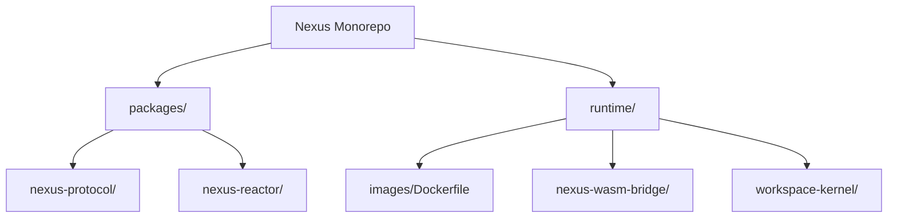
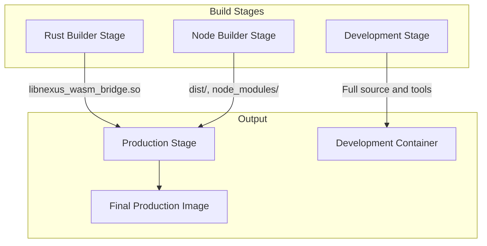
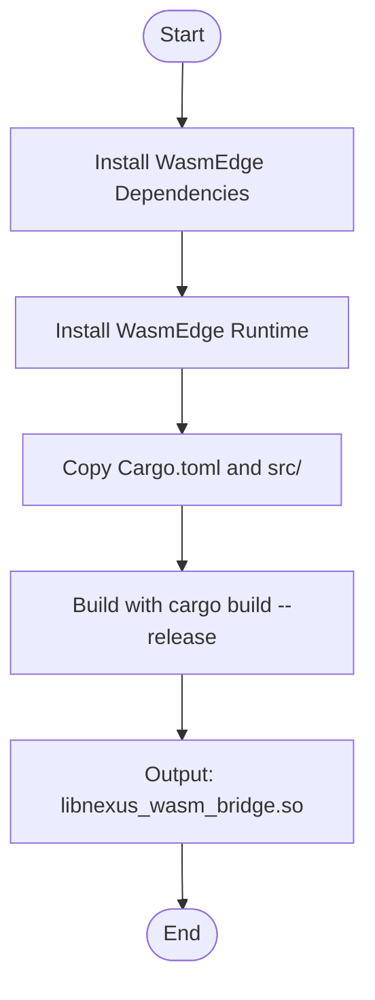
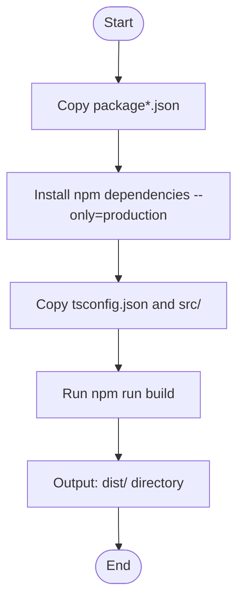
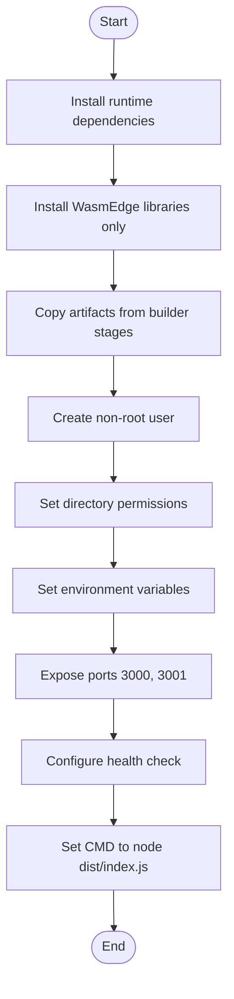
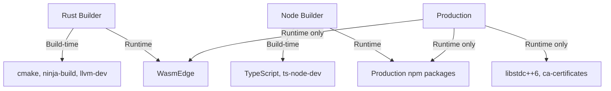

# Container Build Process

<cite>
**Referenced Files in This Document**   
- [Dockerfile](file://runtime/images/Dockerfile)
- [package.json](file://runtime/workspace-kernel/package.json)
- [Cargo.toml](file://runtime/nexus-wasm-bridge/Cargo.toml)
- [tsconfig.json](file://runtime/workspace-kernel/tsconfig.json)
- [index.ts](file://runtime/workspace-kernel/src/index.ts)
- [lib.rs](file://runtime/nexus-wasm-bridge/src/lib.rs)
</cite>

## Table of Contents
1. [Introduction](#introduction)
2. [Project Structure](#project-structure)
3. [Core Components](#core-components)
4. [Architecture Overview](#architecture-overview)
5. [Detailed Component Analysis](#detailed-component-analysis)
6. [Dependency Analysis](#dependency-analysis)
7. [Performance Considerations](#performance-considerations)
8. [Troubleshooting Guide](#troubleshooting-guide)
9. [Conclusion](#conclusion)

## Introduction
The Nexus container build process employs a multi-stage Docker strategy to create an optimized production image for the Nexus runtime environment. This documentation details the three primary build stages: Rust WASM bridge compilation, Node.js application building, and production runtime assembly. The process is designed to separate concerns, optimize image size, and ensure secure execution of JavaScript handlers within a WasmEdge sandbox. The build leverages cross-compilation techniques for Rust components and TypeScript compilation for the workspace-kernel, resulting in a minimal final image that excludes development tools and dependencies.

## Project Structure

The Nexus project follows a monorepo structure with distinct packages and runtime components. The container build process focuses on the runtime directory, which contains the core server application and the Rust-based WASM bridge.

**Diagram sources**
- [Dockerfile](file://runtime/images/Dockerfile)
- [package.json](file://runtime/workspace-kernel/package.json)

**Section sources**
- [Dockerfile](file://runtime/images/Dockerfile)
- [package.json](file://runtime/workspace-kernel/package.json)

## Core Components

The container build process centers around two core components: the Rust WASM bridge and the Node.js workspace-kernel. The WASM bridge provides secure execution of JavaScript handlers using WasmEdge, while the workspace-kernel serves as the HTTP/WebSocket server for panel management. These components are built in separate stages and combined in the final production image.

**Section sources**
- [lib.rs](file://runtime/nexus-wasm-bridge/src/lib.rs)
- [index.ts](file://runtime/workspace-kernel/src/index.ts)

## Architecture Overview

The multi-stage Docker build process follows a clean separation of concerns, with each stage responsible for a specific aspect of the build. The final image contains only the necessary runtime components, significantly reducing attack surface and image size.

**Diagram sources**
- [Dockerfile](file://runtime/images/Dockerfile)

**Section sources**
- [Dockerfile](file://runtime/images/Dockerfile)

## Detailed Component Analysis

### Rust WASM Bridge Compilation Stage

The first build stage compiles the Rust WASM bridge, which provides secure execution of JavaScript handlers within a WasmEdge sandbox. This native module is compiled as a shared library and later linked with the Node.js application.

**Diagram sources**
- [Dockerfile](file://runtime/images/Dockerfile#L7-L30)
- [Cargo.toml](file://runtime/nexus-wasm-bridge/Cargo.toml)

**Section sources**
- [Dockerfile](file://runtime/images/Dockerfile#L7-L30)
- [Cargo.toml](file://runtime/nexus-wasm-bridge/Cargo.toml)
- [lib.rs](file://runtime/nexus-wasm-bridge/src/lib.rs)

### Node.js Application Building Stage

The second stage builds the TypeScript-based workspace-kernel application. This stage installs production dependencies and compiles the TypeScript source into JavaScript.

**Diagram sources**
- [Dockerfile](file://runtime/images/Dockerfile#L34-L50)
- [package.json](file://runtime/workspace-kernel/package.json)
- [tsconfig.json](file://runtime/workspace-kernel/tsconfig.json)

**Section sources**
- [Dockerfile](file://runtime/images/Dockerfile#L34-L50)
- [package.json](file://runtime/workspace-kernel/package.json)
- [tsconfig.json](file://runtime/workspace-kernel/tsconfig.json)
- [index.ts](file://runtime/workspace-kernel/src/index.ts)

### Production Runtime Assembly Stage

The final stage assembles the production image by copying artifacts from previous stages and setting up the runtime environment. This results in a minimal image optimized for production deployment.

**Diagram sources**
- [Dockerfile](file://runtime/images/Dockerfile#L54-L102)

**Section sources**
- [Dockerfile](file://runtime/images/Dockerfile#L54-L102)

## Dependency Analysis

The build process manages dependencies through a staged approach, separating build-time dependencies from runtime dependencies. This ensures that development tools and headers are not included in the final image.

**Diagram sources**
- [Dockerfile](file://runtime/images/Dockerfile)
- [package.json](file://runtime/workspace-kernel/package.json)
- [Cargo.toml](file://runtime/nexus-wasm-bridge/Cargo.toml)

**Section sources**
- [Dockerfile](file://runtime/images/Dockerfile)
- [package.json](file://runtime/workspace-kernel/package.json)
- [Cargo.toml](file://runtime/nexus-wasm-bridge/Cargo.toml)

## Performance Considerations

The multi-stage build process is optimized for both build speed and final image performance. Docker layer caching can be leveraged to speed up repeated builds, particularly for dependency installation steps. The use of `npm ci` ensures consistent dependency installation, while the Rust release profile with LTO and optimization level 3 produces highly optimized native code. The final image is minimized by using the slim Node.js base image and removing package manager caches.

**Section sources**
- [Dockerfile](file://runtime/images/Dockerfile)
- [Cargo.toml](file://runtime/nexus-wasm-bridge/Cargo.toml)

## Troubleshooting Guide

Common build issues include dependency conflicts, caching problems, and cross-platform compilation challenges. When encountering build failures, first verify that the WasmEdge version in the Dockerfile matches the expected version. Clear Docker build cache if dependency installation fails. For cross-platform builds, ensure that the target architecture is properly configured in the Rust build stage. Monitor the size of the final image to detect accidental inclusion of development dependencies.

**Section sources**
- [Dockerfile](file://runtime/images/Dockerfile)

## Conclusion

The Nexus container build process demonstrates a sophisticated multi-stage approach that effectively separates build concerns while producing an optimized production image. By compiling the Rust WASM bridge and Node.js application in isolated stages, the process ensures clean dependency management and security. The final assembly stage creates a minimal runtime environment that excludes development tools, reducing attack surface and image size. This build strategy supports efficient development workflows while maintaining production readiness and performance.