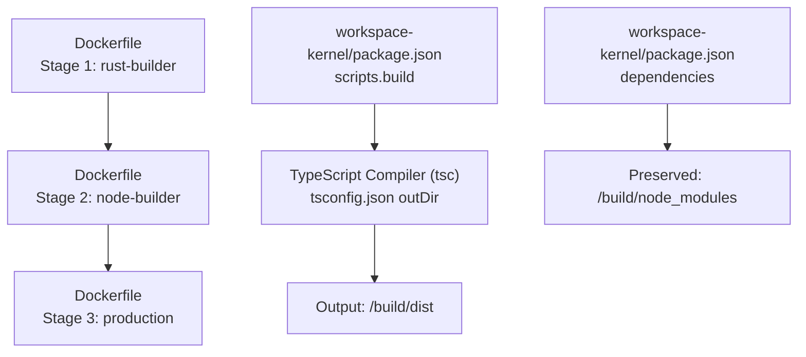
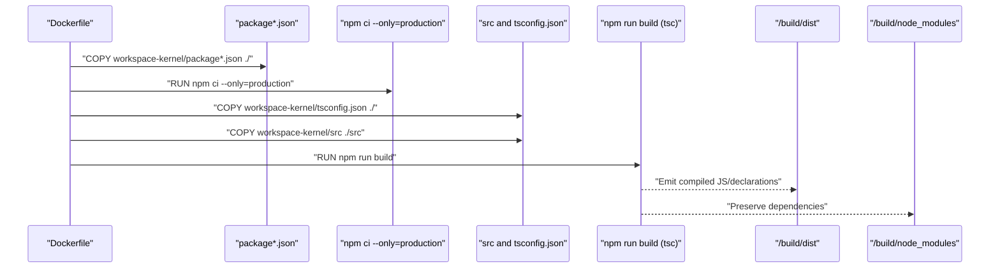
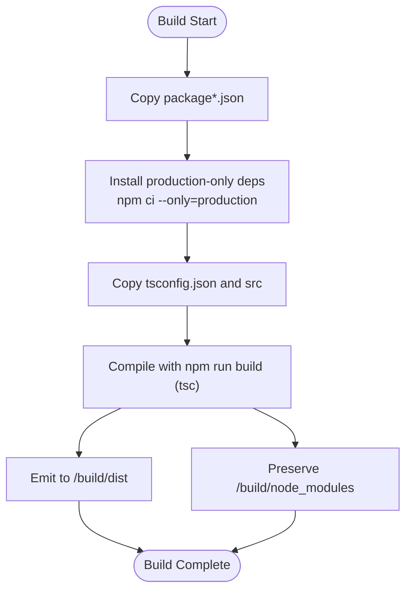
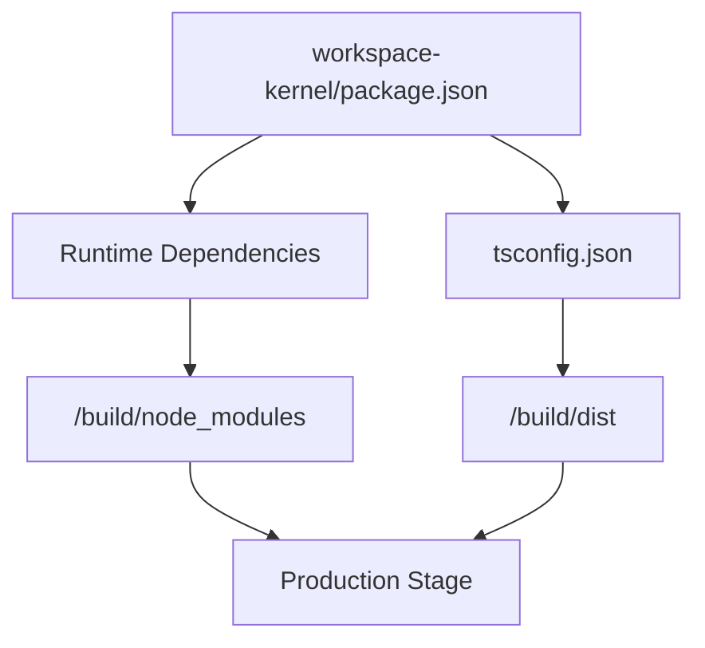

# Node.js Application Build

<cite>
**Referenced Files in This Document**
- [Dockerfile](file://runtime/images/Dockerfile)
- [workspace-kernel package.json](file://runtime/workspace-kernel/package.json)
- [workspace-kernel tsconfig.json](file://runtime/workspace-kernel/tsconfig.json)
- [workspace-kernel index.ts](file://runtime/workspace-kernel/src/index.ts)
- [workspace-kernel server.ts](file://runtime/workspace-kernel/src/server.ts)
- [workspace-kernel config.ts](file://runtime/workspace-kernel/src/config.ts)
- [runtime README](file://runtime/README.md)
</cite>

## Table of Contents
1. [Introduction](#introduction)
2. [Project Structure](#project-structure)
3. [Core Components](#core-components)
4. [Architecture Overview](#architecture-overview)
5. [Detailed Component Analysis](#detailed-component-analysis)
6. [Dependency Analysis](#dependency-analysis)
7. [Performance Considerations](#performance-considerations)
8. [Troubleshooting Guide](#troubleshooting-guide)
9. [Conclusion](#conclusion)

## Introduction
This document explains the Node.js application build stage in the Nexus container process, focusing on the node-builder stage that uses the node:20-bookworm-slim base image. It details the two-phase build approach:
- Phase 1: Install production-only dependencies using npm ci.
- Phase 2: Copy TypeScript sources and compile with npm run build.

It also explains why separating dependency installation from source copying improves Docker layer caching, describes the TypeScript compilation process for the workspace-kernel package, and documents the output and dependency preservation locations. Finally, it addresses common issues such as TypeScript compilation errors, missing devDependencies in build scripts, and differences between npm ci and npm install in containerized environments.

## Project Structure
The build occurs inside the runtime/images/Dockerfile using a multi-stage build. The node-builder stage is the second stage and is responsible for building the workspace-kernel package.

**Diagram sources**
- [Dockerfile](file://runtime/images/Dockerfile#L32-L71)
- [workspace-kernel package.json](file://runtime/workspace-kernel/package.json#L7-L15)
- [workspace-kernel tsconfig.json](file://runtime/workspace-kernel/tsconfig.json#L1-L24)

**Section sources**
- [Dockerfile](file://runtime/images/Dockerfile#L32-L71)
- [runtime README](file://runtime/README.md#L144-L173)

## Core Components
- node-builder stage: Builds the workspace-kernel package using npm ci and tsc.
- workspace-kernel package.json: Defines the build script and dependencies.
- workspace-kernel tsconfig.json: Configures TypeScript output directory and module resolution.
- runtime README: Provides developer guidance for local builds and Docker deployment.

Key build steps in the node-builder stage:
- Copy package metadata files.
- Install production-only dependencies with npm ci.
- Copy TypeScript source files and tsconfig.json.
- Compile TypeScript with npm run build.
- Preserve node_modules and emit dist artifacts for the production stage.

**Section sources**
- [Dockerfile](file://runtime/images/Dockerfile#L34-L49)
- [workspace-kernel package.json](file://runtime/workspace-kernel/package.json#L7-L15)
- [workspace-kernel tsconfig.json](file://runtime/workspace-kernel/tsconfig.json#L1-L24)
- [runtime README](file://runtime/README.md#L144-L173)

## Architecture Overview
The build architecture follows a two-phase approach inside the node-builder stage to maximize Docker layer caching and minimize image size.

**Diagram sources**
- [Dockerfile](file://runtime/images/Dockerfile#L34-L49)
- [workspace-kernel package.json](file://runtime/workspace-kernel/package.json#L7-L15)
- [workspace-kernel tsconfig.json](file://runtime/workspace-kernel/tsconfig.json#L1-L24)

## Detailed Component Analysis

### Two-Phase Build in node-builder
- Phase 1: Install production-only dependencies.
  - Purpose: Ensures only runtime dependencies are present, reducing attack surface and image size.
  - Command: npm ci with --only=production.
- Phase 2: Copy sources and compile.
  - Purpose: Compile TypeScript sources to JavaScript while preserving node_modules for reuse.

Why this separation matters:
- Docker layer caching: Installing dependencies first allows Docker to cache the layer. Subsequent builds that change only source files will reuse the cached dependencies layer, speeding up builds.
- Security and reproducibility: npm ci enforces deterministic installs, preventing accidental devDependency inclusion in production builds.

Examples from the Dockerfile:
- Copy package metadata: [COPY workspace-kernel/package*.json .](file://runtime/images/Dockerfile#L39-L41)
- Install production-only dependencies: [RUN npm ci --only=production](file://runtime/images/Dockerfile#L42-L42)
- Copy TypeScript sources and tsconfig: [COPY workspace-kernel/tsconfig.json ./](file://runtime/images/Dockerfile#L45-L46), [COPY workspace-kernel/src ./src](file://runtime/images/Dockerfile#L46-L46)
- Compile with npm run build: [RUN npm run build](file://runtime/images/Dockerfile#L49-L49)

**Section sources**
- [Dockerfile](file://runtime/images/Dockerfile#L34-L49)

### TypeScript Compilation for workspace-kernel
- Build script: The workspace-kernel package defines a build script that invokes the TypeScript compiler.
  - Script: [build: tsc](file://runtime/workspace-kernel/package.json#L7-L15)
- Output location: The TypeScript configuration specifies the output directory.
  - OutDir: [outDir: ./dist](file://runtime/workspace-kernel/tsconfig.json#L1-L24)
- Dependency preservation: node_modules is preserved in the node-builder stage for use in the production stage.
  - Preserved in: [COPY --from=node-builder /build/node_modules ./node_modules](file://runtime/images/Dockerfile#L69-L71)

Runtime entrypoint:
- The compiled entrypoint is referenced by the package main field.
  - Main: [main: dist/index.js](file://runtime/workspace-kernel/package.json#L1-L10)
- The production stage executes the compiled entrypoint.
  - CMD: [node dist/index.js](file://runtime/images/Dockerfile#L101-L103)

**Section sources**
- [workspace-kernel package.json](file://runtime/workspace-kernel/package.json#L1-L15)
- [workspace-kernel tsconfig.json](file://runtime/workspace-kernel/tsconfig.json#L1-L24)
- [Dockerfile](file://runtime/images/Dockerfile#L68-L71)
- [Dockerfile](file://runtime/images/Dockerfile#L101-L103)

### Build Flowchart

**Diagram sources**
- [Dockerfile](file://runtime/images/Dockerfile#L34-L49)
- [workspace-kernel package.json](file://runtime/workspace-kernel/package.json#L7-L15)
- [workspace-kernel tsconfig.json](file://runtime/workspace-kernel/tsconfig.json#L1-L24)

## Dependency Analysis
- workspace-kernel depends on runtime libraries (express, ws, jsonwebtoken, pino, etc.) as declared in its package.json.
- The production stage copies both dist and node_modules from the node-builder stage, ensuring the runtime can execute without re-installing dependencies.
- The runtime README provides developer guidance for local builds and Docker deployment.

**Diagram sources**
- [workspace-kernel package.json](file://runtime/workspace-kernel/package.json#L16-L43)
- [workspace-kernel tsconfig.json](file://runtime/workspace-kernel/tsconfig.json#L1-L24)
- [Dockerfile](file://runtime/images/Dockerfile#L68-L71)

**Section sources**
- [workspace-kernel package.json](file://runtime/workspace-kernel/package.json#L16-L43)
- [Dockerfile](file://runtime/images/Dockerfile#L68-L71)
- [runtime README](file://runtime/README.md#L144-L173)

## Performance Considerations
- Layer caching: Separating dependency installation from source copying enables Docker to reuse cached layers when only source files change.
- Image size: Using --only=production reduces the final image size by avoiding devDependencies.
- Deterministic installs: npm ci ensures reproducible builds across environments.

[No sources needed since this section provides general guidance]

## Troubleshooting Guide
Common issues and resolutions:

- TypeScript compilation errors
  - Symptom: Build fails during tsc execution.
  - Causes:
    - Strict TypeScript settings rejecting implicit returns, unchecked indexed access, or exact optional property types.
    - Missing or incorrect tsconfig.json settings.
  - Resolution:
    - Review strictness options and adjust code or tsconfig accordingly.
    - Verify outDir and rootDir align with the build pipeline.
  - References:
    - [workspace-kernel tsconfig.json](file://runtime/workspace-kernel/tsconfig.json#L1-L24)

- Missing devDependencies in build scripts
  - Symptom: Build script fails because a devDependency tool is not installed.
  - Cause: The node-builder stage installs only production dependencies.
  - Resolution:
    - Move required build tools into dependencies or use a multi-stage build that installs devDependencies only for the build stage.
  - References:
    - [Dockerfile node-builder install](file://runtime/images/Dockerfile#L42-L42)
    - [workspace-kernel package.json scripts](file://runtime/workspace-kernel/package.json#L7-L15)

- npm ci vs npm install in container environments
  - npm ci:
    - Ensures deterministic installs and faster rebuilds when package-lock.json is present.
    - Prevents accidental devDependency inclusion in production builds.
  - npm install:
    - May install devDependencies and can lead to inconsistent builds.
  - Recommendation:
    - Prefer npm ci in containerized builds to guarantee reproducibility and minimal image size.
  - References:
    - [Dockerfile node-builder install](file://runtime/images/Dockerfile#L42-L42)

- Runtime startup failures
  - Symptom: Application does not start after build.
  - Causes:
    - Incorrect main entrypoint in package.json.
    - Missing compiled output in /build/dist.
  - Resolution:
    - Confirm main points to dist/index.js and that npm run build emits to dist.
  - References:
    - [workspace-kernel package.json main](file://runtime/workspace-kernel/package.json#L1-L10)
    - [Dockerfile production CMD](file://runtime/images/Dockerfile#L101-L103)

**Section sources**
- [workspace-kernel tsconfig.json](file://runtime/workspace-kernel/tsconfig.json#L1-L24)
- [workspace-kernel package.json](file://runtime/workspace-kernel/package.json#L1-L15)
- [Dockerfile](file://runtime/images/Dockerfile#L42-L42)
- [Dockerfile](file://runtime/images/Dockerfile#L101-L103)

## Conclusion
The node-builder stage in the Nexus container process implements a robust two-phase build:
- Install production-only dependencies with npm ci to leverage Docker layer caching and reduce image size.
- Copy TypeScript sources and compile with npm run build (tsc), emitting artifacts to /build/dist while preserving /build/node_modules for the production stage.

This approach ensures reproducible, secure, and efficient builds suitable for containerized deployments. Developers should align their build scripts and tsconfig settings with these expectations and address common issues by validating dependency scopes, TypeScript strictness, and build tooling choices.