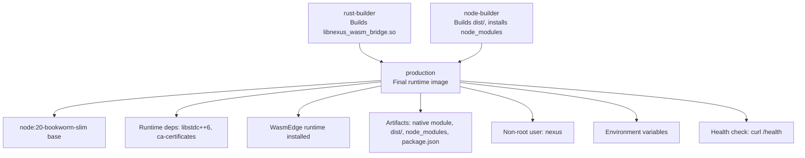
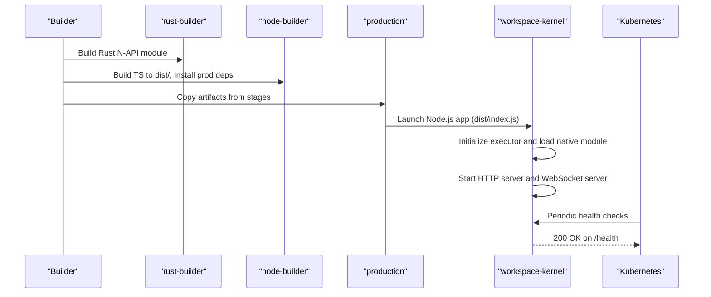
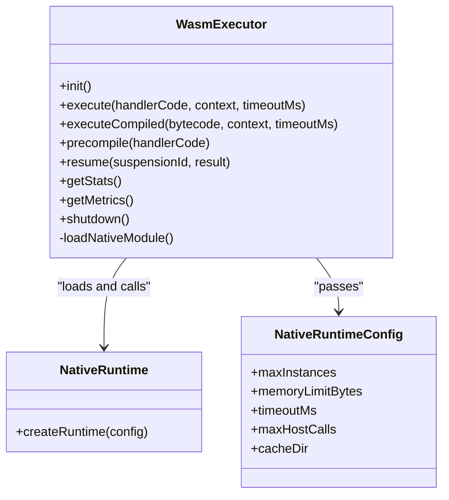
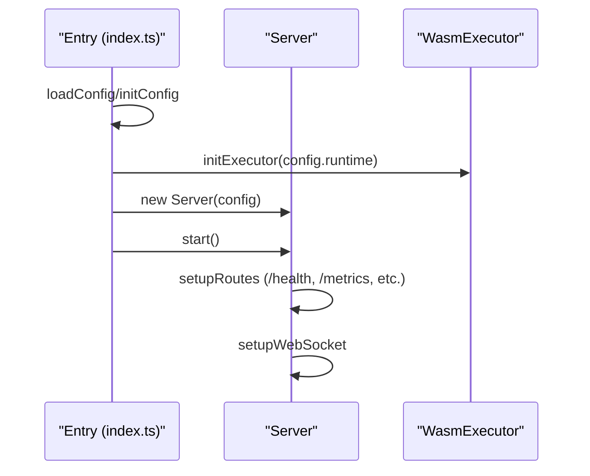
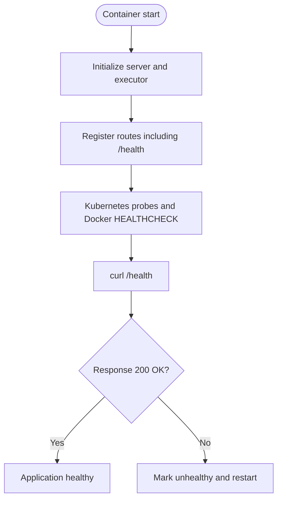
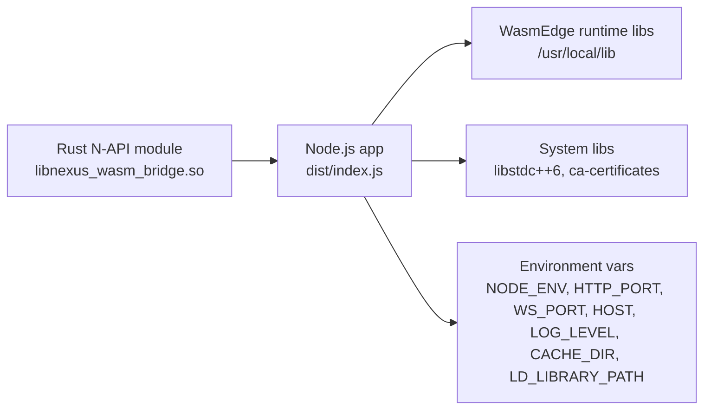

# Production Runtime Assembly

<cite>
**Referenced Files in This Document**
- [Dockerfile](file://runtime/images/Dockerfile)
- [Cargo.toml](file://runtime/nexus-wasm-bridge/Cargo.toml)
- [index.ts](file://runtime/workspace-kernel/src/index.ts)
- [server.ts](file://runtime/workspace-kernel/src/server.ts)
- [executor.ts](file://runtime/workspace-kernel/src/executor.ts)
- [deployment.yaml](file://runtime/k8s/deployment.yaml)
- [package.json](file://runtime/workspace-kernel/package.json)
</cite>

## Table of Contents
1. [Introduction](#introduction)
2. [Project Structure](#project-structure)
3. [Core Components](#core-components)
4. [Architecture Overview](#architecture-overview)
5. [Detailed Component Analysis](#detailed-component-analysis)
6. [Dependency Analysis](#dependency-analysis)
7. [Performance Considerations](#performance-considerations)
8. [Troubleshooting Guide](#troubleshooting-guide)
9. [Conclusion](#conclusion)

## Introduction
This document explains the production runtime assembly stage in the Nexus container build. It focuses on how the final production image is constructed by copying artifacts from earlier build stages, how the compiled Rust N-API module integrates with the Node.js application, and how runtime dependencies and security hardening are configured. It also covers the health check mechanism, environment variables, and common deployment issues such as library path configuration, permissions, and health check failures.

## Project Structure
The production runtime assembly is defined in a multi-stage Dockerfile. The key stages are:
- rust-builder: builds the Rust N-API module with WasmEdge support
- node-builder: compiles the TypeScript workspace-kernel into dist/ and installs production dependencies
- production: assembles the final runtime image, installs runtime libraries, copies artifacts, sets up a non-root user, configures environment variables, and defines health checks

**Diagram sources**
- [Dockerfile](file://runtime/images/Dockerfile#L1-L103)

**Section sources**
- [Dockerfile](file://runtime/images/Dockerfile#L1-L103)

## Core Components
- Rust N-API module: compiled from the nexus-wasm-bridge crate and exposed to Node.js via N-API. It integrates with WasmEdge and QuickJS to execute handlers securely and efficiently.
- Node.js workspace-kernel: the HTTP/WebSocket server that orchestrates panels, extensions, and WASM execution. It loads the native module and exposes health and metrics endpoints.
- Kubernetes deployment: defines probes, environment variables, and security contexts aligned with the runtime image’s configuration.

**Section sources**
- [Cargo.toml](file://runtime/nexus-wasm-bridge/Cargo.toml#L1-L63)
- [index.ts](file://runtime/workspace-kernel/src/index.ts#L1-L149)
- [server.ts](file://runtime/workspace-kernel/src/server.ts#L130-L150)
- [executor.ts](file://runtime/workspace-kernel/src/executor.ts#L190-L213)
- [deployment.yaml](file://runtime/k8s/deployment.yaml#L60-L120)

## Architecture Overview
The production runtime image is assembled by copying:
- The compiled Rust N-API shared object (libnexus_wasm_bridge.so) into the native directory
- The built TypeScript artifacts (dist/) and production node_modules
- The package.json used at runtime

It then installs runtime-only dependencies, the WasmEdge runtime libraries, creates a non-root user, sets environment variables, and exposes health and metrics endpoints.

**Diagram sources**
- [Dockerfile](file://runtime/images/Dockerfile#L54-L103)
- [index.ts](file://runtime/workspace-kernel/src/index.ts#L20-L58)
- [server.ts](file://runtime/workspace-kernel/src/server.ts#L130-L150)
- [deployment.yaml](file://runtime/k8s/deployment.yaml#L100-L120)

## Detailed Component Analysis

### Multi-Stage Copy Operation and Final Image Assembly
- The production stage starts from node:20-bookworm-slim and installs runtime-only system dependencies (libstdc++6, ca-certificates).
- It installs WasmEdge runtime libraries to /usr/local and sets the library path accordingly.
- Artifacts are copied from previous stages:
  - Native module: libnexus_wasm_bridge.so from rust-builder
  - Built application: dist/ from node-builder
  - Dependencies: node_modules from node-builder
  - Package manifest: package.json for runtime inspection
- A non-root user “nexus” is created, and ownership of /app and cache directory is transferred to this user.
- Environment variables are set for production behavior (ports, host, log level, cache directory, and library path).
- Ports 3000/3001 are exposed, and a health check is defined using curl against the local /health endpoint.
- The container runs the Node.js entrypoint pointing to dist/index.js.

Examples of COPY --from directives used in the production stage:
- Copy native module from rust-builder target release path to /app/native
- Copy dist/ and node_modules from node-builder build output
- Copy package.json from node-builder build output

Security hardening:
- Non-root user and chown for directories
- Kubernetes deployment enforces non-root, read-only root filesystem, and drops all capabilities

**Section sources**
- [Dockerfile](file://runtime/images/Dockerfile#L54-L103)
- [deployment.yaml](file://runtime/k8s/deployment.yaml#L60-L120)

### Rust N-API Module and WasmEdge Integration
- The Rust crate targets a dynamic library and uses napi and wasmedge-sdk to expose a Node-compatible N-API interface.
- The Node workspace-kernel dynamically loads the native module and initializes a runtime instance with configurable limits and cache directory.
- The executor provides methods to execute handlers, resume suspended executions, precompile bytecode, and retrieve metrics/stats.

**Diagram sources**
- [executor.ts](file://runtime/workspace-kernel/src/executor.ts#L190-L213)
- [executor.ts](file://runtime/workspace-kernel/src/executor.ts#L214-L303)
- [executor.ts](file://runtime/workspace-kernel/src/executor.ts#L304-L357)
- [Cargo.toml](file://runtime/nexus-wasm-bridge/Cargo.toml#L1-L63)

**Section sources**
- [Cargo.toml](file://runtime/nexus-wasm-bridge/Cargo.toml#L1-L63)
- [executor.ts](file://runtime/workspace-kernel/src/executor.ts#L190-L213)
- [executor.ts](file://runtime/workspace-kernel/src/executor.ts#L214-L303)
- [executor.ts](file://runtime/workspace-kernel/src/executor.ts#L304-L357)

### Node.js Application Bootstrap and Server
- The main entrypoint initializes configuration, subsystems (panel manager, WASM executor, extensions), and starts the HTTP and WebSocket servers.
- The server registers routes including /health and /metrics, and applies authentication middleware except for the health endpoint.
- Graceful shutdown hooks are registered to stop the server and underlying subsystems.

**Diagram sources**
- [index.ts](file://runtime/workspace-kernel/src/index.ts#L20-L58)
- [server.ts](file://runtime/workspace-kernel/src/server.ts#L130-L150)
- [server.ts](file://runtime/workspace-kernel/src/server.ts#L650-L679)

**Section sources**
- [index.ts](file://runtime/workspace-kernel/src/index.ts#L1-L149)
- [server.ts](file://runtime/workspace-kernel/src/server.ts#L130-L150)
- [server.ts](file://runtime/workspace-kernel/src/server.ts#L480-L502)

### Health Check Implementation
- The server exposes a GET /health endpoint that returns a JSON object containing status, version, uptime, panel counts, and runtime statistics.
- The Dockerfile defines a HEALTHCHECK using curl against localhost:3000/health.
- Kubernetes deployment defines readiness and liveness probes targeting the same endpoint.

**Diagram sources**
- [server.ts](file://runtime/workspace-kernel/src/server.ts#L130-L150)
- [server.ts](file://runtime/workspace-kernel/src/server.ts#L480-L502)
- [Dockerfile](file://runtime/images/Dockerfile#L97-L100)
- [deployment.yaml](file://runtime/k8s/deployment.yaml#L100-L120)

**Section sources**
- [server.ts](file://runtime/workspace-kernel/src/server.ts#L130-L150)
- [server.ts](file://runtime/workspace-kernel/src/server.ts#L480-L502)
- [Dockerfile](file://runtime/images/Dockerfile#L97-L100)
- [deployment.yaml](file://runtime/k8s/deployment.yaml#L100-L120)

### Runtime Dependencies and WasmEdge Installation
- The production stage installs libstdc++6 and ca-certificates for runtime compatibility.
- WasmEdge runtime libraries are installed to /usr/local and the library path is set to /usr/local/lib.
- The Rust builder stage installs WasmEdge and sets library paths for building the native module.

**Section sources**
- [Dockerfile](file://runtime/images/Dockerfile#L58-L66)
- [Dockerfile](file://runtime/images/Dockerfile#L12-L29)

### Security Hardening and Non-Root User
- A dedicated non-root user “nexus” is created and used to run the application.
- Ownership of /app and /tmp/nexus-cache is transferred to the nexus user.
- Kubernetes deployment enforces non-root execution, read-only root filesystem, and capability drops.

**Section sources**
- [Dockerfile](file://runtime/images/Dockerfile#L76-L83)
- [deployment.yaml](file://runtime/k8s/deployment.yaml#L60-L120)

### Environment Variables and Ports
- The production stage sets NODE_ENV, HTTP_PORT, WS_PORT, HOST, LOG_LEVEL, CACHE_DIR, and LD_LIBRARY_PATH.
- The container exposes ports 3000 (HTTP) and 3001 (WebSocket).
- The Node workspace-kernel reads environment variables to configure server and runtime behavior.

**Section sources**
- [Dockerfile](file://runtime/images/Dockerfile#L85-L93)
- [package.json](file://runtime/workspace-kernel/package.json#L1-L50)
- [server.ts](file://runtime/workspace-kernel/src/config.ts#L73-L123)

## Dependency Analysis
The production runtime depends on:
- The compiled Rust N-API module (libnexus_wasm_bridge.so) for WASM execution
- The built Node.js application (dist/index.js) and its production dependencies (node_modules)
- WasmEdge runtime libraries installed at /usr/local/lib
- System libraries (libstdc++6, ca-certificates) for runtime compatibility

**Diagram sources**
- [Dockerfile](file://runtime/images/Dockerfile#L58-L103)
- [executor.ts](file://runtime/workspace-kernel/src/executor.ts#L190-L213)

**Section sources**
- [Dockerfile](file://runtime/images/Dockerfile#L58-L103)
- [executor.ts](file://runtime/workspace-kernel/src/executor.ts#L190-L213)

## Performance Considerations
- Minimal image size: The production stage excludes build tools and only copies necessary artifacts, keeping the final image small.
- WasmEdge AOT and caching: The Rust bridge supports AOT and bytecode caching to reduce cold-start latency.
- Instance pooling: The executor maintains a pool of WASM instances to improve throughput under load.
- Kubernetes resource limits: The deployment defines CPU/memory requests/limits and autoscaling to manage resource usage.

[No sources needed since this section provides general guidance]

## Troubleshooting Guide
Common deployment issues and resolutions:

- Library path configuration (LD_LIBRARY_PATH):
  - Symptom: Native module fails to load with library not found errors.
  - Cause: Missing or incorrect LD_LIBRARY_PATH in the runtime environment.
  - Resolution: Ensure LD_LIBRARY_PATH is set to /usr/local/lib in the production stage and remains consistent in the container environment.

- Permission errors:
  - Symptom: Application cannot write to cache directory or fails to start as non-root user.
  - Cause: Incorrect ownership or read-only filesystem.
  - Resolution: Verify that /tmp/nexus-cache is owned by the nexus user and that the root filesystem is writable only where needed. Confirm Kubernetes securityContext allows writes to mounted cache volumes.

- Health check failures:
  - Symptom: Probes fail and pods restart continuously.
  - Causes:
    - Application not listening on the expected port/host
    - Authentication enabled blocking the health endpoint
    - Executor failing to initialize the native module
  - Resolutions:
    - Confirm HTTP_PORT and HOST environment variables are set correctly
    - Verify that the server registers /health and bypasses authentication for it
    - Ensure the native module is present in /app/native and LD_LIBRARY_PATH includes /usr/local/lib
    - Check Kubernetes probes target the correct containerPort and path

- Missing native module:
  - Symptom: Error indicating the native WASM bridge module could not be found.
  - Cause: The native module was not copied into the production image or path mismatch.
  - Resolution: Confirm the COPY --from directives include the native module and that the executor attempts the correct paths.

**Section sources**
- [Dockerfile](file://runtime/images/Dockerfile#L67-L72)
- [Dockerfile](file://runtime/images/Dockerfile#L85-L93)
- [server.ts](file://runtime/workspace-kernel/src/server.ts#L130-L150)
- [executor.ts](file://runtime/workspace-kernel/src/executor.ts#L190-L213)
- [deployment.yaml](file://runtime/k8s/deployment.yaml#L100-L120)

## Conclusion
The production runtime assembly stage consolidates the compiled Rust N-API module and the built Node.js application into a secure, minimal runtime image. By installing only runtime dependencies, setting a non-root user, configuring environment variables, and exposing health and metrics endpoints, the image is optimized for safe and reliable deployment. Kubernetes integration ensures robust observability and resilience through probes and security policies.