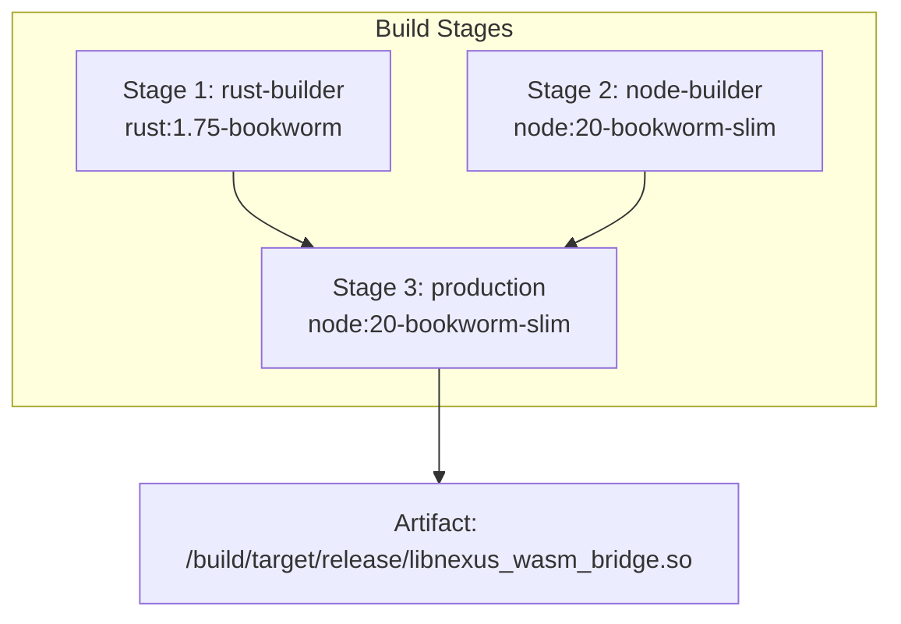
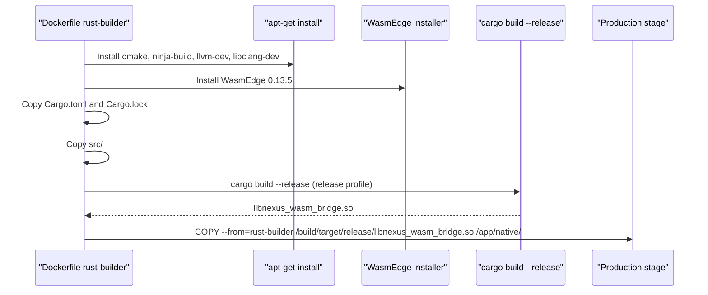
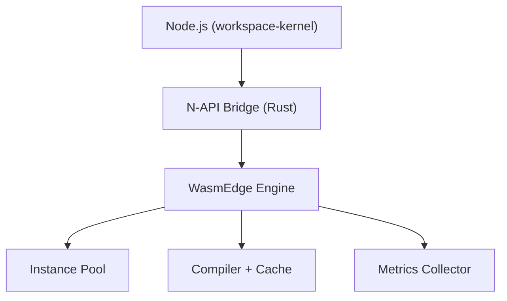
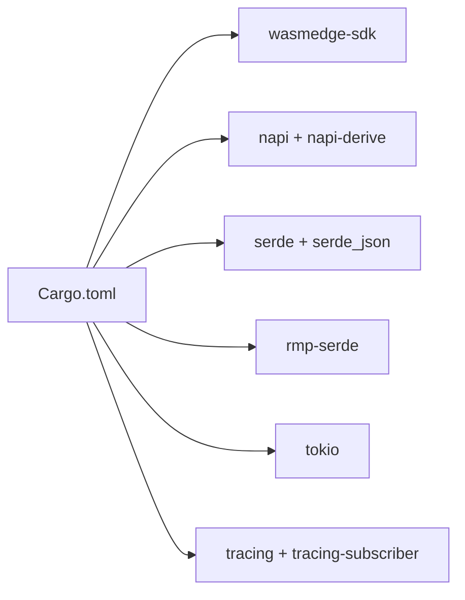

# Rust WASM Bridge Compilation

<cite>
**Referenced Files in This Document**
- [Dockerfile](file://runtime/images/Dockerfile)
- [Cargo.toml](file://runtime/nexus-wasm-bridge/Cargo.toml)
- [lib.rs](file://runtime/nexus-wasm-bridge/src/lib.rs)
- [napi.rs](file://runtime/nexus-wasm-bridge/src/napi.rs)
- [engine/mod.rs](file://runtime/nexus-wasm-bridge/src/engine/mod.rs)
- [host_functions/mod.rs](file://runtime/nexus-wasm-bridge/src/host_functions/mod.rs)
- [config.rs](file://runtime/nexus-wasm-bridge/src/config.rs)
- [metrics.rs](file://runtime/nexus-wasm-bridge/src/metrics.rs)
- [02_runtime_spec.md](file://docs/02_runtime_spec.md)
- [wasmedge_migration_strategy.md](file://docs/wasmedge_migration_strategy.md)
- [.gitignore](file://.gitignore)
</cite>

## Table of Contents
1. [Introduction](#introduction)
2. [Project Structure](#project-structure)
3. [Core Components](#core-components)
4. [Architecture Overview](#architecture-overview)
5. [Detailed Component Analysis](#detailed-component-analysis)
6. [Dependency Analysis](#dependency-analysis)
7. [Performance Considerations](#performance-considerations)
8. [Troubleshooting Guide](#troubleshooting-guide)
9. [Conclusion](#conclusion)

## Introduction
This document explains the Rust WASM bridge compilation stage in the Nexus container build process. It focuses on the dedicated rust-builder stage using the rust:1.75-bookworm base image, the installation of WasmEdge runtime and native build dependencies, the cargo build --release process for compiling the nexus-wasm-bridge native module with N-API bindings, cross-compilation considerations, dependency caching via Cargo.toml copy before source, and the resulting artifact location. It also describes how the compiled Rust binary is consumed in later stages and addresses common build issues such as WasmEdge version compatibility, missing native dependencies, and N-API linking errors.

## Project Structure
The build pipeline is defined in a multi-stage Dockerfile. The first stage builds the Rust WASM bridge, installing WasmEdge and required native toolchains, then compiles the Rust crate into a shared library suitable for Node.js consumption via N-API. The final production stage copies the compiled artifact into the runtime image and prepares the environment for execution.

**Diagram sources**
- [Dockerfile](file://runtime/images/Dockerfile#L1-L103)

**Section sources**
- [Dockerfile](file://runtime/images/Dockerfile#L1-L103)

## Core Components
- Rust WASM bridge crate: Defines the public N-API interface and integrates WasmEdge runtime for handler execution.
- N-API bindings: Exposes a JavaScript-friendly API to Node.js, enabling the workspace-kernel to invoke handlers safely.
- WasmEdge runtime integration: Manages instance pooling, compilation caching, and execution with timeouts and resource limits.
- Build configuration: Cargo.toml specifies crate-type, dependencies, and release profile for optimal performance and linking.

**Section sources**
- [Cargo.toml](file://runtime/nexus-wasm-bridge/Cargo.toml#L1-L63)
- [lib.rs](file://runtime/nexus-wasm-bridge/src/lib.rs#L1-L71)
- [napi.rs](file://runtime/nexus-wasm-bridge/src/napi.rs#L1-L491)
- [engine/mod.rs](file://runtime/nexus-wasm-bridge/src/engine/mod.rs#L1-L244)

## Architecture Overview
The bridge compiles to a dynamic library (cdylib) consumable by Node.js via N-API. The Dockerfile orchestrates:
- Installing WasmEdge runtime and native toolchain (cmake, ninja-build, llvm-dev, libclang-dev)
- Installing WasmEdge CLI to a specific version
- Copying Cargo metadata before source to leverage dependency caching
- Building with cargo build --release and setting environment variables for WasmEdge libraries
- Copying the compiled artifact into the production image for runtime use

**Diagram sources**
- [Dockerfile](file://runtime/images/Dockerfile#L1-L103)

**Section sources**
- [Dockerfile](file://runtime/images/Dockerfile#L1-L103)

## Detailed Component Analysis

### Rust Builder Stage Details
- Base image: rust:1.75-bookworm ensures a modern Rust toolchain aligned with the project’s Rust edition.
- Native dependencies: cmake, ninja-build, llvm-dev, libclang-dev are installed to support WasmEdge and native compilation steps.
- WasmEdge installation: The official installer script is used to install a specific WasmEdge version (0.13.5) into the builder environment.
- Dependency caching: Cargo.toml and Cargo.lock are copied before the source tree to maximize cache hits during dependency resolution.
- Build invocation: cargo build --release compiles the crate with release optimizations and links against WasmEdge libraries configured via environment variables.
- Artifact output: The compiled shared library is placed under /build/target/release/libnexus_wasm_bridge.so.

**Section sources**
- [Dockerfile](file://runtime/images/Dockerfile#L1-L103)

### N-API Bindings and Public API
- The crate exposes a JavaScript-friendly API via N-API, including constructors, async methods for execution and resumption, capability inference, and metrics retrieval.
- The public API is defined in the N-API module and maps between JavaScript objects and Rust structs, handling serialization/deserialization and error conversion.

**Section sources**
- [napi.rs](file://runtime/nexus-wasm-bridge/src/napi.rs#L1-L491)

### WasmEdge Runtime Integration
- The engine module initializes instance pools, compiles handlers (with caching), executes within timeouts, and resumes suspended handlers.
- Configuration controls instance limits, memory/stack sizes, and cache directories.
- Metrics collect execution duration, memory usage, host calls, and cache hit rates.

**Section sources**
- [engine/mod.rs](file://runtime/nexus-wasm-bridge/src/engine/mod.rs#L1-L244)
- [config.rs](file://runtime/nexus-wasm-bridge/src/config.rs#L1-L320)
- [metrics.rs](file://runtime/nexus-wasm-bridge/src/metrics.rs#L1-L474)

### Host Functions and Capabilities
- Host functions provide controlled access to state, events, view updates, logging, and extension calls.
- Capability checking enforces permissions derived from handler code and declared tokens.

**Section sources**
- [host_functions/mod.rs](file://runtime/nexus-wasm-bridge/src/host_functions/mod.rs#L1-L93)

### Build Configuration and Release Profile
- Crate-type includes cdylib to produce a shared library for Node.js consumption.
- Dependencies include wasmedge-sdk, napi, serde, tokio, tracing, and others.
- Release profile enables LTO, opt-level 3, and single codegen unit for smaller, optimized binaries.

**Section sources**
- [Cargo.toml](file://runtime/nexus-wasm-bridge/Cargo.toml#L1-L63)

### Cross-Compilation Considerations
- The builder uses rust:1.75-bookworm and installs native toolchain packages required by WasmEdge and the Rust toolchain.
- The Dockerfile sets WASMEDGE_DIR and LD_LIBRARY_PATH to point to the installed WasmEdge libraries, ensuring the linker and runtime can locate required libraries during build and runtime.
- The final production image also installs WasmEdge libraries into /usr/local and sets LD_LIBRARY_PATH accordingly.

**Section sources**
- [Dockerfile](file://runtime/images/Dockerfile#L1-L103)

### Dependency Caching via Cargo.toml Copy Before Source
- The Dockerfile copies Cargo.toml and Cargo.lock prior to copying the src directory. This allows Docker’s layer caching to reuse previously built dependency layers when only source code changes, reducing rebuild time.

**Section sources**
- [Dockerfile](file://runtime/images/Dockerfile#L1-L103)

### Artifact Output Location and Consumption
- Output artifact: /build/target/release/libnexus_wasm_bridge.so
- Consumption in production: The production stage copies this artifact into /app/native/, where the Node.js runtime expects to load the N-API module.

**Section sources**
- [Dockerfile](file://runtime/images/Dockerfile#L1-L103)

### Conceptual Overview
The bridge’s role is to securely execute user-provided handler code in a sandboxed environment while exposing a minimal, capability-gated host API. The N-API layer bridges Node.js and Rust, and the engine manages lifecycle, isolation, and performance.

[No sources needed since this diagram shows conceptual workflow, not actual code structure]

## Dependency Analysis
The bridge crate depends on:
- WasmEdge SDK for runtime integration
- N-API crates for Node.js binding
- Serde and MessagePack for context/result serialization
- Tokio for async execution
- Tracing for logging and metrics

These dependencies are declared in Cargo.toml and influence the build and runtime behavior.

**Diagram sources**
- [Cargo.toml](file://runtime/nexus-wasm-bridge/Cargo.toml#L1-L63)

**Section sources**
- [Cargo.toml](file://runtime/nexus-wasm-bridge/Cargo.toml#L1-L63)

## Performance Considerations
- Release profile settings (LTO, opt-level 3, single codegen unit) reduce binary size and improve runtime performance.
- Instance pooling and compilation caching minimize cold-start costs and improve throughput.
- Metrics collection enables monitoring of execution time, memory usage, and cache hit rates.

**Section sources**
- [Cargo.toml](file://runtime/nexus-wasm-bridge/Cargo.toml#L55-L63)
- [engine/mod.rs](file://runtime/nexus-wasm-bridge/src/engine/mod.rs#L1-L244)
- [metrics.rs](file://runtime/nexus-wasm-bridge/src/metrics.rs#L1-L474)

## Troubleshooting Guide

### WasmEdge Version Compatibility
- The builder installs WasmEdge 0.13.5. Ensure the installed version matches the SDK dependency version used by the crate to avoid ABI mismatches.
- The production stage also installs WasmEdge 0.13.5 into /usr/local and sets LD_LIBRARY_PATH appropriately.

**Section sources**
- [Dockerfile](file://runtime/images/Dockerfile#L1-L103)
- [Cargo.toml](file://runtime/nexus-wasm-bridge/Cargo.toml#L1-L63)

### Missing Native Dependencies
- The builder installs cmake, ninja-build, llvm-dev, and libclang-dev. If the build fails due to missing system libraries, verify these packages are present and the environment variables (WASMEDGE_DIR, LD_LIBRARY_PATH) are set correctly.

**Section sources**
- [Dockerfile](file://runtime/images/Dockerfile#L1-L103)

### N-API Linking Errors
- The crate targets cdylib and uses napi and napi-derive. Ensure the Node.js environment expects a .node module and that the loader can find the compiled library. The Dockerfile places the artifact in /app/native/ for the runtime image.

**Section sources**
- [Cargo.toml](file://runtime/nexus-wasm-bridge/Cargo.toml#L1-L63)
- [Dockerfile](file://runtime/images/Dockerfile#L1-L103)

### Asyncify Requirement for Suspend/Resume
- The runtime specification mandates Asyncify transformation for the QuickJS WASM module to enable suspend/resume. Confirm that the QuickJS WASM module used by the runtime has been processed with Asyncify before execution.

**Section sources**
- [02_runtime_spec.md](file://docs/02_runtime_spec.md#L1229-L1262)

### Build Artifacts and Paths
- Verify that the compiled artifact exists at /build/target/release/libnexus_wasm_bridge.so in the builder stage and is copied to /app/native/ in the production stage.

**Section sources**
- [Dockerfile](file://runtime/images/Dockerfile#L1-L103)
- [.gitignore](file://.gitignore#L40-L64)

## Conclusion
The Rust WASM bridge compilation stage is a critical part of the Nexus container build pipeline. By using a dedicated rust-builder stage with rust:1.75-bookworm, installing WasmEdge and native toolchain dependencies, leveraging Cargo dependency caching, and building with release optimizations, the pipeline produces a portable, high-performance N-API module. The compiled artifact is then consumed by the production runtime, enabling secure, isolated execution of handler code with strong isolation and observability.