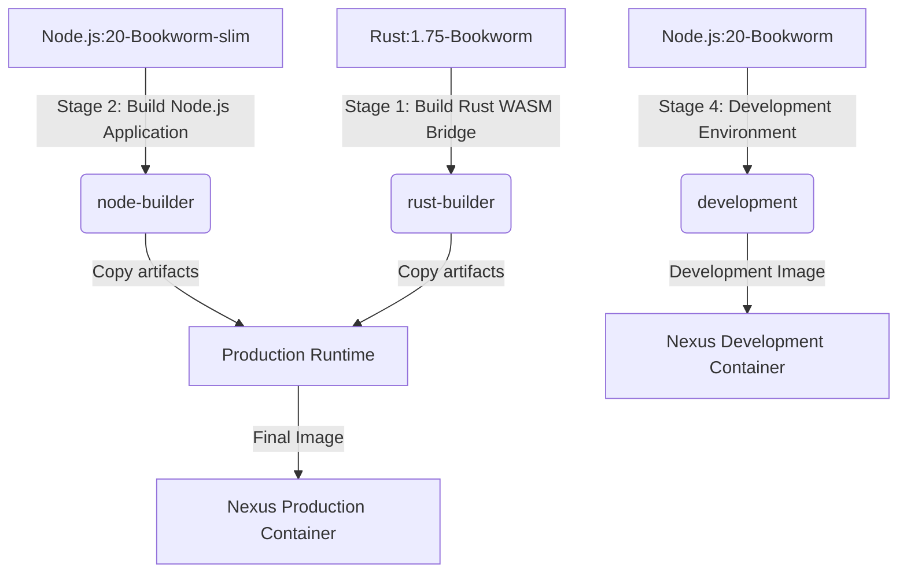
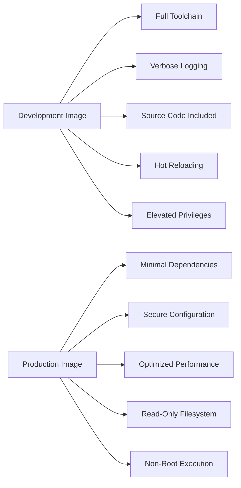

# Containerization Strategy

<cite>
**Referenced Files in This Document**   
- [Dockerfile](file://runtime/images/Dockerfile)
- [deployment.yaml](file://runtime/k8s/deployment.yaml)
- [Cargo.toml](file://runtime/nexus-wasm-bridge/Cargo.toml)
- [package.json](file://runtime/workspace-kernel/package.json)
- [index.ts](file://runtime/workspace-kernel/src/index.ts)
- [server.ts](file://runtime/workspace-kernel/src/server.ts)
- [config.ts](file://runtime/workspace-kernel/src/config.ts)
- [logger.ts](file://runtime/workspace-kernel/src/logger.ts)
- [types.ts](file://runtime/workspace-kernel/src/types.ts)
- [compiler.rs](file://runtime/nexus-wasm-bridge/src/engine/compiler.rs)
- [capability.rs](file://runtime/nexus-wasm-bridge/src/capability.rs)
</cite>

## Table of Contents
1. [Introduction](#introduction)
2. [Multi-Stage Docker Build Process](#multi-stage-docker-build-process)
3. [Security Hardening Measures](#security-hardening-measures)
4. [Base Image Selection and Dependency Management](#base-image-selection-and-dependency-management)
5. [Development vs Production Image Differences](#development-vs-production-image-differences)
6. [Image Size Optimization and Build Caching](#image-size-optimization-and-build-caching)
7. [Environment Configuration and Volume Mounting](#environment-configuration-and-volume-mounting)
8. [Conclusion](#conclusion)

## Introduction
The Nexus containerization strategy employs a multi-stage Docker build process to create optimized, secure, and efficient container images for both development and production environments. This documentation details the comprehensive approach to building, securing, and optimizing the Nexus runtime container, which integrates Rust-based WASM bridge compilation with Node.js application execution. The strategy emphasizes security hardening, resource efficiency, and clear separation between development and production environments while maintaining optimal performance and developer experience.

**Section sources**
- [Dockerfile](file://runtime/images/Dockerfile)
- [deployment.yaml](file://runtime/k8s/deployment.yaml)

## Multi-Stage Docker Build Process

The Nexus containerization strategy implements a sophisticated multi-stage Docker build process that separates concerns and optimizes the final production image. This approach consists of four distinct stages: Rust WASM Bridge compilation, Node.js application building, production runtime assembly, and development environment setup.

The first stage, labeled "rust-builder," uses the official Rust 1.75 image based on Debian Bookworm as its foundation. This stage is dedicated to compiling the Rust WASM bridge component, which serves as the critical interface between the Node.js runtime and the WasmEdge execution environment. The build process begins by installing essential WasmEdge runtime dependencies such as cmake, ninja-build, llvm-dev, and libclang-dev. Following dependency installation, the WasmEdge runtime itself is installed via the official installation script at version 0.13.5. The build then copies the nexus-wasm-bridge Cargo.toml, Cargo.lock, and source files before executing a release build with cargo build --release, producing a native shared library.

The second stage, "node-builder," utilizes the Node.js 20 Bookworm slim image to build the TypeScript application. This stage copies package.json and package-lock.json files to leverage Docker layer caching for dependency installation. It installs only production dependencies using npm ci --only=production, ensuring a clean and reproducible dependency tree. The TypeScript source files and configuration are then copied, followed by compilation using the build script defined in package.json, which invokes the TypeScript compiler to generate JavaScript output in the dist directory.

The third stage, "production," assembles the final runtime image by combining artifacts from the previous build stages. It starts with the same Node.js 20 Bookworm slim base image and installs minimal runtime dependencies including libstdc++6 and ca-certificates. The WasmEdge runtime libraries are installed system-wide to ensure availability without requiring the full development toolchain. The stage then copies the compiled Rust bridge library from the rust-builder stage, the compiled JavaScript application and dependencies from the node-builder stage, and the package.json manifest. This separation ensures that the production image contains only the necessary runtime components without any build tools or source code.

The fourth stage, "development," provides a comprehensive development environment that includes all necessary tooling for iterative development. This stage installs build-essential packages, CMake, Ninja, Rust, and other development dependencies alongside the full Node.js toolchain. It copies the entire repository to enable live reloading and includes development-specific tools like pino-pretty for formatted logging output.



**Diagram sources**
- [Dockerfile](file://runtime/images/Dockerfile)

**Section sources**
- [Dockerfile](file://runtime/images/Dockerfile)
- [Cargo.toml](file://runtime/nexus-wasm-bridge/Cargo.toml)
- [package.json](file://runtime/workspace-kernel/package.json)

## Security Hardening Measures

The Nexus containerization strategy implements comprehensive security hardening measures across both the Docker image configuration and Kubernetes deployment manifest. These measures follow the principle of least privilege and defense in depth to minimize the attack surface and mitigate potential security risks.

The production container runs as a non-root user to prevent privilege escalation attacks. A dedicated system user and group named "nexus" are created during the image build process, and the application directory is chowned to this user. The USER directive in the Dockerfile ensures that the container process executes with reduced privileges, significantly limiting the potential impact of any security vulnerabilities that might be exploited.

Filesystem security is enforced through read-only root filesystem configuration. The Kubernetes deployment manifest specifies readOnlyRootFilesystem: true in the container's security context, preventing any modifications to the container's filesystem at runtime. This measure protects against malware that attempts to modify system files or install additional payloads. The only writable locations are explicitly defined volumes, such as the cache directory mounted at /tmp/nexus-cache.

Linux capabilities are strictly controlled by dropping all capabilities by default. The deployment.yaml specifies capabilities.drop: [ALL] in the security context, removing all Linux capabilities from the container process. This means the container cannot perform privileged operations such as modifying network interfaces, accessing raw sockets, or changing file ownership, even if compromised. The container can only perform operations permitted by the base user permissions.

Network policies are implemented to restrict inbound and outbound traffic. The Kubernetes NetworkPolicy allows ingress traffic only from the ingress-nginx namespace on ports 3000 and 3001, and from the monitoring namespace on port 3000 for metrics collection. Egress traffic is restricted to allow DNS queries to the cluster's DNS service and outbound HTTP/HTTPS connections to external services, while blocking access to internal network ranges to prevent lateral movement.

Process security is enhanced by disabling privilege escalation with allowPrivilegeEscalation: false, preventing the container from gaining additional privileges through setuid binaries or other escalation vectors. The container also implements proper signal handling for graceful shutdown, catching SIGTERM, SIGINT, and SIGUSR2 signals to ensure clean termination and resource cleanup.

```mermaid
graph TD
A[Security Hardening] --> B[Non-Root User]
A --> C[Read-Only Filesystem]
A --> D[Capability Dropping]
A --> E[Network Policies]
A --> F[No Privilege Escalation]
B --> G[User: nexus]
C --> H[readOnlyRootFilesystem: true]
D --> I[drop: [ALL]]
E --> J[Ingress/Egress Rules]
F --> K[allowPrivilegeEscalation: false]
```

**Diagram sources**
- [Dockerfile](file://runtime/images/Dockerfile)
- [deployment.yaml](file://runtime/k8s/deployment.yaml)

**Section sources**
- [Dockerfile](file://runtime/images/Dockerfile)
- [deployment.yaml](file://runtime/k8s/deployment.yaml)
- [capability.rs](file://runtime/nexus-wasm-bridge/src/capability.rs)

## Base Image Selection and Dependency Management

The Nexus containerization strategy employs careful base image selection and comprehensive dependency management for both Rust and Node.js components. The choice of Node.js 20 with Debian Bookworm as the base image provides a stable, secure, and well-supported foundation for the application runtime.

The Node.js 20 runtime is selected for its long-term support status, performance improvements, and compatibility with modern JavaScript features required by the application. The Bookworm variant of Debian provides a balance between stability and up-to-date package availability, ensuring access to recent security patches while maintaining system stability. The slim variants used in production (node:20-bookworm-slim) minimize image size by excluding unnecessary packages like documentation and man pages, reducing the attack surface and improving download times.

For the Rust WASM bridge component, the rust:1.75-bookworm image provides a consistent and reproducible build environment. This image includes the Rust toolchain and necessary build tools, ensuring that the native module is compiled with compatible libraries and settings. The WasmEdge runtime is installed at version 0.13.5, which is pinned to ensure consistency across builds and deployments.

Dependency management for the Node.js application follows best practices with the use of npm ci for production builds. This command installs dependencies from package-lock.json exactly as specified, ensuring reproducible builds and preventing unexpected version changes. The development environment includes additional tooling such as ts-node-dev for TypeScript execution during development and pino-pretty for formatted log output.

The Rust component's dependencies are managed through Cargo.toml, which specifies precise versions for all crates. Key dependencies include napi for Node.js addon development, wasmedge-sdk for WasmEdge integration, serde for serialization, tokio for async runtime, and various utility crates for error handling, logging, and data structures. The release profile is optimized with LTO (Link Time Optimization), maximum optimization level, and single code generation unit for performance.

The application implements capability-based security that influences dependency requirements. The capability system requires crates like dashmap for concurrent access to capability registries, parking_lot for efficient locking, and once_cell for lazy initialization of security contexts. The logging infrastructure uses tracing and tracing-subscriber for structured logging with dynamic filtering based on environment configuration.

**Section sources**
- [Dockerfile](file://runtime/images/Dockerfile)
- [Cargo.toml](file://runtime/nexus-wasm-bridge/Cargo.toml)
- [package.json](file://runtime/workspace-kernel/package.json)

## Development vs Production Image Differences

The Nexus containerization strategy maintains clear distinctions between development and production images, optimizing each for its specific use case. The production image prioritizes security, size, and performance, while the development image emphasizes developer productivity and debugging capabilities.

The production image, built from the node:20-bookworm-slim base, is minimal and secure. It contains only the compiled application artifacts, production dependencies, and essential runtime libraries. The image runs as a non-root user, uses a read-only filesystem, and has all Linux capabilities dropped. Environment variables are set for production operation with NODE_ENV=production and appropriate log levels. The image excludes development tools, source maps, and debugging utilities to minimize size and attack surface.

In contrast, the development image, based on the full node:20-bookworm image, includes a comprehensive set of development tools. It installs build-essential packages, CMake, Ninja, and other build tools required for compiling native modules. The Rust toolchain is installed via rustup, enabling compilation of the WASM bridge during development. The image includes git for version control operations and curl for testing and debugging.

The development environment configures more verbose logging to aid debugging. The LOG_LEVEL is set to debug, and LOG_PRETTY is enabled to format logs with colors and improved readability using pino-pretty. The container runs with elevated privileges to support file system operations required by development tools and live reloading. The entire repository is copied into the container to support iterative development and hot reloading.

The entrypoint differs between environments. The production container runs the compiled application with node dist/index.js, while the development container uses npm run dev --prefix workspace-kernel to start the application with ts-node-dev, which provides automatic restart on file changes and direct execution of TypeScript files without pre-compilation.

Debugging capabilities in the development image include access to the full source code, enabling developers to use debugging tools and inspect the application state. The development environment also allows for easier configuration changes and experimentation without requiring a full rebuild process.



**Diagram sources**
- [Dockerfile](file://runtime/images/Dockerfile)

**Section sources**
- [Dockerfile](file://runtime/images/Dockerfile)
- [package.json](file://runtime/workspace-kernel/package.json)
- [logger.ts](file://runtime/workspace-kernel/src/logger.ts)

## Image Size Optimization and Build Caching

The Nexus containerization strategy implements several optimization techniques to reduce image size and improve build efficiency through effective caching mechanisms. These optimizations are critical for reducing deployment times, minimizing storage requirements, and improving overall system performance.

The multi-stage build process itself is a primary optimization technique, ensuring that build-time dependencies and intermediate artifacts are not included in the final production image. By separating the build environment from the runtime environment, the production image contains only the compiled application, its production dependencies, and essential runtime libraries. This approach significantly reduces image size compared to monolithic build processes that include all dependencies in the final image.

Layer caching is leveraged strategically by ordering Dockerfile instructions from least to most frequently changing. Dependencies are installed and cached before copying application source code, allowing Docker to reuse cached layers when source code changes but dependencies remain the same. For the Node.js application, package.json and package-lock.json are copied and dependencies installed before the source code is copied, maximizing cache hit rates during iterative development.

The Rust WASM bridge compilation benefits from Cargo's built-in caching mechanisms. The build process preserves Cargo's target directory and registry caches, allowing incremental compilation and avoiding recompilation of unchanged dependencies. The production image only includes the final compiled library, not the entire build directory, further reducing size.

The application implements bytecode caching for JavaScript execution, which improves runtime performance and reduces CPU usage. The HandlerCompiler class maintains both in-memory and on-disk caches of compiled QuickJS bytecode. The cache uses an LRU (Least Recently Used) eviction policy to manage memory usage, with configurable maximum cache size. Cache entries include metadata such as creation time, last access time, and access count to inform eviction decisions.

Build-time optimization flags are applied to both Rust and Node.js components. The Rust library is compiled with LTO (Link Time Optimization), maximum optimization level (opt-level=3), and single code generation unit (codegen-units=1) to produce highly optimized native code. The Node.js application is built with TypeScript's production settings, and the final image excludes development dependencies and tools.

Image size is further reduced by cleaning up package manager caches immediately after installation. The apt-get update and install commands are combined in a single RUN instruction with immediate cleanup of the package cache using rm -rf /var/lib/apt/lists/*, preventing these files from persisting in the image layers.

**Section sources**
- [Dockerfile](file://runtime/images/Dockerfile)
- [compiler.rs](file://runtime/nexus-wasm-bridge/src/engine/compiler.rs)
- [Cargo.toml](file://runtime/nexus-wasm-bridge/Cargo.toml)

## Environment Configuration and Volume Mounting

The Nexus containerization strategy implements a robust environment configuration system and strategic volume mounting to ensure flexibility, security, and performance across different deployment environments. This approach separates configuration from code and enables persistence of critical data while maintaining container immutability.

Environment variables are used extensively for configuration, following the 12-factor app methodology. The application reads configuration from environment variables with sensible defaults, allowing easy customization without modifying the container image. Key configuration parameters include HTTP_PORT, WS_PORT, HOST, LOG_LEVEL, CACHE_DIR, and various runtime limits. Sensitive configuration such as JWT_SECRET is provided through Kubernetes Secrets, ensuring secure handling of credentials.

The configuration system implements a hierarchy of configuration sources with environment variables taking precedence over defaults. The loadFromEnv function in config.ts extracts configuration from process.env, converting string values to appropriate types (numbers, booleans, arrays). This function handles unit conversions, such as transforming MEMORY_LIMIT_MB from megabytes to bytes. Configuration is validated at startup to ensure correctness and prevent runtime errors due to invalid settings.

Volume mounting is used strategically for cache persistence and temporary storage. The Kubernetes deployment defines an emptyDir volume mounted at /tmp/nexus-cache with a size limit of 128Mi. This in-memory volume provides fast, persistent storage for the bytecode cache across container restarts while the pod is running. The emptyDir medium is set to Memory to ensure high-performance access, which is critical for the compilation cache used by the HandlerCompiler.

The cache directory structure is organized to separate different types of cached data. Bytecode files are stored in the bytecode subdirectory with .qjsc extension, while source maps are stored in the source-maps directory. This organization enables efficient cache management and cleanup operations. The cache directory is owned by the nexus user to ensure proper permissions when running as a non-root user.

Configuration is also managed through Kubernetes ConfigMap and Secret resources. The nexus-runtime-config ConfigMap contains non-sensitive configuration parameters such as MAX_INSTANCES, MIN_INSTANCES, and various timeout and limit settings. The nexus-runtime-secrets Secret contains sensitive information like JWT_SECRET. These resources are mounted as environment variables in the container, providing a secure and flexible configuration mechanism.

The application implements graceful handling of configuration changes and cache management. The configureLogger function allows dynamic adjustment of logging configuration, while the clear_cache method on HandlerCompiler enables programmatic cache invalidation when needed. The cache directory is created with appropriate permissions during container startup to ensure the non-root user can write to it.

```mermaid
graph TD
A[Configuration Sources] --> B[Environment Variables]
A --> C[Kubernetes ConfigMap]
A --> D[Kubernetes Secret]
A --> E[Default Values]
F[Volume Mounting] --> G[/tmp/nexus-cache]
G --> H[emptyDir Volume]
H --> I[Memory Medium]
I --> J[128Mi Size Limit]
B --> K[HTTP_PORT, WS_PORT]
C --> L[MAX_INSTANCES, TIMEOUT_MS]
D --> M[JWT_SECRET]
E --> N[Default Configuration]
```

**Diagram sources**
- [Dockerfile](file://runtime/images/Dockerfile)
- [deployment.yaml](file://runtime/k8s/deployment.yaml)
- [config.ts](file://runtime/workspace-kernel/src/config.ts)

**Section sources**
- [Dockerfile](file://runtime/images/Dockerfile)
- [deployment.yaml](file://runtime/k8s/deployment.yaml)
- [config.ts](file://runtime/workspace-kernel/src/config.ts)
- [logger.ts](file://runtime/workspace-kernel/src/logger.ts)

## Conclusion
The Nexus containerization strategy demonstrates a comprehensive approach to building, securing, and deploying a complex application that integrates Rust and Node.js components through WASM technology. The multi-stage Docker build process effectively separates concerns, optimizing both the development workflow and production runtime. Security hardening measures, including non-root execution, read-only filesystems, and capability dropping, significantly reduce the attack surface while maintaining functionality.

The strategy balances performance optimization with developer experience, providing a rich development environment while ensuring the production image is minimal and efficient. The use of Kubernetes for orchestration enables sophisticated configuration management, network policies, and resource constraints that complement the container-level security measures. The caching mechanisms, both at the build and runtime levels, contribute to improved performance and reduced resource consumption.

This containerization approach aligns with modern cloud-native principles, enabling reliable, scalable, and secure deployment of the Nexus runtime. The clear separation between development and production environments ensures that developers can work efficiently while maintaining the integrity and security of production systems. The comprehensive configuration system allows for flexible deployment across different environments while preserving security best practices.

**Section sources**
- [Dockerfile](file://runtime/images/Dockerfile)
- [deployment.yaml](file://runtime/k8s/deployment.yaml)