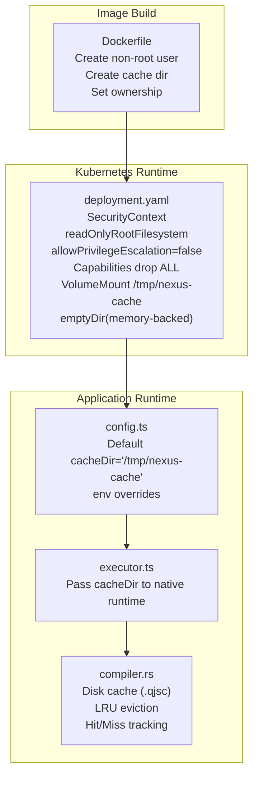
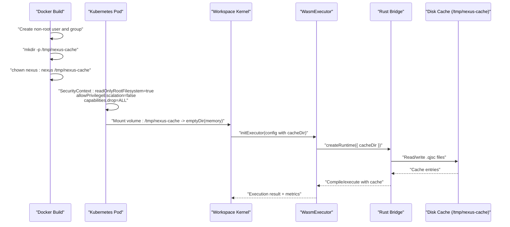
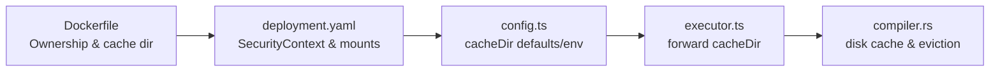
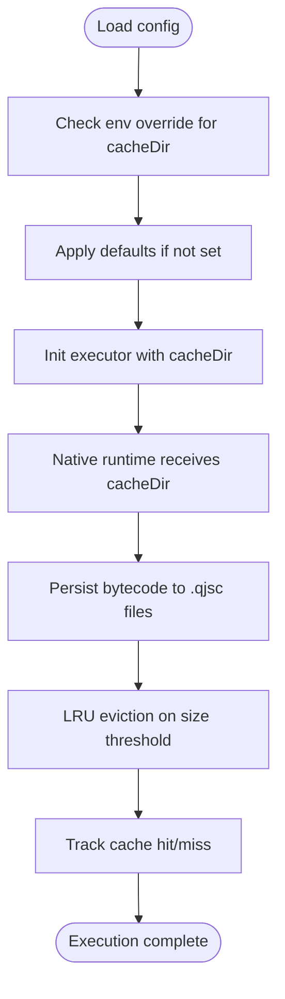

# Filesystem Security

<cite>
**Referenced Files in This Document**
- [Dockerfile](file://runtime/images/Dockerfile)
- [deployment.yaml](file://runtime/k8s/deployment.yaml)
- [config.ts](file://runtime/workspace-kernel/src/config.ts)
- [executor.ts](file://runtime/workspace-kernel/src/executor.ts)
- [compiler.rs](file://runtime/nexus-wasm-bridge/src/engine/compiler.rs)
- [index.ts](file://runtime/workspace-kernel/src/index.ts)
- [02_runtime_spec.md](file://docs/02_runtime_spec.md)
</cite>

## Table of Contents
1. [Introduction](#introduction)
2. [Project Structure](#project-structure)
3. [Core Components](#core-components)
4. [Architecture Overview](#architecture-overview)
5. [Detailed Component Analysis](#detailed-component-analysis)
6. [Dependency Analysis](#dependency-analysis)
7. [Performance Considerations](#performance-considerations)
8. [Troubleshooting Guide](#troubleshooting-guide)
9. [Conclusion](#conclusion)
10. [Appendices](#appendices)

## Introduction
This document explains filesystem security for the Nexus container, focusing on the creation and ownership of the runtime cache directory, the read-only application directory, and how these controls mitigate privilege escalation and tampering. It also covers how the cache directory is configured and used, best practices for managing temporary directories in containers, and guidance for configuring alternative cache locations and managing disk space in production.

## Project Structure
The filesystem security posture spans three layers:
- Image build-time: non-root user creation and cache directory setup
- Kubernetes runtime: read-only root filesystem, dropped capabilities, and ephemeral cache volume
- Application runtime: configuration-driven cache directory and bytecode caching behavior

**Diagram sources**
- [Dockerfile](file://runtime/images/Dockerfile#L76-L92)
- [deployment.yaml](file://runtime/k8s/deployment.yaml#L61-L134)
- [config.ts](file://runtime/workspace-kernel/src/config.ts#L22-L25)
- [executor.ts](file://runtime/workspace-kernel/src/executor.ts#L170-L179)
- [compiler.rs](file://runtime/nexus-wasm-bridge/src/engine/compiler.rs#L293-L318)

**Section sources**
- [Dockerfile](file://runtime/images/Dockerfile#L76-L92)
- [deployment.yaml](file://runtime/k8s/deployment.yaml#L61-L134)
- [config.ts](file://runtime/workspace-kernel/src/config.ts#L22-L25)
- [executor.ts](file://runtime/workspace-kernel/src/executor.ts#L170-L179)
- [compiler.rs](file://runtime/nexus-wasm-bridge/src/engine/compiler.rs#L293-L318)

## Core Components
- Non-root user and cache directory ownership at build time
- Kubernetes securityContext enforcing read-only root filesystem and dropping capabilities
- Application configuration specifying cache directory and size limits
- Native runtime bytecode cache persisted to disk under the configured directory

Key implementation points:
- Build-time ownership ensures the application process runs as a non-root user and can safely write to the cache directory.
- Kubernetes-level hardening prevents privilege escalation and limits host access.
- Application-level configuration enables flexible cache location and size management.
- Disk cache persists compiled bytecode with LRU eviction and hit/miss metrics.

**Section sources**
- [Dockerfile](file://runtime/images/Dockerfile#L76-L92)
- [deployment.yaml](file://runtime/k8s/deployment.yaml#L61-L134)
- [config.ts](file://runtime/workspace-kernel/src/config.ts#L22-L25)
- [executor.ts](file://runtime/workspace-kernel/src/executor.ts#L170-L179)
- [compiler.rs](file://runtime/nexus-wasm-bridge/src/engine/compiler.rs#L293-L318)

## Architecture Overview
The filesystem security architecture integrates build-time, platform-level, and application-level controls.

**Diagram sources**
- [Dockerfile](file://runtime/images/Dockerfile#L76-L92)
- [deployment.yaml](file://runtime/k8s/deployment.yaml#L119-L134)
- [executor.ts](file://runtime/workspace-kernel/src/executor.ts#L170-L179)
- [compiler.rs](file://runtime/nexus-wasm-bridge/src/engine/compiler.rs#L293-L318)

## Detailed Component Analysis

### Cache Directory Creation and Ownership
- Build-time creation and ownership:
  - A non-root user/group is created.
  - The application directory is chowned to the non-root user/group.
  - A cache directory is created under /tmp and chowned to the non-root user/group.
- Purpose:
  - Provides a writable cache location for compiled bytecode and temporary artifacts.
  - Ensures the application process can write to the cache without requiring root privileges.

Security implications:
- Running as a non-root user reduces the blast radius of potential filesystem tampering.
- Explicit ownership prevents accidental world-writable directories and avoids permission drift.

**Section sources**
- [Dockerfile](file://runtime/images/Dockerfile#L76-L92)

### Read-Only Root Filesystem
- Kubernetes securityContext enforces:
  - read-only root filesystem to prevent accidental or malicious writes to the application image.
  - Disabling privilege escalation to prevent gaining higher privileges.
  - Dropping all Linux capabilities to minimize attack surface.
- Volume mount:
  - The cache directory is mounted from an emptyDir volume, typically memory-backed, to keep cache fast and ephemeral.

Security implications:
- Prevents tampering with application binaries and configuration files.
- Limits persistence of sensitive artifacts to the mounted cache volume.

**Section sources**
- [deployment.yaml](file://runtime/k8s/deployment.yaml#L61-L134)

### Application Cache Configuration and Usage
- Default cache directory:
  - The application defaults to a cache directory under /tmp.
- Environment override:
  - The cache directory can be overridden via an environment variable.
- Passing to native runtime:
  - The executor forwards the cache directory to the native bridge, enabling disk-backed bytecode caching.
- Disk cache behavior:
  - Bytecode is persisted to files under the cache directory.
  - LRU eviction and size tracking ensure bounded disk usage.
  - Cache hit/miss metrics are tracked for observability.

Security implications:
- Centralized cache location simplifies auditing and access control.
- Disk-backed cache improves performance by avoiding repeated compilation.
- LRU eviction and size limits reduce risk of disk exhaustion.

**Section sources**
- [config.ts](file://runtime/workspace-kernel/src/config.ts#L22-L25)
- [config.ts](file://runtime/workspace-kernel/src/config.ts#L104-L106)
- [executor.ts](file://runtime/workspace-kernel/src/executor.ts#L170-L179)
- [compiler.rs](file://runtime/nexus-wasm-bridge/src/engine/compiler.rs#L293-L318)
- [compiler.rs](file://runtime/nexus-wasm-bridge/src/engine/compiler.rs#L254-L291)

### Privilege Escalation Mitigation via chown
- The build step sets ownership of the cache directory to the non-root user/group.
- Combined with Kubernetes securityContext (read-only root filesystem, no privilege escalation, dropped capabilities), this prevents:
  - Writing to protected parts of the filesystem.
  - Escalating privileges through misconfigured permissions.
  - Leveraging elevated privileges to inject malicious code or tamper with runtime artifacts.

Best practice alignment:
- Principle of least privilege at both image and runtime levels.

**Section sources**
- [Dockerfile](file://runtime/images/Dockerfile#L76-L92)
- [deployment.yaml](file://runtime/k8s/deployment.yaml#L61-L134)

### Read-Only Application Directory Protection
- The application directory is chowned to the non-root user/group during build.
- Kubernetes enforces a read-only root filesystem, preventing:
  - Unauthorized modification of application code.
  - Persistence of tampering artifacts beyond the cache volume.

**Section sources**
- [Dockerfile](file://runtime/images/Dockerfile#L76-L82)
- [deployment.yaml](file://runtime/k8s/deployment.yaml#L123-L126)

### Temporary Directory Best Practices in Containers
- Use ephemeral, memory-backed volumes for cache when feasible to reduce disk wear and improve performance.
- Keep cache directories owned by the non-root application user.
- Enforce read-only root filesystem and drop unnecessary capabilities.
- Limit cache size and enable eviction to prevent disk exhaustion.
- Prefer environment variables for cache configuration to support flexible deployments.

Nexus implementation:
- Memory-backed emptyDir for cache.
- LRU eviction and size tracking in the native bridge.
- Environment override for cache directory.

**Section sources**
- [deployment.yaml](file://runtime/k8s/deployment.yaml#L119-L134)
- [compiler.rs](file://runtime/nexus-wasm-bridge/src/engine/compiler.rs#L254-L291)
- [config.ts](file://runtime/workspace-kernel/src/config.ts#L104-L106)

### Alternative Cache Locations and Disk Space Management
- Alternative cache locations:
  - Override the cache directory via the environment variable used by the application configuration.
- Disk space management:
  - Configure maximum cache size in the runtime configuration.
  - Rely on LRU eviction to automatically prune older entries.
  - Monitor cache hit rates and adjust sizes based on workload characteristics.

Operational guidance:
- For persistent caches, consider a dedicated PersistentVolumeClaim mounted at a non-default path.
- For ephemeral caches, keep the default memory-backed emptyDir to avoid long-term disk usage.

**Section sources**
- [config.ts](file://runtime/workspace-kernel/src/config.ts#L22-L25)
- [config.ts](file://runtime/workspace-kernel/src/config.ts#L104-L106)
- [compiler.rs](file://runtime/nexus-wasm-bridge/src/engine/compiler.rs#L254-L291)

### Vulnerability Mitigations Related to Temporary File Handling
- Misconfigured permissions:
  - Build-time ownership and Kubernetes securityContext prevent unauthorized writes.
- Privilege escalation:
  - Non-root user and dropped capabilities reduce risk.
- Tampering with application code:
  - Read-only root filesystem protects against binary modification.
- Disk exhaustion:
  - LRU eviction and configurable size limits mitigate resource exhaustion.

Complementary security controls:
- Capability-based access control and sandboxing in the runtime specification.
- Immutable context and explicit capability declarations.

**Section sources**
- [Dockerfile](file://runtime/images/Dockerfile#L76-L92)
- [deployment.yaml](file://runtime/k8s/deployment.yaml#L61-L134)
- [compiler.rs](file://runtime/nexus-wasm-bridge/src/engine/compiler.rs#L254-L291)
- [02_runtime_spec.md](file://docs/02_runtime_spec.md#L2014-L2027)

## Dependency Analysis
The filesystem security relies on coordinated changes across build, platform, and application layers.

**Diagram sources**
- [Dockerfile](file://runtime/images/Dockerfile#L76-L92)
- [deployment.yaml](file://runtime/k8s/deployment.yaml#L61-L134)
- [config.ts](file://runtime/workspace-kernel/src/config.ts#L22-L25)
- [executor.ts](file://runtime/workspace-kernel/src/executor.ts#L170-L179)
- [compiler.rs](file://runtime/nexus-wasm-bridge/src/engine/compiler.rs#L293-L318)

**Section sources**
- [Dockerfile](file://runtime/images/Dockerfile#L76-L92)
- [deployment.yaml](file://runtime/k8s/deployment.yaml#L61-L134)
- [config.ts](file://runtime/workspace-kernel/src/config.ts#L22-L25)
- [executor.ts](file://runtime/workspace-kernel/src/executor.ts#L170-L179)
- [compiler.rs](file://runtime/nexus-wasm-bridge/src/engine/compiler.rs#L293-L318)

## Performance Considerations
- Memory-backed cache volume improves performance and reduces disk wear.
- LRU eviction keeps hot entries cached while pruning cold ones.
- Cache hit rate metrics help tune cache size and workload behavior.

[No sources needed since this section provides general guidance]

## Troubleshooting Guide
Common issues and checks:
- Permission denied when writing to cache:
  - Verify the cache directory exists and is owned by the non-root user.
  - Confirm the Kubernetes volume mount targets the correct path.
- Cache not persisting across restarts:
  - Confirm the cache volume is emptyDir (ephemeral) or a PersistentVolumeClaim as intended.
- Disk usage concerns:
  - Review cache size limits and eviction behavior.
  - Monitor cache hit rate to assess effectiveness.

Operational references:
- Build-time ownership and cache directory creation
- Kubernetes securityContext and volume mount
- Application configuration and executor forwarding
- Disk cache implementation and eviction

**Section sources**
- [Dockerfile](file://runtime/images/Dockerfile#L76-L92)
- [deployment.yaml](file://runtime/k8s/deployment.yaml#L119-L134)
- [config.ts](file://runtime/workspace-kernel/src/config.ts#L22-L25)
- [executor.ts](file://runtime/workspace-kernel/src/executor.ts#L170-L179)
- [compiler.rs](file://runtime/nexus-wasm-bridge/src/engine/compiler.rs#L254-L291)

## Conclusion
Nexus achieves strong filesystem security through layered controls:
- Build-time ownership and cache directory setup
- Kubernetes securityContext enforcing read-only root filesystem, no privilege escalation, and dropped capabilities
- Application configuration enabling flexible cache location and size management
- Native runtime disk cache with LRU eviction and metrics

These controls collectively mitigate privilege escalation, protect application integrity, and manage temporary file handling safely and efficiently.

[No sources needed since this section summarizes without analyzing specific files]

## Appendices

### Appendix A: How the Cache Directory Is Used in the Runtime
- The application loads configuration, including cache directory and size limits.
- The executor forwards the cache directory to the native runtime.
- The native runtime persists compiled bytecode to files under the cache directory and applies LRU eviction.

**Diagram sources**
- [config.ts](file://runtime/workspace-kernel/src/config.ts#L22-L25)
- [config.ts](file://runtime/workspace-kernel/src/config.ts#L104-L106)
- [executor.ts](file://runtime/workspace-kernel/src/executor.ts#L170-L179)
- [compiler.rs](file://runtime/nexus-wasm-bridge/src/engine/compiler.rs#L293-L318)
- [compiler.rs](file://runtime/nexus-wasm-bridge/src/engine/compiler.rs#L254-L291)