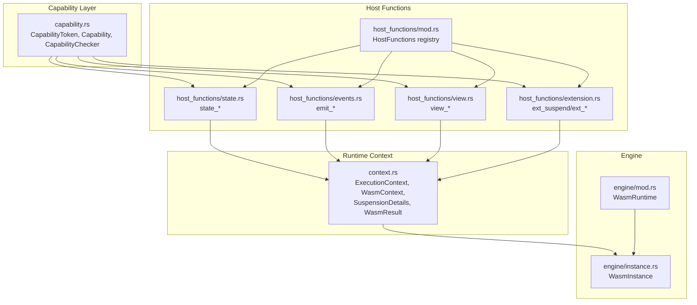
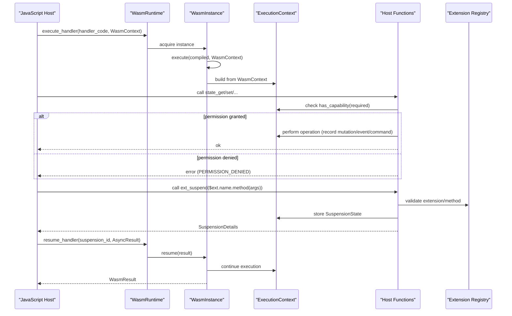
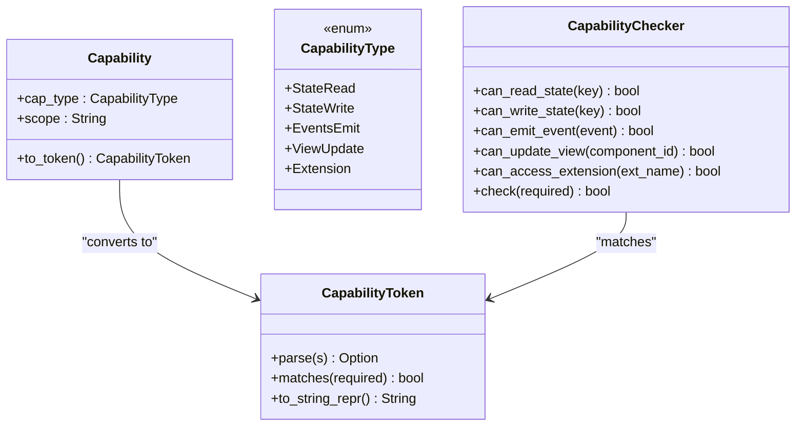
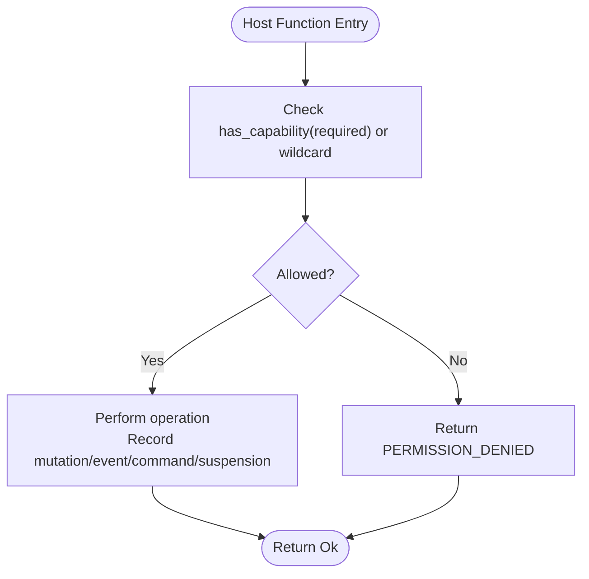
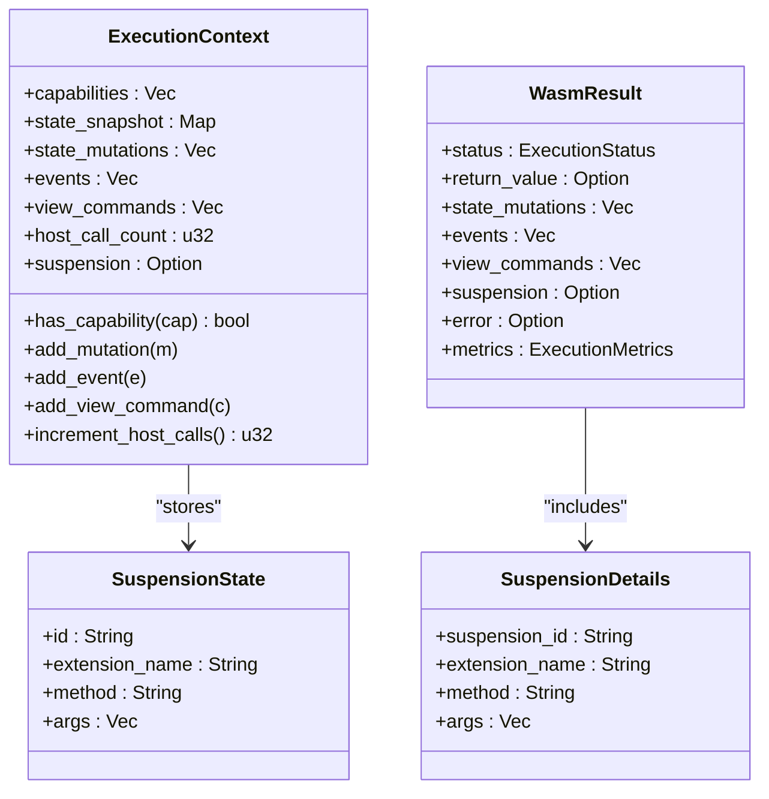
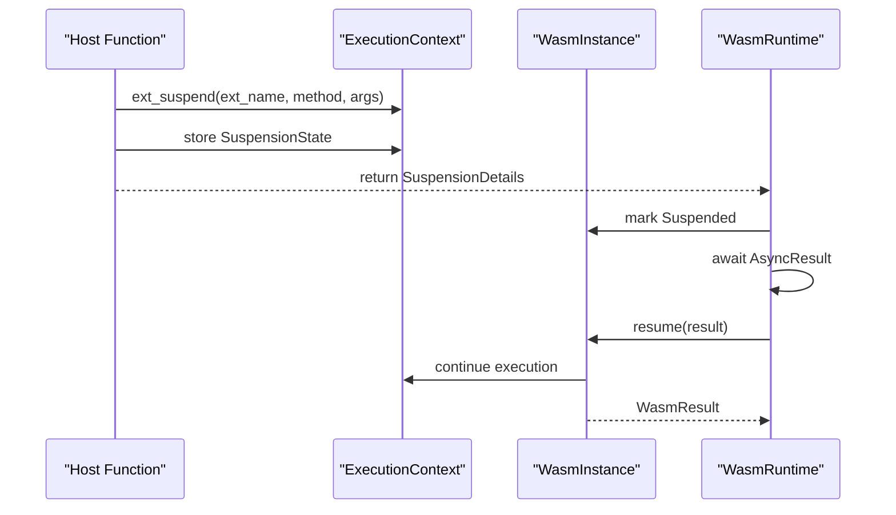
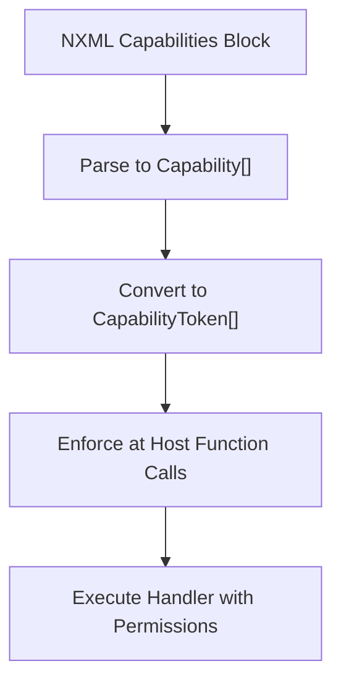
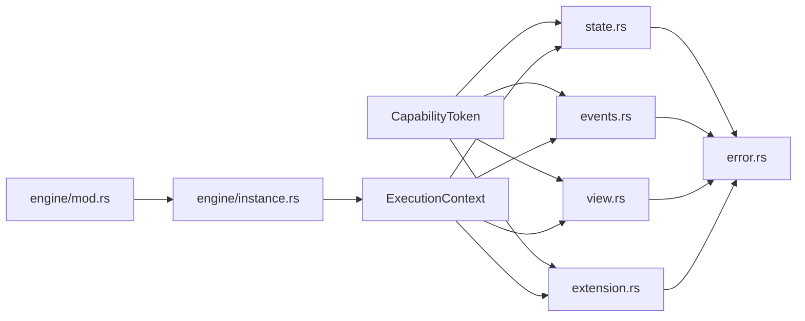

# Runtime Capabilities

<cite>
**Referenced Files in This Document**
- [capability.rs](file://runtime/nexus-wasm-bridge/src/capability.rs)
- [host_functions/mod.rs](file://runtime/nexus-wasm-bridge/src/host_functions/mod.rs)
- [host_functions/state.rs](file://runtime/nexus-wasm-bridge/src/host_functions/state.rs)
- [host_functions/events.rs](file://runtime/nexus-wasm-bridge/src/host_functions/events.rs)
- [host_functions/view.rs](file://runtime/nexus-wasm-bridge/src/host_functions/view.rs)
- [host_functions/extension.rs](file://runtime/nexus-wasm-bridge/src/host_functions/extension.rs)
- [context.rs](file://runtime/nexus-wasm-bridge/src/context.rs)
- [engine/instance.rs](file://runtime/nexus-wasm-bridge/src/engine/instance.rs)
- [engine/mod.rs](file://runtime/nexus-wasm-bridge/src/engine/mod.rs)
- [error.rs](file://runtime/nexus-wasm-bridge/src/error.rs)
- [lib.rs](file://runtime/nexus-wasm-bridge/src/lib.rs)
- [02_runtime_spec.md](file://docs/02_runtime_spec.md)
</cite>

## Table of Contents
1. [Introduction](#introduction)
2. [Project Structure](#project-structure)
3. [Core Components](#core-components)
4. [Architecture Overview](#architecture-overview)
5. [Detailed Component Analysis](#detailed-component-analysis)
6. [Dependency Analysis](#dependency-analysis)
7. [Performance Considerations](#performance-considerations)
8. [Troubleshooting Guide](#troubleshooting-guide)
9. [Conclusion](#conclusion)
10. [Appendices](#appendices)

## Introduction
This document explains Nexus’s capability-based security model for the container runtime. It describes how capabilities are declared in NXML, translated into runtime tokens, enforced at host function boundaries, and integrated with the suspend/resume execution model. It also covers how the model prevents privilege escalation in WASM runtimes and provides guidance for defining custom capabilities and troubleshooting permission-related errors.

## Project Structure
The capability system spans several modules:
- Capability parsing and matching
- Host function implementations that enforce capabilities
- Execution context and suspension state
- Engine orchestration for execution and resumption
- Error reporting for permission denials

**Diagram sources**
- [capability.rs](file://runtime/nexus-wasm-bridge/src/capability.rs#L1-L120)
- [host_functions/mod.rs](file://runtime/nexus-wasm-bridge/src/host_functions/mod.rs#L1-L93)
- [host_functions/state.rs](file://runtime/nexus-wasm-bridge/src/host_functions/state.rs#L1-L128)
- [host_functions/events.rs](file://runtime/nexus-wasm-bridge/src/host_functions/events.rs#L1-L63)
- [host_functions/view.rs](file://runtime/nexus-wasm-bridge/src/host_functions/view.rs#L1-L63)
- [host_functions/extension.rs](file://runtime/nexus-wasm-bridge/src/host_functions/extension.rs#L1-L67)
- [context.rs](file://runtime/nexus-wasm-bridge/src/context.rs#L495-L588)
- [engine/mod.rs](file://runtime/nexus-wasm-bridge/src/engine/mod.rs#L1-L120)
- [engine/instance.rs](file://runtime/nexus-wasm-bridge/src/engine/instance.rs#L1-L120)

**Section sources**
- [lib.rs](file://runtime/nexus-wasm-bridge/src/lib.rs#L1-L71)

## Core Components
- CapabilityToken: Enumerates capability scopes for state access, event emission, view updates, and extension access. Supports parsing from strings and matching against required capability strings.
- Capability: NXML-backed capability definition with type and scope, convertible to a token.
- CapabilityChecker: Utility to check whether a capability is granted.
- Host functions: state_get/set/delete/has/keys, emit_event/emit_toast, view_* commands, and extension suspend/resume. Each validates capabilities before performing operations.
- ExecutionContext: Holds the handler’s capabilities, collects mutations, events, and view commands, and tracks suspension state.
- WasmRuntime/WasmInstance: Orchestrate execution and resumption, manage instance lifecycle, and surface suspension details.

**Section sources**
- [capability.rs](file://runtime/nexus-wasm-bridge/src/capability.rs#L1-L120)
- [host_functions/state.rs](file://runtime/nexus-wasm-bridge/src/host_functions/state.rs#L1-L128)
- [host_functions/events.rs](file://runtime/nexus-wasm-bridge/src/host_functions/events.rs#L1-L63)
- [host_functions/view.rs](file://runtime/nexus-wasm-bridge/src/host_functions/view.rs#L1-L63)
- [host_functions/extension.rs](file://runtime/nexus-wasm-bridge/src/host_functions/extension.rs#L1-L67)
- [context.rs](file://runtime/nexus-wasm-bridge/src/context.rs#L495-L588)
- [engine/mod.rs](file://runtime/nexus-wasm-bridge/src/engine/mod.rs#L1-L120)
- [engine/instance.rs](file://runtime/nexus-wasm-bridge/src/engine/instance.rs#L1-L120)

## Architecture Overview
The capability model enforces fine-grained permissions at every host function call. Handlers receive a read-only state snapshot and can only mutate state, emit events, update views, or call extensions if explicitly granted capabilities. The suspend/resume model allows async extension calls to safely pause execution and resume later with results.

**Diagram sources**
- [engine/mod.rs](file://runtime/nexus-wasm-bridge/src/engine/mod.rs#L56-L120)
- [engine/instance.rs](file://runtime/nexus-wasm-bridge/src/engine/instance.rs#L118-L211)
- [host_functions/state.rs](file://runtime/nexus-wasm-bridge/src/host_functions/state.rs#L1-L128)
- [host_functions/events.rs](file://runtime/nexus-wasm-bridge/src/host_functions/events.rs#L1-L63)
- [host_functions/view.rs](file://runtime/nexus-wasm-bridge/src/host_functions/view.rs#L1-L63)
- [host_functions/extension.rs](file://runtime/nexus-wasm-bridge/src/host_functions/extension.rs#L1-L67)
- [context.rs](file://runtime/nexus-wasm-bridge/src/context.rs#L495-L588)

## Detailed Component Analysis

### Capability Tokens and Matching
- CapabilityToken encodes granular permissions:
  - State: read/write per key or wildcard
  - Events: emit per event or wildcard
  - View: update per component or wildcard
  - Extensions: access per extension or wildcard
- Parsing and matching:
  - Tokens parse from string form and match required capability strings.
  - Wildcards grant broader access (e.g., state:read:*).
- Capability inference:
  - Static analysis detects $state reads/writes, $emit calls, and $ext access patterns to derive minimal required capabilities.

**Diagram sources**
- [capability.rs](file://runtime/nexus-wasm-bridge/src/capability.rs#L1-L120)
- [capability.rs](file://runtime/nexus-wasm-bridge/src/capability.rs#L120-L224)

**Section sources**
- [capability.rs](file://runtime/nexus-wasm-bridge/src/capability.rs#L1-L120)
- [capability.rs](file://runtime/nexus-wasm-bridge/src/capability.rs#L226-L327)

### Host Function Enforcement
- State host functions:
  - state_get: permission required for read; supports wildcard read.
  - state_set/state_delete: permission required for write; records mutations.
  - state_has/state_keys: read checks; wildcard read required for keys.
- Event host functions:
  - emit_event: permission required for specific event or wildcard.
  - emit_toast: convenience wrapper emitting a toast event.
- View host functions:
  - view_command: permission required per component or wildcard.
  - view_set_filter/view_scroll_to/view_focus: convenience commands.
- Extension host functions:
  - ext_suspend: validates extension/method existence, checks capability, stores suspension state, returns suspension details.
  - ext_exists/ext_methods/ext_list: introspection helpers.

**Diagram sources**
- [host_functions/state.rs](file://runtime/nexus-wasm-bridge/src/host_functions/state.rs#L1-L128)
- [host_functions/events.rs](file://runtime/nexus-wasm-bridge/src/host_functions/events.rs#L1-L63)
- [host_functions/view.rs](file://runtime/nexus-wasm-bridge/src/host_functions/view.rs#L1-L63)
- [host_functions/extension.rs](file://runtime/nexus-wasm-bridge/src/host_functions/extension.rs#L1-L67)

**Section sources**
- [host_functions/state.rs](file://runtime/nexus-wasm-bridge/src/host_functions/state.rs#L1-L128)
- [host_functions/events.rs](file://runtime/nexus-wasm-bridge/src/host_functions/events.rs#L1-L63)
- [host_functions/view.rs](file://runtime/nexus-wasm-bridge/src/host_functions/view.rs#L1-L63)
- [host_functions/extension.rs](file://runtime/nexus-wasm-bridge/src/host_functions/extension.rs#L1-L67)

### Execution Context and Suspension
- ExecutionContext holds:
  - Capabilities granted to the handler
  - State snapshot (read-only to WASM)
  - Collected mutations, events, view commands
  - Host call counter and suspension state
- SuspensionDetails and SuspensionState enable safe async pauses and resumptions.
- WasmResult carries immediate effects and suspension metadata.

**Diagram sources**
- [context.rs](file://runtime/nexus-wasm-bridge/src/context.rs#L495-L588)
- [context.rs](file://runtime/nexus-wasm-bridge/src/context.rs#L590-L640)
- [context.rs](file://runtime/nexus-wasm-bridge/src/context.rs#L191-L233)

**Section sources**
- [context.rs](file://runtime/nexus-wasm-bridge/src/context.rs#L495-L588)
- [context.rs](file://runtime/nexus-wasm-bridge/src/context.rs#L590-L640)
- [context.rs](file://runtime/nexus-wasm-bridge/src/context.rs#L191-L233)

### Suspend/Resume Execution Model
- During async extension calls, ext_suspend stores a SuspensionState and returns SuspensionDetails.
- WasmRuntime and WasmInstance manage instance states and resume execution with AsyncResult injected back into the WASM runtime.
- The model ensures that handlers cannot bypass capability checks even across suspension boundaries.

**Diagram sources**
- [host_functions/extension.rs](file://runtime/nexus-wasm-bridge/src/host_functions/extension.rs#L1-L67)
- [context.rs](file://runtime/nexus-wasm-bridge/src/context.rs#L590-L640)
- [engine/instance.rs](file://runtime/nexus-wasm-bridge/src/engine/instance.rs#L213-L289)
- [engine/mod.rs](file://runtime/nexus-wasm-bridge/src/engine/mod.rs#L167-L194)

**Section sources**
- [engine/instance.rs](file://runtime/nexus-wasm-bridge/src/engine/instance.rs#L118-L211)
- [engine/instance.rs](file://runtime/nexus-wasm-bridge/src/engine/instance.rs#L213-L289)
- [engine/mod.rs](file://runtime/nexus-wasm-bridge/src/engine/mod.rs#L167-L194)

### NXML Capabilities and Translation
- Capability token string format: `{type}:{scope}` with examples:
  - state:write:user
  - state:write:*
  - events:emit:toast
  - ext:http
  - ext:*
- At runtime, every host function call checks the required capability string against the handler’s granted tokens.
- Automatic inference can derive capabilities from handler code via static analysis.

**Diagram sources**
- [02_runtime_spec.md](file://docs/02_runtime_spec.md#L860-L907)
- [capability.rs](file://runtime/nexus-wasm-bridge/src/capability.rs#L120-L178)
- [capability.rs](file://runtime/nexus-wasm-bridge/src/capability.rs#L226-L327)

**Section sources**
- [02_runtime_spec.md](file://docs/02_runtime_spec.md#L860-L907)
- [capability.rs](file://runtime/nexus-wasm-bridge/src/capability.rs#L120-L178)
- [capability.rs](file://runtime/nexus-wasm-bridge/src/capability.rs#L226-L327)

### Security Mitigations Against WASM Runtime Vulnerabilities
- Principle of least privilege: handlers start with zero capabilities by default.
- Capability-based enforcement at every host function boundary.
- Resource limits: timeouts, memory limits, host call counts, and mutation/event quotas.
- Immutable context: state snapshot is read-only; mutations are collected and applied by the host.
- No dynamic code generation: handlers cannot use eval/Function.
- WasmEdge sandbox and QuickJS bytecode validation.

**Section sources**
- [02_runtime_spec.md](file://docs/02_runtime_spec.md#L2014-L2027)
- [error.rs](file://runtime/nexus-wasm-bridge/src/error.rs#L1-L120)
- [host_functions/mod.rs](file://runtime/nexus-wasm-bridge/src/host_functions/mod.rs#L37-L46)

## Dependency Analysis
- CapabilityToken is consumed by:
  - Host functions to validate required capabilities
  - CapabilityChecker to evaluate permissions
  - ExecutionContext to check granted capabilities
- Host functions depend on:
  - SharedContext (Arc<Mutex<ExecutionContext>>)
  - Error codes for permission denials
- Engine depends on:
  - Host functions for capability enforcement
  - Context for suspension and results
  - Error codes for consistent error signaling

**Diagram sources**
- [capability.rs](file://runtime/nexus-wasm-bridge/src/capability.rs#L1-L120)
- [host_functions/state.rs](file://runtime/nexus-wasm-bridge/src/host_functions/state.rs#L1-L128)
- [host_functions/events.rs](file://runtime/nexus-wasm-bridge/src/host_functions/events.rs#L1-L63)
- [host_functions/view.rs](file://runtime/nexus-wasm-bridge/src/host_functions/view.rs#L1-L63)
- [host_functions/extension.rs](file://runtime/nexus-wasm-bridge/src/host_functions/extension.rs#L1-L67)
- [context.rs](file://runtime/nexus-wasm-bridge/src/context.rs#L495-L588)
- [error.rs](file://runtime/nexus-wasm-bridge/src/error.rs#L1-L120)
- [engine/mod.rs](file://runtime/nexus-wasm-bridge/src/engine/mod.rs#L1-L120)
- [engine/instance.rs](file://runtime/nexus-wasm-bridge/src/engine/instance.rs#L1-L120)

**Section sources**
- [capability.rs](file://runtime/nexus-wasm-bridge/src/capability.rs#L1-L120)
- [host_functions/state.rs](file://runtime/nexus-wasm-bridge/src/host_functions/state.rs#L1-L128)
- [host_functions/events.rs](file://runtime/nexus-wasm-bridge/src/host_functions/events.rs#L1-L63)
- [host_functions/view.rs](file://runtime/nexus-wasm-bridge/src/host_functions/view.rs#L1-L63)
- [host_functions/extension.rs](file://runtime/nexus-wasm-bridge/src/host_functions/extension.rs#L1-L67)
- [context.rs](file://runtime/nexus-wasm-bridge/src/context.rs#L495-L588)
- [error.rs](file://runtime/nexus-wasm-bridge/src/error.rs#L1-L120)
- [engine/mod.rs](file://runtime/nexus-wasm-bridge/src/engine/mod.rs#L1-L120)
- [engine/instance.rs](file://runtime/nexus-wasm-bridge/src/engine/instance.rs#L1-L120)

## Performance Considerations
- Capability checks are O(n) over granted tokens; keep capability lists minimal.
- Host call limiting prevents runaway host function usage.
- Instance pooling reduces overhead; ensure adequate pool sizing for concurrency.
- Compilation caching improves repeated handler startup times.

[No sources needed since this section provides general guidance]

## Troubleshooting Guide
Common permission-related errors and resolutions:
- PermissionDenied:
  - Symptom: Host function returns permission denied.
  - Causes:
    - Missing specific capability for state key, event name, component ID, or extension name.
    - Missing wildcard capability when required.
  - Resolution:
    - Add the appropriate capability to the handler’s NXML capabilities block.
    - Prefer least privilege: request only the keys, events, components, or extensions needed.
- ExtensionNotFound/MethodNotFound:
  - Symptom: ext_suspend reports not found.
  - Causes: Extension not registered or method not available.
  - Resolution:
    - Verify extension registration and method availability.
    - Ensure the handler has the required ext:* or specific ext:name capability.
- ResourceLimit:
  - Symptom: Exceeded host calls, memory, or other limits.
  - Resolution:
    - Increase limits cautiously or refactor handler logic to reduce resource usage.
- Timeout:
  - Symptom: Handler execution timed out.
  - Resolution:
    - Optimize handler code or increase timeout in configuration.

**Section sources**
- [error.rs](file://runtime/nexus-wasm-bridge/src/error.rs#L1-L120)
- [host_functions/state.rs](file://runtime/nexus-wasm-bridge/src/host_functions/state.rs#L1-L128)
- [host_functions/events.rs](file://runtime/nexus-wasm-bridge/src/host_functions/events.rs#L1-L63)
- [host_functions/view.rs](file://runtime/nexus-wasm-bridge/src/host_functions/view.rs#L1-L63)
- [host_functions/extension.rs](file://runtime/nexus-wasm-bridge/src/host_functions/extension.rs#L1-L67)

## Conclusion
Nexus’s capability-based security model provides strong isolation and precise control over handler permissions. By enforcing capabilities at every host function boundary and integrating with a robust suspend/resume model, the runtime prevents privilege escalation and enables safe asynchronous operations. Proper capability declaration, least privilege, and resource limits collectively mitigate common WASM runtime vulnerabilities.

[No sources needed since this section summarizes without analyzing specific files]

## Appendices

### Defining Custom Capabilities
- Choose the smallest scope that satisfies the handler’s needs:
  - state:read/write per key for targeted state access
  - events:emit per event for targeted emissions
  - view:update per component for targeted UI updates
  - ext:name for specific extension access
- Use wildcards sparingly:
  - state:read:* and state:write:* for broad state access
  - events:emit:* for broad event emission
  - view:update:* for broad view updates
  - ext:* for broad extension access
- Leverage automatic inference to discover minimal required capabilities, then refine to explicit declarations.

**Section sources**
- [capability.rs](file://runtime/nexus-wasm-bridge/src/capability.rs#L120-L178)
- [capability.rs](file://runtime/nexus-wasm-bridge/src/capability.rs#L226-L327)
- [02_runtime_spec.md](file://docs/02_runtime_spec.md#L908-L957)