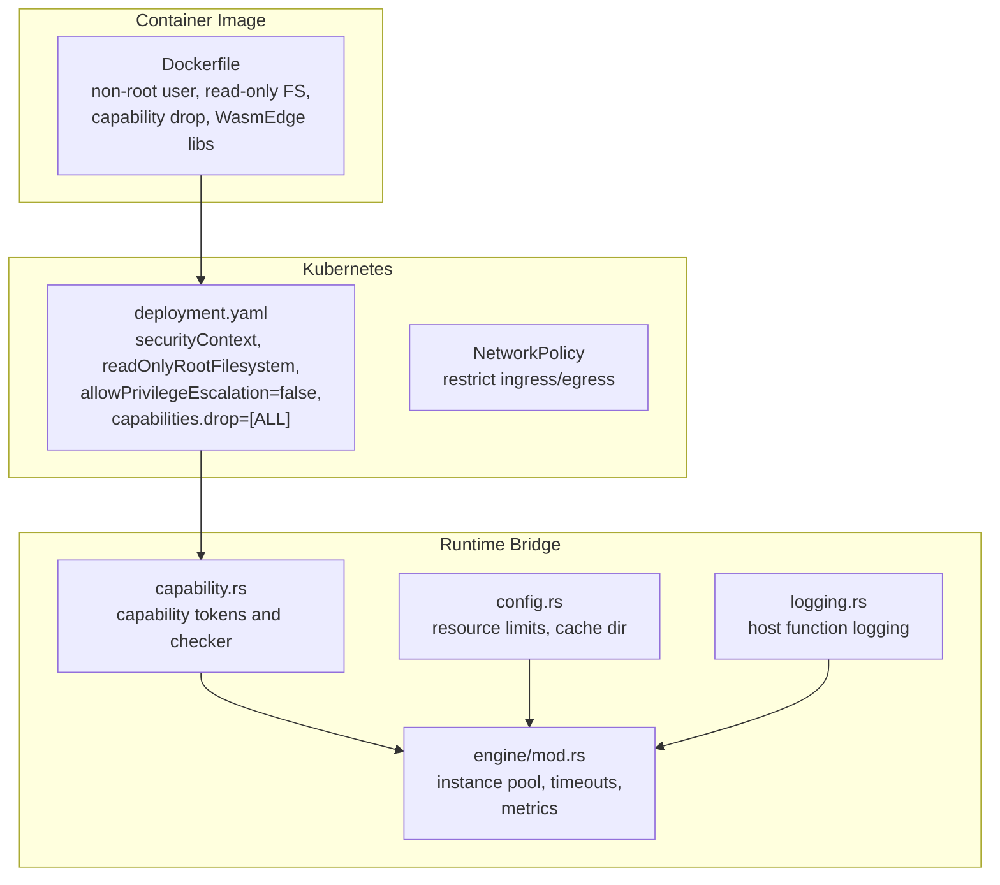
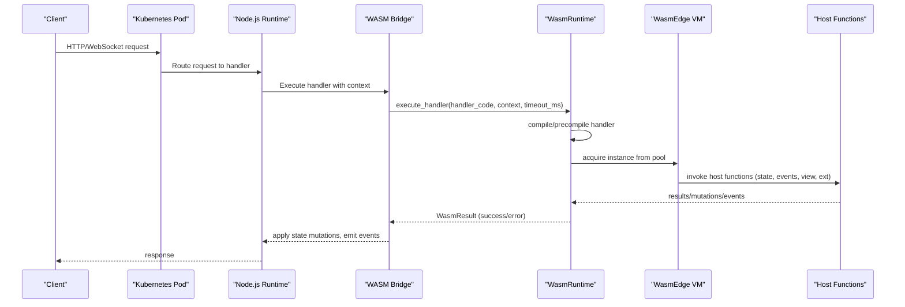
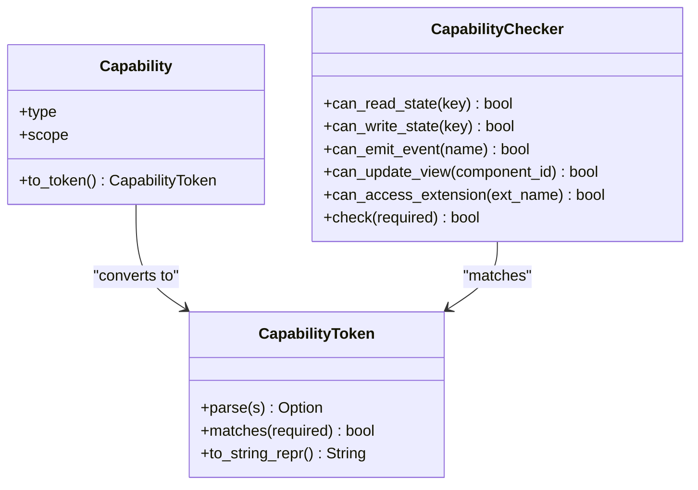
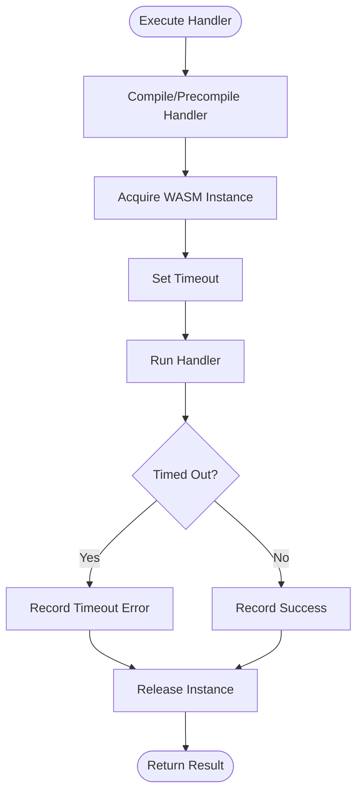
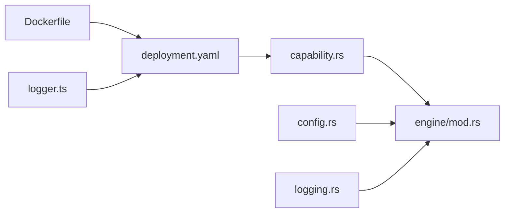

# Security Configuration

<cite>
**Referenced Files in This Document**
- [Dockerfile](file://runtime/images/Dockerfile)
- [deployment.yaml](file://runtime/k8s/deployment.yaml)
- [capability.rs](file://runtime/nexus-wasm-bridge/src/capability.rs)
- [config.rs](file://runtime/nexus-wasm-bridge/src/config.rs)
- [engine/mod.rs](file://runtime/nexus-wasm-bridge/src/engine/mod.rs)
- [logging.rs](file://runtime/nexus-wasm-bridge/src/host_functions/logging.rs)
- [logger.ts](file://runtime/workspace-kernel/src/logger.ts)
- [02_runtime_spec.md](file://docs/02_runtime_spec.md)
- [wasmedge_migration_strategy.md](file://docs/wasmedge_migration_strategy.md)
</cite>

## Table of Contents
1. [Introduction](#introduction)
2. [Project Structure](#project-structure)
3. [Core Components](#core-components)
4. [Architecture Overview](#architecture-overview)
5. [Detailed Component Analysis](#detailed-component-analysis)
6. [Dependency Analysis](#dependency-analysis)
7. [Performance Considerations](#performance-considerations)
8. [Troubleshooting Guide](#troubleshooting-guide)
9. [Conclusion](#conclusion)
10. [Appendices](#appendices)

## Introduction
This document explains the container security configuration for Nexus runtime, focusing on production-grade hardening achieved through:
- Non-root user execution
- Read-only filesystem
- Capability dropping
- WasmEdge runtime integration
- Secure environment variable management
- Operational monitoring and intrusion detection guidance

It also clarifies the rationale for running as the “nexus” user, ownership of application directories, and the security implications of LD_LIBRARY_PATH and WasmEdge runtime dependencies. Guidance is included for managing runtime configuration safely, mitigating common WASM runtime vulnerabilities, and establishing robust security monitoring in production.

## Project Structure
The security posture spans three layers:
- Container image build and runtime configuration
- Kubernetes deployment with security contexts and policies
- Runtime bridge enforcing capability-based access control and resource limits

**Diagram sources**
- [Dockerfile](file://runtime/images/Dockerfile#L76-L103)
- [deployment.yaml](file://runtime/k8s/deployment.yaml#L61-L129)
- [capability.rs](file://runtime/nexus-wasm-bridge/src/capability.rs#L1-L120)
- [config.rs](file://runtime/nexus-wasm-bridge/src/config.rs#L1-L88)
- [engine/mod.rs](file://runtime/nexus-wasm-bridge/src/engine/mod.rs#L1-L120)
- [logging.rs](file://runtime/nexus-wasm-bridge/src/host_functions/logging.rs#L1-L60)

**Section sources**
- [Dockerfile](file://runtime/images/Dockerfile#L76-L103)
- [deployment.yaml](file://runtime/k8s/deployment.yaml#L61-L129)
- [capability.rs](file://runtime/nexus-wasm-bridge/src/capability.rs#L1-L120)
- [config.rs](file://runtime/nexus-wasm-bridge/src/config.rs#L1-L88)
- [engine/mod.rs](file://runtime/nexus-wasm-bridge/src/engine/mod.rs#L1-L120)
- [logging.rs](file://runtime/nexus-wasm-bridge/src/host_functions/logging.rs#L1-L60)

## Core Components
- Container image hardening:
  - Creates a non-root “nexus” user and sets ownership of application directories.
  - Installs WasmEdge libraries and sets LD_LIBRARY_PATH appropriately for both build and runtime stages.
  - Runs the application as the non-root user.
- Kubernetes hardening:
  - Enforces runAsNonRoot, readOnlyRootFilesystem, and drops all Linux capabilities.
  - Prohibits privilege escalation and restricts network access via NetworkPolicy.
- Capability-based security:
  - Defines capability tokens and a checker to enforce granular permissions for state, events, view updates, and extension access.
- Resource limits and timeouts:
  - Enforces per-instance memory and stack limits, host-call quotas, and execution timeouts.
- Logging and observability:
  - Provides host function logging and integrates with Node.js logging configuration.

**Section sources**
- [Dockerfile](file://runtime/images/Dockerfile#L76-L103)
- [deployment.yaml](file://runtime/k8s/deployment.yaml#L61-L129)
- [capability.rs](file://runtime/nexus-wasm-bridge/src/capability.rs#L1-L120)
- [config.rs](file://runtime/nexus-wasm-bridge/src/config.rs#L1-L88)
- [engine/mod.rs](file://runtime/nexus-wasm-bridge/src/engine/mod.rs#L55-L120)
- [logging.rs](file://runtime/nexus-wasm-bridge/src/host_functions/logging.rs#L1-L60)
- [logger.ts](file://runtime/workspace-kernel/src/logger.ts#L1-L45)

## Architecture Overview
The security architecture combines container-level controls with runtime-level enforcement:

**Diagram sources**
- [engine/mod.rs](file://runtime/nexus-wasm-bridge/src/engine/mod.rs#L55-L120)
- [capability.rs](file://runtime/nexus-wasm-bridge/src/capability.rs#L180-L224)
- [logging.rs](file://runtime/nexus-wasm-bridge/src/host_functions/logging.rs#L1-L60)
- [deployment.yaml](file://runtime/k8s/deployment.yaml#L61-L129)

## Detailed Component Analysis

### Container Image Hardening (Dockerfile)
- Non-root user:
  - Creates a dedicated “nexus” user and group, then sets ownership of the application directory and cache directory to this user/group.
- Read-only filesystem:
  - The container runs with a read-only root filesystem and mounts a small, memory-backed cache volume for temporary data.
- Capability dropping:
  - The container is configured to drop all Linux capabilities, preventing privilege escalation.
- WasmEdge runtime dependencies:
  - Installs WasmEdge libraries and sets LD_LIBRARY_PATH to ensure the runtime can locate shared libraries at build and runtime.
- User execution:
  - Switches to the non-root “nexus” user before launching the application.

Security implications:
- Running as a non-root user reduces the blast radius of potential container escapes.
- Read-only root filesystem prevents accidental or malicious writes to the base image.
- Dropping capabilities removes unnecessary privileges (e.g., CAP_SYS_ADMIN).
- Proper LD_LIBRARY_PATH ensures deterministic loading of WasmEdge libraries without relying on system paths.

Operational note:
- The cache directory is mounted as an emptyDir with a size limit to constrain resource usage.

**Section sources**
- [Dockerfile](file://runtime/images/Dockerfile#L76-L103)
- [Dockerfile](file://runtime/images/Dockerfile#L11-L29)
- [Dockerfile](file://runtime/images/Dockerfile#L64-L75)
- [Dockerfile](file://runtime/images/Dockerfile#L86-L93)
- [deployment.yaml](file://runtime/k8s/deployment.yaml#L120-L134)

### Kubernetes Security Context and Policies
- Pod-level:
  - runAsNonRoot: true
  - runAsUser/runAsGroup/fsGroup: set to a non-root numeric ID
- Container-level:
  - readOnlyRootFilesystem: true
  - allowPrivilegeEscalation: false
  - capabilities.drop: ALL
  - securityContext: applied to the container
- NetworkPolicy:
  - Restricts ingress to trusted namespaces and ports.
  - Allows only necessary egress traffic (DNS and controlled HTTP/HTTPS).
- Probes and health:
  - Liveness/readiness probes use HTTP GET against the health endpoint.

Security implications:
- Prevents privilege escalation and limits the attack surface.
- Minimizes lateral movement by restricting network access.
- Ensures the workload runs with minimal privileges.

**Section sources**
- [deployment.yaml](file://runtime/k8s/deployment.yaml#L61-L129)
- [deployment.yaml](file://runtime/k8s/deployment.yaml#L248-L299)

### Capability-Based Security Model
- Capability tokens:
  - Tokens represent access to state keys, events, view components, and extensions.
  - Supports wildcard scopes (“*”) for broad access and specific scopes for least privilege.
- Capability checker:
  - Validates whether a given capability is granted for a particular operation.
- Enforcement:
  - Host functions (state, events, view, extensions) check capabilities before performing actions.
  - Logging is permitted without requiring capabilities.

Security implications:
- Principle of least privilege: handlers receive only the capabilities they explicitly declare.
- Granular control over state mutations, event emissions, and extension calls.
- Eliminates default host access, reducing the risk of unintended side effects.

**Diagram sources**
- [capability.rs](file://runtime/nexus-wasm-bridge/src/capability.rs#L1-L120)
- [capability.rs](file://runtime/nexus-wasm-bridge/src/capability.rs#L120-L224)

**Section sources**
- [capability.rs](file://runtime/nexus-wasm-bridge/src/capability.rs#L1-L120)
- [capability.rs](file://runtime/nexus-wasm-bridge/src/capability.rs#L180-L224)

### Resource Limits and Timeouts
- RuntimeConfig:
  - Defines memory limits, stack sizes, and default cache directory.
  - Provides validation to prevent unsafe configurations.
- WasmRuntime:
  - Enforces per-execution timeouts using asynchronous timeout mechanisms.
  - Tracks execution metrics and records errors and cache hits.

Security implications:
- Prevents resource exhaustion attacks (memory bombs, CPU starvation).
- Ensures bounded execution time, avoiding denial-of-service scenarios.
- Enables observability for anomaly detection.

**Diagram sources**
- [engine/mod.rs](file://runtime/nexus-wasm-bridge/src/engine/mod.rs#L55-L120)
- [config.rs](file://runtime/nexus-wasm-bridge/src/config.rs#L1-L88)

**Section sources**
- [config.rs](file://runtime/nexus-wasm-bridge/src/config.rs#L1-L88)
- [engine/mod.rs](file://runtime/nexus-wasm-bridge/src/engine/mod.rs#L55-L120)

### Logging and Observability
- Host function logging:
  - Logging host functions are always allowed and capture messages in the execution context.
- Node.js logger:
  - Logger configuration respects environment variables for log level and pretty printing.
  - In production, pretty printing is disabled by default.

Security implications:
- Centralized logging without requiring special capabilities.
- Controlled log levels via environment variables reduce noise and preserve sensitive data.

**Section sources**
- [logging.rs](file://runtime/nexus-wasm-bridge/src/host_functions/logging.rs#L1-L60)
- [logger.ts](file://runtime/workspace-kernel/src/logger.ts#L1-L45)

### Rationale for Non-Root User and File Ownership
- Non-root user:
  - The container creates a dedicated “nexus” user and group and switches to it before running the application.
- File ownership:
  - Application directory and cache directory are owned by the “nexus” user/group to ensure the process can write to cache while keeping the rest of the filesystem read-only.

Security implications:
- Reduces risk from container escapes and file system tampering.
- Aligns with principle of least privilege.

**Section sources**
- [Dockerfile](file://runtime/images/Dockerfile#L76-L83)
- [Dockerfile](file://runtime/images/Dockerfile#L80-L82)

### Security Implications of LD_LIBRARY_PATH and WasmEdge Dependencies
- LD_LIBRARY_PATH:
  - During build stage, LD_LIBRARY_PATH points to the user-local WasmEdge installation directory.
  - During runtime stage, LD_LIBRARY_PATH points to the system-wide WasmEdge installation path.
- WasmEdge runtime:
  - Libraries are installed via the official installer script and integrated into the runtime bridge.

Security implications:
- Deterministic library resolution reduces the risk of loading unexpected or malicious libraries.
- Using the system-wide installation avoids embedding potentially outdated or untrusted binaries.

**Section sources**
- [Dockerfile](file://runtime/images/Dockerfile#L11-L29)
- [Dockerfile](file://runtime/images/Dockerfile#L64-L75)
- [Dockerfile](file://runtime/images/Dockerfile#L86-L93)

### Capability-Based Security Extends to Container Security
- Container-level controls (non-root, read-only FS, capability drop) complement runtime-level capability enforcement.
- Together, they prevent privilege escalation and limit the blast radius of compromised handlers.

Security implications:
- Even if a handler attempts to escalate privileges, container-level restrictions and capability checks work in tandem to mitigate risks.

**Section sources**
- [deployment.yaml](file://runtime/k8s/deployment.yaml#L61-L129)
- [capability.rs](file://runtime/nexus-wasm-bridge/src/capability.rs#L180-L224)

### Secure Environment Variable Management
- Production defaults:
  - LOG_LEVEL is set to a safe default.
  - CACHE_DIR points to a writable cache path.
- Kubernetes configuration:
  - ConfigMap provides operational defaults.
  - Secrets store sensitive values (e.g., JWT_SECRET).
  - Environment variables are passed via envFrom and env.

Guidance:
- Avoid injecting secrets into the container image.
- Use ConfigMaps for non-sensitive defaults and Secrets for sensitive values.
- Keep LOG_LEVEL at appropriate levels for production to avoid leaking sensitive data.

**Section sources**
- [Dockerfile](file://runtime/images/Dockerfile#L86-L93)
- [deployment.yaml](file://runtime/k8s/deployment.yaml#L14-L37)
- [deployment.yaml](file://runtime/k8s/deployment.yaml#L78-L96)
- [logger.ts](file://runtime/workspace-kernel/src/logger.ts#L1-L45)

### Mitigations Against Common WASM Runtime Vulnerabilities
- Arbitrary WASM execution:
  - The runtime uses a JavaScript interpreter (QuickJS) compiled to WASM, not raw WASM execution.
- Privilege escalation:
  - Container-level controls (non-root, read-only FS, capability drop) and capability-based host function checks.
- Resource abuse:
  - Timeouts, memory limits, and host-call quotas enforced by the runtime bridge.
- Sandbox isolation:
  - WasmEdge provides a sandboxed execution environment with capability-based host function access.

**Section sources**
- [02_runtime_spec.md](file://docs/02_runtime_spec.md#L2000-L2027)
- [wasmedge_migration_strategy.md](file://docs/wasmedge_migration_strategy.md#L1-L120)
- [engine/mod.rs](file://runtime/nexus-wasm-bridge/src/engine/mod.rs#L55-L120)
- [config.rs](file://runtime/nexus-wasm-bridge/src/config.rs#L1-L88)

### Best Practices for Runtime Security Monitoring and Intrusion Detection
- Metrics and health:
  - Expose Prometheus metrics and use liveness/readiness probes.
- Logging:
  - Centralize logs and avoid logging sensitive data.
- Network policies:
  - Restrict ingress/egress to the minimum required.
- Secrets management:
  - Use Kubernetes Secrets and avoid embedding secrets in images or configs.
- Auditing:
  - Track capability checks and deny reasons for suspicious activity.

**Section sources**
- [deployment.yaml](file://runtime/k8s/deployment.yaml#L57-L60)
- [deployment.yaml](file://runtime/k8s/deployment.yaml#L104-L119)
- [logging.rs](file://runtime/nexus-wasm-bridge/src/host_functions/logging.rs#L1-L60)
- [02_runtime_spec.md](file://docs/02_runtime_spec.md#L2030-L2081)

## Dependency Analysis
The security posture depends on coordinated controls across layers:

**Diagram sources**
- [Dockerfile](file://runtime/images/Dockerfile#L76-L103)
- [deployment.yaml](file://runtime/k8s/deployment.yaml#L61-L129)
- [capability.rs](file://runtime/nexus-wasm-bridge/src/capability.rs#L1-L120)
- [config.rs](file://runtime/nexus-wasm-bridge/src/config.rs#L1-L88)
- [engine/mod.rs](file://runtime/nexus-wasm-bridge/src/engine/mod.rs#L1-L120)
- [logging.rs](file://runtime/nexus-wasm-bridge/src/host_functions/logging.rs#L1-L60)
- [logger.ts](file://runtime/workspace-kernel/src/logger.ts#L1-L45)

**Section sources**
- [Dockerfile](file://runtime/images/Dockerfile#L76-L103)
- [deployment.yaml](file://runtime/k8s/deployment.yaml#L61-L129)
- [capability.rs](file://runtime/nexus-wasm-bridge/src/capability.rs#L1-L120)
- [config.rs](file://runtime/nexus-wasm-bridge/src/config.rs#L1-L88)
- [engine/mod.rs](file://runtime/nexus-wasm-bridge/src/engine/mod.rs#L1-L120)
- [logging.rs](file://runtime/nexus-wasm-bridge/src/host_functions/logging.rs#L1-L60)
- [logger.ts](file://runtime/workspace-kernel/src/logger.ts#L1-L45)

## Performance Considerations
- Instance pooling and precompilation reduce overhead.
- Timeouts and resource limits protect against slow or abusive handlers.
- Logging and metrics should be tuned for production to minimize overhead.

[No sources needed since this section provides general guidance]

## Troubleshooting Guide
- Permission denied errors:
  - Verify that handlers declare the required capabilities in NXML.
- Timeout errors:
  - Increase handler timeout or reduce handler complexity; review resource limits.
- Cache directory issues:
  - Ensure the cache directory is writable and mounted as intended.
- Health probe failures:
  - Confirm the health endpoint is reachable and the container is running with the expected ports.

**Section sources**
- [capability.rs](file://runtime/nexus-wasm-bridge/src/capability.rs#L180-L224)
- [engine/mod.rs](file://runtime/nexus-wasm-bridge/src/engine/mod.rs#L55-L120)
- [Dockerfile](file://runtime/images/Dockerfile#L80-L82)
- [deployment.yaml](file://runtime/k8s/deployment.yaml#L104-L119)

## Conclusion
Nexus achieves strong container security through layered hardening:
- Container image and Kubernetes security contexts enforce non-root execution, read-only filesystems, and capability dropping.
- The runtime bridge enforces capability-based access control and resource limits, preventing privilege escalation and resource abuse.
- Secure environment variable management and observability practices support safe operations in production.

[No sources needed since this section summarizes without analyzing specific files]

## Appendices
- Additional security references:
  - Runtime specification threat model and secure defaults.
  - WasmEdge migration strategy detailing sandboxing and capability enforcement.

**Section sources**
- [02_runtime_spec.md](file://docs/02_runtime_spec.md#L2000-L2027)
- [wasmedge_migration_strategy.md](file://docs/wasmedge_migration_strategy.md#L1-L120)