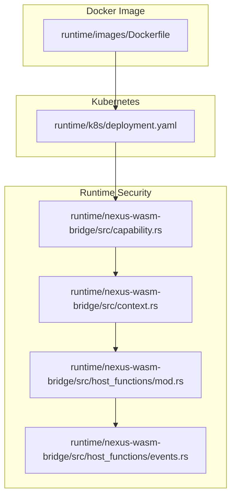
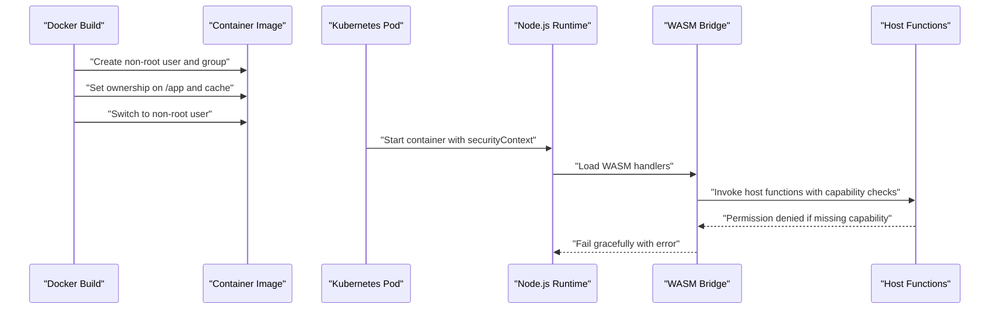
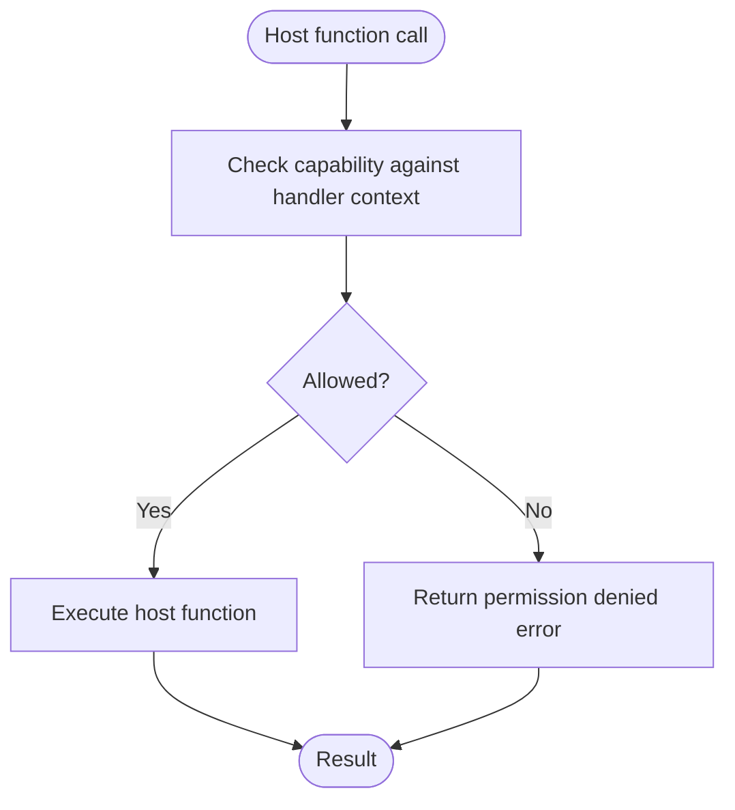
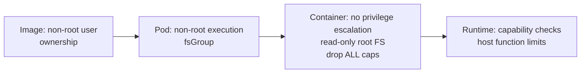
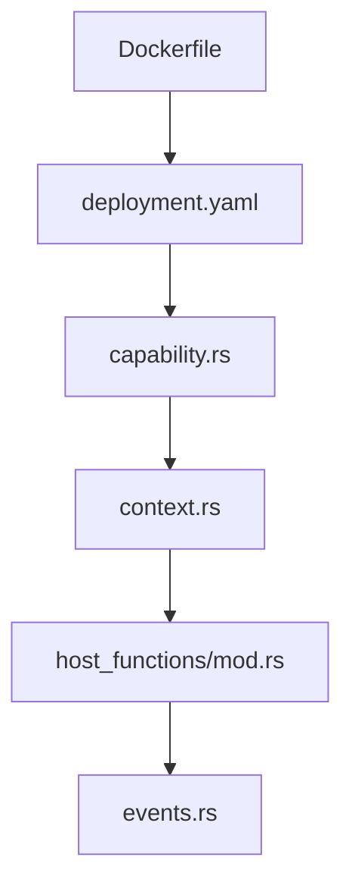

# User Privileges

<cite>
**Referenced Files in This Document**
- [Dockerfile](file://runtime/images/Dockerfile)
- [deployment.yaml](file://runtime/k8s/deployment.yaml)
- [README.md](file://runtime/README.md)
- [02_runtime_spec.md](file://docs/02_runtime_spec.md)
- [capability.rs](file://runtime/nexus-wasm-bridge/src/capability.rs)
- [context.rs](file://runtime/nexus-wasm-bridge/src/context.rs)
- [events.rs](file://runtime/nexus-wasm-bridge/src/host_functions/events.rs)
- [host_functions/mod.rs](file://runtime/nexus-wasm-bridge/src/host_functions/mod.rs)
</cite>

## Table of Contents
1. [Introduction](#introduction)
2. [Project Structure](#project-structure)
3. [Core Components](#core-components)
4. [Architecture Overview](#architecture-overview)
5. [Detailed Component Analysis](#detailed-component-analysis)
6. [Dependency Analysis](#dependency-analysis)
7. [Performance Considerations](#performance-considerations)
8. [Troubleshooting Guide](#troubleshooting-guide)
9. [Conclusion](#conclusion)

## Introduction
This document explains how user privilege management is implemented in the Nexus containerized runtime. It focuses on:
- Creation and purpose of the non-root user and group in the Docker image
- Security benefits of running as a non-root user
- File ownership configuration and its role in preventing privilege escalation
- How the USER directive enforces least privilege
- Guidance for customizing user configuration in production Kubernetes while maintaining security
- Common permission issues and how Nexus’s approach mitigates them
- Secure user management practices in production Kubernetes deployments

## Project Structure
The user privilege controls are implemented across:
- The Docker image build (non-root user creation, file ownership, and runtime user switch)
- Kubernetes manifests (pod and container security contexts)
- The runtime’s capability-based host function enforcement

**Diagram sources**
- [Dockerfile](file://runtime/images/Dockerfile#L76-L83)
- [deployment.yaml](file://runtime/k8s/deployment.yaml#L61-L67)
- [capability.rs](file://runtime/nexus-wasm-bridge/src/capability.rs#L1-L60)
- [context.rs](file://runtime/nexus-wasm-bridge/src/context.rs#L120-L190)
- [host_functions/mod.rs](file://runtime/nexus-wasm-bridge/src/host_functions/mod.rs#L1-L60)
- [events.rs](file://runtime/nexus-wasm-bridge/src/host_functions/events.rs#L1-L35)

**Section sources**
- [Dockerfile](file://runtime/images/Dockerfile#L76-L83)
- [deployment.yaml](file://runtime/k8s/deployment.yaml#L61-L67)
- [README.md](file://runtime/README.md#L98-L110)

## Core Components
- Non-root user and group creation in the Docker image
- File ownership configuration to prevent privilege escalation
- Runtime user switch to enforce least privilege
- Kubernetes pod/container security contexts for non-root execution and restricted capabilities
- Capability-based host function enforcement to limit WASM handler access

**Section sources**
- [Dockerfile](file://runtime/images/Dockerfile#L76-L83)
- [deployment.yaml](file://runtime/k8s/deployment.yaml#L61-L67)
- [capability.rs](file://runtime/nexus-wasm-bridge/src/capability.rs#L1-L60)
- [context.rs](file://runtime/nexus-wasm-bridge/src/context.rs#L120-L190)

## Architecture Overview
The privilege model combines image-level and platform-level controls:
- Docker image creates a dedicated non-root user/group and sets ownership on application directories
- The image switches to that user at runtime
- Kubernetes enforces non-root execution, disallows privilege escalation, and restricts filesystem and capabilities
- The runtime enforces capability-based access control for host functions invoked by WASM handlers

**Diagram sources**
- [Dockerfile](file://runtime/images/Dockerfile#L76-L83)
- [deployment.yaml](file://runtime/k8s/deployment.yaml#L61-L67)
- [capability.rs](file://runtime/nexus-wasm-bridge/src/capability.rs#L1-L60)
- [context.rs](file://runtime/nexus-wasm-bridge/src/context.rs#L558-L567)
- [host_functions/mod.rs](file://runtime/nexus-wasm-bridge/src/host_functions/mod.rs#L37-L52)
- [events.rs](file://runtime/nexus-wasm-bridge/src/host_functions/events.rs#L19-L35)

## Detailed Component Analysis

### Docker Image: Non-root User, Ownership, and Least Privilege
- Creates a non-root group and user for the application
- Sets ownership on application directories to the non-root user/group
- Switches to the non-root user at runtime to enforce least privilege
- Ensures caches and mounts are owned by the non-root user to avoid accidental root writes

Security benefits:
- Reduces attack surface by avoiding root privileges
- Prevents accidental or malicious writes to protected areas of the filesystem
- Aligns with Kubernetes security best practices

Customization guidance:
- Adjust the non-root UID/GID to match your cluster’s user namespace policies
- Ensure cache directories and mounted volumes are owned by the non-root user to avoid permission drift

**Section sources**
- [Dockerfile](file://runtime/images/Dockerfile#L76-L83)

### Kubernetes: Pod and Container Security Contexts
- Pod-level security context enforces non-root execution and sets fsGroup for shared volumes
- Container-level security context:
  - Disables privilege escalation
  - Forces read-only root filesystem
  - Drops all Linux capabilities
  - Optionally sets runAsUser/runAsGroup to align with image-level user

Security benefits:
- Prevents escalation attempts and reduces exposure from compromised containers
- Ensures immutable root filesystem reduces tampering
- Drops capabilities minimizes potential misuse of host resources

Customization guidance:
- Align runAsUser/runAsGroup with the image’s non-root UID/GID
- Use fsGroup to ensure shared volumes are writable by the non-root user
- Consider adding Pod Security Standards labels and admission policies in your cluster

**Section sources**
- [deployment.yaml](file://runtime/k8s/deployment.yaml#L61-L67)
- [deployment.yaml](file://runtime/k8s/deployment.yaml#L120-L129)

### Capability-based Host Function Enforcement
- Handlers execute in a sandboxed environment and must declare required capabilities
- The runtime checks whether the handler’s granted capabilities permit a given host function call
- If not permitted, the call fails with a permission error

Security benefits:
- Enforces least privilege at runtime
- Prevents unauthorized state reads/writes, event emissions, view updates, or extension calls
- Host function invocation is rate-limited and bounded to reduce abuse

Customization guidance:
- Declare only the minimal capabilities required by each handler
- Use wildcard capabilities judiciously and prefer specific scoping
- Monitor host function call counts and adjust limits accordingly

**Diagram sources**
- [capability.rs](file://runtime/nexus-wasm-bridge/src/capability.rs#L1-L60)
- [context.rs](file://runtime/nexus-wasm-bridge/src/context.rs#L558-L567)
- [events.rs](file://runtime/nexus-wasm-bridge/src/host_functions/events.rs#L19-L35)

**Section sources**
- [capability.rs](file://runtime/nexus-wasm-bridge/src/capability.rs#L1-L60)
- [context.rs](file://runtime/nexus-wasm-bridge/src/context.rs#L558-L567)
- [host_functions/mod.rs](file://runtime/nexus-wasm-bridge/src/host_functions/mod.rs#L37-L52)
- [events.rs](file://runtime/nexus-wasm-bridge/src/host_functions/events.rs#L19-L35)

### Conceptual Overview
Nexus applies layered least privilege:
- Image-level: non-root user and ownership
- Platform-level: Kubernetes security contexts
- Runtime-level: capability-based host function enforcement

[No sources needed since this diagram shows conceptual workflow, not actual code structure]

## Dependency Analysis
- The Docker image depends on the non-root user/group and ownership to establish a secure baseline
- Kubernetes manifests depend on the image’s non-root UID/GID to enforce pod/container security contexts
- The runtime’s capability system depends on the execution context to authorize host function calls

**Diagram sources**
- [Dockerfile](file://runtime/images/Dockerfile#L76-L83)
- [deployment.yaml](file://runtime/k8s/deployment.yaml#L61-L67)
- [capability.rs](file://runtime/nexus-wasm-bridge/src/capability.rs#L1-L60)
- [context.rs](file://runtime/nexus-wasm-bridge/src/context.rs#L120-L190)
- [host_functions/mod.rs](file://runtime/nexus-wasm-bridge/src/host_functions/mod.rs#L1-L60)
- [events.rs](file://runtime/nexus-wasm-bridge/src/host_functions/events.rs#L1-L35)

**Section sources**
- [Dockerfile](file://runtime/images/Dockerfile#L76-L83)
- [deployment.yaml](file://runtime/k8s/deployment.yaml#L61-L67)
- [capability.rs](file://runtime/nexus-wasm-bridge/src/capability.rs#L1-L60)
- [context.rs](file://runtime/nexus-wasm-bridge/src/context.rs#L120-L190)
- [host_functions/mod.rs](file://runtime/nexus-wasm-bridge/src/host_functions/mod.rs#L1-L60)
- [events.rs](file://runtime/nexus-wasm-bridge/src/host_functions/events.rs#L1-L35)

## Performance Considerations
- Non-root execution and read-only root filesystem have negligible performance impact compared to the security benefits
- Capability checks and host function limits add minimal overhead while providing strong safety guarantees
- Proper cache directory ownership avoids expensive permission fix-ups at startup

[No sources needed since this section provides general guidance]

## Troubleshooting Guide
Common permission-related issues and mitigations:
- Permission denied on cache or mount points
  - Ensure cache directories and mounted volumes are owned by the non-root user/group
  - Align Kubernetes fsGroup with the image’s non-root UID/GID
- Unexpected root ownership after upgrades
  - Re-run ownership steps in the Dockerfile or re-mount volumes with correct ownership
- Host function failures due to missing capabilities
  - Review the handler’s declared capabilities and grant only what is necessary
  - Use wildcard capabilities sparingly and validate host function call limits

**Section sources**
- [Dockerfile](file://runtime/images/Dockerfile#L76-L83)
- [deployment.yaml](file://runtime/k8s/deployment.yaml#L61-L67)
- [capability.rs](file://runtime/nexus-wasm-bridge/src/capability.rs#L1-L60)
- [context.rs](file://runtime/nexus-wasm-bridge/src/context.rs#L558-L567)

## Conclusion
Nexus enforces least privilege across three layers:
- Image-level non-root user and ownership
- Kubernetes-level non-root execution and restricted capabilities
- Runtime-level capability-based host function enforcement

These controls collectively minimize risk, prevent privilege escalation, and provide a robust foundation for secure containerized deployments. For production Kubernetes, align non-root UIDs/GIDs across the image and cluster, enforce read-only root filesystems, drop all capabilities, and declare only the minimal capabilities required by handlers.