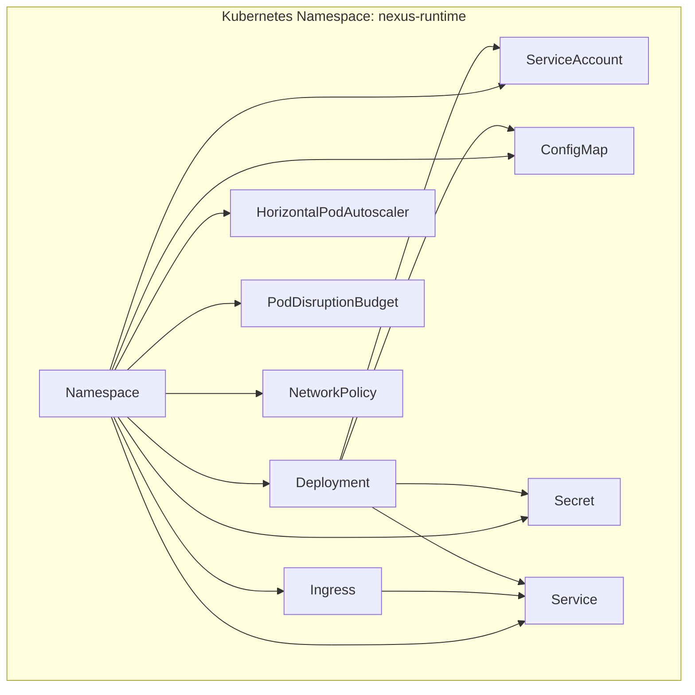
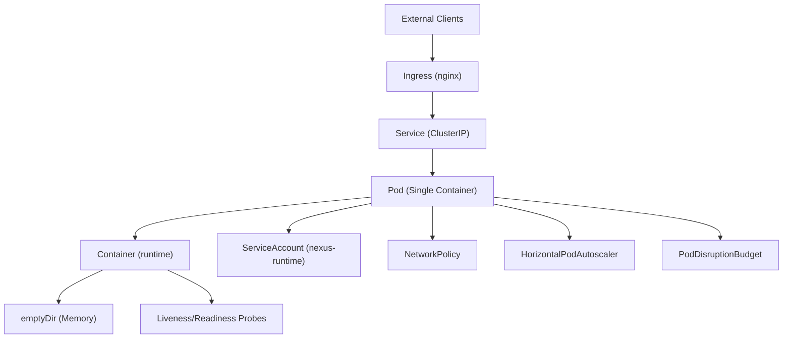
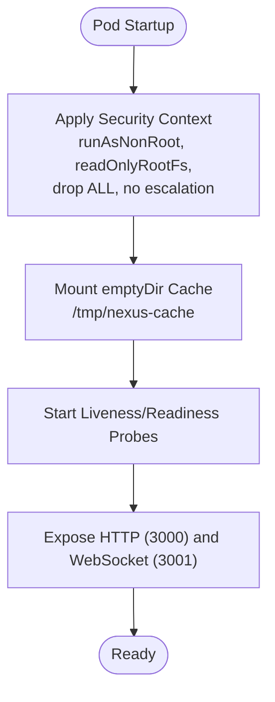
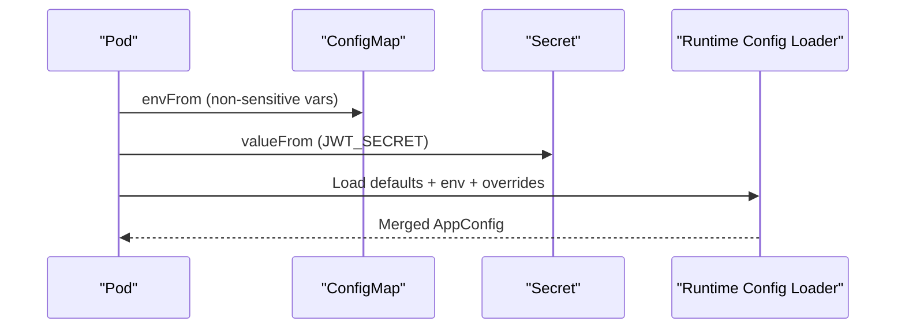
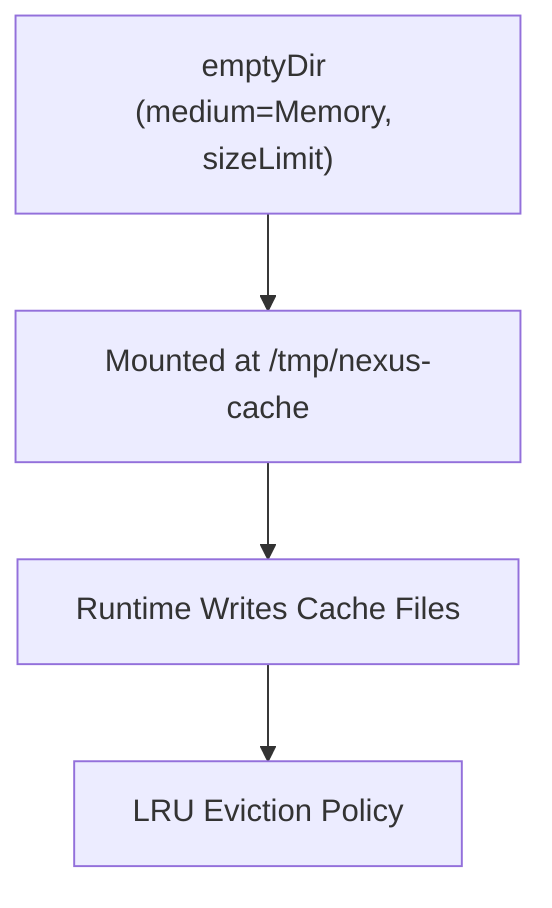
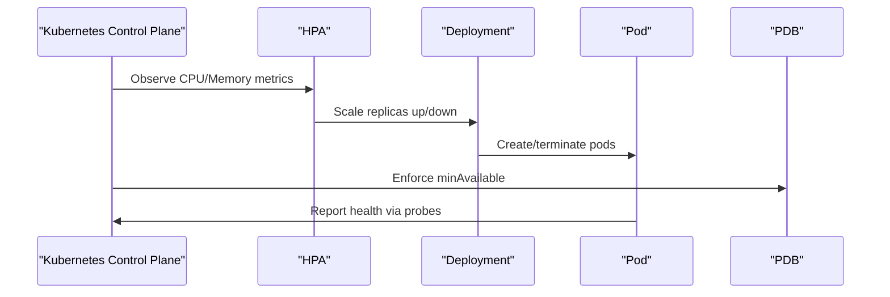
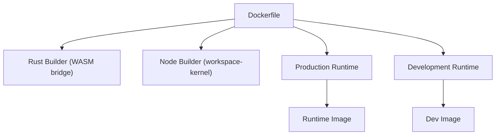

# Deployment Topology

<cite>
**Referenced Files in This Document**
- [deployment.yaml](file://runtime/k8s/deployment.yaml)
- [Dockerfile](file://runtime/images/Dockerfile)
- [config.ts](file://runtime/workspace-kernel/src/config.ts)
- [types.ts](file://runtime/workspace-kernel/src/types.ts)
- [02_runtime_spec.md](file://docs/02_runtime_spec.md)
- [README.md](file://runtime/README.md)
</cite>

## Table of Contents
1. [Introduction](#introduction)
2. [Project Structure](#project-structure)
3. [Core Components](#core-components)
4. [Architecture Overview](#architecture-overview)
5. [Detailed Component Analysis](#detailed-component-analysis)
6. [Dependency Analysis](#dependency-analysis)
7. [Performance Considerations](#performance-considerations)
8. [Troubleshooting Guide](#troubleshooting-guide)
9. [Conclusion](#conclusion)

## Introduction
This document describes the Nexus deployment topology for the runtime component. It focuses on Kubernetes namespace isolation using a dedicated namespace for workload separation, the single-container pod design running the runtime image, resource constraints and security context configuration, the service account role and least privilege enforcement, ConfigMap and Secret management for runtime configuration and sensitive data, the emptyDir volume configuration for ephemeral cache storage in memory, and high availability considerations through multi-replica deployment and observability labeling.

## Project Structure
The runtime deployment is defined in a single Kubernetes manifest file that creates:
- A namespace dedicated to the runtime
- A ConfigMap for non-sensitive runtime settings
- A Secret for sensitive credentials
- A Deployment with a single container
- A ServiceAccount for least privilege
- A Service for internal routing
- An Ingress for external access
- An autoscaler and a PodDisruptionBudget for HA
- A NetworkPolicy for controlled ingress/egress

**Diagram sources**
- [deployment.yaml](file://runtime/k8s/deployment.yaml#L1-L299)

**Section sources**
- [deployment.yaml](file://runtime/k8s/deployment.yaml#L1-L299)

## Core Components
- Namespace isolation: A dedicated namespace isolates runtime workloads from other applications.
- Single-container pod: The Deployment defines a single container running the runtime image.
- Resource constraints: CPU/memory requests/limits are set on the container.
- Security context: Root user disabled, read-only filesystem, privilege escalation disabled, and capability drops configured.
- ServiceAccount: Bound to the pod to enforce least privilege.
- ConfigMap and Secret: Provide non-sensitive and sensitive configuration respectively.
- Volume: An emptyDir-backed volume mounted as an in-memory cache directory.
- High availability: Replica count, anti-affinity, autoscaling, and PodDisruptionBudget.

**Section sources**
- [deployment.yaml](file://runtime/k8s/deployment.yaml#L40-L146)
- [deployment.yaml](file://runtime/k8s/deployment.yaml#L148-L175)
- [deployment.yaml](file://runtime/k8s/deployment.yaml#L177-L206)
- [deployment.yaml](file://runtime/k8s/deployment.yaml#L208-L245)
- [deployment.yaml](file://runtime/k8s/deployment.yaml#L247-L299)

## Architecture Overview
The runtime runs as a single-container pod with:
- HTTP and WebSocket ports exposed
- Health probes for liveness/readiness
- A cache volume backed by memory
- A service account and strict security context
- Controlled ingress via a Service and Ingress
- Autoscaling and a PodDisruptionBudget for resilience

**Diagram sources**
- [deployment.yaml](file://runtime/k8s/deployment.yaml#L148-L206)
- [deployment.yaml](file://runtime/k8s/deployment.yaml#L208-L245)
- [deployment.yaml](file://runtime/k8s/deployment.yaml#L247-L299)

## Detailed Component Analysis

### Namespace Isolation Strategy
- A dedicated namespace groups all runtime resources, enabling:
  - Clear ownership and billing boundaries
  - Simplified RBAC and NetworkPolicy scoping
  - Easier auditing and compliance

**Section sources**
- [deployment.yaml](file://runtime/k8s/deployment.yaml#L4-L10)

### Pod Design and Single-Container Architecture
- The Deployment runs a single container named “runtime”.
- Ports:
  - HTTP on 3000
  - WebSocket on 3001
- Health endpoints:
  - Liveness probe against /health
  - Readiness probe against /health
- Security context:
  - Non-root user/group and fsGroup set
  - Read-only root filesystem
  - Privilege escalation disabled
  - Drop all capabilities

**Diagram sources**
- [deployment.yaml](file://runtime/k8s/deployment.yaml#L61-L129)

**Section sources**
- [deployment.yaml](file://runtime/k8s/deployment.yaml#L61-L129)

### Resource Constraints
- Requests and limits are defined for CPU and memory.
- These constraints inform scheduling and prevent noisy-neighbor effects.

**Section sources**
- [deployment.yaml](file://runtime/k8s/deployment.yaml#L97-L103)

### Security Context Configuration
- Non-root execution enforced.
- Read-only root filesystem.
- Privilege escalation disabled.
- All Linux capabilities dropped.
- Filesystem group ownership set.

**Section sources**
- [deployment.yaml](file://runtime/k8s/deployment.yaml#L61-L67)
- [deployment.yaml](file://runtime/k8s/deployment.yaml#L123-L129)

### Service Account and Least Privilege
- The pod uses a dedicated ServiceAccount.
- The manifest does not define RBAC roles/bindings; the ServiceAccount itself enforces least privilege by default.
- RBAC should be layered externally to grant only required permissions.

**Section sources**
- [deployment.yaml](file://runtime/k8s/deployment.yaml#L61-L61)
- [deployment.yaml](file://runtime/k8s/deployment.yaml#L148-L153)

### ConfigMap and Secret Management
- ConfigMap holds non-sensitive runtime settings (e.g., logging level, instance limits, timeouts).
- Secret holds sensitive data (e.g., JWT secret).
- The container reads:
  - ConfigMap via envFrom
  - Secret via env.valueFrom
- The runtime’s configuration loader merges defaults, environment variables, and overrides.

**Diagram sources**
- [deployment.yaml](file://runtime/k8s/deployment.yaml#L78-L96)
- [config.ts](file://runtime/workspace-kernel/src/config.ts#L76-L123)

**Section sources**
- [deployment.yaml](file://runtime/k8s/deployment.yaml#L13-L37)
- [deployment.yaml](file://runtime/k8s/deployment.yaml#L78-L96)
- [config.ts](file://runtime/workspace-kernel/src/config.ts#L76-L123)
- [types.ts](file://runtime/workspace-kernel/src/types.ts#L304-L352)

### EmptyDir Volume for Ephemeral Cache Storage
- An emptyDir volume is mounted as the cache directory.
- The volume uses memory medium with a size limit.
- The runtime writes bytecode cache and temporary artifacts to this directory.

**Diagram sources**
- [deployment.yaml](file://runtime/k8s/deployment.yaml#L130-L133)
- [config.ts](file://runtime/workspace-kernel/src/config.ts#L18-L25)

**Section sources**
- [deployment.yaml](file://runtime/k8s/deployment.yaml#L130-L133)
- [config.ts](file://runtime/workspace-kernel/src/config.ts#L18-L25)

### High Availability and Observability
- Replicas: The Deployment sets a base replica count and scales via autoscaling.
- Anti-affinity: Pods are scheduled across nodes to improve fault tolerance.
- Autoscaling: CPU and memory utilization targets drive scaling.
- PodDisruptionBudget: Ensures a minimum number of pods remain available during maintenance.
- Observability: Pod labels and annotations enable scraping metrics.

**Diagram sources**
- [deployment.yaml](file://runtime/k8s/deployment.yaml#L48-L48)
- [deployment.yaml](file://runtime/k8s/deployment.yaml#L135-L146)
- [deployment.yaml](file://runtime/k8s/deployment.yaml#L208-L233)
- [deployment.yaml](file://runtime/k8s/deployment.yaml#L235-L245)

**Section sources**
- [deployment.yaml](file://runtime/k8s/deployment.yaml#L48-L48)
- [deployment.yaml](file://runtime/k8s/deployment.yaml#L135-L146)
- [deployment.yaml](file://runtime/k8s/deployment.yaml#L208-L233)
- [deployment.yaml](file://runtime/k8s/deployment.yaml#L235-L245)

### Ingress, Service, and Network Policies
- Service exposes HTTP and WebSocket ports internally.
- Ingress routes external traffic to the Service.
- NetworkPolicy restricts ingress to specific namespaces and allows only necessary egress (DNS and HTTP/HTTPS).

**Section sources**
- [deployment.yaml](file://runtime/k8s/deployment.yaml#L155-L175)
- [deployment.yaml](file://runtime/k8s/deployment.yaml#L177-L206)
- [deployment.yaml](file://runtime/k8s/deployment.yaml#L247-L299)

## Dependency Analysis
The runtime container image is built from a multi-stage Dockerfile that:
- Installs WasmEdge libraries
- Copies compiled artifacts from build stages
- Creates a non-root user
- Sets environment variables and exposes ports
- Defines a health check

**Diagram sources**
- [Dockerfile](file://runtime/images/Dockerfile#L1-L152)

**Section sources**
- [Dockerfile](file://runtime/images/Dockerfile#L1-L152)

## Performance Considerations
- CPU and memory requests/limits are defined to balance performance and resource guarantees.
- The cache volume uses memory medium for fast access; size limits prevent excessive memory usage.
- Autoscaling targets help maintain responsiveness under varying load.
- Anti-affinity reduces risk of correlated failures across nodes.

[No sources needed since this section provides general guidance]

## Troubleshooting Guide
- Authentication failures: Verify JWT secret is present in the Secret and correctly referenced by the container environment.
- Health check failures: Confirm the health endpoint responds and probes are configured appropriately.
- Cache exhaustion or eviction: Review cache directory usage and consider tuning cache size limits.
- Network connectivity issues: Check NetworkPolicy to ensure allowed egress ranges and ingress namespaces.

**Section sources**
- [deployment.yaml](file://runtime/k8s/deployment.yaml#L29-L37)
- [deployment.yaml](file://runtime/k8s/deployment.yaml#L104-L119)
- [deployment.yaml](file://runtime/k8s/deployment.yaml#L130-L133)
- [deployment.yaml](file://runtime/k8s/deployment.yaml#L247-L299)

## Conclusion
The Nexus runtime deployment employs a clean, secure, and highly available topology:
- Dedicated namespace for workload isolation
- Single-container pod with strict security posture
- Managed configuration via ConfigMap and Secret
- In-memory cache via emptyDir for performance
- Multi-replica deployment with anti-affinity, autoscaling, and a PodDisruptionBudget
- Controlled ingress/egress via Service, Ingress, and NetworkPolicy

This design balances security, performance, and operational reliability for the runtime component.