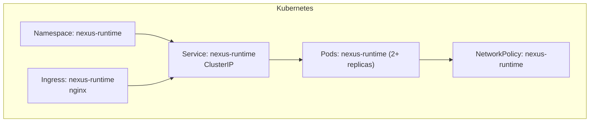
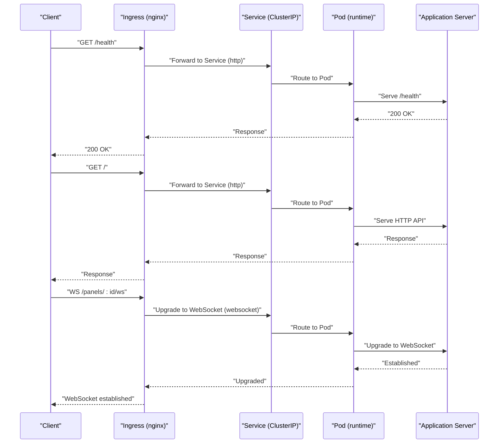
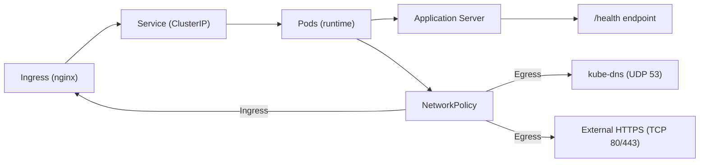

# Networking Configuration

<cite>
**Referenced Files in This Document**
- [deployment.yaml](file://runtime/k8s/deployment.yaml)
- [server.ts](file://runtime/workspace-kernel/src/server.ts)
</cite>

## Table of Contents
1. [Introduction](#introduction)
2. [Project Structure](#project-structure)
3. [Core Components](#core-components)
4. [Architecture Overview](#architecture-overview)
5. [Detailed Component Analysis](#detailed-component-analysis)
6. [Dependency Analysis](#dependency-analysis)
7. [Performance Considerations](#performance-considerations)
8. [Troubleshooting Guide](#troubleshooting-guide)
9. [Conclusion](#conclusion)

## Introduction
This document describes the Nexus networking configuration for the runtime service. It covers the Service definition with ClusterIP exposing HTTP and WebSocket endpoints, the Ingress configuration using nginx.ingress.kubernetes.io annotations for WebSocket support and extended timeouts, path-based routing rules for root and panels paths, the NetworkPolicy that restricts ingress traffic and allows egress to DNS and external HTTPS endpoints, and the liveness and readiness probes configured against the /health endpoint with their timeout parameters.

## Project Structure
The networking configuration is primarily defined in a single Kubernetes manifest file. The runtime application exposes both HTTP and WebSocket endpoints internally, which are fronted by an Nginx Ingress with specific annotations for WebSocket support and long-running connections. A NetworkPolicy controls traffic to and from the pods.

**Diagram sources**
- [deployment.yaml](file://runtime/k8s/deployment.yaml#L1-L299)

**Section sources**
- [deployment.yaml](file://runtime/k8s/deployment.yaml#L1-L299)

## Core Components
- Service (ClusterIP): Exposes HTTP on port 80 and WebSocket on port 3001, targeting container ports named http and websocket respectively.
- Ingress (nginx): Routes root path to the HTTP service and /panels path to the WebSocket service, with annotations enabling WebSocket support and extended proxy timeouts.
- NetworkPolicy: Allows ingress from ingress-nginx and monitoring namespaces, and permits egress to kube-dns and external HTTPS endpoints.
- Probes: Liveness and readiness probes check the /health endpoint on the HTTP port with explicit timeout parameters.

**Section sources**
- [deployment.yaml](file://runtime/k8s/deployment.yaml#L155-L206)
- [deployment.yaml](file://runtime/k8s/deployment.yaml#L177-L206)
- [deployment.yaml](file://runtime/k8s/deployment.yaml#L247-L299)
- [deployment.yaml](file://runtime/k8s/deployment.yaml#L104-L119)

## Architecture Overview
The runtime service is exposed internally via a ClusterIP Service and accessed externally through an Nginx Ingress. The Ingress routes:
- Root path (/) to the HTTP service port
- Panels path (/panels) to the WebSocket service port

The Ingress uses annotations to enable WebSocket upgrades and to set long proxy timeouts suitable for long-lived connections. The NetworkPolicy restricts inbound traffic to trusted namespaces and outbound traffic to DNS and external HTTPS endpoints. Pods expose liveness and readiness probes on the /health endpoint.

**Diagram sources**
- [deployment.yaml](file://runtime/k8s/deployment.yaml#L155-L206)
- [deployment.yaml](file://runtime/k8s/deployment.yaml#L177-L206)
- [server.ts](file://runtime/workspace-kernel/src/server.ts#L130-L201)

## Detailed Component Analysis

### Service Definition (ClusterIP)
- Type: ClusterIP
- Ports:
  - http: port 80, targetPort named http
  - websocket: port 3001, targetPort named websocket
- Selector: matches pods labeled with app.kubernetes.io/name=nexus-runtime

This Service exposes both HTTP and WebSocket endpoints internally. The Ingress routes to these ports based on path rules.

**Section sources**
- [deployment.yaml](file://runtime/k8s/deployment.yaml#L155-L175)

### Ingress Configuration (nginx)
- ingressClassName: nginx
- host: nexus-runtime.example.com
- Annotations:
  - nginx.ingress.kubernetes.io/proxy-read-timeout: "3600"
  - nginx.ingress.kubernetes.io/proxy-send-timeout: "3600"
  - nginx.ingress.kubernetes.io/websocket-services: "nexus-runtime"
- Path-based routing:
  - / -> backend service nexus-runtime, port http
  - /panels -> backend service nexus-runtime, port websocket

These annotations enable WebSocket upgrades and set long proxy timeouts suitable for long-lived connections. The path rules route the root path to the HTTP service and the /panels path to the WebSocket service.

**Section sources**
- [deployment.yaml](file://runtime/k8s/deployment.yaml#L177-L206)

### Path-Based Routing Rules
- Root path (/):
  - Route to Service nexus-runtime
  - Port: http (targeting container port named http)
- Panels path (/panels):
  - Route to Service nexus-runtime
  - Port: websocket (targeting container port named websocket)

The application’s WebSocket upgrade logic expects a path pattern under /panels for WebSocket connections.

**Section sources**
- [deployment.yaml](file://runtime/k8s/deployment.yaml#L188-L206)
- [server.ts](file://runtime/workspace-kernel/src/server.ts#L154-L201)

### NetworkPolicy Implementation
- PolicyTypes: Ingress, Egress
- Ingress:
  - Allow from namespace labeled name=ingress-nginx
  - Allow TCP ports 3000, 3001 to the runtime pods
  - Allow from namespace labeled name=monitoring
  - Allow TCP port 3000 (metrics) to the runtime pods
- Egress:
  - Allow DNS to kube-dns pod (UDP 53)
  - Allow external HTTPS to 0.0.0.0/0 excluding RFC1918 ranges (TCP 80, 443)

This policy restricts inbound traffic to trusted namespaces and outbound traffic to DNS and external HTTPS endpoints.

**Section sources**
- [deployment.yaml](file://runtime/k8s/deployment.yaml#L247-L299)

### Liveness and Readiness Probes
- Probe path: /health
- Probe port: http (containerPort named http)
- LivenessProbe:
  - initialDelaySeconds: 10
  - periodSeconds: 30
  - timeoutSeconds: 5
  - failureThreshold: 3
- ReadinessProbe:
  - initialDelaySeconds: 5
  - periodSeconds: 10
  - timeoutSeconds: 3
  - failureThreshold: 3

The application serves the /health endpoint and skips authentication for health checks.

**Section sources**
- [deployment.yaml](file://runtime/k8s/deployment.yaml#L104-L119)
- [server.ts](file://runtime/workspace-kernel/src/server.ts#L130-L136)
- [server.ts](file://runtime/workspace-kernel/src/server.ts#L480-L502)

## Dependency Analysis
The runtime application exposes both HTTP and WebSocket endpoints. The Ingress depends on the Service to forward traffic to the correct container ports. The NetworkPolicy constrains traffic to and from the pods. Probes depend on the /health endpoint being served by the application.

**Diagram sources**
- [deployment.yaml](file://runtime/k8s/deployment.yaml#L155-L206)
- [deployment.yaml](file://runtime/k8s/deployment.yaml#L247-L299)
- [server.ts](file://runtime/workspace-kernel/src/server.ts#L130-L136)

**Section sources**
- [deployment.yaml](file://runtime/k8s/deployment.yaml#L155-L206)
- [deployment.yaml](file://runtime/k8s/deployment.yaml#L247-L299)
- [server.ts](file://runtime/workspace-kernel/src/server.ts#L130-L136)

## Performance Considerations
- Extended proxy timeouts: The Ingress annotations set proxy read/send timeouts to 3600 seconds, enabling long-lived WebSocket connections and slow upstream responses.
- Concurrency and timeouts in application: The HTTP extension defaults to a 30000 ms timeout for outbound HTTP requests, aligning with the Ingress proxy timeouts.
- Probes: The readiness probe has a shorter timeout than the liveness probe, reducing premature termination during startup.

[No sources needed since this section provides general guidance]

## Troubleshooting Guide
- WebSocket not upgrading:
  - Verify Ingress annotation nginx.ingress.kubernetes.io/websocket-services includes the Service name.
  - Confirm path rule for /panels targets the websocket port.
- Long-running connections disconnecting:
  - Confirm proxy read/send timeouts are set appropriately in the Ingress annotations.
- Health probe failures:
  - Check /health endpoint availability and ensure it responds quickly within the probe timeout window.
  - Review probe timing parameters and adjust initialDelaySeconds and periodSeconds if needed.
- Connectivity issues:
  - Ensure NetworkPolicy allows ingress from ingress-nginx and monitoring namespaces.
  - Verify egress to kube-dns and external HTTPS endpoints is permitted.

**Section sources**
- [deployment.yaml](file://runtime/k8s/deployment.yaml#L177-L206)
- [deployment.yaml](file://runtime/k8s/deployment.yaml#L247-L299)
- [deployment.yaml](file://runtime/k8s/deployment.yaml#L104-L119)
- [server.ts](file://runtime/workspace-kernel/src/server.ts#L130-L136)

## Conclusion
The Nexus networking configuration defines a robust internal and external access model for the runtime service. The ClusterIP Service exposes both HTTP and WebSocket endpoints, the Nginx Ingress routes paths appropriately with WebSocket support and extended timeouts, the NetworkPolicy enforces strict ingress and egress policies, and the /health endpoint is probed with carefully tuned timeouts. Together, these components provide a secure and scalable foundation for the runtime service.