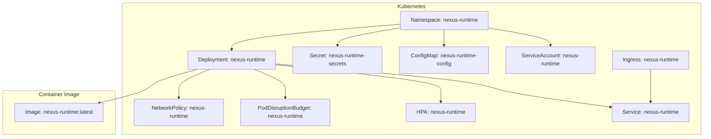
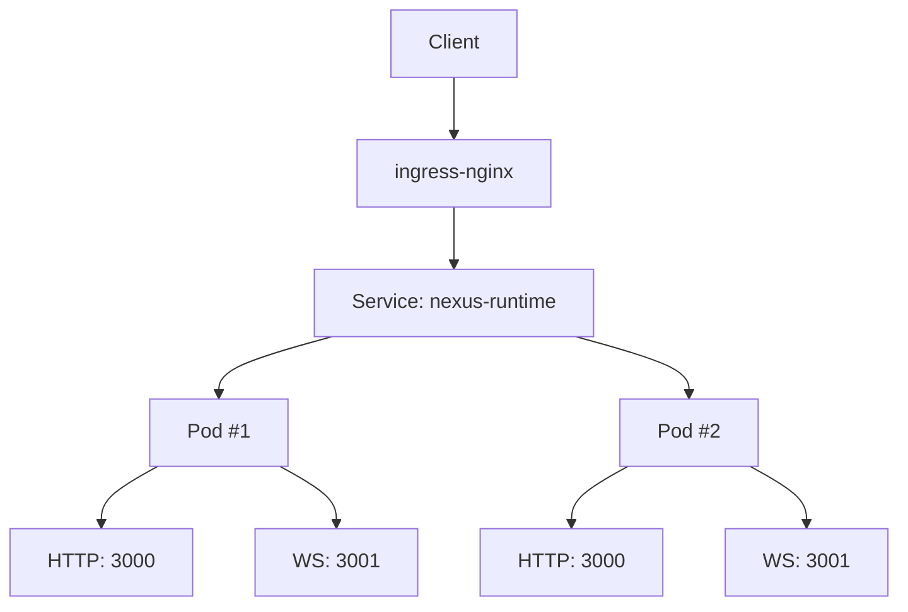
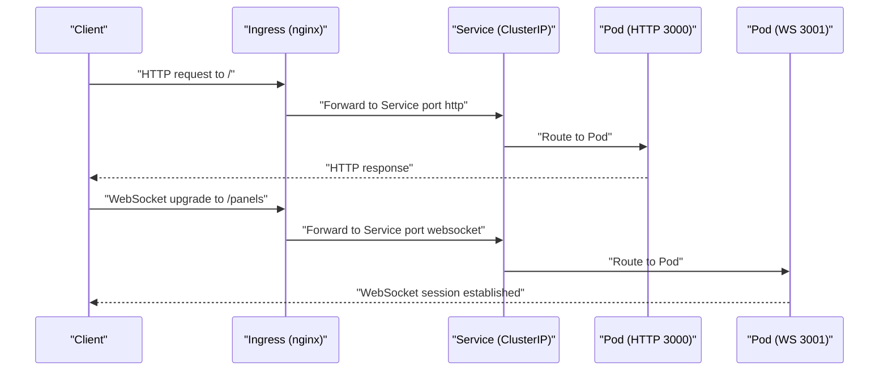
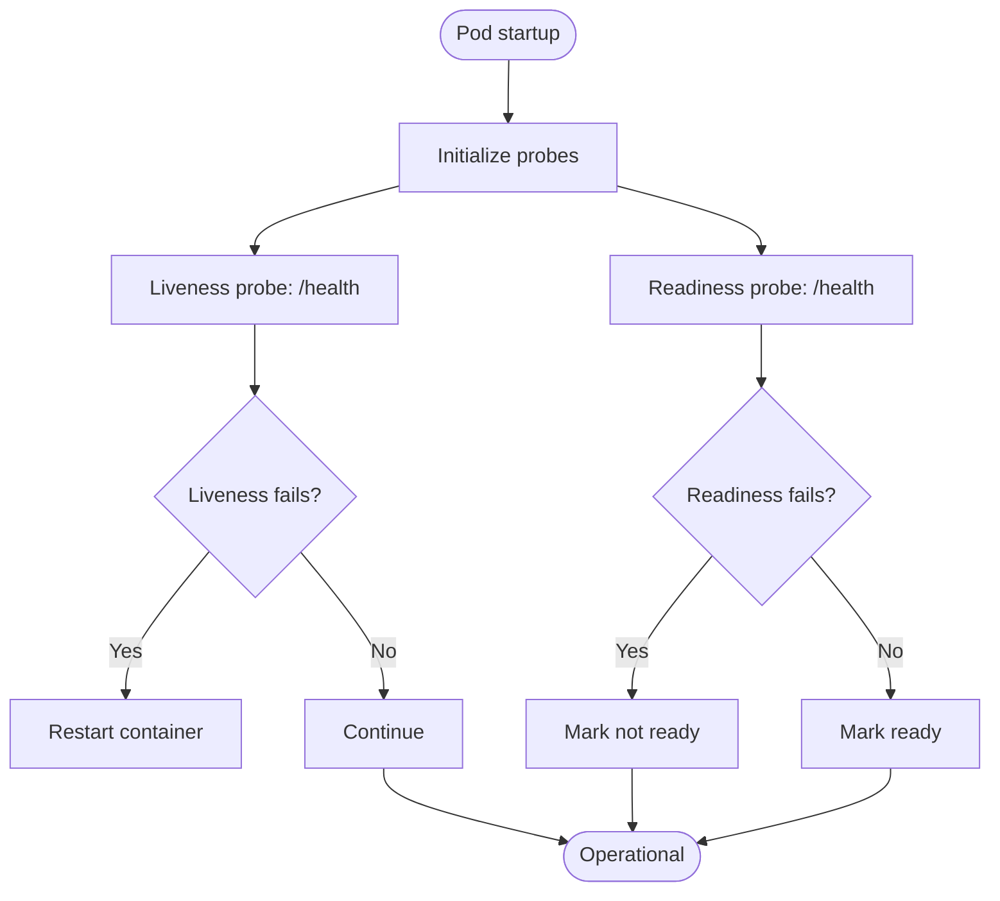
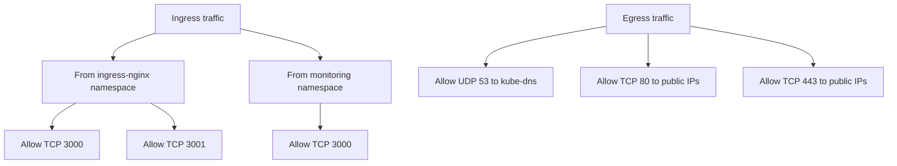
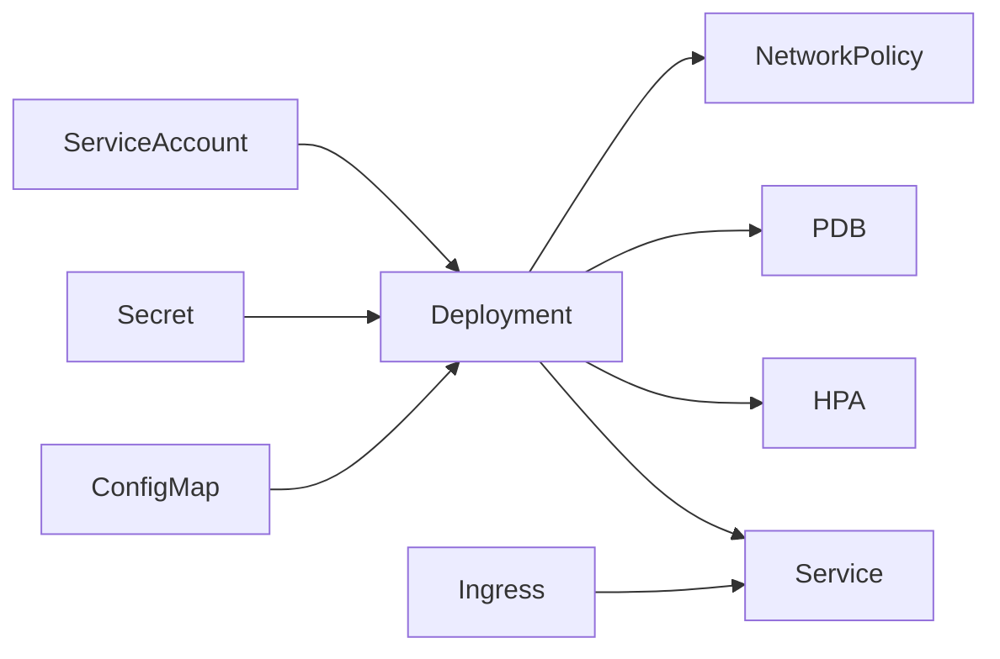

# Orchestration and Deployment

<cite>
**Referenced Files in This Document**
- [deployment.yaml](file://runtime/k8s/deployment.yaml)
- [Dockerfile](file://runtime/images/Dockerfile)
- [server.ts](file://runtime/workspace-kernel/src/server.ts)
- [config.ts](file://runtime/workspace-kernel/src/config.ts)
- [types.ts](file://runtime/workspace-kernel/src/types.ts)
- [README.md](file://runtime/README.md)
</cite>

## Table of Contents
1. [Introduction](#introduction)
2. [Project Structure](#project-structure)
3. [Core Components](#core-components)
4. [Architecture Overview](#architecture-overview)
5. [Detailed Component Analysis](#detailed-component-analysis)
6. [Dependency Analysis](#dependency-analysis)
7. [Performance Considerations](#performance-considerations)
8. [Troubleshooting Guide](#troubleshooting-guide)
9. [Conclusion](#conclusion)

## Introduction
This document describes the Kubernetes orchestration and deployment of the Nexus Runtime. It focuses on the pod specification defined in the deployment manifest, including resource requests/limits, probes, autoscaling, network policies, anti-affinity, Pod Disruption Budget, service accounts, security contexts, and Ingress configuration for both HTTP and WebSocket traffic. It also covers deployment strategies and scaling considerations for production environments.

## Project Structure
The runtime is composed of:
- A Node.js HTTP/WebSocket server (workspace-kernel)
- A Rust WASM bridge (nexus-wasm-bridge) exposing N-API to Node.js
- A multi-stage Dockerfile building the production image
- Kubernetes manifests under runtime/k8s

**Diagram sources**
- [deployment.yaml](file://runtime/k8s/deployment.yaml#L1-L299)

**Section sources**
- [deployment.yaml](file://runtime/k8s/deployment.yaml#L1-L299)
- [README.md](file://runtime/README.md#L1-L210)

## Core Components
- Namespace: isolates the runtime resources.
- ConfigMap: defines operational environment variables for the runtime.
- Secret: stores sensitive values such as JWT secrets.
- Deployment: defines the pod template, probes, resources, anti-affinity, and volumes.
- ServiceAccount: minimal privileges for the workload.
- Service: exposes HTTP and WebSocket ports internally.
- Ingress: routes external HTTP and WebSocket traffic via ingress-nginx.
- HorizontalPodAutoscaler: scales based on CPU and memory utilization.
- PodDisruptionBudget: ensures high availability during maintenance.
- NetworkPolicy: restricts ingress/egress to trusted namespaces and ports.

**Section sources**
- [deployment.yaml](file://runtime/k8s/deployment.yaml#L1-L299)

## Architecture Overview
The runtime exposes:
- HTTP API on port 3000
- WebSocket API on port 3001

Ingress routes:
- HTTP traffic to the HTTP port
- WebSocket traffic to the WebSocket port

Prometheus scraping is enabled via pod annotations for metrics collection.

**Diagram sources**
- [deployment.yaml](file://runtime/k8s/deployment.yaml#L155-L206)
- [server.ts](file://runtime/workspace-kernel/src/server.ts#L133-L152)

## Detailed Component Analysis

### Pod Specification and Probes
- Ports:
  - HTTP: 3000
  - WebSocket: 3001
- Liveness probe:
  - HTTP GET /health on port http
  - Initial delay: seconds
  - Period: seconds
  - Timeout: seconds
  - Failure threshold: count
- Readiness probe:
  - HTTP GET /health on port http
  - Initial delay: seconds
  - Period: seconds
  - Timeout: seconds
  - Failure threshold: count
- Prometheus scraping:
  - Annotations enable scraping on port 3000 at path /metrics

These align with the server’s health and metrics endpoints.

**Section sources**
- [deployment.yaml](file://runtime/k8s/deployment.yaml#L71-L119)
- [server.ts](file://runtime/workspace-kernel/src/server.ts#L133-L152)
- [server.ts](file://runtime/workspace-kernel/src/server.ts#L480-L508)

### Resource Requests and Limits
- CPU:
  - Requests: milliCPU
  - Limits: milliCPU
- Memory:
  - Requests: MiB
  - Limits: GiB

These values are set in the Deployment’s resources section.

**Section sources**
- [deployment.yaml](file://runtime/k8s/deployment.yaml#L97-L104)

### Horizontal Pod Autoscaling
- Scale target: Deployment nexus-runtime
- Min replicas: 2
- Max replicas: 10
- Metrics:
  - CPU utilization average: percentage
  - Memory utilization average: percentage

This configuration enables dynamic scaling based on observed resource usage.

**Section sources**
- [deployment.yaml](file://runtime/k8s/deployment.yaml#L208-L233)

### Pod Anti-Affinity for High Availability
- Preferred anti-affinity across nodes (topologyKey: hostname)
- Weight: high preference to schedule pods on different nodes

This reduces risk of simultaneous outages.

**Section sources**
- [deployment.yaml](file://runtime/k8s/deployment.yaml#L134-L146)

### Pod Disruption Budget
- Ensures at least one pod remains available during voluntary disruptions (e.g., upgrades, maintenance).

**Section sources**
- [deployment.yaml](file://runtime/k8s/deployment.yaml#L235-L245)

### Service Account and Security Context
- ServiceAccount: nexus-runtime
- Pod securityContext:
  - runAsNonRoot: true
  - runAsUser: numeric
  - runAsGroup: numeric
  - fsGroup: numeric
- Container securityContext:
  - allowPrivilegeEscalation: false
  - readOnlyRootFilesystem: true
  - capabilities.drop: ALL

These settings enforce least privilege and reduce attack surface.

**Section sources**
- [deployment.yaml](file://runtime/k8s/deployment.yaml#L61-L67)
- [deployment.yaml](file://runtime/k8s/deployment.yaml#L123-L129)

### Network Policy: Ingress/Egress Control
- Ingress:
  - Allows traffic from ingress-nginx namespace to HTTP and WebSocket ports
  - Allows traffic from monitoring namespace to metrics port
- Egress:
  - DNS: allows UDP 53 to kube-dns pod
  - HTTP/HTTPS: allows TCP 80 and 443 to public IPs excluding RFC1918 ranges

This restricts exposure while enabling essential connectivity.

**Section sources**
- [deployment.yaml](file://runtime/k8s/deployment.yaml#L247-L299)

### Ingress Configuration for HTTP and WebSocket
- ingressClassName: nginx
- host: configured hostname
- paths:
  - Root path (/) -> Service port http
  - /panels -> Service port websocket
- Annotations:
  - Proxy timeouts for long-running connections
  - WebSocket support annotation pointing to the service

This enables both REST and WebSocket traffic to reach the runtime.

**Section sources**
- [deployment.yaml](file://runtime/k8s/deployment.yaml#L177-L206)

### Environment Variables and Configuration
- ConfigMap values include logging level, instance limits, timeouts, concurrency, and cache directory.
- Secret provides JWT secret.
- Server loads environment variables and validates them against defaults.

These drive runtime behavior and security.

**Section sources**
- [deployment.yaml](file://runtime/k8s/deployment.yaml#L13-L37)
- [config.ts](file://runtime/workspace-kernel/src/config.ts#L76-L123)
- [config.ts](file://runtime/workspace-kernel/src/config.ts#L150-L167)

### Container Image and Health Checks
- Multi-stage Dockerfile builds the production image with WasmEdge and Node.js.
- HEALTHCHECK executes a curl against /health on port 3000.
- Ports exposed: 3000, 3001.

This ensures the container itself reports health consistently.

**Section sources**
- [Dockerfile](file://runtime/images/Dockerfile#L1-L152)

## Architecture Overview

**Diagram sources**
- [deployment.yaml](file://runtime/k8s/deployment.yaml#L155-L206)
- [server.ts](file://runtime/workspace-kernel/src/server.ts#L133-L152)

## Detailed Component Analysis

### Deployment Strategy and Scaling
- Replicas: 2
- HPA min/max replicas: 2–10
- Scaling metrics: CPU and memory utilization averages
- Anti-affinity: spread pods across nodes
- PDB: maintain at least one available pod during disruptions

Production considerations:
- Start with minReplicas equal to current replicas to avoid unnecessary churn.
- Set conservative thresholds for CPU/memory to prevent thrashing.
- Use rolling updates with appropriate maxUnavailable and maxSurge to minimize downtime.

**Section sources**
- [deployment.yaml](file://runtime/k8s/deployment.yaml#L48-L49)
- [deployment.yaml](file://runtime/k8s/deployment.yaml#L208-L233)
- [deployment.yaml](file://runtime/k8s/deployment.yaml#L134-L146)
- [deployment.yaml](file://runtime/k8s/deployment.yaml#L235-L245)

### Health and Readiness Flow

**Diagram sources**
- [deployment.yaml](file://runtime/k8s/deployment.yaml#L104-L119)
- [server.ts](file://runtime/workspace-kernel/src/server.ts#L480-L508)

### Security Hardening
- Non-root user and filesystem groups
- Read-only root filesystem
- Drop all Linux capabilities
- Minimal service account permissions
- JWT-based authentication for protected endpoints

**Section sources**
- [deployment.yaml](file://runtime/k8s/deployment.yaml#L61-L67)
- [deployment.yaml](file://runtime/k8s/deployment.yaml#L123-L129)
- [server.ts](file://runtime/workspace-kernel/src/server.ts#L99-L128)

### Network Policy Enforcement

**Diagram sources**
- [deployment.yaml](file://runtime/k8s/deployment.yaml#L247-L299)

## Dependency Analysis
- Deployment depends on:
  - ConfigMap for environment variables
  - Secret for JWT secret
  - ServiceAccount for RBAC identity
  - Service for internal routing
  - Ingress for external routing
  - HPA for autoscaling
  - PDB for availability guarantees
  - NetworkPolicy for traffic controls

**Diagram sources**
- [deployment.yaml](file://runtime/k8s/deployment.yaml#L1-L299)

**Section sources**
- [deployment.yaml](file://runtime/k8s/deployment.yaml#L1-L299)

## Performance Considerations
- CPU/memory requests/limits should reflect typical workload characteristics; adjust HPA thresholds to avoid oscillation.
- Use anti-affinity to distribute pods across nodes for resilience and reduced contention.
- Configure Prometheus scraping via pod annotations to monitor real-time utilization.
- Keep cache volumes sized appropriately to balance performance and resource usage.
- Tune HTTP and WebSocket timeouts in the Ingress annotations to accommodate long-running operations.

[No sources needed since this section provides general guidance]

## Troubleshooting Guide
- Pods failing readiness/liveness:
  - Verify /health endpoint availability and response shape.
  - Check container logs for startup errors.
- Authentication failures:
  - Confirm JWT secret is present in Secret and referenced correctly.
  - Ensure Authorization header is present for protected endpoints.
- Ingress not reaching pods:
  - Validate Service selectors match pod labels.
  - Confirm IngressClassName and annotations are correct.
- Autoscaling not triggering:
  - Review HPA metrics and thresholds.
  - Ensure Prometheus scraping is enabled and metrics are available.
- Network connectivity issues:
  - Confirm NetworkPolicy allows traffic from ingress-nginx and monitoring namespaces.
  - Verify egress rules permit DNS and outbound HTTP/HTTPS.

**Section sources**
- [server.ts](file://runtime/workspace-kernel/src/server.ts#L133-L152)
- [server.ts](file://runtime/workspace-kernel/src/server.ts#L480-L508)
- [deployment.yaml](file://runtime/k8s/deployment.yaml#L177-L206)
- [deployment.yaml](file://runtime/k8s/deployment.yaml#L208-L233)
- [deployment.yaml](file://runtime/k8s/deployment.yaml#L247-L299)

## Conclusion
The Nexus Runtime deployment is configured for production-grade reliability and security. It employs resource limits, health/readiness probes, autoscaling, anti-affinity, and a Pod Disruption Budget to ensure availability. Network policies restrict traffic to trusted sources, while Ingress handles both HTTP and WebSocket routing. Service accounts and security contexts enforce least privilege. Together, these components provide a robust foundation for scalable and secure operations.