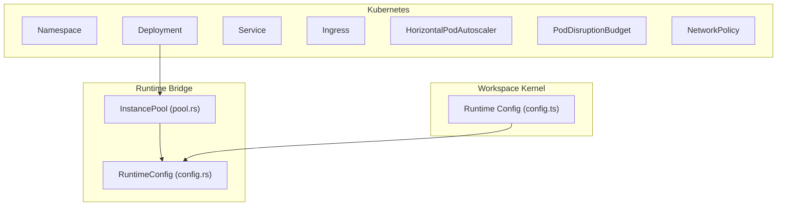
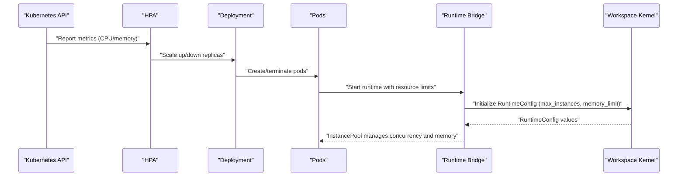
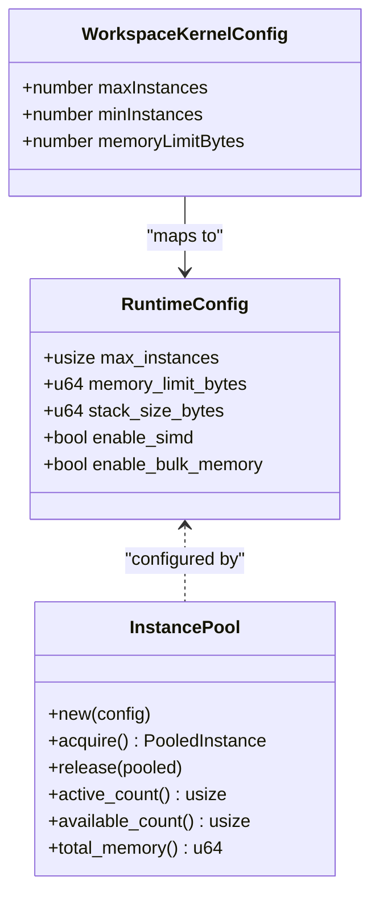
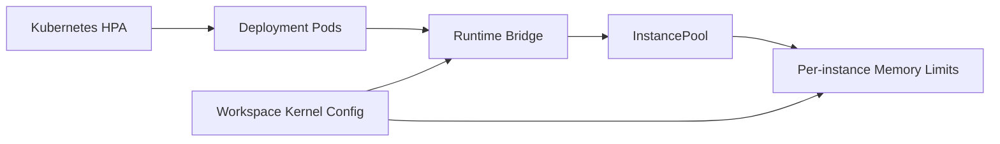

# Scaling Strategy

<cite>
**Referenced Files in This Document**
- [deployment.yaml](file://runtime/k8s/deployment.yaml)
- [02_runtime_spec.md](file://docs/02_runtime_spec.md)
- [pool.rs](file://runtime/nexus-wasm-bridge/src/engine/pool.rs)
- [config.rs](file://runtime/nexus-wasm-bridge/src/config.rs)
- [config.ts](file://runtime/workspace-kernel/src/config.ts)
- [wasmedge_migration_strategy.md](file://docs/wasmedge_migration_strategy.md)
</cite>

## Table of Contents
1. [Introduction](#introduction)
2. [Project Structure](#project-structure)
3. [Core Components](#core-components)
4. [Architecture Overview](#architecture-overview)
5. [Detailed Component Analysis](#detailed-component-analysis)
6. [Dependency Analysis](#dependency-analysis)
7. [Performance Considerations](#performance-considerations)
8. [Troubleshooting Guide](#troubleshooting-guide)
9. [Conclusion](#conclusion)

## Introduction
This document describes the Nexus runtime scaling strategy across Kubernetes and the WASM instance pooling layer. It explains how HorizontalPodAutoscaler targets CPU and memory utilization, how replica bounds are configured, how PodDisruptionBudget ensures availability during maintenance, and how container resource requests/limits are set to balance scheduling efficiency and safety. It also connects these operational controls to the runtime’s instance pooling and memory limits to ensure predictable performance and resource behavior in production.

## Project Structure
The scaling strategy spans Kubernetes manifests and runtime configuration:
- Kubernetes autoscaling and availability policies are defined in the deployment manifest.
- The runtime’s instance pooling and memory limits are defined in the runtime bridge and workspace kernel configuration.

**Diagram sources**
- [deployment.yaml](file://runtime/k8s/deployment.yaml#L1-L299)
- [pool.rs](file://runtime/nexus-wasm-bridge/src/engine/pool.rs#L1-L200)
- [config.rs](file://runtime/nexus-wasm-bridge/src/config.rs#L1-L120)
- [config.ts](file://runtime/workspace-kernel/src/config.ts#L1-L120)

**Section sources**
- [deployment.yaml](file://runtime/k8s/deployment.yaml#L1-L299)
- [config.ts](file://runtime/workspace-kernel/src/config.ts#L1-L120)

## Core Components
- HorizontalPodAutoscaler: scales the runtime deployment based on CPU and memory utilization with min/max replicas aligned to production needs.
- PodDisruptionBudget: guarantees at least one pod remains available during planned maintenance windows.
- Container resource requests/limits: define the CPU and memory footprint for scheduling and cgroups enforcement.
- Instance pool and memory limits: configure the maximum number of concurrent WASM instances and per-instance memory to prevent resource exhaustion.

**Section sources**
- [deployment.yaml](file://runtime/k8s/deployment.yaml#L207-L245)
- [config.ts](file://runtime/workspace-kernel/src/config.ts#L1-L120)
- [config.rs](file://runtime/nexus-wasm-bridge/src/config.rs#L1-L120)
- [pool.rs](file://runtime/nexus-wasm-bridge/src/engine/pool.rs#L70-L120)

## Architecture Overview
The scaling architecture integrates Kubernetes autoscaling with runtime-level resource controls. Kubernetes manages horizontal scaling and availability; the runtime enforces per-instance resource limits and pooling to keep CPU and memory usage predictable.

**Diagram sources**
- [deployment.yaml](file://runtime/k8s/deployment.yaml#L207-L245)
- [pool.rs](file://runtime/nexus-wasm-bridge/src/engine/pool.rs#L70-L120)
- [config.rs](file://runtime/nexus-wasm-bridge/src/config.rs#L1-L120)
- [config.ts](file://runtime/workspace-kernel/src/config.ts#L1-L120)

## Detailed Component Analysis

### HorizontalPodAutoscaler (CPU 70%, Memory 80%)
- Targets the runtime Deployment.
- Uses Resource metrics with Utilization targets for CPU and memory.
- Minimum replicas: 2, Maximum replicas: 10.

These targets and bounds are chosen to:
- Prevent over-scaling on short bursts while still reacting to sustained load.
- Ensure adequate headroom for memory-intensive handler workloads.
- Keep cluster scheduling predictable by avoiding extreme spikes.

**Section sources**
- [deployment.yaml](file://runtime/k8s/deployment.yaml#L207-L233)

### Replica Management (min 2, max 10)
- The Deployment starts with 2 replicas.
- HPA increases replicas up to 10 when CPU or memory utilization exceeds targets.
- Anti-affinity is configured to spread pods across nodes for resilience.

This combination ensures:
- Baseline availability and responsiveness.
- Elastic scaling under load without exhausting cluster resources.

**Section sources**
- [deployment.yaml](file://runtime/k8s/deployment.yaml#L48-L146)

### PodDisruptionBudget (minAvailable 1)
- Ensures at least one pod remains available during voluntary disruptions (maintenance, rolling updates).
- Selector matches the runtime workload.

This protects:
- Continuous service availability during planned operations.
- Graceful handling of node drains or upgrades.

**Section sources**
- [deployment.yaml](file://runtime/k8s/deployment.yaml#L235-L245)

### Resource Requests and Limits (container)
- Requests: 100m CPU, 256Mi memory.
- Limits: 1000m CPU, 1Gi memory.

These values:
- Allow the scheduler to place pods on nodes with sufficient CPU and memory.
- Cap CPU and memory to prevent noisy-neighbor effects and ensure fairness.
- Provide headroom for bursty handler workloads while bounding risk.

**Section sources**
- [deployment.yaml](file://runtime/k8s/deployment.yaml#L97-L103)

### WASM Instance Pooling and Memory Limits
- The runtime defines a maximum number of concurrent instances and per-instance memory limits.
- The workspace kernel exposes min_instances, max_instances, and memory_limit configuration.
- The runtime bridge enforces these limits and manages instance acquisition/release with a semaphore and pool.

Alignment with Kubernetes scaling:
- Kubernetes replicas increase/decrease based on CPU/memory utilization.
- The runtime enforces per-pod instance concurrency and memory to avoid runaway consumption within a pod.
- Together, they provide layered protection: cluster-level elasticity and pod-level resource discipline.

**Diagram sources**
- [config.rs](file://runtime/nexus-wasm-bridge/src/config.rs#L1-L120)
- [pool.rs](file://runtime/nexus-wasm-bridge/src/engine/pool.rs#L70-L120)
- [config.ts](file://runtime/workspace-kernel/src/config.ts#L1-L120)

**Section sources**
- [config.rs](file://runtime/nexus-wasm-bridge/src/config.rs#L1-L120)
- [pool.rs](file://runtime/nexus-wasm-bridge/src/engine/pool.rs#L70-L120)
- [config.ts](file://runtime/workspace-kernel/src/config.ts#L1-L120)

### Scaling Alignment with WASM Instance Pooling
- Kubernetes HPA reacts to CPU and memory signals; it does not directly observe per-instance memory.
- The runtime’s instance pool and per-instance memory limits act as a safety net to prevent a single pod from consuming all its allocated resources.
- The workspace kernel’s min_instances and max_instances influence how many handlers can run concurrently per pod, indirectly affecting CPU and memory utilization.

This alignment ensures:
- Kubernetes can scale pods to meet demand.
- Each pod remains stable under load thanks to runtime-level resource caps.
- Operational predictability across autoscaling and runtime controls.

**Section sources**
- [deployment.yaml](file://runtime/k8s/deployment.yaml#L207-L245)
- [config.ts](file://runtime/workspace-kernel/src/config.ts#L1-L120)
- [config.rs](file://runtime/nexus-wasm-bridge/src/config.rs#L1-L120)
- [pool.rs](file://runtime/nexus-wasm-bridge/src/engine/pool.rs#L70-L120)

## Dependency Analysis
- Kubernetes autoscaling depends on the runtime’s resource requests/limits and the runtime’s instance pool behavior.
- The workspace kernel configuration feeds into the runtime bridge configuration.
- The runtime bridge’s instance pool enforces per-instance memory limits and concurrency.

**Diagram sources**
- [deployment.yaml](file://runtime/k8s/deployment.yaml#L207-L245)
- [pool.rs](file://runtime/nexus-wasm-bridge/src/engine/pool.rs#L70-L120)
- [config.rs](file://runtime/nexus-wasm-bridge/src/config.rs#L1-L120)
- [config.ts](file://runtime/workspace-kernel/src/config.ts#L1-L120)

**Section sources**
- [deployment.yaml](file://runtime/k8s/deployment.yaml#L207-L245)
- [pool.rs](file://runtime/nexus-wasm-bridge/src/engine/pool.rs#L70-L120)
- [config.rs](file://runtime/nexus-wasm-bridge/src/config.rs#L1-L120)
- [config.ts](file://runtime/workspace-kernel/src/config.ts#L1-L120)

## Performance Considerations
- Autoscaling sensitivity: CPU 70% and memory 80% targets provide responsive scaling without overreacting to transient spikes.
- Replicas: Starting at 2 replicas balances availability and cost; scaling up to 10 accommodates load growth.
- Resource requests/limits: Requests enable fair scheduling; limits prevent resource contention.
- Instance pooling: Reusing instances reduces startup overhead and stabilizes latency.
- Per-instance memory limits: Prevents memory leaks or overly large handlers from destabilizing a pod.

[No sources needed since this section provides general guidance]

## Troubleshooting Guide
- Pods frequently restart or are evicted:
  - Verify resource limits are not too low for handler workloads.
  - Check if per-instance memory limits are too strict for the workload.
- HPA not scaling:
  - Confirm metrics are available and HPA targets are reasonable given workload characteristics.
  - Ensure requests/limits are set to allow meaningful autoscaling signals.
- Availability drops during maintenance:
  - Confirm PodDisruptionBudget is present and minAvailable is set appropriately.
- Excessive CPU usage:
  - Review instance pool size and handler concurrency; consider reducing max_instances or increasing CPU requests/limits.

**Section sources**
- [deployment.yaml](file://runtime/k8s/deployment.yaml#L207-L245)
- [config.ts](file://runtime/workspace-kernel/src/config.ts#L1-L120)
- [config.rs](file://runtime/nexus-wasm-bridge/src/config.rs#L1-L120)
- [pool.rs](file://runtime/nexus-wasm-bridge/src/engine/pool.rs#L70-L120)

## Conclusion
The Nexus scaling strategy combines Kubernetes autoscaling with runtime-level resource discipline. HPA targets and replica bounds ensure elastic and predictable scaling, while PodDisruptionBudget preserves availability during maintenance. Container requests/limits provide scheduling and cgroup safeguards. Together with the runtime’s instance pooling and per-instance memory limits, this design keeps pods stable under varying loads and prevents resource exhaustion, aligning operational controls with the WASM execution model.