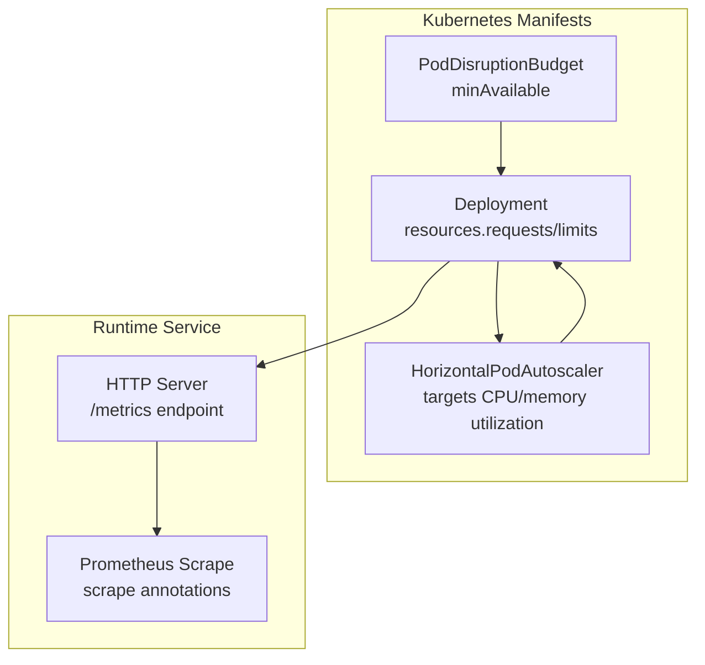
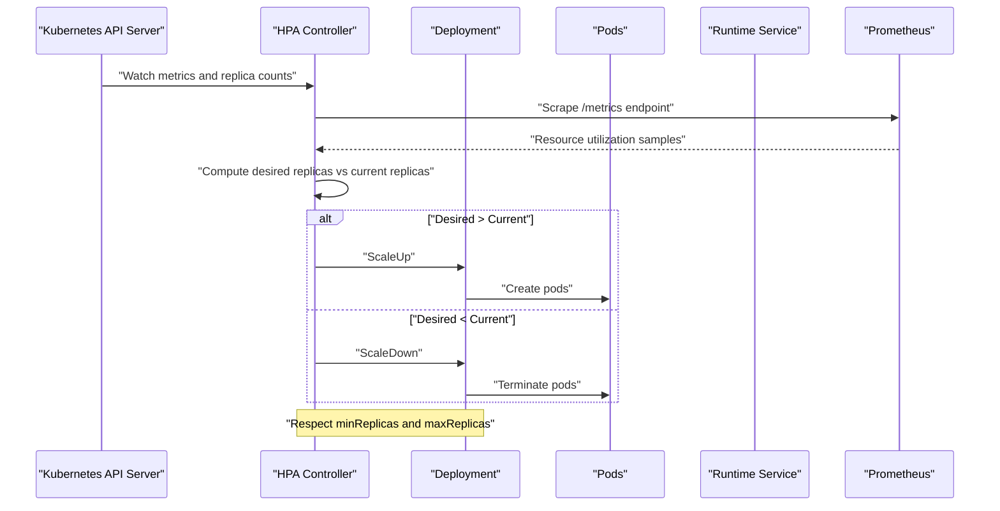
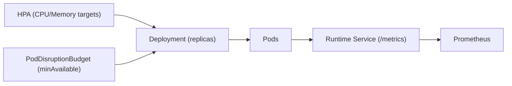

# Autoscaling Policy

<cite>
**Referenced Files in This Document**
- [deployment.yaml](file://runtime/k8s/deployment.yaml)
- [server.ts](file://runtime/workspace-kernel/src/server.ts)
- [types.ts](file://runtime/workspace-kernel/src/types.ts)
- [Dockerfile](file://runtime/images/Dockerfile)
- [02_runtime_spec.md](file://docs/02_runtime_spec.md)
</cite>

## Table of Contents
1. [Introduction](#introduction)
2. [Project Structure](#project-structure)
3. [Core Components](#core-components)
4. [Architecture Overview](#architecture-overview)
5. [Detailed Component Analysis](#detailed-component-analysis)
6. [Dependency Analysis](#dependency-analysis)
7. [Performance Considerations](#performance-considerations)
8. [Troubleshooting Guide](#troubleshooting-guide)
9. [Conclusion](#conclusion)

## Introduction
This document defines the Nexus autoscaling policy for the runtime workload. It explains how the HorizontalPodAutoscaler targets CPU and memory utilization, how baseline capacity is established via minReplicas and maxReplicas, how CPU limits influence autoscaling decisions, and how PodDisruptionBudget maintains availability during maintenance. It also provides guidance on monitoring autoscaling events and tuning target utilization percentages for different traffic patterns.

## Project Structure
The autoscaling policy is defined in the Kubernetes manifests under the runtime directory. The runtime service exposes a metrics endpoint that can be scraped by Prometheus, enabling autoscaling signals to be derived from application-level metrics.

**Diagram sources**
- [deployment.yaml](file://runtime/k8s/deployment.yaml#L97-L119)
- [deployment.yaml](file://runtime/k8s/deployment.yaml#L208-L233)
- [deployment.yaml](file://runtime/k8s/deployment.yaml#L235-L245)
- [server.ts](file://runtime/workspace-kernel/src/server.ts#L137-L139)
- [Dockerfile](file://runtime/images/Dockerfile#L56-L100)

**Section sources**
- [deployment.yaml](file://runtime/k8s/deployment.yaml#L97-L119)
- [deployment.yaml](file://runtime/k8s/deployment.yaml#L208-L245)
- [server.ts](file://runtime/workspace-kernel/src/server.ts#L137-L139)
- [Dockerfile](file://runtime/images/Dockerfile#L56-L100)

## Core Components
- HorizontalPodAutoscaler: Targets CPU and memory resource utilization with configured thresholds and bounds the number of replicas.
- PodDisruptionBudget: Ensures a minimum number of pods remain available during planned maintenance windows.
- Deployment resources: Defines requests and limits for CPU and memory, which inform autoscaling calculations and pod scheduling.
- Metrics endpoint: Exposes Prometheus-compatible metrics for autoscaling signals.

**Section sources**
- [deployment.yaml](file://runtime/k8s/deployment.yaml#L208-L245)
- [deployment.yaml](file://runtime/k8s/deployment.yaml#L97-L119)
- [server.ts](file://runtime/workspace-kernel/src/server.ts#L137-L139)

## Architecture Overview
The autoscaling architecture ties Kubernetes autoscaling primitives to the runtime’s metrics exposure. The HPA observes resource utilization against configured targets and scales the Deployment up or down within min/max bounds. The PDB ensures availability during maintenance. The runtime’s /metrics endpoint is scraped by Prometheus, which feeds autoscaling signals.

**Diagram sources**
- [deployment.yaml](file://runtime/k8s/deployment.yaml#L208-L233)
- [deployment.yaml](file://runtime/k8s/deployment.yaml#L235-L245)
- [server.ts](file://runtime/workspace-kernel/src/server.ts#L137-L139)

## Detailed Component Analysis

### HorizontalPodAutoscaler Configuration
- Targeting:
  - CPU utilization target: 70% average utilization across pods.
  - Memory utilization target: 80% average utilization across pods.
- Bounds:
  - minReplicas: 2
  - maxReplicas: 10
- Scale target:
  - References the Deployment by name and namespace.

These settings establish a baseline capacity of two pods while allowing elastic scaling up to ten pods when CPU or memory utilization approaches the configured thresholds.

**Section sources**
- [deployment.yaml](file://runtime/k8s/deployment.yaml#L208-L233)

### Baseline Capacity and Elastic Scaling
- minReplicas (2): Ensures a minimum number of pods are always running, providing baseline capacity for steady-state traffic.
- maxReplicas (10): Caps growth to prevent resource exhaustion and cost overruns during traffic spikes.

Together, these parameters define a scalable envelope around the baseline.

**Section sources**
- [deployment.yaml](file://runtime/k8s/deployment.yaml#L218-L219)

### CPU Limits and Autoscaling Decisions
- Deployment resources include explicit CPU requests and limits:
  - requests.cpu: small fraction suitable for steady scheduling.
  - limits.cpu: higher bound indicating maximum CPU allocation per pod.
- Autoscaling behavior:
  - HPA compares observed CPU utilization against the configured averageUtilization target.
  - If utilization nears or exceeds the target, HPA increases replicas to distribute load.
  - If utilization drops below the target, HPA decreases replicas to reduce overhead.
- Sustained high CPU usage:
  - Long-running or CPU-intensive handlers will increase per-pod CPU utilization.
  - When sustained, HPA will scale out to meet demand, respecting minReplicas and maxReplicas.

Note: The autoscaling controller computes utilization as a percentage of the pod’s CPU limit. Higher limits allow pods to consume more CPU before reaching the target threshold, potentially delaying scaling events.

**Section sources**
- [deployment.yaml](file://runtime/k8s/deployment.yaml#L97-L119)
- [deployment.yaml](file://runtime/k8s/deployment.yaml#L222-L226)

### Role of PodDisruptionBudget
- minAvailable: 1
- Selector: matches the runtime workload.

This ensures that at least one pod remains available during planned maintenance operations (e.g., node draining), preventing temporary unavailability despite rolling updates or node maintenance.

**Section sources**
- [deployment.yaml](file://runtime/k8s/deployment.yaml#L235-L245)

### Monitoring Autoscaling Events
- Metrics endpoint:
  - The runtime exposes a /metrics endpoint for Prometheus scraping.
  - The Dockerfile includes health checks and scrape annotations for Prometheus.
- Observability:
  - Prometheus scrapes the /metrics endpoint from the runtime service.
  - HPA uses these metrics to compute desired replicas.

Operators can monitor autoscaling events via:
- Kubernetes events for HPA scaling actions.
- Prometheus metrics for CPU and memory utilization trends.
- Runtime health and metrics endpoints for operational insights.

**Section sources**
- [server.ts](file://runtime/workspace-kernel/src/server.ts#L137-L139)
- [Dockerfile](file://runtime/images/Dockerfile#L56-L100)

### Tuning Target Utilization Percentages
- CPU target (70%):
  - Lower values provide earlier scaling but may cause frequent churn.
  - Higher values delay scaling but risk overloading pods.
- Memory target (80%):
  - Align with memory limits and handler memory constraints.
  - Consider handler memory limits and cache sizes when adjusting.

Guidance:
- Start with the current targets and observe scaling behavior under representative loads.
- Increase targets to reduce churn if scaling is too aggressive; decrease targets to improve responsiveness if latency grows under load.
- Validate with load tests and monitor HPA events and pod CPU/memory utilization.

**Section sources**
- [deployment.yaml](file://runtime/k8s/deployment.yaml#L222-L232)
- [02_runtime_spec.md](file://docs/02_runtime_spec.md#L961-L1030)

## Dependency Analysis
The autoscaling policy depends on:
- Kubernetes autoscaling/v2 API for HPA.
- Prometheus scraping of the runtime’s /metrics endpoint.
- Deployment resource requests/limits influencing autoscaling calculations.
- PodDisruptionBudget enforcing availability during maintenance.

**Diagram sources**
- [deployment.yaml](file://runtime/k8s/deployment.yaml#L208-L245)
- [server.ts](file://runtime/workspace-kernel/src/server.ts#L137-L139)

**Section sources**
- [deployment.yaml](file://runtime/k8s/deployment.yaml#L208-L245)
- [server.ts](file://runtime/workspace-kernel/src/server.ts#L137-L139)

## Performance Considerations
- CPU utilization sensitivity:
  - Higher CPU limits can delay scaling events because utilization is computed relative to the limit.
  - Ensure limits reflect realistic peak usage to avoid premature or delayed scaling.
- Memory pressure:
  - Memory targets should align with handler memory limits and cache sizes.
  - Monitor memory utilization trends to adjust targets and limits accordingly.
- Scaling granularity:
  - minReplicas sets the floor; tune based on steady-state requirements.
  - maxReplicas prevents runaway growth; consider cluster capacity and cost controls.

[No sources needed since this section provides general guidance]

## Troubleshooting Guide
- No scaling occurs:
  - Verify HPA exists and references the correct Deployment.
  - Confirm Prometheus is scraping the /metrics endpoint and exposing CPU/memory metrics.
  - Check that CPU utilization consistently approaches or exceeds the target threshold.
- Excessive scaling:
  - Consider increasing CPU and/or memory targets to reduce churn.
  - Review handler execution patterns; long-running tasks may drive sustained CPU usage.
- Availability concerns during maintenance:
  - Ensure PDB is configured with appropriate minAvailable to protect against partial unavailability.

Operational checks:
- Inspect HPA status and events to understand scaling decisions.
- Review runtime health and metrics endpoints for anomalies.
- Validate resource requests/limits and their impact on autoscaling calculations.

**Section sources**
- [deployment.yaml](file://runtime/k8s/deployment.yaml#L208-L245)
- [server.ts](file://runtime/workspace-kernel/src/server.ts#L137-L139)

## Conclusion
The Nexus autoscaling policy establishes a robust baseline with minReplicas and maxReplicas, targets CPU and memory utilization for responsive scaling, and enforces availability via PodDisruptionBudget. Operators should monitor autoscaling events, validate Prometheus metrics, and tune utilization targets based on observed traffic patterns and resource constraints.