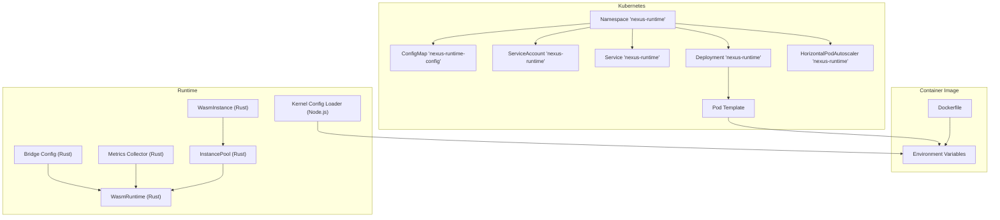
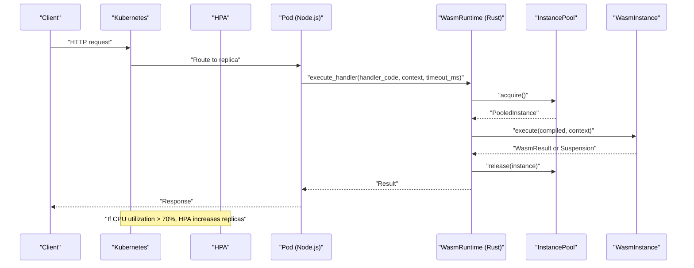
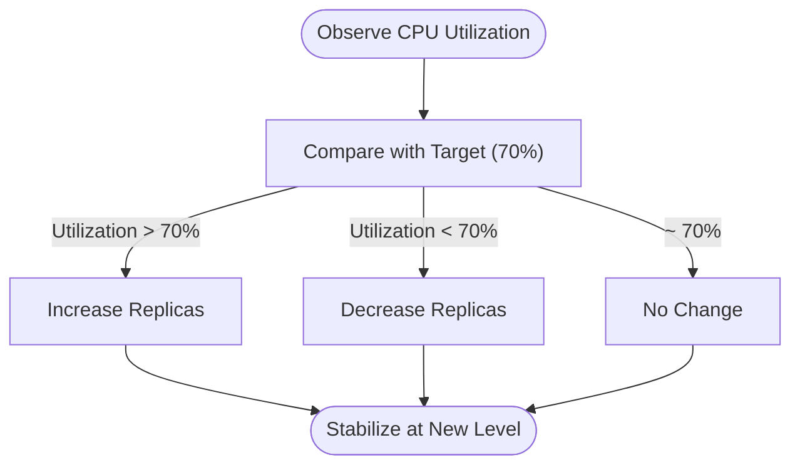
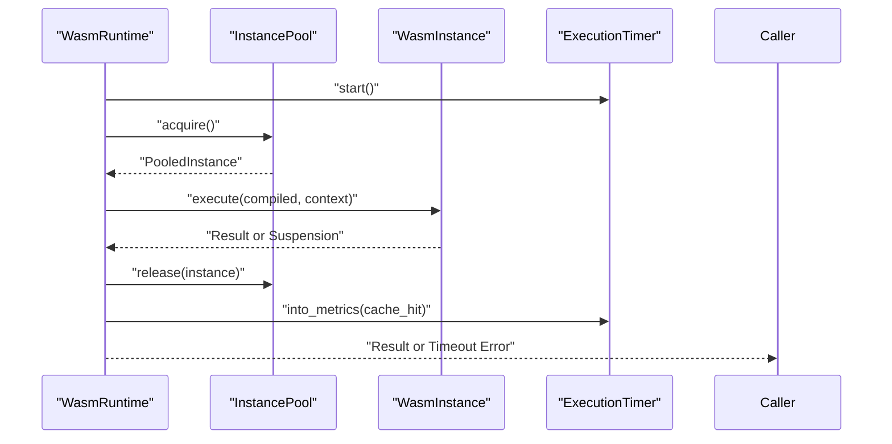
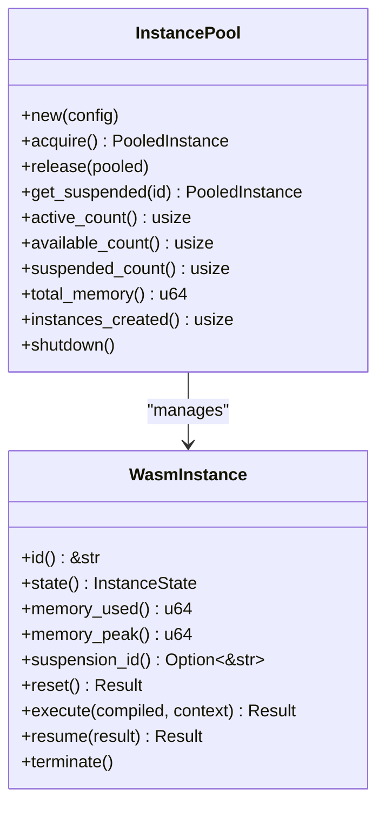
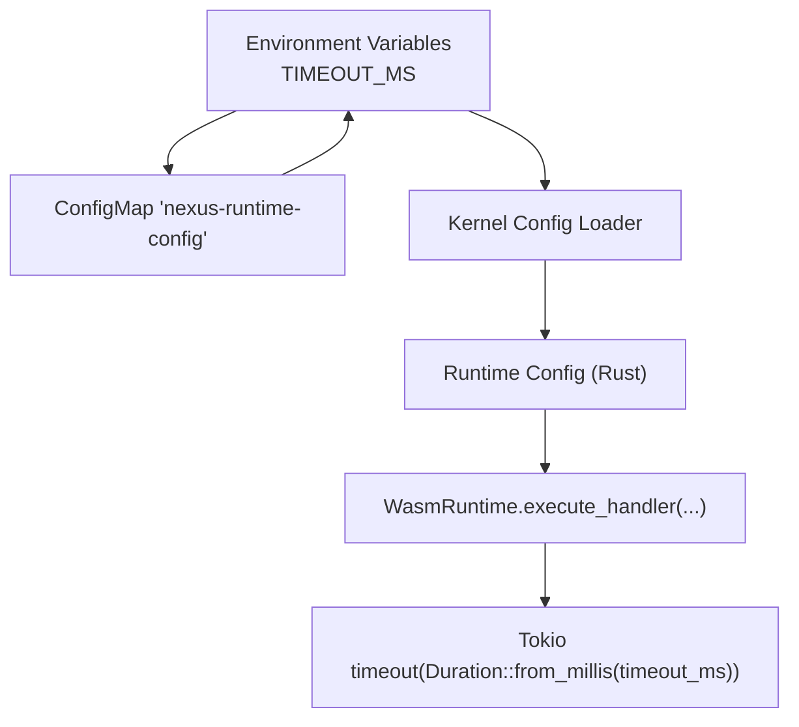
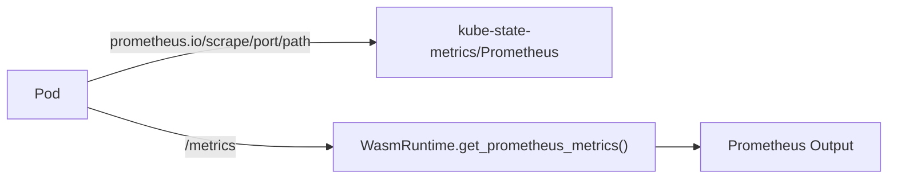
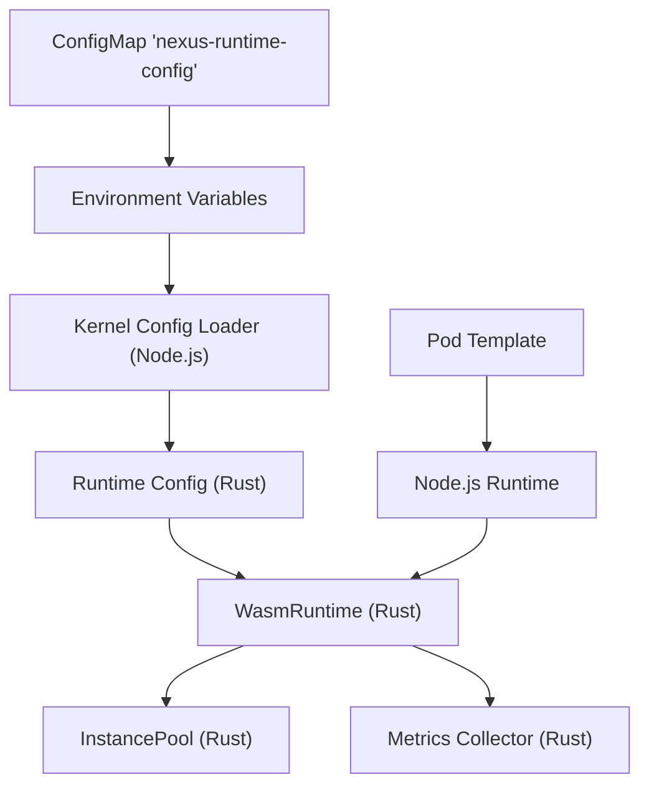

# CPU Allocation

<cite>
**Referenced Files in This Document**
- [deployment.yaml](file://runtime/k8s/deployment.yaml)
- [Dockerfile](file://runtime/images/Dockerfile)
- [config.ts](file://runtime/workspace-kernel/src/config.ts)
- [config.rs](file://runtime/nexus-wasm-bridge/src/config.rs)
- [metrics.rs](file://runtime/nexus-wasm-bridge/src/metrics.rs)
- [mod.rs](file://runtime/nexus-wasm-bridge/src/engine/mod.rs)
- [pool.rs](file://runtime/nexus-wasm-bridge/src/engine/pool.rs)
- [instance.rs](file://runtime/nexus-wasm-bridge/src/engine/instance.rs)
- [README.md](file://runtime/README.md)
</cite>

## Table of Contents
1. [Introduction](#introduction)
2. [Project Structure](#project-structure)
3. [Core Components](#core-components)
4. [Architecture Overview](#architecture-overview)
5. [Detailed Component Analysis](#detailed-component-analysis)
6. [Dependency Analysis](#dependency-analysis)
7. [Performance Considerations](#performance-considerations)
8. [Troubleshooting Guide](#troubleshooting-guide)
9. [Conclusion](#conclusion)

## Introduction
This document explains the CPU allocation strategy for Nexus Runtime, focusing on Kubernetes resource configuration, HorizontalPodAutoscaler scaling, WASM handler execution timeouts, and instance pooling to reduce CPU overhead. It also covers Prometheus metrics integration and tuning recommendations for different workload patterns.

## Project Structure
The CPU allocation architecture spans Kubernetes manifests, container configuration, runtime configuration, and WASM execution layers.

**Diagram sources**
- [deployment.yaml](file://runtime/k8s/deployment.yaml#L1-L299)
- [Dockerfile](file://runtime/images/Dockerfile#L1-L152)
- [config.ts](file://runtime/workspace-kernel/src/config.ts#L1-L233)
- [config.rs](file://runtime/nexus-wasm-bridge/src/config.rs#L1-L320)
- [metrics.rs](file://runtime/nexus-wasm-bridge/src/metrics.rs#L1-L474)
- [mod.rs](file://runtime/nexus-wasm-bridge/src/engine/mod.rs#L1-L244)
- [pool.rs](file://runtime/nexus-wasm-bridge/src/engine/pool.rs#L1-L395)
- [instance.rs](file://runtime/nexus-wasm-bridge/src/engine/instance.rs#L1-L381)

**Section sources**
- [deployment.yaml](file://runtime/k8s/deployment.yaml#L1-L299)
- [Dockerfile](file://runtime/images/Dockerfile#L1-L152)
- [README.md](file://runtime/README.md#L1-L210)

## Core Components
- Kubernetes CPU requests and limits define the baseline and burst capacity per container.
- HorizontalPodAutoscaler scales pods based on CPU utilization targets.
- Runtime configuration controls instance pooling and timeout enforcement.
- WASM execution pipeline enforces timeouts and tracks metrics for observability.
- Prometheus scraping is enabled via Kubernetes annotations.

**Section sources**
- [deployment.yaml](file://runtime/k8s/deployment.yaml#L78-L119)
- [deployment.yaml](file://runtime/k8s/deployment.yaml#L208-L233)
- [config.ts](file://runtime/workspace-kernel/src/config.ts#L1-L233)
- [config.rs](file://runtime/nexus-wasm-bridge/src/config.rs#L1-L320)
- [metrics.rs](file://runtime/nexus-wasm-bridge/src/metrics.rs#L1-L474)

## Architecture Overview
The CPU allocation architecture ensures predictable baseline performance with controlled bursts, while autoscaling adapts to demand. The runtime enforces timeouts and tracks metrics to support both operational visibility and tuning.

**Diagram sources**
- [deployment.yaml](file://runtime/k8s/deployment.yaml#L208-L233)
- [mod.rs](file://runtime/nexus-wasm-bridge/src/engine/mod.rs#L55-L110)
- [pool.rs](file://runtime/nexus-wasm-bridge/src/engine/pool.rs#L118-L171)
- [instance.rs](file://runtime/nexus-wasm-bridge/src/engine/instance.rs#L118-L211)

## Detailed Component Analysis

### Kubernetes CPU Requests and Limits
- Each container specifies:
  - CPU requests: 100m
  - CPU limits: 1000m
- This guarantees a baseline share of CPU while allowing bursts up to 10x the request.
- Predictable CPU allocation occurs at the cgroup level; limits cap the maximum CPU bandwidth.

**Section sources**
- [deployment.yaml](file://runtime/k8s/deployment.yaml#L97-L104)

### HorizontalPodAutoscaler Scaling
- Target: CPU utilization average at 70%.
- Min replicas: 2; Max replicas: 10.
- Autoscaling reacts to observed CPU utilization across pods, increasing or decreasing replicas to meet the target.

**Diagram sources**
- [deployment.yaml](file://runtime/k8s/deployment.yaml#L208-L233)

**Section sources**
- [deployment.yaml](file://runtime/k8s/deployment.yaml#L208-L233)

### WASM Handler Execution and Timeout Enforcement
- The runtime compiles handlers and executes them against pooled WASM instances.
- Execution is wrapped in a timeout using the configured timeout value.
- On timeout, a timeout error is recorded and surfaced to the caller.

**Diagram sources**
- [mod.rs](file://runtime/nexus-wasm-bridge/src/engine/mod.rs#L55-L110)
- [pool.rs](file://runtime/nexus-wasm-bridge/src/engine/pool.rs#L173-L217)
- [instance.rs](file://runtime/nexus-wasm-bridge/src/engine/instance.rs#L118-L211)
- [metrics.rs](file://runtime/nexus-wasm-bridge/src/metrics.rs#L348-L399)

**Section sources**
- [mod.rs](file://runtime/nexus-wasm-bridge/src/engine/mod.rs#L55-L110)
- [config.rs](file://runtime/nexus-wasm-bridge/src/config.rs#L171-L211)

### Instance Pooling and CPU Overhead Reduction
- The instance pool reuses WASM instances to minimize compilation and instantiation costs.
- Minimum instances are pre-warmed to reduce cold-start latency.
- Active and available counts are tracked to inform autoscaling and runtime decisions.

**Diagram sources**
- [pool.rs](file://runtime/nexus-wasm-bridge/src/engine/pool.rs#L70-L217)
- [instance.rs](file://runtime/nexus-wasm-bridge/src/engine/instance.rs#L1-L120)

**Section sources**
- [pool.rs](file://runtime/nexus-wasm-bridge/src/engine/pool.rs#L69-L117)
- [pool.rs](file://runtime/nexus-wasm-bridge/src/engine/pool.rs#L118-L171)
- [pool.rs](file://runtime/nexus-wasm-bridge/src/engine/pool.rs#L173-L217)

### Relationship Between CPU Limits and Handler Performance
- CPU limits cap the maximum CPU bandwidth per container.
- With a 1000m limit and 100m request, the runtime can burst up to 10x the request when other pods yield CPU.
- The instance pool’s concurrency is bounded by the configured maximum instances; higher CPU limits allow more concurrent workloads without immediate throttling.

**Section sources**
- [deployment.yaml](file://runtime/k8s/deployment.yaml#L97-L104)
- [config.rs](file://runtime/nexus-wasm-bridge/src/config.rs#L33-L88)

### Timeout Enforcement and Environment Variables
- The runtime reads timeout configuration from environment variables and applies it to handler execution.
- The Kubernetes ConfigMap sets a default timeout value used by the runtime.
- The Node.js kernel loads environment variables and merges them into the application configuration.

**Diagram sources**
- [deployment.yaml](file://runtime/k8s/deployment.yaml#L14-L26)
- [config.ts](file://runtime/workspace-kernel/src/config.ts#L76-L123)
- [config.rs](file://runtime/nexus-wasm-bridge/src/config.rs#L171-L211)
- [mod.rs](file://runtime/nexus-wasm-bridge/src/engine/mod.rs#L55-L110)

**Section sources**
- [deployment.yaml](file://runtime/k8s/deployment.yaml#L14-L26)
- [config.ts](file://runtime/workspace-kernel/src/config.ts#L76-L123)
- [config.rs](file://runtime/nexus-wasm-bridge/src/config.rs#L171-L211)
- [mod.rs](file://runtime/nexus-wasm-bridge/src/engine/mod.rs#L55-L110)

### Monitoring CPU Usage with Prometheus
- The Pod template includes Prometheus scrape annotations for metrics endpoint.
- The runtime exposes Prometheus-formatted metrics via a dedicated endpoint.
- Metrics include handler execution totals, average execution time, cache hit rate, and peak memory.

**Diagram sources**
- [deployment.yaml](file://runtime/k8s/deployment.yaml#L57-L60)
- [metrics.rs](file://runtime/nexus-wasm-bridge/src/metrics.rs#L284-L339)

**Section sources**
- [deployment.yaml](file://runtime/k8s/deployment.yaml#L57-L60)
- [metrics.rs](file://runtime/nexus-wasm-bridge/src/metrics.rs#L284-L339)

## Dependency Analysis
- Kubernetes Deployment depends on ConfigMap for environment variables and Docker image for runtime.
- Runtime configuration is loaded from environment variables and passed to the Rust WASM bridge.
- The WASM runtime depends on the instance pool and metrics collector.

**Diagram sources**
- [deployment.yaml](file://runtime/k8s/deployment.yaml#L14-L26)
- [config.ts](file://runtime/workspace-kernel/src/config.ts#L76-L123)
- [config.rs](file://runtime/nexus-wasm-bridge/src/config.rs#L1-L120)
- [mod.rs](file://runtime/nexus-wasm-bridge/src/engine/mod.rs#L1-L60)

**Section sources**
- [deployment.yaml](file://runtime/k8s/deployment.yaml#L1-L120)
- [config.ts](file://runtime/workspace-kernel/src/config.ts#L76-L123)
- [config.rs](file://runtime/nexus-wasm-bridge/src/config.rs#L1-L120)
- [mod.rs](file://runtime/nexus-wasm-bridge/src/engine/mod.rs#L1-L60)

## Performance Considerations
- CPU requests and limits:
  - Requests: 100m; Limits: 1000m. This provides predictable baseline CPU with burst capacity.
- Autoscaling:
  - Target CPU utilization: 70%. Adjust min/max replicas to balance cost and responsiveness.
- Instance pooling:
  - Increase min_instances to reduce cold-start latency under steady load.
  - Tune max_instances to match concurrency needs without exceeding CPU limits.
- Timeout tuning:
  - Align timeout_ms with expected handler durations. Shorter timeouts improve responsiveness but increase risk of premature termination.
- Prometheus metrics:
  - Track average execution time, cache hit rate, and peak memory to detect regressions and optimize handler performance.

[No sources needed since this section provides general guidance]

## Troubleshooting Guide
- Frequent timeouts:
  - Verify timeout_ms configuration and adjust handler logic or increase timeout.
  - Check autoscaling behavior; if replicas are low, CPU contention may cause delays.
- High CPU utilization:
  - Review autoscaling thresholds and replica counts.
  - Inspect metrics for cache hit rate and average execution time to identify hotspots.
- Instance pool exhaustion:
  - Increase max_instances or reduce concurrency to prevent blocking acquisition.
  - Monitor active and available instance counts to tune pool sizing.

**Section sources**
- [config.ts](file://runtime/workspace-kernel/src/config.ts#L184-L200)
- [config.rs](file://runtime/nexus-wasm-bridge/src/config.rs#L171-L211)
- [metrics.rs](file://runtime/nexus-wasm-bridge/src/metrics.rs#L284-L339)
- [pool.rs](file://runtime/nexus-wasm-bridge/src/engine/pool.rs#L235-L260)

## Conclusion
Nexus Runtime achieves predictable CPU allocation through Kubernetes CPU requests and limits, combined with autoscaling at 70% average CPU utilization. The WASM runtime enforces timeouts and reduces CPU overhead via instance pooling. Prometheus metrics provide operational insights to tune performance across varying workloads.