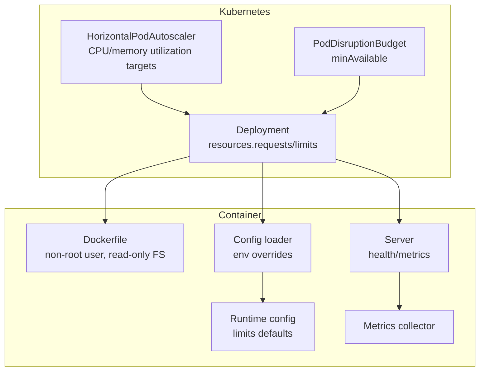
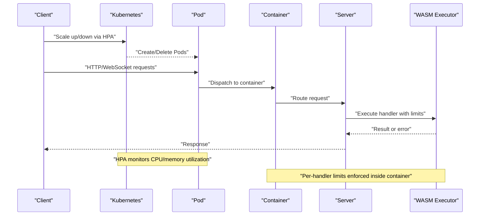
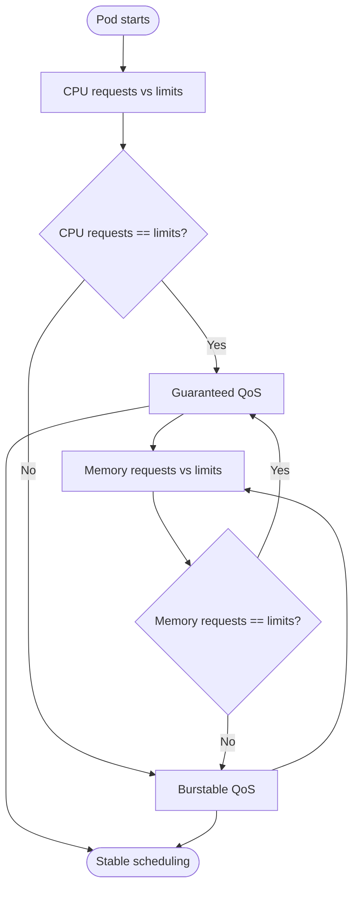
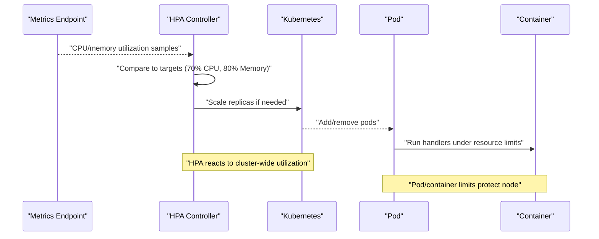
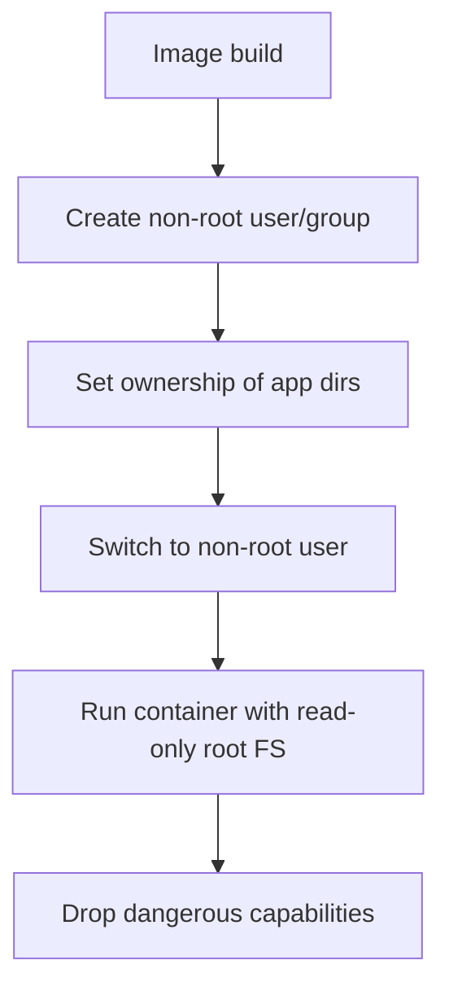
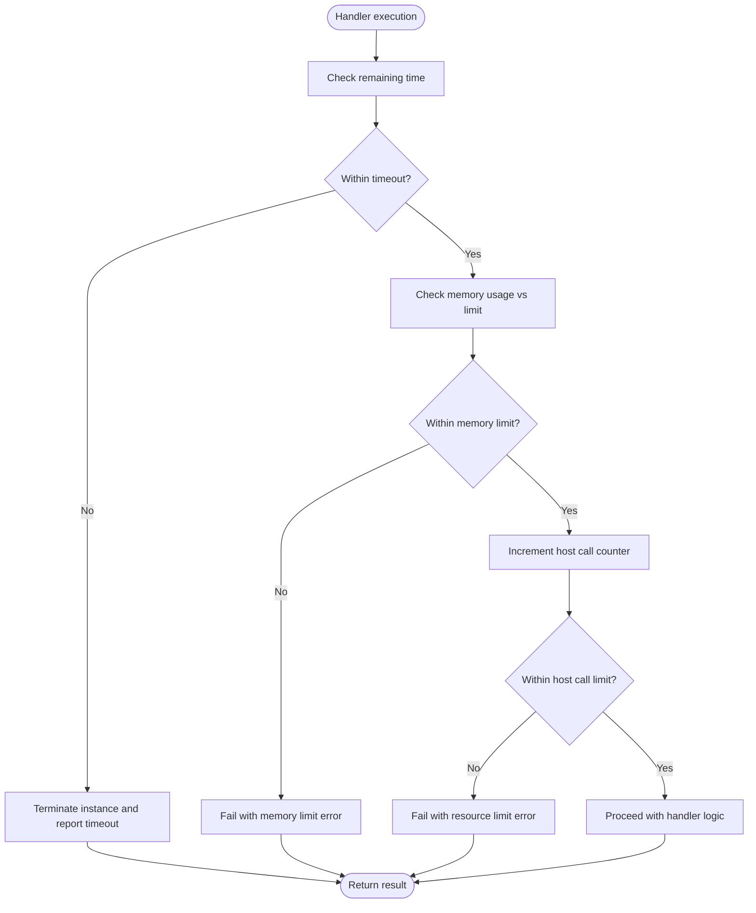
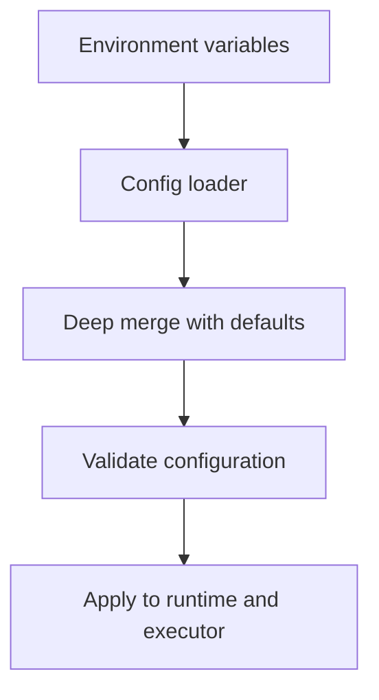
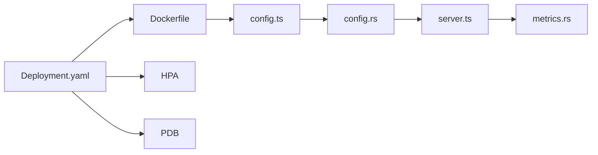

# Container Resource Limits

<cite>
**Referenced Files in This Document**
- [deployment.yaml](file://runtime/k8s/deployment.yaml)
- [Dockerfile](file://runtime/images/Dockerfile)
- [config.ts](file://runtime/workspace-kernel/src/config.ts)
- [config.rs](file://runtime/nexus-wasm-bridge/src/config.rs)
- [server.ts](file://runtime/workspace-kernel/src/server.ts)
- [metrics.rs](file://runtime/nexus-wasm-bridge/src/metrics.rs)
- [02_runtime_spec.md](file://docs/02_runtime_spec.md)
</cite>

## Table of Contents
1. [Introduction](#introduction)
2. [Project Structure](#project-structure)
3. [Core Components](#core-components)
4. [Architecture Overview](#architecture-overview)
5. [Detailed Component Analysis](#detailed-component-analysis)
6. [Dependency Analysis](#dependency-analysis)
7. [Performance Considerations](#performance-considerations)
8. [Troubleshooting Guide](#troubleshooting-guide)
9. [Conclusion](#conclusion)

## Introduction
This document explains the container resource limits for the Nexus runtime in Kubernetes, focusing on CPU and memory guarantees, security posture, and how these settings interact with autoscaling. It also provides best practices for tuning these values based on workload characteristics and performance testing results.

## Project Structure
The resource limits and security posture are defined in the Kubernetes deployment manifest and container image configuration. The runtime enforces additional resource limits inside the container to prevent runaway handlers from consuming excessive resources.

**Diagram sources**
- [deployment.yaml](file://runtime/k8s/deployment.yaml#L97-L104)
- [deployment.yaml](file://runtime/k8s/deployment.yaml#L208-L233)
- [deployment.yaml](file://runtime/k8s/deployment.yaml#L235-L245)
- [Dockerfile](file://runtime/images/Dockerfile#L76-L84)
- [config.ts](file://runtime/workspace-kernel/src/config.ts#L80-L123)
- [config.rs](file://runtime/nexus-wasm-bridge/src/config.rs#L9-32)
- [server.ts](file://runtime/workspace-kernel/src/server.ts#L480-L508)
- [metrics.rs](file://runtime/nexus-wasm-bridge/src/metrics.rs#L151-L268)

**Section sources**
- [deployment.yaml](file://runtime/k8s/deployment.yaml#L97-L104)
- [deployment.yaml](file://runtime/k8s/deployment.yaml#L208-L233)
- [deployment.yaml](file://runtime/k8s/deployment.yaml#L235-L245)
- [Dockerfile](file://runtime/images/Dockerfile#L76-L84)
- [config.ts](file://runtime/workspace-kernel/src/config.ts#L80-L123)
- [config.rs](file://runtime/nexus-wasm-bridge/src/config.rs#L9-32)
- [server.ts](file://runtime/workspace-kernel/src/server.ts#L480-L508)
- [metrics.rs](file://runtime/nexus-wasm-bridge/src/metrics.rs#L151-L268)

## Core Components
- Kubernetes Pod resource requests and limits:
  - CPU requests: 100m, CPU limits: 1000m
  - Memory requests: 256Mi, Memory limits: 1Gi
- Security context:
  - Non-root user and group
  - Read-only root filesystem
  - Dropped capabilities
- Autoscaling:
  - HPA targeting CPU utilization average at 70% and memory utilization average at 80%
  - Minimum replicas: 2, maximum replicas: 10
- Runtime-side resource limits:
  - Default per-instance memory limit: 32 MiB
  - Default timeout: 5 seconds
  - Additional constraints: host call count, state mutations, events

These controls work together to ensure predictable performance, isolation, and safety under varying load.

**Section sources**
- [deployment.yaml](file://runtime/k8s/deployment.yaml#L97-L104)
- [deployment.yaml](file://runtime/k8s/deployment.yaml#L208-L233)
- [config.rs](file://runtime/nexus-wasm-bridge/src/config.rs#L9-32)
- [config.rs](file://runtime/nexus-wasm-bridge/src/config.rs#L171-L209)
- [config.ts](file://runtime/workspace-kernel/src/config.ts#L184-L199)

## Architecture Overview
The runtime container exposes HTTP and WebSocket endpoints. Kubernetes enforces pod-level CPU and memory guarantees and applies autoscaling based on resource utilization. Inside the container, the runtime enforces per-handler resource limits to prevent a single handler from consuming excessive CPU, memory, or performing too many host calls.

**Diagram sources**
- [deployment.yaml](file://runtime/k8s/deployment.yaml#L208-L233)
- [server.ts](file://runtime/workspace-kernel/src/server.ts#L579-L642)
- [config.rs](file://runtime/nexus-wasm-bridge/src/config.rs#L171-L209)

## Detailed Component Analysis

### Kubernetes Pod Specification and QoS
- CPU:
  - Requests: 100m ensures the pod is eligible to run on nodes with sufficient CPU capacity.
  - Limits: 1000m cap prevents a single pod from monopolizing CPU cycles.
  - Combined with HPA, this enables predictable scaling while preventing CPU contention spikes.
- Memory:
  - Requests: 256Mi ensures baseline memory availability.
  - Limits: 1Gi caps memory growth to protect the node and other pods.
  - Together with per-handler memory limits, this prevents memory exhaustion.

Quality of Service:
- Guaranteed CPU allocation is achieved by setting requests equal to limits for CPU in the container spec. However, the current spec sets requests lower than limits for CPU. This creates a Burstable QoS class for CPU. For Guaranteed CPU, set requests equal to limits at the container level. The current configuration still provides CPU throttling protection via limits and HPA-driven scaling.

Security Context:
- Non-root user and group ensure the container runs with minimal privileges.
- Read-only root filesystem reduces attack surface.
- Dropped capabilities remove unnecessary Linux capabilities.

**Diagram sources**
- [deployment.yaml](file://runtime/k8s/deployment.yaml#L97-L104)

**Section sources**
- [deployment.yaml](file://runtime/k8s/deployment.yaml#L97-L104)
- [deployment.yaml](file://runtime/k8s/deployment.yaml#L62-L67)
- [deployment.yaml](file://runtime/k8s/deployment.yaml#L123-L129)

### Autoscaling Interaction with Resource Limits
- HPA targets:
  - CPU utilization average: 70%
  - Memory utilization average: 80%
  - Replicas range: 2–10
- Behavior:
  - When utilization approaches thresholds, HPA scales replicas up or down.
  - Pod-level limits (CPU 1000m, Memory 1Gi) prevent a single pod from consuming all node resources.
  - Per-handler limits (e.g., 32 MiB memory per instance) prevent runaway handlers from causing OOM or timeouts.

**Diagram sources**
- [deployment.yaml](file://runtime/k8s/deployment.yaml#L208-L233)
- [deployment.yaml](file://runtime/k8s/deployment.yaml#L97-L104)
- [config.rs](file://runtime/nexus-wasm-bridge/src/config.rs#L171-L209)

**Section sources**
- [deployment.yaml](file://runtime/k8s/deployment.yaml#L208-L233)
- [deployment.yaml](file://runtime/k8s/deployment.yaml#L97-L104)

### Security Context Configuration
- Non-root execution:
  - Container runs as a non-root user and group.
  - Image creates a dedicated runtime user and sets ownership accordingly.
- Read-only root filesystem:
  - Prevents accidental or malicious writes to critical paths.
- Dropped capabilities:
  - Removes dangerous Linux capabilities to minimize privilege escalation risks.

**Diagram sources**
- [Dockerfile](file://runtime/images/Dockerfile#L76-L84)
- [deployment.yaml](file://runtime/k8s/deployment.yaml#L123-L129)

**Section sources**
- [Dockerfile](file://runtime/images/Dockerfile#L76-L84)
- [deployment.yaml](file://runtime/k8s/deployment.yaml#L62-L67)
- [deployment.yaml](file://runtime/k8s/deployment.yaml#L123-L129)

### Runtime-Side Resource Limits Enforcement
- Defaults:
  - Per-instance memory limit: 32 MiB
  - Timeout: 5 seconds
  - Host call limit: 10,000
  - State mutations and events limits: 1,000 and 100 respectively
- Enforcement:
  - Timeout enforcement wraps execution with a deadline.
  - Memory limit is enforced by configuring the underlying WebAssembly runtime’s memory pages.
  - Host call counting increments on each host function invocation and fails fast when exceeded.
- Observability:
  - Metrics include execution counts, durations, cache hit rates, and peak memory usage.

**Diagram sources**
- [config.rs](file://runtime/nexus-wasm-bridge/src/config.rs#L171-L209)
- [config.rs](file://runtime/nexus-wasm-bridge/src/config.rs#L144-L168)
- [metrics.rs](file://runtime/nexus-wasm-bridge/src/metrics.rs#L151-L268)
- [02_runtime_spec.md](file://docs/02_runtime_spec.md#L961-L1093)

**Section sources**
- [config.rs](file://runtime/nexus-wasm-bridge/src/config.rs#L9-32)
- [config.rs](file://runtime/nexus-wasm-bridge/src/config.rs#L171-L209)
- [config.rs](file://runtime/nexus-wasm-bridge/src/config.rs#L144-L168)
- [metrics.rs](file://runtime/nexus-wasm-bridge/src/metrics.rs#L151-L268)
- [02_runtime_spec.md](file://docs/02_runtime_spec.md#L961-L1093)

### Configuration Loading and Overrides
- Environment variables override defaults for runtime configuration, including memory limit and timeouts.
- These values feed into the runtime configuration and influence per-handler limits.

**Diagram sources**
- [config.ts](file://runtime/workspace-kernel/src/config.ts#L80-L123)
- [config.ts](file://runtime/workspace-kernel/src/config.ts#L150-L167)
- [config.ts](file://runtime/workspace-kernel/src/config.ts#L172-L199)

**Section sources**
- [config.ts](file://runtime/workspace-kernel/src/config.ts#L80-L123)
- [config.ts](file://runtime/workspace-kernel/src/config.ts#L150-L167)
- [config.ts](file://runtime/workspace-kernel/src/config.ts#L172-L199)

## Dependency Analysis
- Kubernetes Deployment depends on:
  - Container image (Dockerfile) for non-root user and base OS.
  - HPA for scaling decisions.
  - PodDisruptionBudget for availability.
- Container runtime depends on:
  - Config loader for environment overrides.
  - WASM executor for enforcing per-handler limits.
  - Metrics for observability.

**Diagram sources**
- [deployment.yaml](file://runtime/k8s/deployment.yaml#L97-L104)
- [deployment.yaml](file://runtime/k8s/deployment.yaml#L208-L233)
- [deployment.yaml](file://runtime/k8s/deployment.yaml#L235-L245)
- [Dockerfile](file://runtime/images/Dockerfile#L76-L84)
- [config.ts](file://runtime/workspace-kernel/src/config.ts#L80-L123)
- [config.rs](file://runtime/nexus-wasm-bridge/src/config.rs#L9-32)
- [server.ts](file://runtime/workspace-kernel/src/server.ts#L480-L508)
- [metrics.rs](file://runtime/nexus-wasm-bridge/src/metrics.rs#L151-L268)

**Section sources**
- [deployment.yaml](file://runtime/k8s/deployment.yaml#L97-L104)
- [deployment.yaml](file://runtime/k8s/deployment.yaml#L208-L233)
- [deployment.yaml](file://runtime/k8s/deployment.yaml#L235-L245)
- [Dockerfile](file://runtime/images/Dockerfile#L76-L84)
- [config.ts](file://runtime/workspace-kernel/src/config.ts#L80-L123)
- [config.rs](file://runtime/nexus-wasm-bridge/src/config.rs#L9-32)
- [server.ts](file://runtime/workspace-kernel/src/server.ts#L480-L508)
- [metrics.rs](file://runtime/nexus-wasm-bridge/src/metrics.rs#L151-L268)

## Performance Considerations
- CPU:
  - Start with CPU requests at 100m and limits at 1000m to provide headroom for bursts while capping spikes.
  - Tune HPA thresholds (70%) to balance responsiveness and stability; lower thresholds increase scaling frequency.
- Memory:
  - Requests at 256Mi and limits at 1Gi provide a strong upper bound; pair with per-handler memory limits (32 MiB) to avoid OOM.
  - Monitor cache hit rates and peak memory usage to adjust limits and HPA targets.
- Handler-level limits:
  - Increase per-instance memory limit cautiously; ensure it aligns with workload patterns and HPA max replicas.
  - Adjust timeouts based on typical handler execution times; too low causes premature failures, too high risks resource starvation.
- Observability:
  - Use health endpoints and metrics to validate scaling behavior and detect resource bottlenecks.

[No sources needed since this section provides general guidance]

## Troubleshooting Guide
- Symptoms of CPU pressure:
  - Pods throttled or HPA rapidly scaling up; consider raising CPU requests or reducing bursty workloads.
- Symptoms of memory pressure:
  - OOMKilled events or frequent restarts; reduce per-handler memory limit or increase pod memory limit.
- Handler timeouts:
  - Execution errors indicating timeouts; increase handler timeout or optimize handler logic.
- Excessive host calls:
  - Errors indicating resource limit exceeded for host calls; refactor handler to batch or reduce external calls.

**Section sources**
- [config.rs](file://runtime/nexus-wasm-bridge/src/config.rs#L144-L168)
- [config.rs](file://runtime/nexus-wasm-bridge/src/config.rs#L171-L209)
- [server.ts](file://runtime/workspace-kernel/src/server.ts#L480-L508)
- [metrics.rs](file://runtime/nexus-wasm-bridge/src/metrics.rs#L151-L268)

## Conclusion
The Nexus runtime’s container resource limits combine Kubernetes-level guarantees with in-container enforcement to ensure predictable performance and safety. CPU and memory requests/limits, combined with HPA thresholds and per-handler constraints, provide a robust foundation for scaling under load. Security hardening through non-root execution, read-only filesystems, and dropped capabilities further strengthens operational resilience. Tuning these values should be guided by workload characteristics and continuous performance testing.