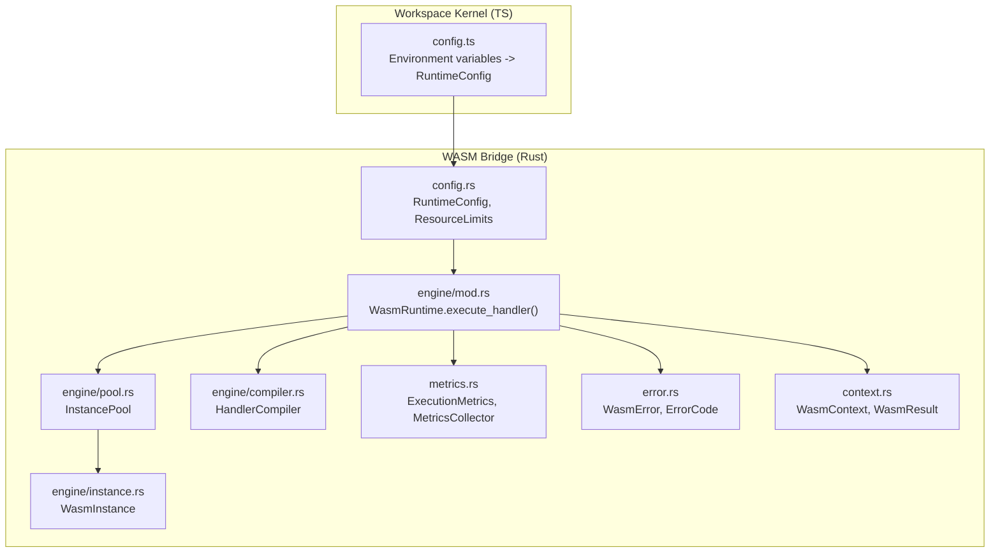
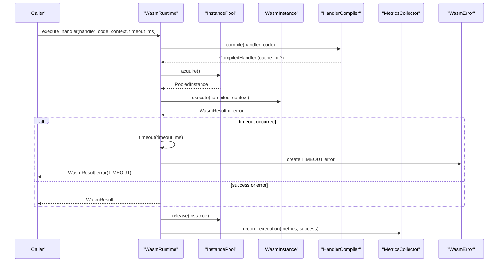
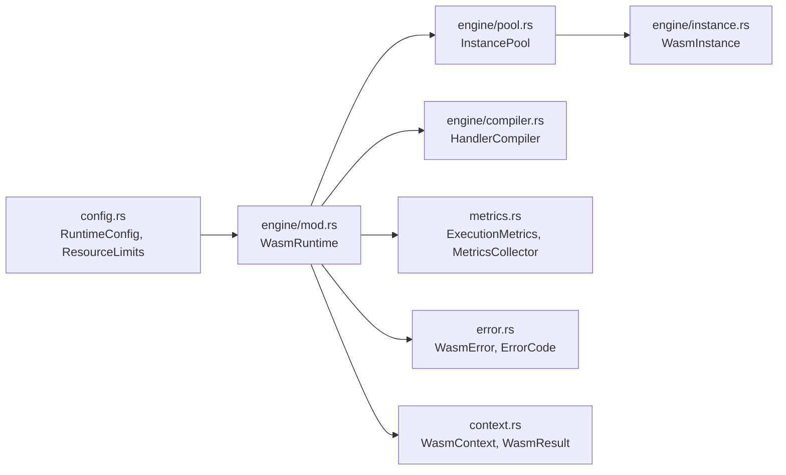

# Execution Performance

<cite>
**Referenced Files in This Document**
- [config.rs](file://runtime/nexus-wasm-bridge/src/config.rs)
- [mod.rs](file://runtime/nexus-wasm-bridge/src/engine/mod.rs)
- [pool.rs](file://runtime/nexus-wasm-bridge/src/engine/pool.rs)
- [instance.rs](file://runtime/nexus-wasm-bridge/src/engine/instance.rs)
- [compiler.rs](file://runtime/nexus-wasm-bridge/src/engine/compiler.rs)
- [metrics.rs](file://runtime/nexus-wasm-bridge/src/metrics.rs)
- [error.rs](file://runtime/nexus-wasm-bridge/src/error.rs)
- [context.rs](file://runtime/nexus-wasm-bridge/src/context.rs)
- [config.ts](file://runtime/workspace-kernel/src/config.ts)
</cite>

## Table of Contents
1. [Introduction](#introduction)
2. [Project Structure](#project-structure)
3. [Core Components](#core-components)
4. [Architecture Overview](#architecture-overview)
5. [Detailed Component Analysis](#detailed-component-analysis)
6. [Dependency Analysis](#dependency-analysis)
7. [Performance Considerations](#performance-considerations)
8. [Troubleshooting Guide](#troubleshooting-guide)
9. [Conclusion](#conclusion)

## Introduction
This document explains Nexus execution performance controls, focusing on:
- WASM handler timeout enforcement at 5000 ms as configured via environment variables and enforced in the Rust runtime
- How ResourceLimits governs execution parameters including timeout_ms, memory_limit_bytes, and stack_size_bytes
- Error handling mechanisms that return RESOURCE_LIMIT error codes for resource limit violations
- Instance pooling in the WasmExecutor that reduces CPU overhead by reusing compiled modules
- Performance monitoring metrics exposed through execution results and how they inform optimization decisions

## Project Structure
The execution performance controls live primarily in the Rust WASM bridge runtime:
- Configuration and limits are defined in config.rs
- Execution orchestration and timeout enforcement are in engine/mod.rs
- Instance pooling and lifecycle are in engine/pool.rs
- Individual instance execution and metrics are in engine/instance.rs and metrics.rs
- Error types and codes are in error.rs
- Execution context and results are in context.rs
- Environment variable loading for runtime settings is in workspace-kernel/config.ts

**Diagram sources**
- [config.ts](file://runtime/workspace-kernel/src/config.ts#L1-L233)
- [config.rs](file://runtime/nexus-wasm-bridge/src/config.rs#L1-L320)
- [mod.rs](file://runtime/nexus-wasm-bridge/src/engine/mod.rs#L1-L244)
- [pool.rs](file://runtime/nexus-wasm-bridge/src/engine/pool.rs#L1-L395)
- [instance.rs](file://runtime/nexus-wasm-bridge/src/engine/instance.rs#L1-L381)
- [compiler.rs](file://runtime/nexus-wasm-bridge/src/engine/compiler.rs#L1-L567)
- [metrics.rs](file://runtime/nexus-wasm-bridge/src/metrics.rs#L1-L474)
- [error.rs](file://runtime/nexus-wasm-bridge/src/error.rs#L1-L395)
- [context.rs](file://runtime/nexus-wasm-bridge/src/context.rs#L1-L695)

**Section sources**
- [config.rs](file://runtime/nexus-wasm-bridge/src/config.rs#L1-L320)
- [mod.rs](file://runtime/nexus-wasm-bridge/src/engine/mod.rs#L1-L244)
- [pool.rs](file://runtime/nexus-wasm-bridge/src/engine/pool.rs#L1-L395)
- [instance.rs](file://runtime/nexus-wasm-bridge/src/engine/instance.rs#L1-L381)
- [compiler.rs](file://runtime/nexus-wasm-bridge/src/engine/compiler.rs#L1-L567)
- [metrics.rs](file://runtime/nexus-wasm-bridge/src/metrics.rs#L1-L474)
- [error.rs](file://runtime/nexus-wasm-bridge/src/error.rs#L1-L395)
- [context.rs](file://runtime/nexus-wasm-bridge/src/context.rs#L1-L695)
- [config.ts](file://runtime/workspace-kernel/src/config.ts#L1-L233)

## Core Components
- ResourceLimits: Defines execution constraints such as timeout_ms, memory_limit_bytes, stack_size_bytes, and host-call/state/event quotas. Defaults include a 5000 ms timeout.
- WasmRuntime: Orchestrates handler compilation, instance acquisition from the pool, execution with timeout enforcement, and metrics recording.
- InstancePool: Manages a bounded set of reusable WasmInstance objects, reducing startup cost and CPU overhead.
- MetricsCollector: Aggregates execution metrics and exposes Prometheus-formatted metrics for observability.
- WasmError: Standardized error codes including TIMEOUT and RESOURCE_LIMIT.

Key implementation references:
- ResourceLimits and defaults: [config.rs](file://runtime/nexus-wasm-bridge/src/config.rs#L171-L211)
- Default timeout_ms: [config.rs](file://runtime/nexus-wasm-bridge/src/config.rs#L18-L20)
- WasmRuntime.execute_handler timeout enforcement: [mod.rs](file://runtime/nexus-wasm-bridge/src/engine/mod.rs#L56-L110)
- InstancePool acquisition/release: [pool.rs](file://runtime/nexus-wasm-bridge/src/engine/pool.rs#L118-L217)
- Metrics collection and export: [metrics.rs](file://runtime/nexus-wasm-bridge/src/metrics.rs#L138-L339)
- Error codes and timeout creation: [error.rs](file://runtime/nexus-wasm-bridge/src/error.rs#L1-L120)

**Section sources**
- [config.rs](file://runtime/nexus-wasm-bridge/src/config.rs#L171-L211)
- [config.rs](file://runtime/nexus-wasm-bridge/src/config.rs#L18-L20)
- [mod.rs](file://runtime/nexus-wasm-bridge/src/engine/mod.rs#L56-L110)
- [pool.rs](file://runtime/nexus-wasm-bridge/src/engine/pool.rs#L118-L217)
- [metrics.rs](file://runtime/nexus-wasm-bridge/src/metrics.rs#L138-L339)
- [error.rs](file://runtime/nexus-wasm-bridge/src/error.rs#L1-L120)

## Architecture Overview
The execution pipeline enforces timeouts and limits, records metrics, and returns structured results.

**Diagram sources**
- [mod.rs](file://runtime/nexus-wasm-bridge/src/engine/mod.rs#L56-L110)
- [pool.rs](file://runtime/nexus-wasm-bridge/src/engine/pool.rs#L118-L217)
- [instance.rs](file://runtime/nexus-wasm-bridge/src/engine/instance.rs#L118-L211)
- [compiler.rs](file://runtime/nexus-wasm-bridge/src/engine/compiler.rs#L168-L214)
- [metrics.rs](file://runtime/nexus-wasm-bridge/src/metrics.rs#L168-L211)
- [error.rs](file://runtime/nexus-wasm-bridge/src/error.rs#L127-L133)

## Detailed Component Analysis

### WASM Handler Timeout Enforcement (5000 ms)
- Default timeout_ms is defined as 5000 ms in defaults.
- The WasmRuntime.execute_handler enforces a per-execution timeout using tokio::time::timeout with the provided timeout_ms.
- On timeout, the runtime records execution metrics, marks failure, and returns a WasmResult containing a WasmError with code TIMEOUT.

Implementation references:
- Default timeout_ms: [config.rs](file://runtime/nexus-wasm-bridge/src/config.rs#L18-L20)
- Timeout enforcement: [mod.rs](file://runtime/nexus-wasm-bridge/src/engine/mod.rs#L76-L109)
- Timeout error creation: [error.rs](file://runtime/nexus-wasm-bridge/src/error.rs#L127-L133)

**Section sources**
- [config.rs](file://runtime/nexus-wasm-bridge/src/config.rs#L18-L20)
- [mod.rs](file://runtime/nexus-wasm-bridge/src/engine/mod.rs#L76-L109)
- [error.rs](file://runtime/nexus-wasm-bridge/src/error.rs#L127-L133)

### ResourceLimits and Execution Parameters
- ResourceLimits defines:
  - timeout_ms: per-handler execution time limit (default 5000 ms)
  - memory_limit_bytes: per-instance memory limit (default 32 MB)
  - stack_size_bytes: per-instance stack size (default 1 MB)
  - max_host_calls, max_state_mutations, max_events: quotas for host calls and side effects
- These defaults are applied when creating WasmInstance and can be overridden via configuration.

Implementation references:
- ResourceLimits struct and defaults: [config.rs](file://runtime/nexus-wasm-bridge/src/config.rs#L171-L211)
- Default memory and stack sizes: [config.rs](file://runtime/nexus-wasm-bridge/src/config.rs#L9-L16)
- Instance construction with ResourceLimits: [instance.rs](file://runtime/nexus-wasm-bridge/src/engine/instance.rs#L58-L75)

**Section sources**
- [config.rs](file://runtime/nexus-wasm-bridge/src/config.rs#L171-L211)
- [config.rs](file://runtime/nexus-wasm-bridge/src/config.rs#L9-L16)
- [instance.rs](file://runtime/nexus-wasm-bridge/src/engine/instance.rs#L58-L75)

### Error Handling Mechanisms and RESOURCE_LIMIT Codes
- Timeout errors are represented by ErrorCode::Timeout and are surfaced as WasmError in the result.
- ResourceLimit errors are represented by ErrorCode::ResourceLimit and are used by host functions to signal quota exceeded conditions.
- The runtime converts internal errors to WasmError for transport to callers.

Implementation references:
- Timeout error creation: [error.rs](file://runtime/nexus-wasm-bridge/src/error.rs#L127-L133)
- ResourceLimit error creation: [error.rs](file://runtime/nexus-wasm-bridge/src/error.rs#L176-L187)
- Error code constants for host functions: [error.rs](file://runtime/nexus-wasm-bridge/src/error.rs#L339-L352)
- Runtime error conversion to WasmError: [error.rs](file://runtime/nexus-wasm-bridge/src/error.rs#L293-L315)

**Section sources**
- [error.rs](file://runtime/nexus-wasm-bridge/src/error.rs#L127-L133)
- [error.rs](file://runtime/nexus-wasm-bridge/src/error.rs#L176-L187)
- [error.rs](file://runtime/nexus-wasm-bridge/src/error.rs#L339-L352)
- [error.rs](file://runtime/nexus-wasm-bridge/src/error.rs#L293-L315)

### Instance Pooling and CPU Overhead Reduction
- InstancePool maintains a bounded set of WasmInstance objects, acquired via a semaphore and reused through acquire/release.
- Acquisition resets instances and returns them to the pool when released, minimizing cold-start costs and CPU overhead.
- The pool tracks active instances, available instances, suspended instances, and total memory usage.

Implementation references:
- Pool creation and pre-warming: [pool.rs](file://runtime/nexus-wasm-bridge/src/engine/pool.rs#L77-L116)
- Acquire path (reuse vs create): [pool.rs](file://runtime/nexus-wasm-bridge/src/engine/pool.rs#L118-L171)
- Release path (reset, suspend, or terminate): [pool.rs](file://runtime/nexus-wasm-bridge/src/engine/pool.rs#L173-L217)
- Stats and shutdown: [pool.rs](file://runtime/nexus-wasm-bridge/src/engine/pool.rs#L235-L285)

**Section sources**
- [pool.rs](file://runtime/nexus-wasm-bridge/src/engine/pool.rs#L77-L116)
- [pool.rs](file://runtime/nexus-wasm-bridge/src/engine/pool.rs#L118-L171)
- [pool.rs](file://runtime/nexus-wasm-bridge/src/engine/pool.rs#L173-L217)
- [pool.rs](file://runtime/nexus-wasm-bridge/src/engine/pool.rs#L235-L285)

### Performance Monitoring Metrics and Optimization Signals
- ExecutionMetrics captures duration_us, memory_used_bytes, memory_peak_bytes, host_calls, instruction_count, compilation_time_us, and cache_hit.
- MetricsCollector aggregates totals, averages, cache hit rates, peak memory, and error counts; exports Prometheus-formatted metrics.
- WasmRuntime records metrics for each execution and distinguishes success vs failure.

Implementation references:
- ExecutionMetrics fields and builder: [metrics.rs](file://runtime/nexus-wasm-bridge/src/metrics.rs#L13-L100)
- MetricsCollector aggregation and Prometheus export: [metrics.rs](file://runtime/nexus-wasm-bridge/src/metrics.rs#L138-L339)
- ExecutionTimer and into_metrics: [metrics.rs](file://runtime/nexus-wasm-bridge/src/metrics.rs#L347-L399)
- WasmRuntime metrics recording: [mod.rs](file://runtime/nexus-wasm-bridge/src/engine/mod.rs#L83-L109)

Optimization signals:
- High avg_execution_time_us suggests CPU-bound handlers or slow host calls; consider reducing workload or enabling AOT.
- Low cache_hit_rate indicates frequent recompilation; ensure cache_dir is writable and persistent.
- High peak_memory_bytes or frequent memory_limit errors indicate handlers exceeding memory budgets; reduce allocations or increase memory_limit_bytes.

**Section sources**
- [metrics.rs](file://runtime/nexus-wasm-bridge/src/metrics.rs#L13-L100)
- [metrics.rs](file://runtime/nexus-wasm-bridge/src/metrics.rs#L138-L339)
- [metrics.rs](file://runtime/nexus-wasm-bridge/src/metrics.rs#L347-L399)
- [mod.rs](file://runtime/nexus-wasm-bridge/src/engine/mod.rs#L83-L109)

### Environment Variables and Default Timeout
- The workspace-kernel loads environment variables and applies them to runtime configuration, including timeoutMs.
- The default timeoutMs is 5000 ms in both the TS defaults and the Rust defaults.

Implementation references:
- Environment variable mapping (TIMEOUT_MS): [config.ts](file://runtime/workspace-kernel/src/config.ts#L76-L123)
- Default timeoutMs in TS: [config.ts](file://runtime/workspace-kernel/src/config.ts#L17-L25)
- Default timeoutMs in Rust: [config.rs](file://runtime/nexus-wasm-bridge/src/config.rs#L18-L20)

**Section sources**
- [config.ts](file://runtime/workspace-kernel/src/config.ts#L76-L123)
- [config.ts](file://runtime/workspace-kernel/src/config.ts#L17-L25)
- [config.rs](file://runtime/nexus-wasm-bridge/src/config.rs#L18-L20)

## Dependency Analysis
The following diagram shows key dependencies among components involved in execution performance:

**Diagram sources**
- [config.rs](file://runtime/nexus-wasm-bridge/src/config.rs#L1-L320)
- [mod.rs](file://runtime/nexus-wasm-bridge/src/engine/mod.rs#L1-L244)
- [pool.rs](file://runtime/nexus-wasm-bridge/src/engine/pool.rs#L1-L395)
- [instance.rs](file://runtime/nexus-wasm-bridge/src/engine/instance.rs#L1-L381)
- [compiler.rs](file://runtime/nexus-wasm-bridge/src/engine/compiler.rs#L1-L567)
- [metrics.rs](file://runtime/nexus-wasm-bridge/src/metrics.rs#L1-L474)
- [error.rs](file://runtime/nexus-wasm-bridge/src/error.rs#L1-L395)
- [context.rs](file://runtime/nexus-wasm-bridge/src/context.rs#L1-L695)

**Section sources**
- [config.rs](file://runtime/nexus-wasm-bridge/src/config.rs#L1-L320)
- [mod.rs](file://runtime/nexus-wasm-bridge/src/engine/mod.rs#L1-L244)
- [pool.rs](file://runtime/nexus-wasm-bridge/src/engine/pool.rs#L1-L395)
- [instance.rs](file://runtime/nexus-wasm-bridge/src/engine/instance.rs#L1-L381)
- [compiler.rs](file://runtime/nexus-wasm-bridge/src/engine/compiler.rs#L1-L567)
- [metrics.rs](file://runtime/nexus-wasm-bridge/src/metrics.rs#L1-L474)
- [error.rs](file://runtime/nexus-wasm-bridge/src/error.rs#L1-L395)
- [context.rs](file://runtime/nexus-wasm-bridge/src/context.rs#L1-L695)

## Performance Considerations
- Use instance pooling to minimize cold starts and CPU overhead from repeated instantiation.
- Tune timeout_ms to balance responsiveness and handler complexity; monitor avg_execution_time_us to detect regressions.
- Monitor cache_hit_rate; low rates imply frequent recompilation—ensure cache_dir is persistent and writable.
- Watch peak_memory_bytes and memory_limit_bytes to prevent memory-limit errors; adjust budgets based on observed usage.
- Track host_calls and max_host_calls to identify handlers that exceed quotas; refactor to batch operations or reduce calls.
- Export Prometheus metrics to drive alerting and capacity planning.

[No sources needed since this section provides general guidance]

## Troubleshooting Guide
Common symptoms and diagnostics:
- Handler times out:
  - Verify timeout_ms setting and environment configuration.
  - Inspect avg_execution_time_us and cache_hit_rate to determine if optimization is needed.
  - References: [mod.rs](file://runtime/nexus-wasm-bridge/src/engine/mod.rs#L76-L109), [metrics.rs](file://runtime/nexus-wasm-bridge/src/metrics.rs#L246-L253), [config.ts](file://runtime/workspace-kernel/src/config.ts#L76-L123)
- Resource limit exceeded:
  - Check max_host_calls, max_state_mutations, max_events quotas and host_calls aggregation.
  - Use resource_limit error codes to identify which resource was exceeded.
  - References: [metrics.rs](file://runtime/nexus-wasm-bridge/src/metrics.rs#L206-L210), [error.rs](file://runtime/nexus-wasm-bridge/src/error.rs#L176-L187)
- Memory limit exceeded:
  - Increase memory_limit_bytes or optimize handler memory usage.
  - References: [config.rs](file://runtime/nexus-wasm-bridge/src/config.rs#L9-L16), [instance.rs](file://runtime/nexus-wasm-bridge/src/engine/instance.rs#L118-L211)
- High CPU overhead:
  - Ensure instance pooling is active and cache_dir is functional to reduce compilation overhead.
  - References: [pool.rs](file://runtime/nexus-wasm-bridge/src/engine/pool.rs#L118-L171), [compiler.rs](file://runtime/nexus-wasm-bridge/src/engine/compiler.rs#L138-L166)

**Section sources**
- [mod.rs](file://runtime/nexus-wasm-bridge/src/engine/mod.rs#L76-L109)
- [metrics.rs](file://runtime/nexus-wasm-bridge/src/metrics.rs#L206-L210)
- [error.rs](file://runtime/nexus-wasm-bridge/src/error.rs#L176-L187)
- [config.rs](file://runtime/nexus-wasm-bridge/src/config.rs#L9-L16)
- [instance.rs](file://runtime/nexus-wasm-bridge/src/engine/instance.rs#L118-L211)
- [pool.rs](file://runtime/nexus-wasm-bridge/src/engine/pool.rs#L118-L171)
- [compiler.rs](file://runtime/nexus-wasm-bridge/src/engine/compiler.rs#L138-L166)
- [config.ts](file://runtime/workspace-kernel/src/config.ts#L76-L123)

## Conclusion
Nexus enforces a 5000 ms default handler timeout, governed by ResourceLimits and enforced at the WasmRuntime boundary. Instance pooling minimizes CPU overhead by reusing compiled modules, while comprehensive metrics capture execution duration, memory usage, host calls, and cache behavior. Errors are standardized with clear codes (TIMEOUT, RESOURCE_LIMIT), enabling precise diagnostics and actionable optimization decisions.

[No sources needed since this section summarizes without analyzing specific files]