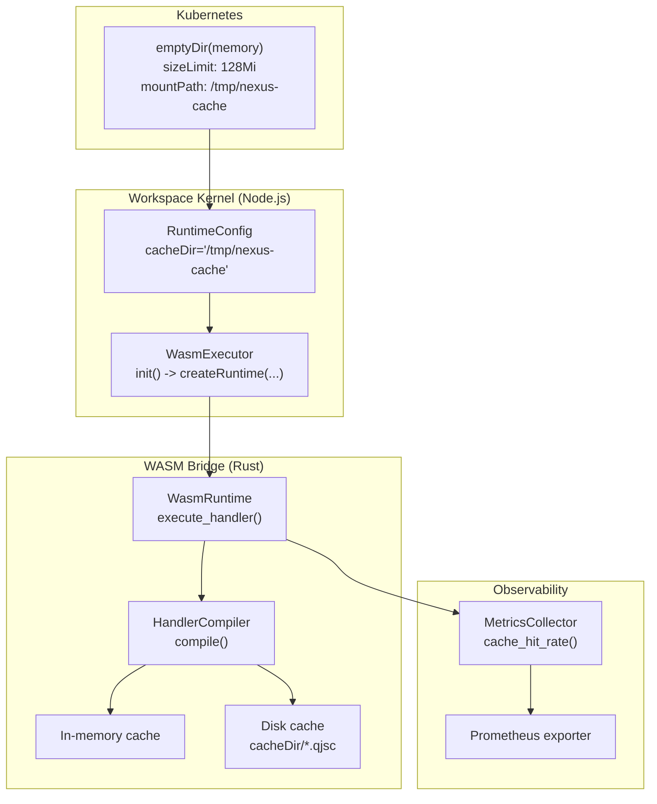
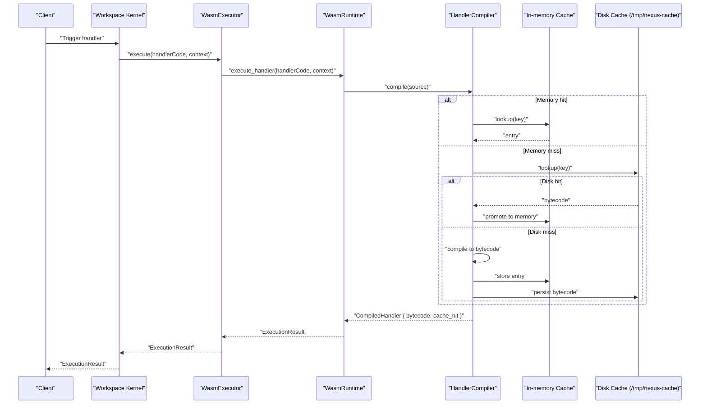
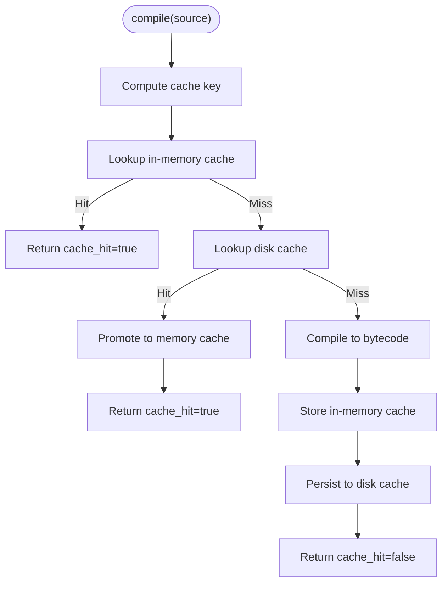
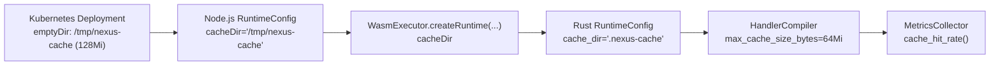

# Caching Strategy

<cite>
**Referenced Files in This Document**
- [deployment.yaml](file://runtime/k8s/deployment.yaml)
- [config.ts](file://runtime/workspace-kernel/src/config.ts)
- [types.ts](file://runtime/workspace-kernel/src/types.ts)
- [executor.ts](file://runtime/workspace-kernel/src/executor.ts)
- [index.ts](file://runtime/workspace-kernel/src/index.ts)
- [config.rs](file://runtime/nexus-wasm-bridge/src/config.rs)
- [compiler.rs](file://runtime/nexus-wasm-bridge/src/engine/compiler.rs)
- [metrics.rs](file://runtime/nexus-wasm-bridge/src/metrics.rs)
- [engine/mod.rs](file://runtime/nexus-wasm-bridge/src/engine/mod.rs)
- [lib.rs](file://runtime/nexus-wasm-bridge/src/lib.rs)
</cite>

## Table of Contents
1. [Introduction](#introduction)
2. [Project Structure](#project-structure)
3. [Core Components](#core-components)
4. [Architecture Overview](#architecture-overview)
5. [Detailed Component Analysis](#detailed-component-analysis)
6. [Dependency Analysis](#dependency-analysis)
7. [Performance Considerations](#performance-considerations)
8. [Troubleshooting Guide](#troubleshooting-guide)
9. [Conclusion](#conclusion)

## Introduction
This document explains the Nexus caching strategy for high-performance handler execution. It covers:
- The use of Kubernetes emptyDir volumes with memory medium mounted at /tmp/nexus-cache for high-throughput temporary storage.
- The size limit of 128Mi and its role in bounding memory usage.
- The compilation cache in the WASM bridge that stores pre-compiled bytecode to reduce handler execution latency.
- How the filesystem cache interacts with the in-memory cache.
- The cacheDir configuration parameter and its default value of .nexus-cache/.
- Monitoring cache hit rates via runtime statistics and Prometheus metrics.
- Guidelines for optimizing cache sizes based on deployment scale and handler diversity.

## Project Structure
The caching strategy spans both the Node.js workspace kernel and the Rust WASM bridge:
- Kubernetes deployment mounts an in-memory emptyDir at /tmp/nexus-cache with a 128Mi size limit.
- The workspace kernel passes runtime configuration (including cacheDir) to the native WASM bridge.
- The Rust bridge compiles handlers to bytecode, caches it in memory, and persists it to disk under cacheDir.
- Metrics are aggregated and exported for monitoring.

**Diagram sources**
- [deployment.yaml](file://runtime/k8s/deployment.yaml#L120-L133)
- [config.ts](file://runtime/workspace-kernel/src/config.ts#L23-L25)
- [executor.ts](file://runtime/workspace-kernel/src/executor.ts#L170-L179)
- [engine/mod.rs](file://runtime/nexus-wasm-bridge/src/engine/mod.rs#L56-L110)
- [compiler.rs](file://runtime/nexus-wasm-bridge/src/engine/compiler.rs#L168-L214)
- [metrics.rs](file://runtime/nexus-wasm-bridge/src/metrics.rs#L233-L243)

**Section sources**
- [deployment.yaml](file://runtime/k8s/deployment.yaml#L120-L133)
- [config.ts](file://runtime/workspace-kernel/src/config.ts#L23-L25)
- [executor.ts](file://runtime/workspace-kernel/src/executor.ts#L170-L179)

## Core Components
- Kubernetes emptyDir with memory medium and size limit:
  - Mount path: /tmp/nexus-cache
  - Medium: Memory
  - Size limit: 128Mi
- Workspace kernel configuration:
  - cacheDir default: /tmp/nexus-cache
  - maxCacheSizeBytes default: 64Mi (see note below)
- Rust WASM bridge configuration:
  - cache_dir default: .nexus-cache
  - max_cache_size_bytes default: 64Mi
- HandlerCompiler:
  - In-memory LRU cache with eviction
  - Disk cache persisted under cacheDir/*.qjsc
  - Cache key derived from source plus versioning
- MetricsCollector:
  - Tracks cache hits and misses
  - Exposes cache_hit_rate and Prometheus metrics

**Section sources**
- [deployment.yaml](file://runtime/k8s/deployment.yaml#L120-L133)
- [config.ts](file://runtime/workspace-kernel/src/config.ts#L23-L25)
- [config.rs](file://runtime/nexus-wasm-bridge/src/config.rs#L21-L23)
- [compiler.rs](file://runtime/nexus-wasm-bridge/src/engine/compiler.rs#L137-L166)
- [metrics.rs](file://runtime/nexus-wasm-bridge/src/metrics.rs#L233-L243)

## Architecture Overview
The caching pipeline integrates Kubernetes storage, Node.js configuration, and Rust compilation caching:

**Diagram sources**
- [engine/mod.rs](file://runtime/nexus-wasm-bridge/src/engine/mod.rs#L56-L110)
- [compiler.rs](file://runtime/nexus-wasm-bridge/src/engine/compiler.rs#L168-L214)
- [compiler.rs](file://runtime/nexus-wasm-bridge/src/engine/compiler.rs#L293-L318)
- [executor.ts](file://runtime/workspace-kernel/src/executor.ts#L214-L236)

## Detailed Component Analysis

### Kubernetes emptyDir Volume for /tmp/nexus-cache
- Purpose: Provide high-performance temporary storage for the filesystem cache.
- Configuration:
  - Mount path: /tmp/nexus-cache
  - Medium: Memory
  - Size limit: 128Mi
- Impact:
  - Ensures fast reads/writes for bytecode persistence.
  - Prevents unbounded growth beyond 128Mi.
  - Pods with anti-affinity reduce risk of cache fragmentation across nodes.

**Section sources**
- [deployment.yaml](file://runtime/k8s/deployment.yaml#L120-L133)

### Workspace Kernel Runtime Configuration
- cacheDir default: /tmp/nexus-cache
- maxCacheSizeBytes default: 64Mi
- These values are loaded from environment variables and merged into the final configuration.

**Section sources**
- [config.ts](file://runtime/workspace-kernel/src/config.ts#L23-L25)
- [config.ts](file://runtime/workspace-kernel/src/config.ts#L76-L123)

### Rust WASM Bridge Runtime Configuration
- cache_dir default: .nexus-cache
- max_cache_size_bytes default: 64Mi
- The bridge receives cacheDir from the Node.js side and creates the directory if missing.

**Section sources**
- [config.rs](file://runtime/nexus-wasm-bridge/src/config.rs#L21-L23)
- [config.rs](file://runtime/nexus-wasm-bridge/src/config.rs#L65-L67)
- [compiler.rs](file://runtime/nexus-wasm-bridge/src/engine/compiler.rs#L137-L166)

### HandlerCompiler: In-memory and Disk Caching
- In-memory cache:
  - LRU eviction policy based on last_accessed timestamps.
  - Tracks total cache_size_bytes and enforces max_cache_size_bytes.
- Disk cache:
  - Persists bytecode under cacheDir/*.qjsc.
  - Reads/writes are logged; failures are warned.
- Cache key:
  - Derived from source hash plus versioning to invalidate on upgrades.
- Behavior:
  - Memory-first lookup; on miss, try disk; on miss, compile and store in both caches.

**Diagram sources**
- [compiler.rs](file://runtime/nexus-wasm-bridge/src/engine/compiler.rs#L168-L214)
- [compiler.rs](file://runtime/nexus-wasm-bridge/src/engine/compiler.rs#L228-L291)
- [compiler.rs](file://runtime/nexus-wasm-bridge/src/engine/compiler.rs#L293-L318)

**Section sources**
- [compiler.rs](file://runtime/nexus-wasm-bridge/src/engine/compiler.rs#L137-L166)
- [compiler.rs](file://runtime/nexus-wasm-bridge/src/engine/compiler.rs#L228-L291)
- [compiler.rs](file://runtime/nexus-wasm-bridge/src/engine/compiler.rs#L293-L318)

### Precompiled Bytecode Execution
- The bridge supports precompiling handlers to bytecode and executing that bytecode directly.
- Execution path:
  - Precompile handler to bytecode.
  - Execute precompiled bytecode with the same instance pool and timeout.
  - Treats precompiled execution as cache_hit=true for metrics.

**Section sources**
- [engine/mod.rs](file://runtime/nexus-wasm-bridge/src/engine/mod.rs#L111-L166)

### Monitoring Cache Hit Rates
- MetricsCollector aggregates:
  - cache_hits and cache_misses atomically.
  - Provides cache_hit_rate = hits / (hits + misses).
- Prometheus metrics include:
  - nexus_cache_hit_rate gauge.
- Runtime statistics expose cache_hit_rate for health/status endpoints.

**Section sources**
- [metrics.rs](file://runtime/nexus-wasm-bridge/src/metrics.rs#L233-L243)
- [metrics.rs](file://runtime/nexus-wasm-bridge/src/metrics.rs#L285-L338)
- [engine/mod.rs](file://runtime/nexus-wasm-bridge/src/engine/mod.rs#L196-L206)
- [types.ts](file://runtime/workspace-kernel/src/types.ts#L260-L273)

### Configuration Parameter: cacheDir
- Node.js side:
  - default: /tmp/nexus-cache
  - passed to native runtime via createRuntime.
- Rust side:
  - default: .nexus-cache
  - used to persist disk cache entries.

**Section sources**
- [config.ts](file://runtime/workspace-kernel/src/config.ts#L23-L25)
- [executor.ts](file://runtime/workspace-kernel/src/executor.ts#L170-L179)
- [config.rs](file://runtime/nexus-wasm-bridge/src/config.rs#L65-L67)

## Dependency Analysis
The caching strategy depends on coordinated configuration across layers:

**Diagram sources**
- [deployment.yaml](file://runtime/k8s/deployment.yaml#L120-L133)
- [config.ts](file://runtime/workspace-kernel/src/config.ts#L23-L25)
- [executor.ts](file://runtime/workspace-kernel/src/executor.ts#L170-L179)
- [config.rs](file://runtime/nexus-wasm-bridge/src/config.rs#L65-L67)
- [compiler.rs](file://runtime/nexus-wasm-bridge/src/engine/compiler.rs#L163-L165)
- [metrics.rs](file://runtime/nexus-wasm-bridge/src/metrics.rs#L233-L243)

**Section sources**
- [deployment.yaml](file://runtime/k8s/deployment.yaml#L120-L133)
- [config.ts](file://runtime/workspace-kernel/src/config.ts#L23-L25)
- [executor.ts](file://runtime/workspace-kernel/src/executor.ts#L170-L179)
- [config.rs](file://runtime/nexus-wasm-bridge/src/config.rs#L65-L67)
- [compiler.rs](file://runtime/nexus-wasm-bridge/src/engine/compiler.rs#L163-L165)
- [metrics.rs](file://runtime/nexus-wasm-bridge/src/metrics.rs#L233-L243)

## Performance Considerations
- emptyDir memory medium:
  - Extremely low latency for cache reads/writes.
  - Volatile storage; pods restart or reschedules can cause cache misses.
- Size limit 128Mi:
  - Bounds memory footprint; helps prevent OOM on large deployments.
  - For high handler diversity, consider increasing cacheDir capacity or using persistent volumes if appropriate.
- In-memory cache sizing:
  - Default max_cache_size_bytes is 64Mi; adjust based on observed cache_hit_rate and workload.
- LRU eviction:
  - Keeps frequently used bytecode hot; tune handler reuse patterns to maximize hit rate.
- Precompiled bytecode:
  - Reduces compilation overhead; beneficial for hot handlers.
- Instance pooling:
  - Combined with caching minimizes cold-start costs.

[No sources needed since this section provides general guidance]

## Troubleshooting Guide
- Low cache hit rate:
  - Verify cacheDir path is writable and mounted at /tmp/nexus-cache.
  - Confirm HandlerCompiler is receiving cacheDir from Node.js.
  - Check for frequent handler code churn; versioned cache keys invalidate aggressively.
- High memory usage:
  - Review max_cache_size_bytes and increase if needed.
  - Monitor Prometheus metrics for cache_hit_rate and peak memory.
- Disk cache not persisting:
  - Ensure cacheDir exists and permissions are correct.
  - Check warnings for disk write failures.
- Unexpected cache misses after upgrades:
  - Versioned cache keys intentionally invalidate on source changes; expect short-term misses.

**Section sources**
- [compiler.rs](file://runtime/nexus-wasm-bridge/src/engine/compiler.rs#L137-L166)
- [compiler.rs](file://runtime/nexus-wasm-bridge/src/engine/compiler.rs#L293-L318)
- [metrics.rs](file://runtime/nexus-wasm-bridge/src/metrics.rs#L285-L338)

## Conclusion
Nexus employs a layered caching strategy:
- Kubernetes emptyDir with memory medium and 128Mi size limit provides high-speed temporary storage for the filesystem cache.
- The Rust WASM bridge maintains an in-memory LRU cache and a disk cache under cacheDir, with versioned cache keys to prevent stale cache poisoning.
- Precompiled bytecode execution further reduces latency for hot handlers.
- Runtime statistics and Prometheus metrics expose cache_hit_rate for observability.
- Tune cacheDir and max_cache_size_bytes according to deployment scale and handler diversity to balance performance and resource usage.