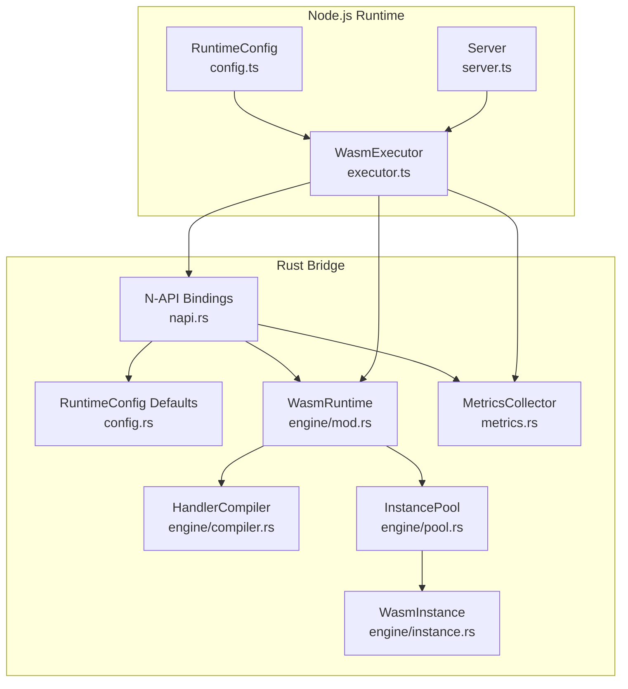
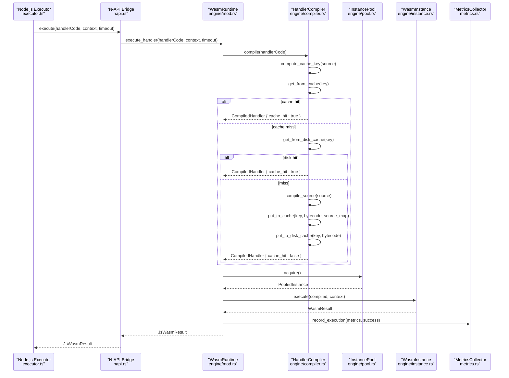
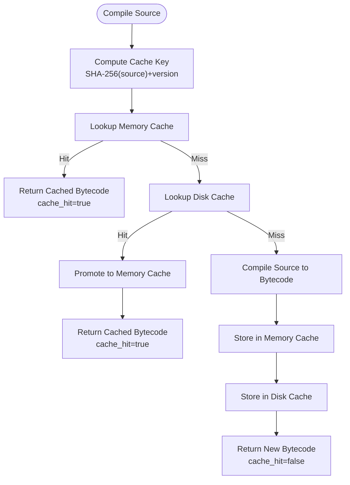
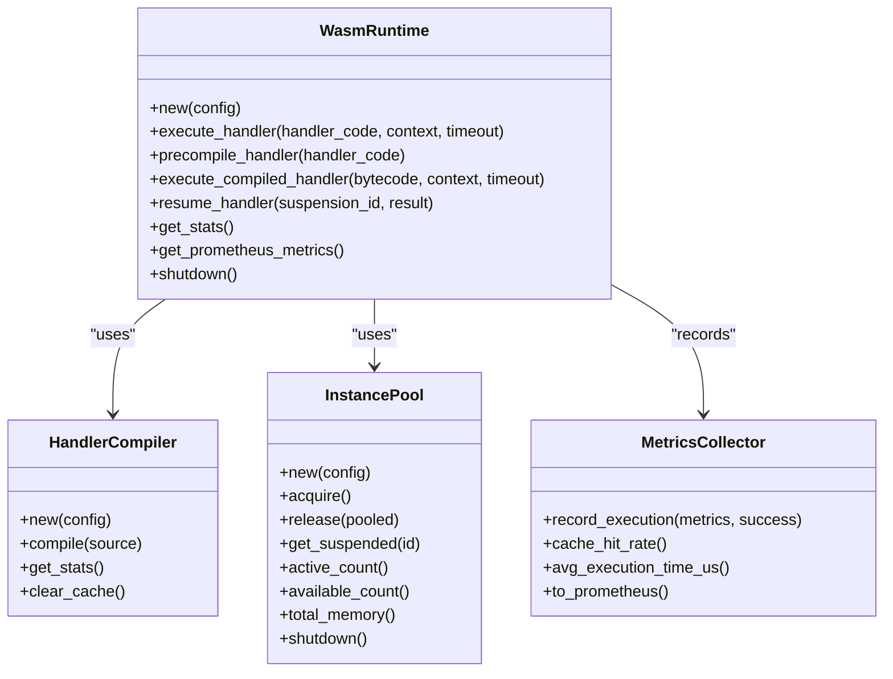
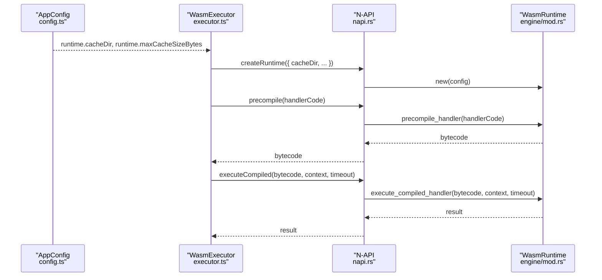
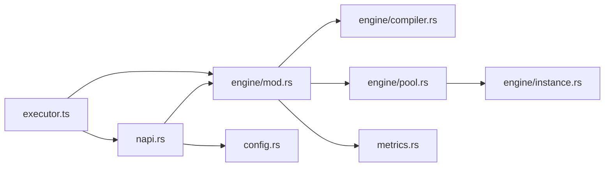

# Compilation Caching

<cite>
**Referenced Files in This Document**
- [compiler.rs](file://runtime/nexus-wasm-bridge/src/engine/compiler.rs)
- [mod.rs (engine)](file://runtime/nexus-wasm-bridge/src/engine/mod.rs)
- [instance.rs](file://runtime/nexus-wasm-bridge/src/engine/instance.rs)
- [pool.rs](file://runtime/nexus-wasm-bridge/src/engine/pool.rs)
- [napi.rs](file://runtime/nexus-wasm-bridge/src/napi.rs)
- [config.rs](file://runtime/nexus-wasm-bridge/src/config.rs)
- [metrics.rs](file://runtime/nexus-wasm-bridge/src/metrics.rs)
- [executor.ts](file://runtime/workspace-kernel/src/executor.ts)
- [config.ts](file://runtime/workspace-kernel/src/config.ts)
- [server.ts](file://runtime/workspace-kernel/src/server.ts)
</cite>

## Table of Contents
1. [Introduction](#introduction)
2. [Project Structure](#project-structure)
3. [Core Components](#core-components)
4. [Architecture Overview](#architecture-overview)
5. [Detailed Component Analysis](#detailed-component-analysis)
6. [Dependency Analysis](#dependency-analysis)
7. [Performance Considerations](#performance-considerations)
8. [Troubleshooting Guide](#troubleshooting-guide)
9. [Conclusion](#conclusion)
10. [Appendices](#appendices)

## Introduction
This document explains the compilation caching sub-feature of the Nexus runtime. The WASM bridge compiles JavaScript handler code to QuickJS bytecode and caches the results to reduce handler execution latency. The cache is backed by both an in-memory LRU cache and a persistent filesystem cache keyed by a hash of the source plus a version identifier. The cacheDir configuration parameter controls the filesystem cache location, with a default value of .nexus-cache/. The Node.js runtime integrates with the Rust engine via N-API, passing cacheDir and other runtime settings to configure the caching behavior. Validation checks ensure cache consistency across restarts by incorporating a version component into the cache key.

## Project Structure
The compilation caching feature spans the Rust bridge and the Node.js workspace kernel:

- Rust bridge (nexus-wasm-bridge):
  - Engine: compilation and caching logic
  - N-API: Node.js integration and configuration bridging
  - Config: default cache directory and runtime settings
  - Metrics: cache hit tracking and reporting
- Node.js workspace-kernel:
  - Executor: loads the native bridge and forwards cacheDir to Rust
  - Server: exposes runtime stats including cache hit rate

**Diagram sources**
- [executor.ts](file://runtime/workspace-kernel/src/executor.ts#L165-L187)
- [napi.rs](file://runtime/nexus-wasm-bridge/src/napi.rs#L286-L336)
- [config.rs](file://runtime/nexus-wasm-bridge/src/config.rs#L21-L26)
- [mod.rs (engine)](file://runtime/nexus-wasm-bridge/src/engine/mod.rs#L34-L53)
- [compiler.rs](file://runtime/nexus-wasm-bridge/src/engine/compiler.rs#L118-L166)
- [pool.rs](file://runtime/nexus-wasm-bridge/src/engine/pool.rs#L77-L116)
- [instance.rs](file://runtime/nexus-wasm-bridge/src/engine/instance.rs#L59-L75)
- [metrics.rs](file://runtime/nexus-wasm-bridge/src/metrics.rs#L138-L210)
- [server.ts](file://runtime/workspace-kernel/src/server.ts#L480-L502)

**Section sources**
- [compiler.rs](file://runtime/nexus-wasm-bridge/src/engine/compiler.rs#L118-L166)
- [napi.rs](file://runtime/nexus-wasm-bridge/src/napi.rs#L286-L336)
- [config.rs](file://runtime/nexus-wasm-bridge/src/config.rs#L21-L26)
- [executor.ts](file://runtime/workspace-kernel/src/executor.ts#L165-L187)
- [server.ts](file://runtime/workspace-kernel/src/server.ts#L480-L502)

## Core Components
- HandlerCompiler: computes cache keys, manages in-memory and disk caches, and performs compilation.
- WasmRuntime: orchestrates compilation and instance execution, wiring cache hits into metrics.
- N-API bindings: convert Node.js configuration to Rust RuntimeConfig and expose APIs for precompilation and execution.
- MetricsCollector: aggregates cache hit/miss totals and exposes cache hit rate.
- Executor: loads the native bridge and passes cacheDir to Rust.

Key implementation highlights:
- Hash-based cache keys include a version component to invalidate cache on upgrades.
- Disk cache stores bytecode files named by the cache key.
- LRU eviction maintains memory cache within configured size limits.
- Cache hit detection propagates through execution metrics and runtime stats.

**Section sources**
- [compiler.rs](file://runtime/nexus-wasm-bridge/src/engine/compiler.rs#L118-L166)
- [compiler.rs](file://runtime/nexus-wasm-bridge/src/engine/compiler.rs#L216-L226)
- [compiler.rs](file://runtime/nexus-wasm-bridge/src/engine/compiler.rs#L293-L318)
- [compiler.rs](file://runtime/nexus-wasm-bridge/src/engine/compiler.rs#L249-L266)
- [compiler.rs](file://runtime/nexus-wasm-bridge/src/engine/compiler.rs#L268-L291)
- [mod.rs (engine)](file://runtime/nexus-wasm-bridge/src/engine/mod.rs#L56-L109)
- [metrics.rs](file://runtime/nexus-wasm-bridge/src/metrics.rs#L138-L210)
- [napi.rs](file://runtime/nexus-wasm-bridge/src/napi.rs#L286-L336)
- [executor.ts](file://runtime/workspace-kernel/src/executor.ts#L165-L187)

## Architecture Overview
The compilation caching pipeline integrates Node.js and Rust:

- Node.js receives handler code and context, and forwards them to the native bridge.
- The bridge compiles handler code to bytecode using HandlerCompiler.
- HandlerCompiler attempts memory cache first, then disk cache, and finally compiles.
- Compiled bytecode is executed by a pooled WasmInstance.
- Metrics reflect whether compilation was cached.

**Diagram sources**
- [executor.ts](file://runtime/workspace-kernel/src/executor.ts#L217-L236)
- [napi.rs](file://runtime/nexus-wasm-bridge/src/napi.rs#L299-L320)
- [mod.rs (engine)](file://runtime/nexus-wasm-bridge/src/engine/mod.rs#L56-L109)
- [compiler.rs](file://runtime/nexus-wasm-bridge/src/engine/compiler.rs#L169-L214)
- [compiler.rs](file://runtime/nexus-wasm-bridge/src/engine/compiler.rs#L293-L318)
- [pool.rs](file://runtime/nexus-wasm-bridge/src/engine/pool.rs#L118-L171)
- [instance.rs](file://runtime/nexus-wasm-bridge/src/engine/instance.rs#L119-L211)
- [metrics.rs](file://runtime/nexus-wasm-bridge/src/metrics.rs#L168-L210)

## Detailed Component Analysis

### HandlerCompiler: Cache Keys, Memory and Disk Caches
- Cache key computation:
  - Uses SHA-256 of the source text.
  - Appends a version component to invalidate cache on upgrades.
  - Hex-encoded key is used for both in-memory and disk cache identifiers.
- Memory cache:
  - Stores bytecode and optional source map with timestamps and access counters.
  - On hit, updates last_accessed and increments access_count.
  - Evicts least-recently-used entries when cache size exceeds configured maximum.
- Disk cache:
  - Writes bytecode files to the configured cache directory with names derived from the cache key.
  - Reads bytecode from disk when memory cache misses.
- Compilation:
  - Wraps handler source with a runtime wrapper and compiles to bytecode.
  - Stores results in both caches upon miss.

**Diagram sources**
- [compiler.rs](file://runtime/nexus-wasm-bridge/src/engine/compiler.rs#L216-L226)
- [compiler.rs](file://runtime/nexus-wasm-bridge/src/engine/compiler.rs#L228-L247)
- [compiler.rs](file://runtime/nexus-wasm-bridge/src/engine/compiler.rs#L293-L318)
- [compiler.rs](file://runtime/nexus-wasm-bridge/src/engine/compiler.rs#L249-L266)
- [compiler.rs](file://runtime/nexus-wasm-bridge/src/engine/compiler.rs#L320-L337)

**Section sources**
- [compiler.rs](file://runtime/nexus-wasm-bridge/src/engine/compiler.rs#L118-L166)
- [compiler.rs](file://runtime/nexus-wasm-bridge/src/engine/compiler.rs#L216-L226)
- [compiler.rs](file://runtime/nexus-wasm-bridge/src/engine/compiler.rs#L228-L247)
- [compiler.rs](file://runtime/nexus-wasm-bridge/src/engine/compiler.rs#L249-L266)
- [compiler.rs](file://runtime/nexus-wasm-bridge/src/engine/compiler.rs#L268-L291)
- [compiler.rs](file://runtime/nexus-wasm-bridge/src/engine/compiler.rs#L293-L318)
- [compiler.rs](file://runtime/nexus-wasm-bridge/src/engine/compiler.rs#L320-L337)

### WasmRuntime: Integration with Compilation Pipeline
- Orchestrates execution:
  - Compiles handler code via HandlerCompiler.
  - Records cache_hit into ExecutionMetrics.
  - Executes compiled bytecode on a pooled WasmInstance.
  - Updates MetricsCollector with execution outcomes.
- Precompile and execute compiled:
  - Precompile returns bytecode for later execution.
  - Execute compiled treats pre-compiled bytecode as a cache hit.

**Diagram sources**
- [mod.rs (engine)](file://runtime/nexus-wasm-bridge/src/engine/mod.rs#L20-L53)
- [mod.rs (engine)](file://runtime/nexus-wasm-bridge/src/engine/mod.rs#L56-L109)
- [mod.rs (engine)](file://runtime/nexus-wasm-bridge/src/engine/mod.rs#L111-L165)
- [compiler.rs](file://runtime/nexus-wasm-bridge/src/engine/compiler.rs#L118-L166)
- [pool.rs](file://runtime/nexus-wasm-bridge/src/engine/pool.rs#L77-L116)
- [metrics.rs](file://runtime/nexus-wasm-bridge/src/metrics.rs#L138-L210)

**Section sources**
- [mod.rs (engine)](file://runtime/nexus-wasm-bridge/src/engine/mod.rs#L56-L109)
- [mod.rs (engine)](file://runtime/nexus-wasm-bridge/src/engine/mod.rs#L111-L165)

### N-API Interface and Node.js Runtime Integration
- Node.js configuration:
  - RuntimeConfig includes cacheDir and maxCacheSizeBytes.
  - Environment variables can override cacheDir and other runtime settings.
- N-API bindings:
  - Convert JsRuntimeConfig to RuntimeConfig.
  - Expose precompile and execute compiled APIs.
  - Pass cacheDir to Rust via the native bridge.
- Executor:
  - Initializes the native bridge and forwards cacheDir to Rust.
  - Encodes/decodes contexts and results using MessagePack.

**Diagram sources**
- [config.ts](file://runtime/workspace-kernel/src/config.ts#L19-L25)
- [config.ts](file://runtime/workspace-kernel/src/config.ts#L76-L106)
- [executor.ts](file://runtime/workspace-kernel/src/executor.ts#L165-L187)
- [napi.rs](file://runtime/nexus-wasm-bridge/src/napi.rs#L286-L336)
- [mod.rs (engine)](file://runtime/nexus-wasm-bridge/src/engine/mod.rs#L111-L165)

**Section sources**
- [config.ts](file://runtime/workspace-kernel/src/config.ts#L19-L25)
- [config.ts](file://runtime/workspace-kernel/src/config.ts#L76-L106)
- [executor.ts](file://runtime/workspace-kernel/src/executor.ts#L165-L187)
- [napi.rs](file://runtime/nexus-wasm-bridge/src/napi.rs#L286-L336)

### Cache Directory and Versioning
- cacheDir default:
  - Rust default is .nexus-cache/.
- Versioning:
  - Cache keys include a version component to invalidate cache on upgrades.
- Disk cache file naming:
  - Files are stored as <key>.qjsc inside cacheDir.

**Section sources**
- [config.rs](file://runtime/nexus-wasm-bridge/src/config.rs#L21-L26)
- [compiler.rs](file://runtime/nexus-wasm-bridge/src/engine/compiler.rs#L216-L226)
- [compiler.rs](file://runtime/nexus-wasm-bridge/src/engine/compiler.rs#L293-L318)

### Metrics and Observability
- ExecutionMetrics includes cache_hit flag.
- MetricsCollector tracks cache_hits and cache_misses atomically.
- RuntimeStats exposes cache_hit_rate derived from aggregated metrics.
- Prometheus export includes cache hit rate metric.

**Section sources**
- [metrics.rs](file://runtime/nexus-wasm-bridge/src/metrics.rs#L13-L37)
- [metrics.rs](file://runtime/nexus-wasm-bridge/src/metrics.rs#L138-L210)
- [metrics.rs](file://runtime/nexus-wasm-bridge/src/metrics.rs#L233-L243)
- [metrics.rs](file://runtime/nexus-wasm-bridge/src/metrics.rs#L285-L339)
- [mod.rs (engine)](file://runtime/nexus-wasm-bridge/src/engine/mod.rs#L196-L206)
- [server.ts](file://runtime/workspace-kernel/src/server.ts#L480-L502)

## Dependency Analysis
- Coupling:
  - WasmRuntime depends on HandlerCompiler and InstancePool.
  - HandlerCompiler depends on RuntimeConfig and filesystem I/O.
  - N-API bridges Node.js configuration to Rust RuntimeConfig.
- Cohesion:
  - HandlerCompiler encapsulates cache logic and compilation.
  - MetricsCollector centralizes aggregation for cache hit rate and execution stats.
- External dependencies:
  - Filesystem for disk cache.
  - MessagePack for cross-language serialization in Node.js bridge.

**Diagram sources**
- [executor.ts](file://runtime/workspace-kernel/src/executor.ts#L165-L187)
- [napi.rs](file://runtime/nexus-wasm-bridge/src/napi.rs#L286-L336)
- [mod.rs (engine)](file://runtime/nexus-wasm-bridge/src/engine/mod.rs#L20-L53)
- [compiler.rs](file://runtime/nexus-wasm-bridge/src/engine/compiler.rs#L118-L166)
- [pool.rs](file://runtime/nexus-wasm-bridge/src/engine/pool.rs#L77-L116)
- [instance.rs](file://runtime/nexus-wasm-bridge/src/engine/instance.rs#L59-L75)
- [metrics.rs](file://runtime/nexus-wasm-bridge/src/metrics.rs#L138-L210)
- [config.rs](file://runtime/nexus-wasm-bridge/src/config.rs#L21-L26)

**Section sources**
- [mod.rs (engine)](file://runtime/nexus-wasm-bridge/src/engine/mod.rs#L20-L53)
- [compiler.rs](file://runtime/nexus-wasm-bridge/src/engine/compiler.rs#L118-L166)
- [pool.rs](file://runtime/nexus-wasm-bridge/src/engine/pool.rs#L77-L116)
- [metrics.rs](file://runtime/nexus-wasm-bridge/src/metrics.rs#L138-L210)
- [napi.rs](file://runtime/nexus-wasm-bridge/src/napi.rs#L286-L336)
- [executor.ts](file://runtime/workspace-kernel/src/executor.ts#L165-L187)

## Performance Considerations
- Latency reduction:
  - Cache hits bypass compilation, reducing handler execution latency.
  - Precompilation APIs allow persisting bytecode externally and executing compiled bytecode directly.
- Throughput scaling:
  - Instance pooling reduces instance creation overhead.
  - LRU eviction prevents memory bloat while preserving hot entries.
- Tuning recommendations:
  - Increase max_instances to handle bursts without blocking on acquisition.
  - Adjust maxCacheSizeBytes to balance memory usage against cache hit rate.
  - Use precompile + execute compiled for frequently reused handlers to maximize cache hits.
- High-load scenarios:
  - With high handler diversity, cache hit rate may be lower; increase cache size and consider precompilation.
  - With frequent deployments, rely on versioned cache keys to invalidate stale bytecode automatically.

[No sources needed since this section provides general guidance]

## Troubleshooting Guide
Common issues and mitigations:
- Stale cache entries:
  - Cause: Outdated bytecode after handler changes.
  - Mitigation: Versioned cache keys invalidate cache on upgrades; clear caches when necessary.
- Cache bloat:
  - Cause: Many distinct handlers or long-lived processes.
  - Mitigation: Increase maxCacheSizeBytes; monitor cache hit rate and prune unused handlers.
- Disk cache write failures:
  - Cause: Permission or path issues.
  - Mitigation: Verify cacheDir exists and is writable; confirm filesystem availability.
- Cache miss storms:
  - Cause: High handler diversity or frequent redeployments.
  - Mitigation: Enable precompilation; set reasonable maxCacheSizeBytes; monitor cache hit rate.

Operational controls:
- Clear caches programmatically to recover from corruption or stale entries.
- Monitor cache hit rate via runtime stats and Prometheus metrics.

**Section sources**
- [compiler.rs](file://runtime/nexus-wasm-bridge/src/engine/compiler.rs#L405-L423)
- [metrics.rs](file://runtime/nexus-wasm-bridge/src/metrics.rs#L233-L243)
- [server.ts](file://runtime/workspace-kernel/src/server.ts#L480-L502)

## Conclusion
The Nexus runtime’s compilation caching leverages hash-based cache keys with versioning to ensure correctness across upgrades, combined with an LRU in-memory cache and a persistent filesystem cache. The Node.js workspace-kernel integrates seamlessly via N-API, forwarding cacheDir and other runtime settings to Rust. Metrics and observability surfaces expose cache hit rates and execution statistics, enabling tuning for diverse deployment patterns and high-load scenarios.

[No sources needed since this section summarizes without analyzing specific files]

## Appendices

### Configuration Reference
- cacheDir:
  - Default: .nexus-cache/ (Rust).
  - Node.js: runtime.cacheDir (config.ts) and environment variable CACHE_DIR (config.ts).
- maxCacheSizeBytes:
  - Node.js: runtime.maxCacheSizeBytes (config.ts) and environment variable (config.ts).
  - Rust: max_cache_size_bytes in RuntimeConfig (config.rs).

**Section sources**
- [config.rs](file://runtime/nexus-wasm-bridge/src/config.rs#L21-L26)
- [config.ts](file://runtime/workspace-kernel/src/config.ts#L19-L25)
- [config.ts](file://runtime/workspace-kernel/src/config.ts#L76-L106)