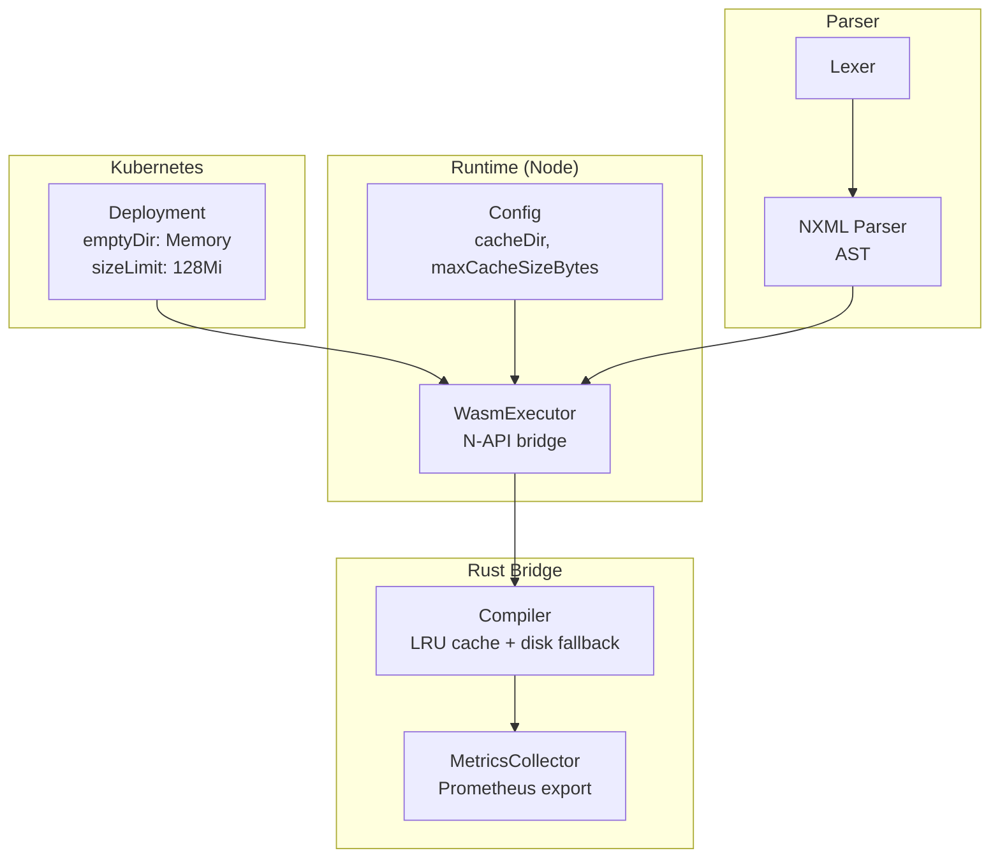
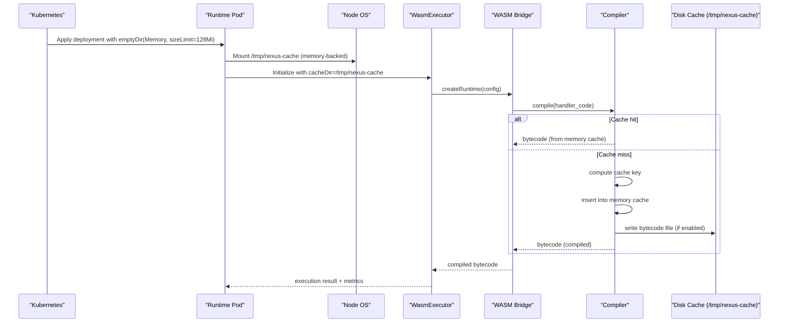
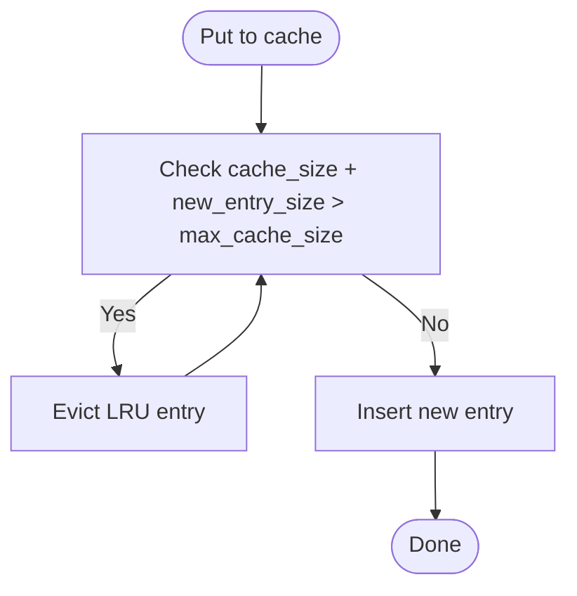
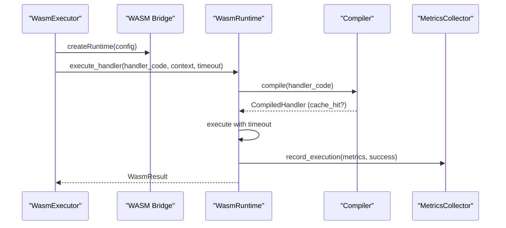
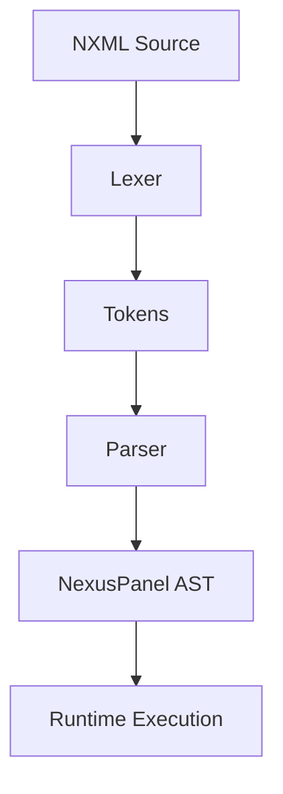
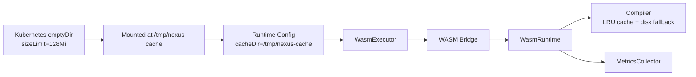

# Memory Volume Caching

<cite>
**Referenced Files in This Document**
- [deployment.yaml](file://runtime/k8s/deployment.yaml)
- [config.ts](file://runtime/workspace-kernel/src/config.ts)
- [executor.ts](file://runtime/workspace-kernel/src/executor.ts)
- [types.ts](file://runtime/workspace-kernel/src/types.ts)
- [index.ts](file://runtime/workspace-kernel/src/index.ts)
- [compiler.rs](file://runtime/nexus-wasm-bridge/src/engine/compiler.rs)
- [engine/mod.rs](file://runtime/nexus-wasm-bridge/src/engine/mod.rs)
- [metrics.rs](file://runtime/nexus-wasm-bridge/src/metrics.rs)
- [parser.ts](file://packages/nexus-reactor/src/parser/parser.ts)
- [lexer.ts](file://packages/nexus-reactor/src/parser/lexer.ts)
- [context.ts](file://packages/nexus-reactor/src/sandbox/context.ts)
- [02_runtime_spec.md](file://docs/02_runtime_spec.md)
- [03_state_engine_spec.md](file://docs/03_state_engine_spec.md)
</cite>

## Table of Contents
1. [Introduction](#introduction)
2. [Project Structure](#project-structure)
3. [Core Components](#core-components)
4. [Architecture Overview](#architecture-overview)
5. [Detailed Component Analysis](#detailed-component-analysis)
6. [Dependency Analysis](#dependency-analysis)
7. [Performance Considerations](#performance-considerations)
8. [Troubleshooting Guide](#troubleshooting-guide)
9. [Conclusion](#conclusion)
10. [Appendices](#appendices)

## Introduction
This document explains the memory volume caching strategy in Nexus, focusing on how Kubernetes emptyDir volumes with memory medium are used to provide high-performance temporary storage for runtime artifacts. It details the configuration of sizeLimit to 128Mi, how this caching layer supports transient data such as parsed NXML intermediates and execution context snapshots, and how it integrates with Kubernetes deployment specifications, resource limits, and ephemeral storage constraints. Monitoring recommendations and guidance for adjusting size limits based on panel complexity and concurrency are included, along with troubleshooting advice for cache exhaustion and performance degradation due to swapping.

## Project Structure
The memory caching strategy spans Kubernetes manifests, runtime configuration, and the WASM bridge that executes handlers and caches compiled bytecode. The key areas are:
- Kubernetes deployment manifest defines the emptyDir volume with memory medium and sizeLimit.
- Runtime configuration sets the cache directory and maximum cache size.
- The WASM bridge compiles and caches handler bytecode, with LRU eviction and disk fallback.
- Reactor parses NXML into an AST used by the state engine and runtime.

**Diagram sources**
- [deployment.yaml](file://runtime/k8s/deployment.yaml#L120-L134)
- [config.ts](file://runtime/workspace-kernel/src/config.ts#L1-L38)
- [executor.ts](file://runtime/workspace-kernel/src/executor.ts#L150-L210)
- [compiler.rs](file://runtime/nexus-wasm-bridge/src/engine/compiler.rs#L209-L296)
- [metrics.rs](file://runtime/nexus-wasm-bridge/src/metrics.rs#L151-L284)
- [parser.ts](file://packages/nexus-reactor/src/parser/parser.ts#L1-L120)
- [lexer.ts](file://packages/nexus-reactor/src/parser/lexer.ts#L1-L48)

**Section sources**
- [deployment.yaml](file://runtime/k8s/deployment.yaml#L120-L134)
- [config.ts](file://runtime/workspace-kernel/src/config.ts#L1-L38)
- [executor.ts](file://runtime/workspace-kernel/src/executor.ts#L150-L210)

## Core Components
- Kubernetes emptyDir with memory medium and sizeLimit:
  - Mounted at /tmp/nexus-cache inside the container.
  - Ensures high-speed temporary storage with in-memory backing.
  - sizeLimit prevents unbounded memory consumption by bounding the volume’s capacity.
- Runtime configuration:
  - cacheDir defaults to /tmp/nexus-cache.
  - maxCacheSizeBytes controls the upper bound for in-memory cache entries.
- WASM bridge compiler:
  - Maintains an in-memory cache keyed by source hash.
  - Evicts least-recently-used entries when exceeding max cache size.
  - Optionally persists bytecode to disk under the configured cacheDir for reuse across restarts.
- Reactor parser:
  - Produces an AST from NXML, enabling downstream mapping to state engine entities and runtime execution.

**Section sources**
- [deployment.yaml](file://runtime/k8s/deployment.yaml#L95-L100)
- [deployment.yaml](file://runtime/k8s/deployment.yaml#L120-L134)
- [config.ts](file://runtime/workspace-kernel/src/config.ts#L1-L38)
- [compiler.rs](file://runtime/nexus-wasm-bridge/src/engine/compiler.rs#L209-L296)
- [parser.ts](file://packages/nexus-reactor/src/parser/parser.ts#L1-L120)

## Architecture Overview
The memory volume caching strategy integrates at the intersection of Kubernetes storage, runtime configuration, and the WASM bridge’s caching layer.

**Diagram sources**
- [deployment.yaml](file://runtime/k8s/deployment.yaml#L120-L134)
- [executor.ts](file://runtime/workspace-kernel/src/executor.ts#L165-L187)
- [compiler.rs](file://runtime/nexus-wasm-bridge/src/engine/compiler.rs#L209-L296)

## Detailed Component Analysis

### Kubernetes emptyDir Memory Volume
- Purpose: Provide high-performance temporary storage for runtime artifacts.
- Configuration:
  - medium: Memory
  - sizeLimit: 128Mi
- Mount path: /tmp/nexus-cache
- Integration:
  - volumeMounts in the container spec mounts the volume at /tmp/nexus-cache.
  - volumes defines the emptyDir with memory medium and sizeLimit.
- Impact:
  - Prevents unbounded memory growth by bounding the volume capacity.
  - Improves I/O performance for frequent writes/reads of compiled bytecode and intermediate artifacts.

**Section sources**
- [deployment.yaml](file://runtime/k8s/deployment.yaml#L120-L134)

### Runtime Configuration and Cache Directory
- cacheDir:
  - Set to /tmp/nexus-cache to align with the Kubernetes mount path.
- maxCacheSizeBytes:
  - Controls the maximum size of the in-memory cache maintained by the WASM bridge.
  - Helps prevent excessive memory usage even if the underlying volume grows larger.

**Section sources**
- [config.ts](file://runtime/workspace-kernel/src/config.ts#L1-L38)
- [executor.ts](file://runtime/workspace-kernel/src/executor.ts#L165-L187)

### WASM Bridge Compiler and LRU Cache
- Compilation caching:
  - Computes a cache key from handler source and version.
  - Stores compiled bytecode in memory with access counters and timestamps.
- Eviction policy:
  - While adding a new entry exceeds max cache size, evicts least-recently-used entries until space is available.
- Disk fallback:
  - Optionally reads/writes bytecode files under cacheDir for persistence across restarts.

**Diagram sources**
- [compiler.rs](file://runtime/nexus-wasm-bridge/src/engine/compiler.rs#L249-L296)

**Section sources**
- [compiler.rs](file://runtime/nexus-wasm-bridge/src/engine/compiler.rs#L209-L296)

### Execution and Metrics Collection
- Execution flow:
  - WasmExecutor initializes the native runtime with cacheDir and other limits.
  - The Rust engine compiles handlers, executes them, and records metrics.
- Metrics:
  - Execution metrics include cacheHit flag, execution time, memory usage, and host calls.
  - Prometheus-compatible metrics are exported for monitoring.

**Diagram sources**
- [executor.ts](file://runtime/workspace-kernel/src/executor.ts#L165-L187)
- [engine/mod.rs](file://runtime/nexus-wasm-bridge/src/engine/mod.rs#L56-L116)
- [metrics.rs](file://runtime/nexus-wasm-bridge/src/metrics.rs#L151-L284)

**Section sources**
- [executor.ts](file://runtime/workspace-kernel/src/executor.ts#L165-L187)
- [engine/mod.rs](file://runtime/nexus-wasm-bridge/src/engine/mod.rs#L56-L116)
- [metrics.rs](file://runtime/nexus-wasm-bridge/src/metrics.rs#L151-L284)

### NXML Parsing and Transient Data
- NXML parsing produces an AST used by the state engine and runtime.
- Transient data such as parsed NXML intermediates and execution context snapshots can be stored in /tmp/nexus-cache to reduce repeated parsing overhead.
- The Reactor parser and lexer define tokenization and AST construction, which are foundational for runtime orchestration.

**Diagram sources**
- [parser.ts](file://packages/nexus-reactor/src/parser/parser.ts#L1-L120)
- [lexer.ts](file://packages/nexus-reactor/src/parser/lexer.ts#L1-L48)

**Section sources**
- [parser.ts](file://packages/nexus-reactor/src/parser/parser.ts#L1-L120)
- [lexer.ts](file://packages/nexus-reactor/src/parser/lexer.ts#L1-L48)
- [03_state_engine_spec.md](file://docs/03_state_engine_spec.md#L254-L293)

### Integration with Kubernetes Deployment Specifications
- Resources:
  - CPU and memory requests/limits are defined for the container.
  - These limits complement the memory volume caching by bounding overall memory usage.
- Probes and security:
  - Liveness and readiness probes ensure health checks.
  - SecurityContext restricts privileges and filesystem access.
- Affinity:
  - Pod anti-affinity spreads pods across nodes for resilience.

**Section sources**
- [deployment.yaml](file://runtime/k8s/deployment.yaml#L95-L119)
- [deployment.yaml](file://runtime/k8s/deployment.yaml#L135-L146)

## Dependency Analysis
The memory volume caching strategy depends on coordinated configuration across Kubernetes, runtime, and the WASM bridge.

**Diagram sources**
- [deployment.yaml](file://runtime/k8s/deployment.yaml#L120-L134)
- [config.ts](file://runtime/workspace-kernel/src/config.ts#L1-L38)
- [executor.ts](file://runtime/workspace-kernel/src/executor.ts#L165-L187)
- [engine/mod.rs](file://runtime/nexus-wasm-bridge/src/engine/mod.rs#L1-L60)
- [compiler.rs](file://runtime/nexus-wasm-bridge/src/engine/compiler.rs#L209-L296)
- [metrics.rs](file://runtime/nexus-wasm-bridge/src/metrics.rs#L151-L284)

**Section sources**
- [deployment.yaml](file://runtime/k8s/deployment.yaml#L120-L134)
- [config.ts](file://runtime/workspace-kernel/src/config.ts#L1-L38)
- [executor.ts](file://runtime/workspace-kernel/src/executor.ts#L165-L187)
- [engine/mod.rs](file://runtime/nexus-wasm-bridge/src/engine/mod.rs#L1-L60)
- [compiler.rs](file://runtime/nexus-wasm-bridge/src/engine/compiler.rs#L209-L296)
- [metrics.rs](file://runtime/nexus-wasm-bridge/src/metrics.rs#L151-L284)

## Performance Considerations
- Memory medium emptyDir ensures low-latency I/O for frequent cache writes and reads.
- sizeLimit of 128Mi caps the volume’s capacity, preventing memory pressure from runaway cache growth.
- maxCacheSizeBytes in runtime configuration bounds the in-memory cache, complementing the volume limit.
- Cache hit rate and execution metrics are exported for observability; monitor these to tune cache sizes and concurrency.
- Resource limits (CPU/memory) in the deployment help prevent swapping and ensure predictable performance.

[No sources needed since this section provides general guidance]

## Troubleshooting Guide
- Symptoms: Cache exhaustion errors or degraded performance.
  - Causes: Exceeding maxCacheSizeBytes or hitting the emptyDir sizeLimit.
  - Actions:
    - Increase maxCacheSizeBytes in runtime configuration.
    - Adjust sizeLimit in the Kubernetes deployment if appropriate.
    - Reduce concurrency (replicas or maxInstances) to lower memory pressure.
    - Monitor cache hit rate and eviction patterns via Prometheus metrics.
- Symptoms: Performance degradation due to swapping.
  - Causes: Memory limits exceeded by combined container memory plus cache usage.
  - Actions:
    - Raise container memory limits.
    - Reduce handler complexity or panel concurrency.
    - Ensure the memory volume remains the primary hot-path cache and avoid storing large persistent artifacts on it.
- Monitoring recommendations:
  - Track cache hit rate, eviction counts, and average execution time.
  - Observe memoryUsedBytes and memoryPeakBytes from execution metrics.
  - Use Prometheus metrics endpoint exposed by the runtime.

**Section sources**
- [metrics.rs](file://runtime/nexus-wasm-bridge/src/metrics.rs#L151-L284)
- [engine/mod.rs](file://runtime/nexus-wasm-bridge/src/engine/mod.rs#L56-L116)
- [compiler.rs](file://runtime/nexus-wasm-bridge/src/engine/compiler.rs#L249-L296)
- [deployment.yaml](file://runtime/k8s/deployment.yaml#L95-L119)

## Conclusion
The memory volume caching strategy in Nexus combines a Kubernetes emptyDir with memory medium and sizeLimit=128Mi with an in-memory cache in the WASM bridge. Together, they provide high-performance temporary storage for compiled bytecode and transient runtime artifacts. Proper configuration of cache sizes, resource limits, and monitoring enables reliable operation under varying panel complexity and concurrency levels.

[No sources needed since this section summarizes without analyzing specific files]

## Appendices

### Appendix A: Configuration Options and Defaults
- cacheDir: /tmp/nexus-cache (mounted from emptyDir)
- maxCacheSizeBytes: 64 MiB (default in runtime configuration)
- Kubernetes emptyDir sizeLimit: 128 MiB
- Container memory limits: 1 GiB (requests/limits in deployment)

**Section sources**
- [config.ts](file://runtime/workspace-kernel/src/config.ts#L1-L38)
- [deployment.yaml](file://runtime/k8s/deployment.yaml#L95-L119)
- [deployment.yaml](file://runtime/k8s/deployment.yaml#L120-L134)

### Appendix B: Monitoring Metrics
- Exported metrics include:
  - Total handler executions (success/error)
  - Cache hit rate
  - Average execution time
  - Peak memory usage
- Prometheus output is generated by the metrics collector.

**Section sources**
- [metrics.rs](file://runtime/nexus-wasm-bridge/src/metrics.rs#L285-L473)