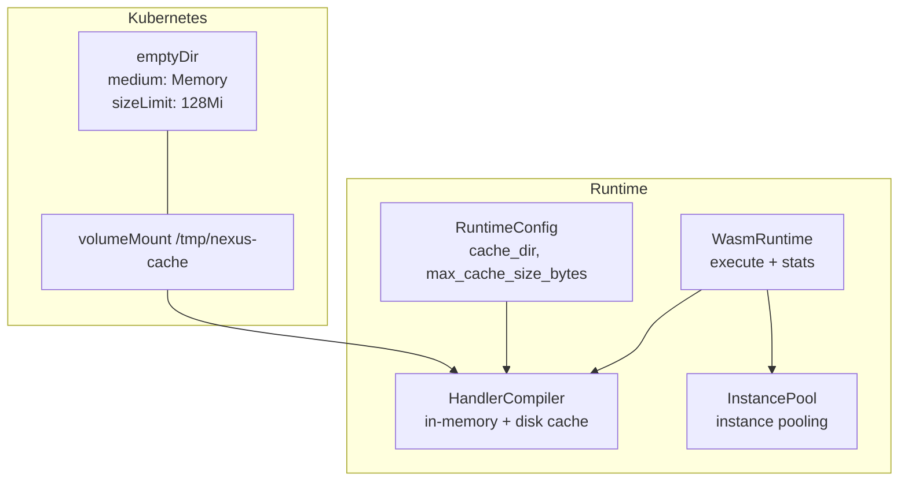
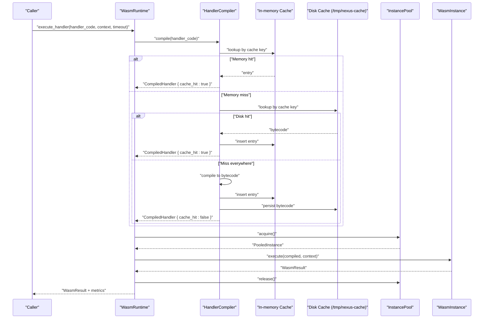
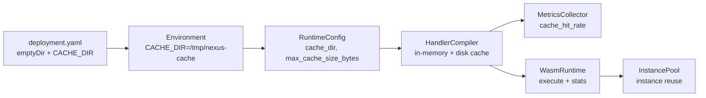

# Cache Memory Management

<cite>
**Referenced Files in This Document**
- [deployment.yaml](file://runtime/k8s/deployment.yaml)
- [config.rs](file://runtime/nexus-wasm-bridge/src/config.rs)
- [compiler.rs](file://runtime/nexus-wasm-bridge/src/engine/compiler.rs)
- [pool.rs](file://runtime/nexus-wasm-bridge/src/engine/pool.rs)
- [instance.rs](file://runtime/nexus-wasm-bridge/src/engine/instance.rs)
- [metrics.rs](file://runtime/nexus-wasm-bridge/src/metrics.rs)
- [mod.rs](file://runtime/nexus-wasm-bridge/src/engine/mod.rs)
- [config.ts](file://runtime/workspace-kernel/src/config.ts)
- [02_runtime_spec.md](file://docs/02_runtime_spec.md)
</cite>

## Table of Contents
1. [Introduction](#introduction)
2. [Project Structure](#project-structure)
3. [Core Components](#core-components)
4. [Architecture Overview](#architecture-overview)
5. [Detailed Component Analysis](#detailed-component-analysis)
6. [Dependency Analysis](#dependency-analysis)
7. [Performance Considerations](#performance-considerations)
8. [Troubleshooting Guide](#troubleshooting-guide)
9. [Conclusion](#conclusion)
10. [Appendices](#appendices)

## Introduction
This document explains the cache memory management strategy in the Nexus runtime. It focuses on how the system uses an in-memory temporary cache backed by a Kubernetes emptyDir volume with medium: Memory and sizeLimit: 128Mi to accelerate handler compilation. It also details how the compilation cache integrates with the WASM instance pool, how cache hit rates are measured, and how to size the cache volume based on expected handler diversity and execution frequency.

## Project Structure
The cache memory management spans several layers:
- Kubernetes deployment mounts an in-memory emptyDir volume at /tmp/nexus-cache and sets CACHE_DIR to that path.
- The runtime configuration exposes cache_dir and max_cache_size_bytes.
- The HandlerCompiler maintains an in-memory cache keyed by source hash and a disk cache under cache_dir.
- The WasmRuntime orchestrates compilation and instance acquisition, and exposes runtime statistics including cache hit rate.

**Diagram sources**
- [deployment.yaml](file://runtime/k8s/deployment.yaml#L120-L134)
- [config.rs](file://runtime/nexus-wasm-bridge/src/config.rs#L33-L86)
- [compiler.rs](file://runtime/nexus-wasm-bridge/src/engine/compiler.rs#L117-L166)
- [mod.rs](file://runtime/nexus-wasm-bridge/src/engine/mod.rs#L20-L53)
- [pool.rs](file://runtime/nexus-wasm-bridge/src/engine/pool.rs#L71-L116)

**Section sources**
- [deployment.yaml](file://runtime/k8s/deployment.yaml#L88-L134)
- [config.rs](file://runtime/nexus-wasm-bridge/src/config.rs#L33-L86)
- [compiler.rs](file://runtime/nexus-wasm-bridge/src/engine/compiler.rs#L117-L166)
- [mod.rs](file://runtime/nexus-wasm-bridge/src/engine/mod.rs#L20-L53)
- [pool.rs](file://runtime/nexus-wasm-bridge/src/engine/pool.rs#L71-L116)

## Core Components
- Kubernetes emptyDir volume: Provides a 128Mi RAM-backed temporary filesystem mounted at /tmp/nexus-cache. This is the backing store for the disk cache.
- Runtime configuration: Exposes cache_dir and max_cache_size_bytes to control where bytecode is stored and how large the in-memory cache can grow.
- HandlerCompiler: Implements in-memory LRU eviction and disk cache persistence. It computes a cache key from source plus a version tag and stores both bytecode and optional source maps.
- InstancePool: Manages WASM instance lifecycle and reuse, reducing cold-start overhead for handler execution.
- WasmRuntime: Coordinates compilation and execution, records metrics, and exposes runtime statistics including cache hit rate.

**Section sources**
- [deployment.yaml](file://runtime/k8s/deployment.yaml#L120-L134)
- [config.rs](file://runtime/nexus-wasm-bridge/src/config.rs#L33-L86)
- [compiler.rs](file://runtime/nexus-wasm-bridge/src/engine/compiler.rs#L85-L166)
- [pool.rs](file://runtime/nexus-wasm-bridge/src/engine/pool.rs#L51-L116)
- [mod.rs](file://runtime/nexus-wasm-bridge/src/engine/mod.rs#L20-L53)

## Architecture Overview
The compilation and execution pipeline integrates cache memory management as follows:
- On handler invocation, WasmRuntime compiles handler code via HandlerCompiler.
- HandlerCompiler first checks the in-memory cache keyed by a hash of the source plus a version tag. If not present, it checks the disk cache under cache_dir.
- On cache miss, the compiler compiles the handler, stores the result in both in-memory and disk caches, and returns the compiled bytecode.
- WasmRuntime acquires a pooled WASM instance, executes the compiled handler, and releases the instance back to the pool.
- Metrics are recorded and aggregated, including cache hit flags and cache hit rate.

**Diagram sources**
- [mod.rs](file://runtime/nexus-wasm-bridge/src/engine/mod.rs#L56-L109)
- [compiler.rs](file://runtime/nexus-wasm-bridge/src/engine/compiler.rs#L169-L214)
- [compiler.rs](file://runtime/nexus-wasm-bridge/src/engine/compiler.rs#L228-L318)
- [pool.rs](file://runtime/nexus-wasm-bridge/src/engine/pool.rs#L118-L171)
- [instance.rs](file://runtime/nexus-wasm-bridge/src/engine/instance.rs#L118-L211)

## Detailed Component Analysis

### Kubernetes emptyDir Volume and Disk Cache Mount
- The deployment defines an emptyDir volume with medium: Memory and sizeLimit: 128Mi, mounted at /tmp/nexus-cache.
- The container environment sets CACHE_DIR=/tmp/nexus-cache, aligning with the mount path.
- HandlerCompiler creates the cache_dir if it does not exist and writes bytecode files under cache_dir with a .qjsc extension.

Operational implications:
- The 128Mi limit bounds the total size of persisted bytecode on disk.
- If the in-memory cache grows beyond max_cache_size_bytes, LRU eviction removes entries to stay within budget.
- Disk cache persists across restarts and can serve as a warm-up layer for frequent handlers.

**Section sources**
- [deployment.yaml](file://runtime/k8s/deployment.yaml#L120-L134)
- [deployment.yaml](file://runtime/k8s/deployment.yaml#L95-L96)
- [compiler.rs](file://runtime/nexus-wasm-bridge/src/engine/compiler.rs#L137-L166)
- [compiler.rs](file://runtime/nexus-wasm-bridge/src/engine/compiler.rs#L293-L318)

### Runtime Configuration and Cache Controls
- RuntimeConfig exposes cache_dir and max_cache_size_bytes. The default cache_dir is a local path, while the deployment sets CACHE_DIR to /tmp/nexus-cache.
- Workspace kernel configuration also exposes cacheDir and maxCacheSizeBytes, allowing tuning from environment variables.

Key behaviors:
- max_cache_size_bytes controls the in-memory cache’s upper bound in bytes.
- cache_dir determines where bytecode is persisted on disk.

**Section sources**
- [config.rs](file://runtime/nexus-wasm-bridge/src/config.rs#L33-L86)
- [config.rs](file://runtime/nexus-wasm-bridge/src/config.rs#L258-L260)
- [config.ts](file://runtime/workspace-kernel/src/config.ts#L18-L25)
- [config.ts](file://runtime/workspace-kernel/src/config.ts#L105-L106)

### HandlerCompiler: In-Memory and Disk Caching
- In-memory cache: Hash-map keyed by cache key; entries include bytecode, optional source map, timestamps, access counters, and size. Uses an LRU eviction policy based on last_accessed.
- Disk cache: Persists bytecode under cache_dir with a .qjsc filename derived from the cache key.
- Cache key: Deterministic hash of the handler source plus a version tag to invalidate on upgrades.
- Statistics: Tracks cache_hits, cache_misses, total_compilations, and current cache_size_bytes.

Performance characteristics:
- Memory hits avoid compilation overhead and disk I/O.
- Disk hits promote bytecode to memory, reducing future misses.
- LRU eviction keeps memory bounded by max_cache_size_bytes.

**Section sources**
- [compiler.rs](file://runtime/nexus-wasm-bridge/src/engine/compiler.rs#L85-L115)
- [compiler.rs](file://runtime/nexus-wasm-bridge/src/engine/compiler.rs#L117-L166)
- [compiler.rs](file://runtime/nexus-wasm-bridge/src/engine/compiler.rs#L169-L214)
- [compiler.rs](file://runtime/nexus-wasm-bridge/src/engine/compiler.rs#L228-L318)
- [compiler.rs](file://runtime/nexus-wasm-bridge/src/engine/compiler.rs#L392-L424)

### InstancePool: WASM Instance Reuse
- Maintains a semaphore-limited pool of instances, with pre-warming support.
- LIFO queue for available instances improves cache locality.
- Tracks active_count, total_memory, and supports acquiring/releasing instances.

Interaction with cache:
- Faster compilation (cache hits) reduces the time spent in the compilation phase, enabling quicker instance acquisition and execution.

**Section sources**
- [pool.rs](file://runtime/nexus-wasm-bridge/src/engine/pool.rs#L51-L116)
- [pool.rs](file://runtime/nexus-wasm-bridge/src/engine/pool.rs#L118-L171)
- [pool.rs](file://runtime/nexus-wasm-bridge/src/engine/pool.rs#L173-L217)

### WasmRuntime: Orchestration and Metrics
- Executes handlers by compiling code, acquiring an instance, executing, and releasing the instance.
- Records ExecutionMetrics including cache_hit flag and compilation_time_us when applicable.
- Aggregates metrics via MetricsCollector and exposes runtime statistics including cache_hit_rate.

Cache hit rate calculation:
- Derived from total cache_hits and cache_misses across all executions.

**Section sources**
- [mod.rs](file://runtime/nexus-wasm-bridge/src/engine/mod.rs#L56-L109)
- [mod.rs](file://runtime/nexus-wasm-bridge/src/engine/mod.rs#L196-L206)
- [metrics.rs](file://runtime/nexus-wasm-bridge/src/metrics.rs#L137-L211)
- [metrics.rs](file://runtime/nexus-wasm-bridge/src/metrics.rs#L233-L243)

### Cache Interaction with WASM Instance Pool and Compilation
- When a handler is compiled and cached, subsequent invocations hit the in-memory cache, avoiding compilation and disk I/O.
- The instance pool ensures rapid reuse of instances, minimizing overhead after compilation.
- The combination yields lower latency for frequently executed handlers.

**Section sources**
- [compiler.rs](file://runtime/nexus-wasm-bridge/src/engine/compiler.rs#L169-L214)
- [pool.rs](file://runtime/nexus-wasm-bridge/src/engine/pool.rs#L118-L171)
- [mod.rs](file://runtime/nexus-wasm-bridge/src/engine/mod.rs#L56-L109)

### Cache Hit Rate Metrics via WasmRuntime.getStats()
- WasmRuntime.get_stats() returns RuntimeStats including cache_hit_rate, derived from MetricsCollector.cache_hit_rate().
- MetricsCollector aggregates cache_hit flags from ExecutionMetrics to compute the overall cache hit rate.

**Section sources**
- [mod.rs](file://runtime/nexus-wasm-bridge/src/engine/mod.rs#L196-L206)
- [metrics.rs](file://runtime/nexus-wasm-bridge/src/metrics.rs#L137-L211)
- [metrics.rs](file://runtime/nexus-wasm-bridge/src/metrics.rs#L233-L243)

### Sizing Guidance for the Cache Volume
- The Kubernetes emptyDir volume is 128Mi. This constrains the total size of persisted bytecode on disk.
- The in-memory cache is bounded by max_cache_size_bytes (default 64Mi in workspace-kernel config).
- Practical sizing strategy:
  - Estimate handler diversity: number of distinct handler sources.
  - Estimate average bytecode size per handler (empirical).
  - Multiply diversity × average size to estimate disk cache usage.
  - Ensure 128Mi emptyDir can accommodate expected disk cache growth.
  - Tune max_cache_size_bytes to balance memory footprint vs. cache hit rate.

[No sources needed since this section provides general guidance]

## Dependency Analysis
The cache memory management depends on:
- Kubernetes deployment mounting the emptyDir volume at /tmp/nexus-cache.
- Environment variable CACHE_DIR pointing to /tmp/nexus-cache.
- Runtime configuration specifying cache_dir and max_cache_size_bytes.
- HandlerCompiler managing in-memory and disk caches.
- MetricsCollector aggregating cache_hit flags for cache hit rate computation.

**Diagram sources**
- [deployment.yaml](file://runtime/k8s/deployment.yaml#L95-L96)
- [deployment.yaml](file://runtime/k8s/deployment.yaml#L120-L134)
- [config.rs](file://runtime/nexus-wasm-bridge/src/config.rs#L33-L86)
- [compiler.rs](file://runtime/nexus-wasm-bridge/src/engine/compiler.rs#L117-L166)
- [metrics.rs](file://runtime/nexus-wasm-bridge/src/metrics.rs#L137-L211)
- [mod.rs](file://runtime/nexus-wasm-bridge/src/engine/mod.rs#L196-L206)
- [pool.rs](file://runtime/nexus-wasm-bridge/src/engine/pool.rs#L71-L116)

**Section sources**
- [deployment.yaml](file://runtime/k8s/deployment.yaml#L95-L96)
- [deployment.yaml](file://runtime/k8s/deployment.yaml#L120-L134)
- [config.rs](file://runtime/nexus-wasm-bridge/src/config.rs#L33-L86)
- [compiler.rs](file://runtime/nexus-wasm-bridge/src/engine/compiler.rs#L117-L166)
- [metrics.rs](file://runtime/nexus-wasm-bridge/src/metrics.rs#L137-L211)
- [mod.rs](file://runtime/nexus-wasm-bridge/src/engine/mod.rs#L196-L206)
- [pool.rs](file://runtime/nexus-wasm-bridge/src/engine/pool.rs#L71-L116)

## Performance Considerations
- In-memory cache hits eliminate compilation and disk I/O, reducing latency for frequently executed handlers.
- LRU eviction prevents unbounded memory growth; tune max_cache_size_bytes to balance hit rate and memory footprint.
- The 128Mi emptyDir volume caps disk cache growth; monitor cache hit rate and adjust handler diversity expectations accordingly.
- Instance pooling reduces cold-start overhead, complementing compilation caching.

[No sources needed since this section provides general guidance]

## Troubleshooting Guide
- Low cache hit rate:
  - Verify cache_dir is set to /tmp/nexus-cache and the emptyDir volume is mounted.
  - Confirm max_cache_size_bytes is sufficiently large for your workload.
  - Check that handlers are stable and not changing frequently (version tag invalidates cache).
- Disk cache not persisting:
  - Ensure cache_dir exists and is writable.
  - Confirm the .qjsc files are being written under cache_dir.
- Memory pressure:
  - Reduce max_cache_size_bytes or increase container memory limits.
  - Monitor total_memory_bytes from WasmRuntime.get_stats() to assess instance memory usage.

**Section sources**
- [deployment.yaml](file://runtime/k8s/deployment.yaml#L120-L134)
- [compiler.rs](file://runtime/nexus-wasm-bridge/src/engine/compiler.rs#L137-L166)
- [compiler.rs](file://runtime/nexus-wasm-bridge/src/engine/compiler.rs#L293-L318)
- [mod.rs](file://runtime/nexus-wasm-bridge/src/engine/mod.rs#L196-L206)

## Conclusion
The Nexus runtime employs a layered caching strategy: an in-memory LRU cache for fast compilation reuse and a disk cache persisted under a 128Mi RAM-backed emptyDir volume. Together with instance pooling, this design minimizes compilation overhead and reduces handler execution latency for frequently invoked handlers. Cache hit rate metrics are available via WasmRuntime.get_stats(), enabling operational monitoring and tuning. Proper sizing of both in-memory and disk caches, aligned with handler diversity and execution frequency, ensures optimal performance and predictable memory footprint.

## Appendices

### Appendix A: How enableAOT and cacheDir Work Together
- The repository’s configuration and deployment define cache_dir and max_cache_size_bytes, and the HandlerCompiler persists bytecode to disk under cache_dir.
- The runtime specification describes a cache directory structure with bytecode and source-maps subdirectories, and a compilation API that reads from cache and writes to cache.
- While enableAOT is not explicitly referenced in the current code, the described cache directory structure and compilation API indicate a mechanism for persisting compiled bytecode to disk, which is conceptually aligned with AOT-style caching.

**Section sources**
- [config.rs](file://runtime/nexus-wasm-bridge/src/config.rs#L61-L67)
- [config.ts](file://runtime/workspace-kernel/src/config.ts#L18-L25)
- [compiler.rs](file://runtime/nexus-wasm-bridge/src/engine/compiler.rs#L137-L166)
- [compiler.rs](file://runtime/nexus-wasm-bridge/src/engine/compiler.rs#L293-L318)
- [02_runtime_spec.md](file://docs/02_runtime_spec.md#L1173-L1228)