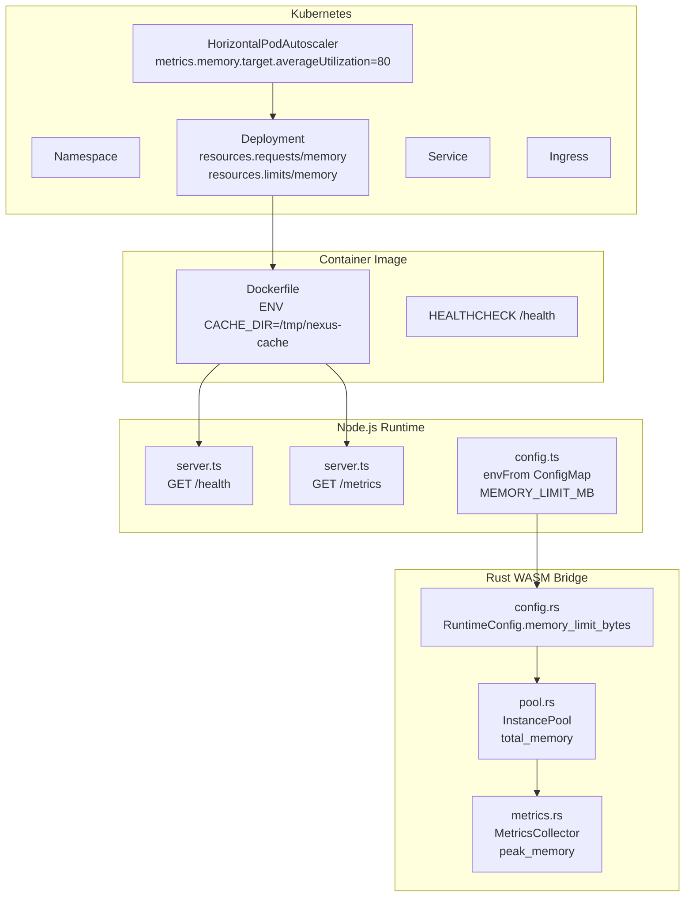
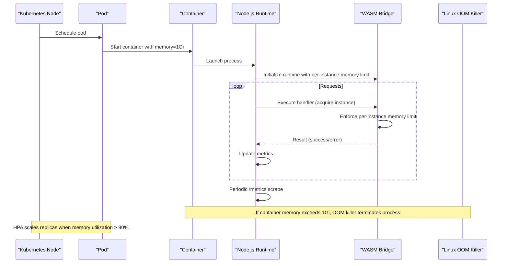
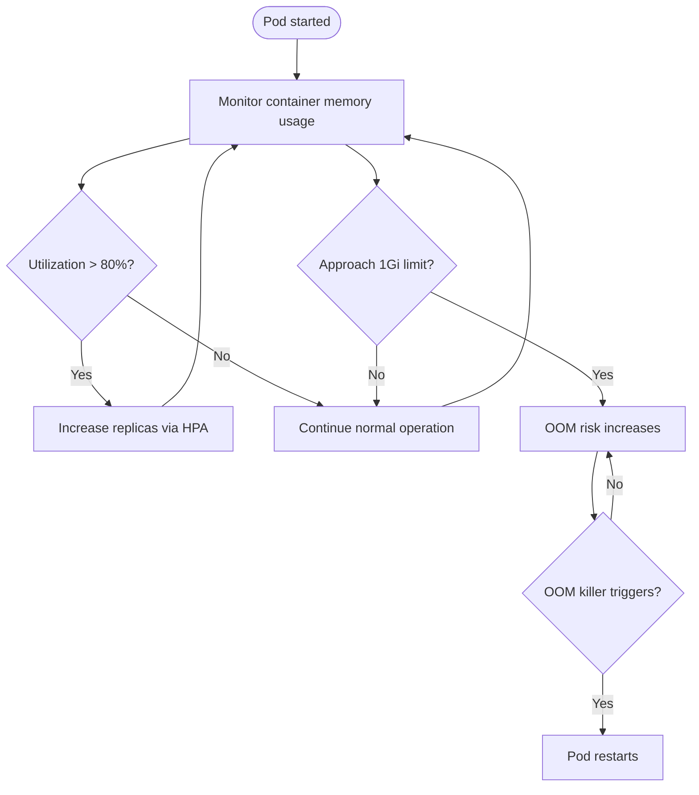
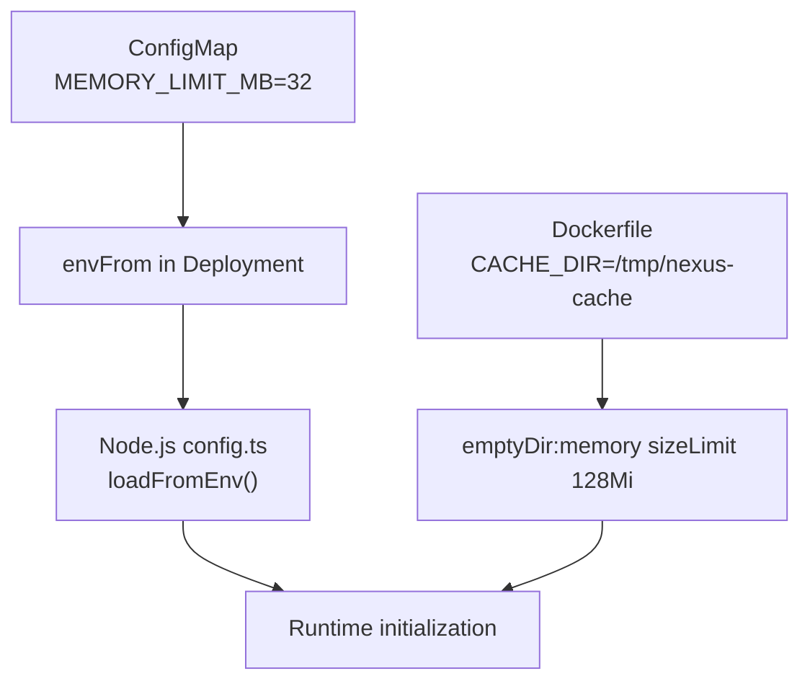
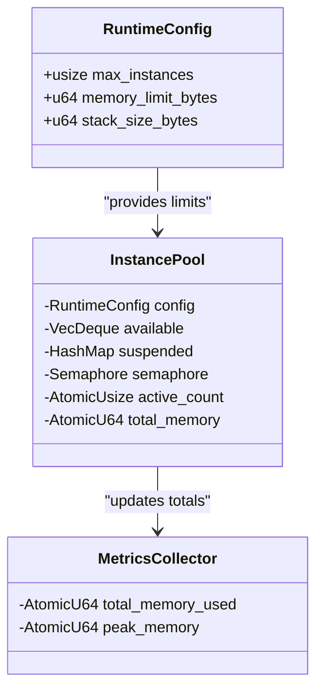
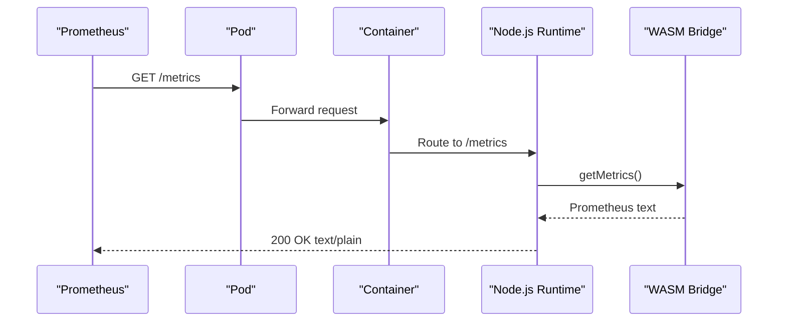
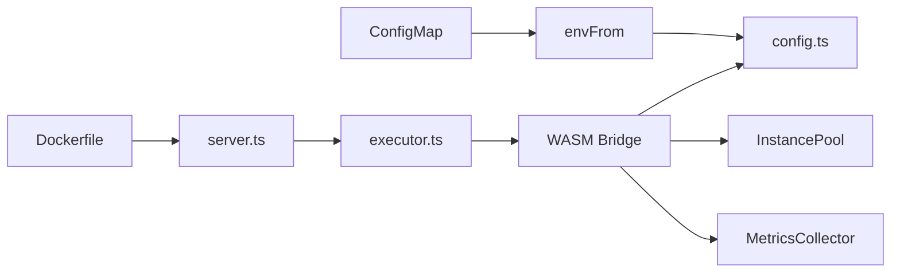

# Container Memory Configuration

<cite>
**Referenced Files in This Document**
- [deployment.yaml](file://runtime/k8s/deployment.yaml)
- [Dockerfile](file://runtime/images/Dockerfile)
- [config.ts](file://runtime/workspace-kernel/src/config.ts)
- [config.rs](file://runtime/nexus-wasm-bridge/src/config.rs)
- [pool.rs](file://runtime/nexus-wasm-bridge/src/engine/pool.rs)
- [mod.rs](file://runtime/nexus-wasm-bridge/src/engine/mod.rs)
- [metrics.rs](file://runtime/nexus-wasm-bridge/src/metrics.rs)
- [server.ts](file://runtime/workspace-kernel/src/server.ts)
- [executor.ts](file://runtime/workspace-kernel/src/executor.ts)
- [types.ts](file://runtime/workspace-kernel/src/types.ts)
</cite>

## Table of Contents
1. [Introduction](#introduction)
2. [Project Structure](#project-structure)
3. [Core Components](#core-components)
4. [Architecture Overview](#architecture-overview)
5. [Detailed Component Analysis](#detailed-component-analysis)
6. [Dependency Analysis](#dependency-analysis)
7. [Performance Considerations](#performance-considerations)
8. [Troubleshooting Guide](#troubleshooting-guide)
9. [Conclusion](#conclusion)
10. [Appendices](#appendices)

## Introduction
This document explains the container-level memory configuration in the Nexus runtime, focusing on how Kubernetes resource requests and limits are defined in the deployment manifest and how they interact with the underlying node resources. It also details how the container memory limits act as a safety boundary for the entire runtime process, including pooled WASM instances and Node.js overhead. The document covers the role of the HorizontalPodAutoscaler in scaling based on memory utilization (80% target) and how this complements per-instance WASM limits. Monitoring and alerting considerations for container memory usage are included, along with tuning recommendations based on workload patterns.

## Project Structure
The memory configuration spans multiple layers:
- Kubernetes manifests define container resource requests and limits, probes, and autoscaling targets.
- The Node.js runtime reads configuration from environment variables and exposes health and metrics endpoints.
- The Rust WASM bridge enforces per-instance memory limits and tracks total memory usage across the pool.
- The Dockerfile sets the runtime environment and exposes health checks.

**Diagram sources**
- [deployment.yaml](file://runtime/k8s/deployment.yaml#L97-L103)
- [deployment.yaml](file://runtime/k8s/deployment.yaml#L208-L233)
- [Dockerfile](file://runtime/images/Dockerfile#L86-L102)
- [server.ts](file://runtime/workspace-kernel/src/server.ts#L134-L139)
- [config.ts](file://runtime/workspace-kernel/src/config.ts#L76-L123)
- [config.rs](file://runtime/nexus-wasm-bridge/src/config.rs#L33-L88)
- [pool.rs](file://runtime/nexus-wasm-bridge/src/engine/pool.rs#L50-L95)
- [metrics.rs](file://runtime/nexus-wasm-bridge/src/metrics.rs#L137-L210)

**Section sources**
- [deployment.yaml](file://runtime/k8s/deployment.yaml#L97-L103)
- [Dockerfile](file://runtime/images/Dockerfile#L86-L102)
- [server.ts](file://runtime/workspace-kernel/src/server.ts#L134-L139)
- [config.ts](file://runtime/workspace-kernel/src/config.ts#L76-L123)
- [config.rs](file://runtime/nexus-wasm-bridge/src/config.rs#L33-L88)
- [pool.rs](file://runtime/nexus-wasm-bridge/src/engine/pool.rs#L50-L95)
- [metrics.rs](file://runtime/nexus-wasm-bridge/src/metrics.rs#L137-L210)

## Core Components
- Kubernetes Deployment resource settings:
  - Container memory requests: 256Mi
  - Container memory limits: 1Gi
- Kubernetes HPA targeting memory utilization at 80%
- Node.js runtime configuration:
  - Reads MEMORY_LIMIT_MB from ConfigMap via envFrom
  - Exposes /health and /metrics endpoints
- Rust WASM bridge:
  - Per-instance memory limit defaults to 32 MiB
  - Tracks total memory across pooled instances
  - Exposes Prometheus-formatted metrics

These components collectively define a layered memory safety model: container-level limits bound the total memory footprint, per-instance limits bound individual WASM execution memory, and autoscaling reacts to memory pressure.

**Section sources**
- [deployment.yaml](file://runtime/k8s/deployment.yaml#L97-L103)
- [deployment.yaml](file://runtime/k8s/deployment.yaml#L208-L233)
- [config.ts](file://runtime/workspace-kernel/src/config.ts#L76-L123)
- [config.rs](file://runtime/nexus-wasm-bridge/src/config.rs#L33-L88)
- [pool.rs](file://runtime/nexus-wasm-bridge/src/engine/pool.rs#L50-L95)
- [metrics.rs](file://runtime/nexus-wasm-bridge/src/metrics.rs#L137-L210)

## Architecture Overview
The memory safety architecture operates across three layers:
- Container layer: Kubernetes enforces hard memory limits and autoscales pods based on memory utilization.
- Process layer: Node.js runtime and WASM bridge enforce per-instance memory limits and track total memory usage.
- Observability layer: Health and metrics endpoints expose runtime status and Prometheus metrics.

**Diagram sources**
- [deployment.yaml](file://runtime/k8s/deployment.yaml#L97-L103)
- [deployment.yaml](file://runtime/k8s/deployment.yaml#L208-L233)
- [server.ts](file://runtime/workspace-kernel/src/server.ts#L134-L139)
- [config.rs](file://runtime/nexus-wasm-bridge/src/config.rs#L33-L88)
- [pool.rs](file://runtime/nexus-wasm-bridge/src/engine/pool.rs#L118-L171)
- [metrics.rs](file://runtime/nexus-wasm-bridge/src/metrics.rs#L284-L339)

## Detailed Component Analysis

### Kubernetes Container Memory Limits and Autoscaling
- Container memory requests: 256Mi
- Container memory limits: 1Gi
- HPA memory target: 80% average utilization across pods
- Interaction with node resources:
  - The container’s memory limit acts as a hard boundary enforced by the Linux kernel and cgroups.
  - If the combined memory of the Node.js process and WASM instances approaches 1Gi, the container is subject to memory pressure and potential termination by the OOM killer.
  - HPA monitors memory utilization across pods and scales replicas to keep utilization below the 80% target.

**Diagram sources**
- [deployment.yaml](file://runtime/k8s/deployment.yaml#L208-L233)
- [deployment.yaml](file://runtime/k8s/deployment.yaml#L97-L103)

**Section sources**
- [deployment.yaml](file://runtime/k8s/deployment.yaml#L97-L103)
- [deployment.yaml](file://runtime/k8s/deployment.yaml#L208-L233)

### Node.js Runtime Memory Configuration
- The ConfigMap sets MEMORY_LIMIT_MB to 32, which is read by the Node.js runtime via envFrom.
- The runtime loads configuration from environment variables and validates minimum memory limits.
- The Dockerfile sets CACHE_DIR to /tmp/nexus-cache, which is mounted as an in-memory emptyDir with a size limit.

**Diagram sources**
- [deployment.yaml](file://runtime/k8s/deployment.yaml#L11-L26)
- [deployment.yaml](file://runtime/k8s/deployment.yaml#L120-L133)
- [config.ts](file://runtime/workspace-kernel/src/config.ts#L76-L123)
- [Dockerfile](file://runtime/images/Dockerfile#L80-L83)

**Section sources**
- [deployment.yaml](file://runtime/k8s/deployment.yaml#L11-L26)
- [deployment.yaml](file://runtime/k8s/deployment.yaml#L120-L133)
- [config.ts](file://runtime/workspace-kernel/src/config.ts#L76-L123)
- [Dockerfile](file://runtime/images/Dockerfile#L80-L83)

### WASM Instance Pool Memory Safety
- Per-instance memory limit defaults to 32 MiB in the Rust bridge configuration.
- The instance pool tracks total memory used across all instances and enforces concurrency via a semaphore equal to max_instances.
- The runtime exposes total memory usage via metrics and health endpoints.

**Diagram sources**
- [config.rs](file://runtime/nexus-wasm-bridge/src/config.rs#L33-L88)
- [pool.rs](file://runtime/nexus-wasm-bridge/src/engine/pool.rs#L50-L95)
- [metrics.rs](file://runtime/nexus-wasm-bridge/src/metrics.rs#L137-L210)

**Section sources**
- [config.rs](file://runtime/nexus-wasm-bridge/src/config.rs#L33-L88)
- [pool.rs](file://runtime/nexus-wasm-bridge/src/engine/pool.rs#L118-L171)
- [metrics.rs](file://runtime/nexus-wasm-bridge/src/metrics.rs#L137-L210)

### Health and Metrics Endpoints
- The Node.js server exposes:
  - GET /health: returns runtime status including active/available instances and total memory bytes.
  - GET /metrics: returns Prometheus-formatted metrics exported by the runtime.
- The Dockerfile defines a HEALTHCHECK against /health.

**Diagram sources**
- [server.ts](file://runtime/workspace-kernel/src/server.ts#L134-L139)
- [server.ts](file://runtime/workspace-kernel/src/server.ts#L504-L508)
- [Dockerfile](file://runtime/images/Dockerfile#L98-L100)
- [executor.ts](file://runtime/workspace-kernel/src/executor.ts#L329-L338)

**Section sources**
- [server.ts](file://runtime/workspace-kernel/src/server.ts#L134-L139)
- [server.ts](file://runtime/workspace-kernel/src/server.ts#L485-L502)
- [server.ts](file://runtime/workspace-kernel/src/server.ts#L504-L508)
- [Dockerfile](file://runtime/images/Dockerfile#L98-L100)
- [executor.ts](file://runtime/workspace-kernel/src/executor.ts#L329-L338)
- [types.ts](file://runtime/workspace-kernel/src/types.ts#L252-L303)

## Dependency Analysis
- Kubernetes Deployment depends on:
  - ConfigMap for environment variables (including MEMORY_LIMIT_MB).
  - Docker image built with Node.js and the WASM bridge native module.
- Node.js runtime depends on:
  - ConfigMap values for memory limits and cache directory.
  - WASM bridge for execution and metrics.
- WASM bridge depends on:
  - RuntimeConfig for per-instance memory limits.
  - InstancePool for concurrency and memory accounting.
  - MetricsCollector for aggregated metrics.

**Diagram sources**
- [deployment.yaml](file://runtime/k8s/deployment.yaml#L11-L26)
- [deployment.yaml](file://runtime/k8s/deployment.yaml#L68-L103)
- [config.ts](file://runtime/workspace-kernel/src/config.ts#L76-L123)
- [server.ts](file://runtime/workspace-kernel/src/server.ts#L134-L139)
- [executor.ts](file://runtime/workspace-kernel/src/executor.ts#L329-L338)
- [config.rs](file://runtime/nexus-wasm-bridge/src/config.rs#L33-L88)
- [pool.rs](file://runtime/nexus-wasm-bridge/src/engine/pool.rs#L50-L95)
- [metrics.rs](file://runtime/nexus-wasm-bridge/src/metrics.rs#L137-L210)

**Section sources**
- [deployment.yaml](file://runtime/k8s/deployment.yaml#L11-L26)
- [deployment.yaml](file://runtime/k8s/deployment.yaml#L68-L103)
- [config.ts](file://runtime/workspace-kernel/src/config.ts#L76-L123)
- [server.ts](file://runtime/workspace-kernel/src/server.ts#L134-L139)
- [executor.ts](file://runtime/workspace-kernel/src/executor.ts#L329-L338)
- [config.rs](file://runtime/nexus-wasm-bridge/src/config.rs#L33-L88)
- [pool.rs](file://runtime/nexus-wasm-bridge/src/engine/pool.rs#L50-L95)
- [metrics.rs](file://runtime/nexus-wasm-bridge/src/metrics.rs#L137-L210)

## Performance Considerations
- Container memory limits as a safety boundary:
  - The 1Gi limit bounds the total memory footprint of the Node.js process and all WASM instances. When approaching this limit, the container becomes vulnerable to OOM killer termination.
- Per-instance WASM limits:
  - The default per-instance memory limit is 32 MiB. This prevents any single execution from consuming excessive memory and helps maintain stability across pooled instances.
- Autoscaling and memory utilization:
  - HPA targets 80% average memory utilization. This provides headroom to prevent pods from reaching the 1Gi limit while still maintaining efficient resource usage.
- Cache and memory overhead:
  - The cache directory is mounted as an in-memory emptyDir with a size limit. This reduces disk I/O but consumes additional memory; tune cache size and memory limits accordingly.

[No sources needed since this section provides general guidance]

## Troubleshooting Guide
- Symptoms of memory pressure:
  - Frequent pod restarts or crashes around the 1Gi boundary.
  - HPA increasing replicas rapidly due to sustained memory utilization near 80%.
  - Health endpoint reports high total memory usage or degraded status.
- Monitoring and alerts:
  - Scrape /metrics for Prometheus metrics including peak memory and handler execution counters.
  - Alert thresholds:
    - Container memory utilization > 70% for sustained periods.
    - HPA replica count > configured max for extended durations.
    - Health endpoint status not healthy.
- Tuning recommendations:
  - Increase container memory limits cautiously if workloads consistently approach 1Gi and HPA is not scaling fast enough.
  - Reduce per-instance memory limits if handlers are memory-heavy; lower the default 32 MiB to constrain growth.
  - Adjust HPA memory target to a safer threshold (e.g., 75%) if frequent autoscaling is causing instability.
  - Optimize handler code to reduce memory usage and leverage compilation caching to minimize peak memory.

**Section sources**
- [server.ts](file://runtime/workspace-kernel/src/server.ts#L485-L502)
- [metrics.rs](file://runtime/nexus-wasm-bridge/src/metrics.rs#L284-L339)
- [deployment.yaml](file://runtime/k8s/deployment.yaml#L208-L233)

## Conclusion
The Nexus runtime employs a layered memory safety model: Kubernetes container limits (1Gi) protect the host node, per-instance WASM limits (default 32 MiB) constrain individual executions, and HPA scales replicas based on memory utilization (80% target). Together, these controls provide predictable resource behavior, early warning signals, and operational flexibility. Monitoring and tuning should focus on balancing container limits, per-instance constraints, and autoscaling targets to maintain stability under varying workloads.

[No sources needed since this section summarizes without analyzing specific files]

## Appendices

### Appendix A: Configuration Reference
- Kubernetes Deployment:
  - resources.requests.memory: 256Mi
  - resources.limits.memory: 1Gi
  - HorizontalPodAutoscaler memory target: 80%
- Node.js Runtime:
  - MEMORY_LIMIT_MB: 32 (from ConfigMap)
  - CACHE_DIR: /tmp/nexus-cache (mounted as in-memory emptyDir)
- WASM Bridge:
  - Default per-instance memory_limit_bytes: 32 MiB
  - Tracks total_memory across pooled instances

**Section sources**
- [deployment.yaml](file://runtime/k8s/deployment.yaml#L97-L103)
- [deployment.yaml](file://runtime/k8s/deployment.yaml#L208-L233)
- [deployment.yaml](file://runtime/k8s/deployment.yaml#L120-L133)
- [config.ts](file://runtime/workspace-kernel/src/config.ts#L76-L123)
- [config.rs](file://runtime/nexus-wasm-bridge/src/config.rs#L33-L88)
- [pool.rs](file://runtime/nexus-wasm-bridge/src/engine/pool.rs#L235-L260)