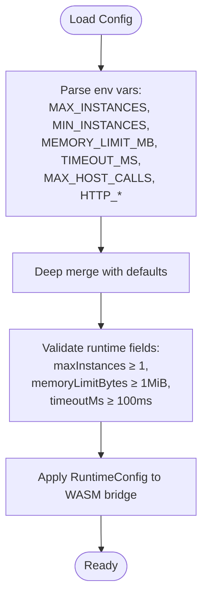

# Memory Management

<cite>
**Referenced Files in This Document**
- [deployment.yaml](file://runtime/k8s/deployment.yaml)
- [config.rs](file://runtime/nexus-wasm-bridge/src/config.rs)
- [config.ts](file://runtime/workspace-kernel/src/config.ts)
- [pool.rs](file://runtime/nexus-wasm-bridge/src/engine/pool.rs)
- [instance.rs](file://runtime/nexus-wasm-bridge/src/engine/instance.rs)
- [metrics.rs](file://runtime/nexus-wasm-bridge/src/metrics.rs)
- [server.ts](file://runtime/workspace-kernel/src/server.ts)
- [Dockerfile](file://runtime/images/Dockerfile)
- [README.md](file://runtime/README.md)
</cite>

## Table of Contents
1. [Introduction](#introduction)
2. [Project Structure](#project-structure)
3. [Core Components](#core-components)
4. [Architecture Overview](#architecture-overview)
5. [Detailed Component Analysis](#detailed-component-analysis)
6. [Dependency Analysis](#dependency-analysis)
7. [Performance Considerations](#performance-considerations)
8. [Troubleshooting Guide](#troubleshooting-guide)
9. [Conclusion](#conclusion)

## Introduction
This document explains Nexus memory management across three layers:
- Per-instance memory limits configured via the RuntimeConfig interface with memoryLimitBytes.
- Container-level memory constraints defined in Kubernetes with requests and limits.
- Instance pooling to optimize memory and CPU utilization by reusing WASM instances.
- Temporary cache storage using an emptyDir volume with memory medium and a size limit.
- Monitoring memory usage through Prometheus metrics and guidelines for tuning based on workload characteristics.

## Project Structure
The memory management architecture spans the Node.js workspace-kernel and the Rust nexus-wasm-bridge:
- Kubernetes deployment defines container memory requests/limits and an emptyDir cache volume.
- Workspace kernel loads configuration from environment variables and exposes metrics.
- The WASM bridge enforces per-instance memory limits and tracks memory usage.
- Metrics are aggregated and exported in Prometheus format.

**Diagram sources**
- [deployment.yaml](file://runtime/k8s/deployment.yaml#L97-L104)
- [deployment.yaml](file://runtime/k8s/deployment.yaml#L130-L134)
- [config.rs](file://runtime/nexus-wasm-bridge/src/config.rs#L33-L88)
- [pool.rs](file://runtime/nexus-wasm-bridge/src/engine/pool.rs#L50-L116)
- [instance.rs](file://runtime/nexus-wasm-bridge/src/engine/instance.rs#L34-L116)
- [metrics.rs](file://runtime/nexus-wasm-bridge/src/metrics.rs#L284-L339)
- [server.ts](file://runtime/workspace-kernel/src/server.ts#L504-L508)

**Section sources**
- [deployment.yaml](file://runtime/k8s/deployment.yaml#L97-L104)
- [deployment.yaml](file://runtime/k8s/deployment.yaml#L130-L134)
- [config.rs](file://runtime/nexus-wasm-bridge/src/config.rs#L33-L88)
- [config.ts](file://runtime/workspace-kernel/src/config.ts#L17-L37)
- [server.ts](file://runtime/workspace-kernel/src/server.ts#L504-L508)
- [README.md](file://runtime/README.md#L100-L114)

## Core Components
- RuntimeConfig memoryLimitBytes: Defines per-instance memory budget in bytes. Defaults to 32 MiB and validates a minimum threshold.
- InstancePool: Manages a bounded set of reusable WasmInstance objects with a semaphore limiting concurrency and tracking total memory usage.
- WasmInstance: Tracks memory_used and memory_peak per instance and resets or terminates instances for reuse.
- MetricsCollector: Aggregates execution metrics including peak memory and exports Prometheus-formatted metrics.
- Kubernetes Deployment: Sets container memory requests and limits, and mounts an emptyDir with memory medium and sizeLimit.

**Section sources**
- [config.rs](file://runtime/nexus-wasm-bridge/src/config.rs#L33-L88)
- [config.rs](file://runtime/nexus-wasm-bridge/src/config.rs#L145-L169)
- [pool.rs](file://runtime/nexus-wasm-bridge/src/engine/pool.rs#L50-L116)
- [pool.rs](file://runtime/nexus-wasm-bridge/src/engine/pool.rs#L118-L217)
- [instance.rs](file://runtime/nexus-wasm-bridge/src/engine/instance.rs#L34-L116)
- [metrics.rs](file://runtime/nexus-wasm-bridge/src/metrics.rs#L137-L211)
- [metrics.rs](file://runtime/nexus-wasm-bridge/src/metrics.rs#L284-L339)
- [deployment.yaml](file://runtime/k8s/deployment.yaml#L97-L104)
- [deployment.yaml](file://runtime/k8s/deployment.yaml#L130-L134)

## Architecture Overview
The memory management architecture enforces layered limits:
- Per-instance limit via RuntimeConfig.memoryLimitBytes.
- Pool-level concurrency via InstancePool semaphore.
- Container-level memory via Kubernetes requests/limits.
- Temporary cache storage via emptyDir with memory medium and sizeLimit.

**Diagram sources**
- [server.ts](file://runtime/workspace-kernel/src/server.ts#L579-L642)
- [pool.rs](file://runtime/nexus-wasm-bridge/src/engine/pool.rs#L118-L217)
- [instance.rs](file://runtime/nexus-wasm-bridge/src/engine/instance.rs#L118-L211)
- [metrics.rs](file://runtime/nexus-wasm-bridge/src/metrics.rs#L137-L211)

## Detailed Component Analysis

### Per-instance memory limits via RuntimeConfig
- memoryLimitBytes default is 32 MiB and validated to be at least 1 MiB.
- ResourceLimits mirrors memoryLimitBytes for enforcement boundaries.
- These values are loaded from environment variables in workspace-kernel and merged into the final configuration.

**Diagram sources**
- [config.ts](file://runtime/workspace-kernel/src/config.ts#L76-L123)
- [config.ts](file://runtime/workspace-kernel/src/config.ts#L150-L200)
- [config.rs](file://runtime/nexus-wasm-bridge/src/config.rs#L145-L169)

**Section sources**
- [config.rs](file://runtime/nexus-wasm-bridge/src/config.rs#L33-L88)
- [config.rs](file://runtime/nexus-wasm-bridge/src/config.rs#L145-L169)
- [config.ts](file://runtime/workspace-kernel/src/config.ts#L17-L37)
- [config.ts](file://runtime/workspace-kernel/src/config.ts#L76-L123)
- [config.ts](file://runtime/workspace-kernel/src/config.ts#L150-L200)

### Container-level memory constraints in Kubernetes
- Container memory requests: 256 MiB; limits: 1 Gi.
- Prometheus scraping is enabled on port 3000 at path /metrics.
- emptyDir volume mounted at /tmp/nexus-cache with medium: Memory and sizeLimit: 128 Mi.

**Diagram sources**
- [deployment.yaml](file://runtime/k8s/deployment.yaml#L97-L104)
- [deployment.yaml](file://runtime/k8s/deployment.yaml#L104-L119)
- [deployment.yaml](file://runtime/k8s/deployment.yaml#L120-L123)
- [deployment.yaml](file://runtime/k8s/deployment.yaml#L130-L134)

**Section sources**
- [deployment.yaml](file://runtime/k8s/deployment.yaml#L97-L104)
- [deployment.yaml](file://runtime/k8s/deployment.yaml#L130-L134)
- [Dockerfile](file://runtime/images/Dockerfile#L80-L82)

### Instance pooling and memory reuse
- InstancePool maintains:
  - Available instances (VecDeque, LIFO for cache locality).
  - Suspended instances mapped by suspension ID.
  - Semaphore to enforce max_instances concurrency.
  - Atomic counters for active_count, total_memory, and instances_created.
- acquire() returns an idle instance or creates a new one; release() resets and returns to pool or moves to suspended map.
- total_memory is tracked across the pool to inform decisions and monitoring.

**Diagram sources**
- [pool.rs](file://runtime/nexus-wasm-bridge/src/engine/pool.rs#L50-L116)
- [pool.rs](file://runtime/nexus-wasm-bridge/src/engine/pool.rs#L118-L217)
- [instance.rs](file://runtime/nexus-wasm-bridge/src/engine/instance.rs#L34-L116)

**Section sources**
- [pool.rs](file://runtime/nexus-wasm-bridge/src/engine/pool.rs#L50-L116)
- [pool.rs](file://runtime/nexus-wasm-bridge/src/engine/pool.rs#L118-L217)
- [instance.rs](file://runtime/nexus-wasm-bridge/src/engine/instance.rs#L34-L116)

### Temporary cache storage with emptyDir memory medium
- The deployment mounts an emptyDir volume with medium: Memory and sizeLimit: 128 Mi at /tmp/nexus-cache.
- The workspace-kernel sets CACHE_DIR to /tmp/nexus-cache and the Dockerfile ensures the directory exists and is owned by the non-root user.
- This provides fast, ephemeral cache storage backed by RAM.

**Diagram sources**
- [deployment.yaml](file://runtime/k8s/deployment.yaml#L120-L123)
- [deployment.yaml](file://runtime/k8s/deployment.yaml#L130-L134)
- [Dockerfile](file://runtime/images/Dockerfile#L80-L82)
- [config.ts](file://runtime/workspace-kernel/src/config.ts#L17-L37)

**Section sources**
- [deployment.yaml](file://runtime/k8s/deployment.yaml#L120-L123)
- [deployment.yaml](file://runtime/k8s/deployment.yaml#L130-L134)
- [Dockerfile](file://runtime/images/Dockerfile#L80-L82)
- [config.ts](file://runtime/workspace-kernel/src/config.ts#L17-L37)

### Monitoring memory usage via Prometheus metrics
- The workspace-kernel exposes /metrics and returns Prometheus-formatted metrics produced by the Rust bridge’s MetricsCollector.
- Metrics include handler executions, cache hit rate, peak memory, host calls, and error counts.
- The deployment enables scraping on port 3000 at path /metrics.

**Diagram sources**
- [deployment.yaml](file://runtime/k8s/deployment.yaml#L57-L60)
- [server.ts](file://runtime/workspace-kernel/src/server.ts#L504-L508)
- [metrics.rs](file://runtime/nexus-wasm-bridge/src/metrics.rs#L284-L339)

**Section sources**
- [deployment.yaml](file://runtime/k8s/deployment.yaml#L57-L60)
- [server.ts](file://runtime/workspace-kernel/src/server.ts#L504-L508)
- [metrics.rs](file://runtime/nexus-wasm-bridge/src/metrics.rs#L284-L339)

## Dependency Analysis
- RuntimeConfig drives per-instance memory budgets and is validated before use.
- InstancePool depends on RuntimeConfig to enforce max_instances and memory limits.
- WasmInstance tracks memory usage and participates in pool accounting.
- MetricsCollector aggregates metrics and formats them for Prometheus scraping.
- Kubernetes deployment ties container memory limits to the runtime’s per-instance budgets.

**Diagram sources**
- [config.rs](file://runtime/nexus-wasm-bridge/src/config.rs#L33-L88)
- [pool.rs](file://runtime/nexus-wasm-bridge/src/engine/pool.rs#L50-L116)
- [instance.rs](file://runtime/nexus-wasm-bridge/src/engine/instance.rs#L34-L116)
- [metrics.rs](file://runtime/nexus-wasm-bridge/src/metrics.rs#L284-L339)
- [deployment.yaml](file://runtime/k8s/deployment.yaml#L97-L104)
- [deployment.yaml](file://runtime/k8s/deployment.yaml#L130-L134)

**Section sources**
- [config.rs](file://runtime/nexus-wasm-bridge/src/config.rs#L33-L88)
- [pool.rs](file://runtime/nexus-wasm-bridge/src/engine/pool.rs#L50-L116)
- [instance.rs](file://runtime/nexus-wasm-bridge/src/engine/instance.rs#L34-L116)
- [metrics.rs](file://runtime/nexus-wasm-bridge/src/metrics.rs#L284-L339)
- [deployment.yaml](file://runtime/k8s/deployment.yaml#L97-L104)
- [deployment.yaml](file://runtime/k8s/deployment.yaml#L130-L134)

## Performance Considerations
- Instance pooling reduces creation overhead and improves throughput by reusing initialized runtimes.
- LIFO availability ordering in the pool favors cache locality.
- Tracking total_memory in the pool helps monitor aggregate memory usage and informs scaling decisions.
- emptyDir with memory medium accelerates cache reads/writes at the cost of RAM usage; sizeLimit bounds memory footprint.
- Container memory requests and limits prevent noisy-neighbor effects and ensure predictable scheduling.

[No sources needed since this section provides general guidance]

## Troubleshooting Guide
- Symptoms of memory pressure:
  - High peak memory usage reported by metrics.
  - Frequent handler suspensions indicating long-running tasks.
  - Container OOMKilled due to exceeding memory limits.
- Actions:
  - Increase memoryLimitBytes in configuration to raise per-instance budget.
  - Adjust max_instances/min_instances to balance concurrency and memory.
  - Verify emptyDir cache sizeLimit is adequate for workload.
  - Review Prometheus metrics for cache hit rate and host call counts to identify hotspots.
  - Confirm Kubernetes memory requests/limits align with workload profile.

**Section sources**
- [config.rs](file://runtime/nexus-wasm-bridge/src/config.rs#L145-L169)
- [pool.rs](file://runtime/nexus-wasm-bridge/src/engine/pool.rs#L118-L217)
- [metrics.rs](file://runtime/nexus-wasm-bridge/src/metrics.rs#L284-L339)
- [deployment.yaml](file://runtime/k8s/deployment.yaml#L97-L104)
- [deployment.yaml](file://runtime/k8s/deployment.yaml#L130-L134)

## Conclusion
Nexus employs layered memory controls:
- Per-instance budgets via RuntimeConfig.memoryLimitBytes.
- Pool-level concurrency and memory accounting via InstancePool.
- Container-level safeguards via Kubernetes requests/limits.
- Fast temporary caching via emptyDir with memory medium and sizeLimit.
- Observability via Prometheus metrics for informed tuning.

These mechanisms together prevent individual WASM handlers from consuming excessive resources while maintaining performance and reliability.