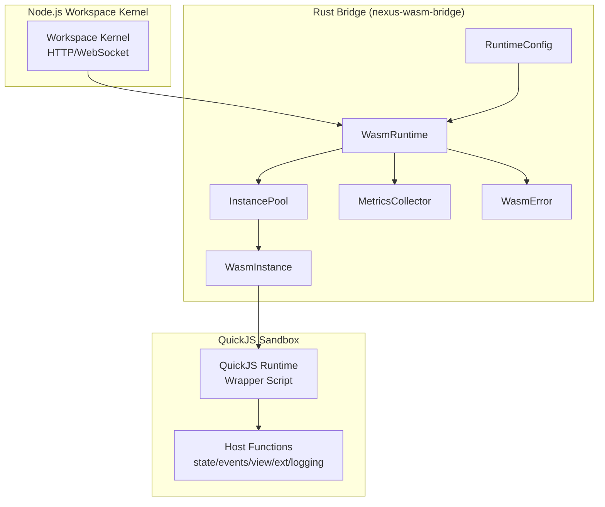
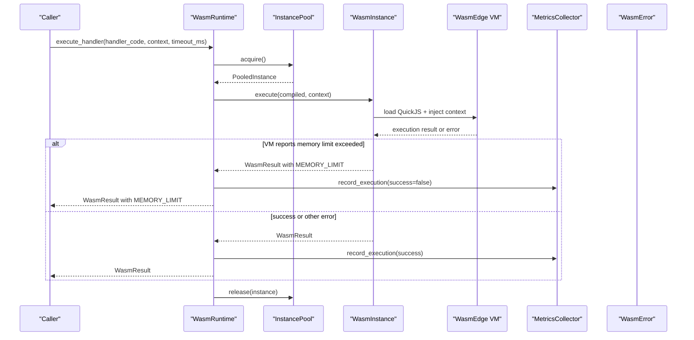
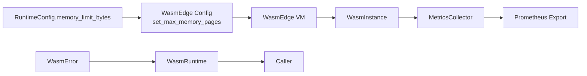

# WASM Instance Memory Limits

<cite>
**Referenced Files in This Document**
- [config.rs](file://runtime/nexus-wasm-bridge/src/config.rs)
- [engine/mod.rs](file://runtime/nexus-wasm-bridge/src/engine/mod.rs)
- [engine/instance.rs](file://runtime/nexus-wasm-bridge/src/engine/instance.rs)
- [engine/pool.rs](file://runtime/nexus-wasm-bridge/src/engine/pool.rs)
- [metrics.rs](file://runtime/nexus-wasm-bridge/src/metrics.rs)
- [error.rs](file://runtime/nexus-wasm-bridge/src/error.rs)
- [quickjs_wrapper.js](file://runtime/nexus-wasm-bridge/src/quickjs_wrapper.js)
- [host_functions/mod.rs](file://runtime/nexus-wasm-bridge/src/host_functions/mod.rs)
- [runtime/README.md](file://runtime/README.md)
- [docs/02_runtime_spec.md](file://docs/02_runtime_spec.md)
- [docs/wasmedge_migration_strategy.md](file://docs/wasmedge_migration_strategy.md)
</cite>

## Table of Contents
1. [Introduction](#introduction)
2. [Project Structure](#project-structure)
3. [Core Components](#core-components)
4. [Architecture Overview](#architecture-overview)
5. [Detailed Component Analysis](#detailed-component-analysis)
6. [Dependency Analysis](#dependency-analysis)
7. [Performance Considerations](#performance-considerations)
8. [Troubleshooting Guide](#troubleshooting-guide)
9. [Conclusion](#conclusion)
10. [Appendices](#appendices)

## Introduction
This document explains how the Nexus runtime enforces per-instance memory limits for WASM handlers running in the WasmEdge environment. It focuses on the RuntimeConfig interface’s memoryLimitBytes parameter, the default 32 MB limit, and how exceeding this limit results in a MEMORY_LIMIT error in the WasmResult. It also describes how the WASM memory limiter interacts with the QuickJS runtime and how memory pressure is monitored and reported via execution metrics. Finally, it provides configuration examples and best practices for optimizing memory usage in handler code.

## Project Structure
The Nexus runtime is composed of:
- A Rust bridge library that manages WasmEdge VMs, instance pooling, compilation, and metrics.
- A QuickJS wrapper that exposes host functions and executes handlers in a sandboxed environment.
- A Node.js workspace kernel that orchestrates panels and integrates with the bridge.

**Diagram sources**
- [engine/mod.rs](file://runtime/nexus-wasm-bridge/src/engine/mod.rs#L1-L120)
- [engine/pool.rs](file://runtime/nexus-wasm-bridge/src/engine/pool.rs#L1-L120)
- [engine/instance.rs](file://runtime/nexus-wasm-bridge/src/engine/instance.rs#L1-L120)
- [config.rs](file://runtime/nexus-wasm-bridge/src/config.rs#L1-L120)
- [metrics.rs](file://runtime/nexus-wasm-bridge/src/metrics.rs#L1-L120)
- [error.rs](file://runtime/nexus-wasm-bridge/src/error.rs#L1-L80)
- [quickjs_wrapper.js](file://runtime/nexus-wasm-bridge/src/quickjs_wrapper.js#L1-L60)
- [host_functions/mod.rs](file://runtime/nexus-wasm-bridge/src/host_functions/mod.rs#L1-L60)

**Section sources**
- [runtime/README.md](file://runtime/README.md#L1-L120)

## Core Components
- RuntimeConfig: Defines memoryLimitBytes and other runtime parameters. Includes validation and defaults.
- WasmRuntime: Orchestrates compilation, instance acquisition from the pool, execution with timeout, and metrics recording.
- InstancePool: Manages a semaphore-limited pool of WasmInstance, tracks total memory usage, and handles suspension.
- WasmInstance: Represents a single QuickJS runtime in WasmEdge, tracks memory_used and memory_peak, and builds ExecutionMetrics.
- MetricsCollector: Aggregates execution metrics including memory_used_bytes and memory_peak_bytes.
- WasmError: Provides error codes including MEMORY_LIMIT for memory violations.
- QuickJS wrapper and host functions: Provide the sandboxed execution environment and host function registry.

**Section sources**
- [config.rs](file://runtime/nexus-wasm-bridge/src/config.rs#L1-L120)
- [engine/mod.rs](file://runtime/nexus-wasm-bridge/src/engine/mod.rs#L1-L120)
- [engine/pool.rs](file://runtime/nexus-wasm-bridge/src/engine/pool.rs#L1-L120)
- [engine/instance.rs](file://runtime/nexus-wasm-bridge/src/engine/instance.rs#L1-L120)
- [metrics.rs](file://runtime/nexus-wasm-bridge/src/metrics.rs#L1-L120)
- [error.rs](file://runtime/nexus-wasm-bridge/src/error.rs#L1-L80)
- [quickjs_wrapper.js](file://runtime/nexus-wasm-bridge/src/quickjs_wrapper.js#L1-L60)
- [host_functions/mod.rs](file://runtime/nexus-wasm-bridge/src/host_functions/mod.rs#L1-L60)

## Architecture Overview
The runtime enforces memory limits at the WasmEdge VM level and augments it with in-process accounting and metrics.

**Diagram sources**
- [engine/mod.rs](file://runtime/nexus-wasm-bridge/src/engine/mod.rs#L55-L120)
- [engine/pool.rs](file://runtime/nexus-wasm-bridge/src/engine/pool.rs#L118-L180)
- [engine/instance.rs](file://runtime/nexus-wasm-bridge/src/engine/instance.rs#L118-L210)
- [metrics.rs](file://runtime/nexus-wasm-bridge/src/metrics.rs#L168-L210)
- [error.rs](file://runtime/nexus-wasm-bridge/src/error.rs#L135-L144)

## Detailed Component Analysis

### RuntimeConfig and Memory Limits
- Default memory limit: 32 MB (constant defined in the configuration module).
- Validation ensures memory_limit_bytes is at least 1 MB.
- ResourceLimits mirrors RuntimeConfig with the same memory_limit_bytes default.
- The migration strategy documentation shows how WasmEdge memory limits are configured by converting bytes to memory pages.

Key references:
- Default value and validation: [config.rs](file://runtime/nexus-wasm-bridge/src/config.rs#L9-L20), [config.rs](file://runtime/nexus-wasm-bridge/src/config.rs#L144-L169)
- ResourceLimits defaults: [config.rs](file://runtime/nexus-wasm-bridge/src/config.rs#L171-L211)
- WasmEdge memory page conversion: [docs/wasmedge_migration_strategy.md](file://docs/wasmedge_migration_strategy.md#L585-L602)

**Section sources**
- [config.rs](file://runtime/nexus-wasm-bridge/src/config.rs#L9-L20)
- [config.rs](file://runtime/nexus-wasm-bridge/src/config.rs#L144-L169)
- [config.rs](file://runtime/nexus-wasm-bridge/src/config.rs#L171-L211)
- [docs/wasmedge_migration_strategy.md](file://docs/wasmedge_migration_strategy.md#L585-L602)

### WasmRuntime Execution Flow and Timeout
- WasmRuntime compiles handlers (with caching), acquires a pooled instance, executes with a timeout, records metrics, and releases the instance.
- Timeout handling returns a WasmResult with a TIME_OUT error code.

Key references:
- Execution orchestration: [engine/mod.rs](file://runtime/nexus-wasm-bridge/src/engine/mod.rs#L55-L120)
- Timeout handling: [engine/mod.rs](file://runtime/nexus-wasm-bridge/src/engine/mod.rs#L83-L102)

**Section sources**
- [engine/mod.rs](file://runtime/nexus-wasm-bridge/src/engine/mod.rs#L55-L120)
- [engine/mod.rs](file://runtime/nexus-wasm-bridge/src/engine/mod.rs#L83-L102)

### InstancePool and Total Memory Accounting
- InstancePool maintains an atomic total_memory accumulator and updates it when acquiring and releasing instances.
- It tracks active_count and suspended instances, and supports shutdown and cleanup.

Key references:
- Acquire/release memory accounting: [engine/pool.rs](file://runtime/nexus-wasm-bridge/src/engine/pool.rs#L158-L180)
- Stats and totals: [engine/pool.rs](file://runtime/nexus-wasm-bridge/src/engine/pool.rs#L245-L259)

**Section sources**
- [engine/pool.rs](file://runtime/nexus-wasm-bridge/src/engine/pool.rs#L158-L180)
- [engine/pool.rs](file://runtime/nexus-wasm-bridge/src/engine/pool.rs#L245-L259)

### WasmInstance Memory Tracking and Metrics
- WasmInstance tracks memory_used and memory_peak and includes them in ExecutionMetrics.
- The simulated execute_internal sets memory usage for demonstration.

Key references:
- Memory fields and getters: [engine/instance.rs](file://runtime/nexus-wasm-bridge/src/engine/instance.rs#L44-L56)
- Metrics inclusion: [engine/instance.rs](file://runtime/nexus-wasm-bridge/src/engine/instance.rs#L170-L207)
- Simulated memory usage: [engine/instance.rs](file://runtime/nexus-wasm-bridge/src/engine/instance.rs#L306-L320)

**Section sources**
- [engine/instance.rs](file://runtime/nexus-wasm-bridge/src/engine/instance.rs#L44-L56)
- [engine/instance.rs](file://runtime/nexus-wasm-bridge/src/engine/instance.rs#L170-L207)
- [engine/instance.rs](file://runtime/nexus-wasm-bridge/src/engine/instance.rs#L306-L320)

### MetricsCollector and Memory Reporting
- MetricsCollector aggregates memory_used_bytes and computes a peak memory value using compare-and-swap semantics.
- Prometheus export includes peak memory metrics.

Key references:
- Memory aggregation: [metrics.rs](file://runtime/nexus-wasm-bridge/src/metrics.rs#L168-L210)
- Peak memory export: [metrics.rs](file://runtime/nexus-wasm-bridge/src/metrics.rs#L284-L339)

**Section sources**
- [metrics.rs](file://runtime/nexus-wasm-bridge/src/metrics.rs#L168-L210)
- [metrics.rs](file://runtime/nexus-wasm-bridge/src/metrics.rs#L284-L339)

### QuickJS Integration and Host Functions
- The QuickJS wrapper script exposes $state, $emit, $view, $ext, and $log APIs and serializes values via MessagePack.
- Host functions are registered and tracked for resource limits.

Key references:
- Wrapper script entry points: [quickjs_wrapper.js](file://runtime/nexus-wasm-bridge/src/quickjs_wrapper.js#L356-L410)
- Host function registry and limits: [host_functions/mod.rs](file://runtime/nexus-wasm-bridge/src/host_functions/mod.rs#L1-L60)

**Section sources**
- [quickjs_wrapper.js](file://runtime/nexus-wasm-bridge/src/quickjs_wrapper.js#L356-L410)
- [host_functions/mod.rs](file://runtime/nexus-wasm-bridge/src/host_functions/mod.rs#L1-L60)

### Error Codes and MEMORY_LIMIT
- WasmError provides MEMORY_LIMIT error construction with used and allowed byte counts.
- Error code enumeration includes MEMORY_LIMIT.

Key references:
- Error code definition: [error.rs](file://runtime/nexus-wasm-bridge/src/error.rs#L40-L58)
- Memory limit error factory: [error.rs](file://runtime/nexus-wasm-bridge/src/error.rs#L135-L144)

**Section sources**
- [error.rs](file://runtime/nexus-wasm-bridge/src/error.rs#L40-L58)
- [error.rs](file://runtime/nexus-wasm-bridge/src/error.rs#L135-L144)

## Dependency Analysis
The memory enforcement pipeline depends on:
- RuntimeConfig for the memory limit.
- WasmEdge VM configuration to enforce per-instance memory limits.
- WasmInstance to report memory_used and memory_peak.
- MetricsCollector to aggregate and export peak memory.
- Error subsystem to surface MEMORY_LIMIT.

**Diagram sources**
- [config.rs](file://runtime/nexus-wasm-bridge/src/config.rs#L9-L20)
- [docs/wasmedge_migration_strategy.md](file://docs/wasmedge_migration_strategy.md#L585-L602)
- [engine/instance.rs](file://runtime/nexus-wasm-bridge/src/engine/instance.rs#L170-L207)
- [metrics.rs](file://runtime/nexus-wasm-bridge/src/metrics.rs#L168-L210)
- [error.rs](file://runtime/nexus-wasm-bridge/src/error.rs#L135-L144)
- [engine/mod.rs](file://runtime/nexus-wasm-bridge/src/engine/mod.rs#L55-L120)

**Section sources**
- [config.rs](file://runtime/nexus-wasm-bridge/src/config.rs#L9-L20)
- [docs/wasmedge_migration_strategy.md](file://docs/wasmedge_migration_strategy.md#L585-L602)
- [engine/instance.rs](file://runtime/nexus-wasm-bridge/src/engine/instance.rs#L170-L207)
- [metrics.rs](file://runtime/nexus-wasm-bridge/src/metrics.rs#L168-L210)
- [error.rs](file://runtime/nexus-wasm-bridge/src/error.rs#L135-L144)
- [engine/mod.rs](file://runtime/nexus-wasm-bridge/src/engine/mod.rs#L55-L120)

## Performance Considerations
- Instance pooling reduces VM creation overhead and amortizes initialization costs.
- Compilation caching minimizes repeated compilation work.
- Memory accounting in the pool enables visibility into total memory usage across instances.
- Metrics collection helps identify handlers that approach or exceed memory limits.

[No sources needed since this section provides general guidance]

## Troubleshooting Guide
Common symptoms and actions:
- MEMORY_LIMIT error: Indicates the handler exceeded the configured memory limit. Review handler logic and reduce memory footprint or increase memory_limit_bytes.
- High peak memory usage: Investigate long-lived allocations, large data structures, or excessive caching in handlers.
- Frequent timeouts: While not memory-related, timeouts can mask memory issues; address both concurrently.

Operational checks:
- Verify RuntimeConfig.memory_limit_bytes is set appropriately for the workload.
- Monitor Prometheus metrics for peak_memory_bytes and cache hit rates.
- Confirm WasmEdge memory page configuration aligns with memory_limit_bytes.

**Section sources**
- [error.rs](file://runtime/nexus-wasm-bridge/src/error.rs#L135-L144)
- [metrics.rs](file://runtime/nexus-wasm-bridge/src/metrics.rs#L284-L339)
- [docs/wasmedge_migration_strategy.md](file://docs/wasmedge_migration_strategy.md#L585-L602)

## Conclusion
The Nexus runtime enforces per-instance memory limits by combining WasmEdge VM-level constraints with in-process memory tracking and metrics. The default memory limit is 32 MB, configurable via RuntimeConfig.memory_limit_bytes. When handlers exceed this limit, the runtime surfaces a MEMORY_LIMIT error in the WasmResult and records metrics for observability. Proper configuration and handler optimization help ensure reliable execution under memory pressure.

[No sources needed since this section summarizes without analyzing specific files]

## Appendices

### Configuration Examples
- Adjust memory limit for a handler workload:
  - Use the builder pattern to set memory_limit_bytes on RuntimeConfig.
  - Reference: [config.rs](file://runtime/nexus-wasm-bridge/src/config.rs#L96-L112)
- Validate configuration constraints:
  - Ensure memory_limit_bytes meets minimum thresholds.
  - Reference: [config.rs](file://runtime/nexus-wasm-bridge/src/config.rs#L144-L169)
- WasmEdge memory page configuration:
  - The migration strategy demonstrates setting memory limits via WasmEdge SDK.
  - Reference: [docs/wasmedge_migration_strategy.md](file://docs/wasmedge_migration_strategy.md#L585-L602)

**Section sources**
- [config.rs](file://runtime/nexus-wasm-bridge/src/config.rs#L96-L112)
- [config.rs](file://runtime/nexus-wasm-bridge/src/config.rs#L144-L169)
- [docs/wasmedge_migration_strategy.md](file://docs/wasmedge_migration_strategy.md#L585-L602)

### Best Practices for Optimizing Memory Usage in Handlers
- Minimize retained state: Prefer streaming or chunked processing over loading entire datasets into memory.
- Avoid deep copies: Reuse buffers and structures where possible.
- Use pagination: Process large lists in smaller batches.
- Clear caches: Periodically prune unused data structures.
- Monitor metrics: Track memory_used_bytes and memory_peak_bytes to detect regressions.

[No sources needed since this section provides general guidance]