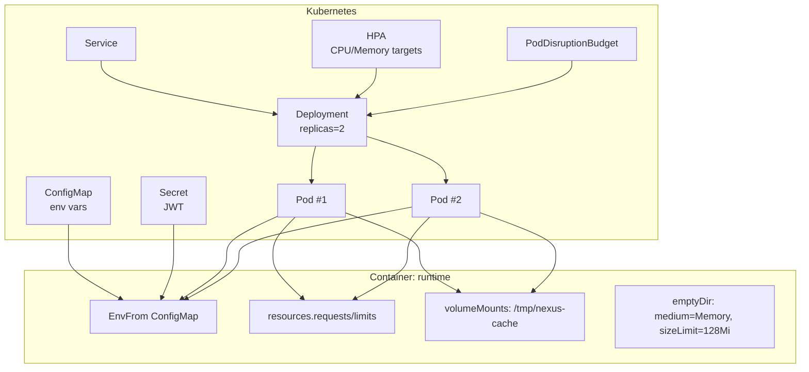
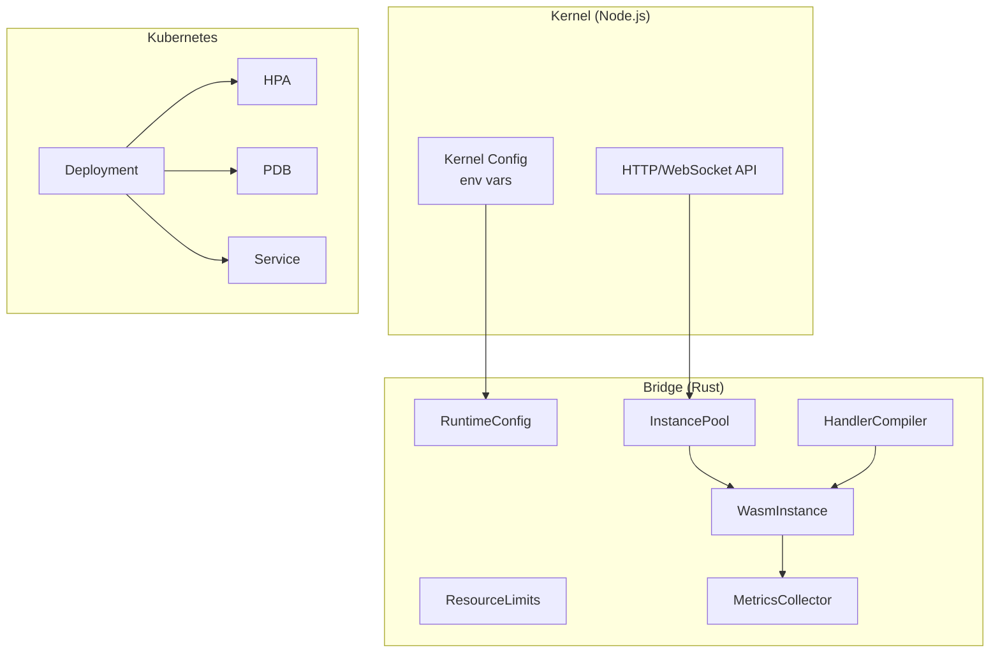
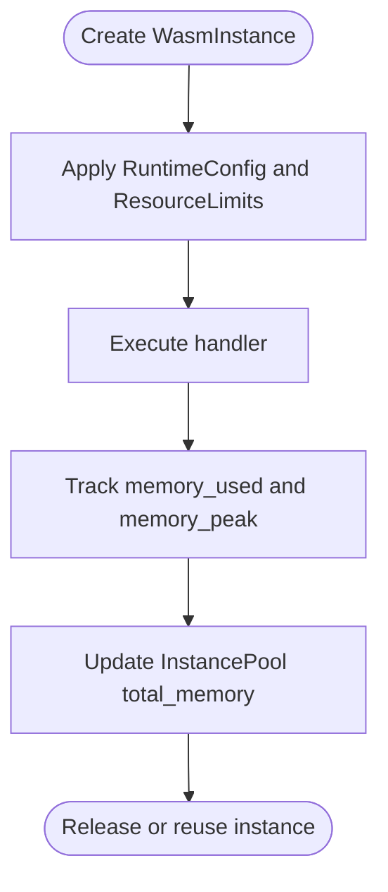
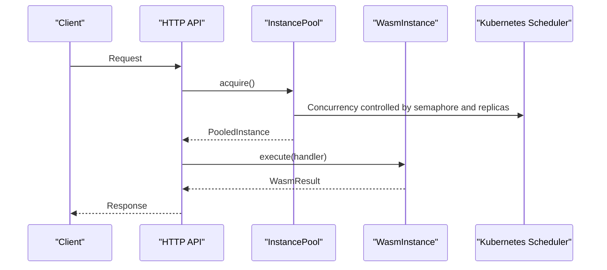
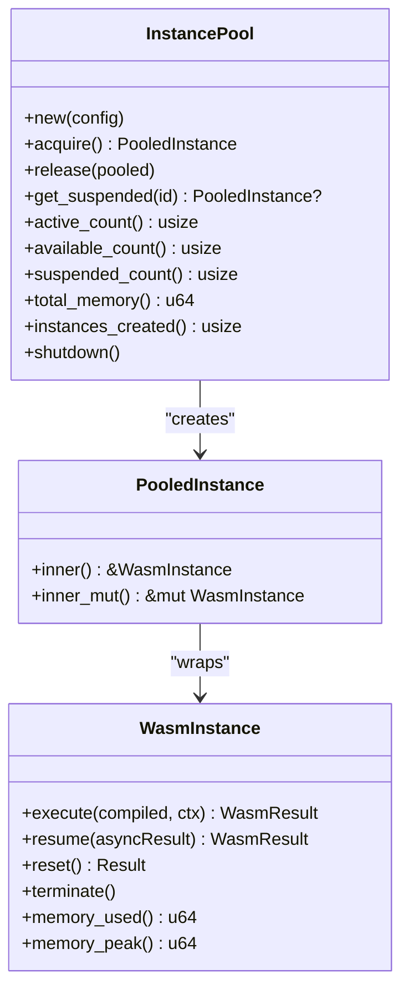
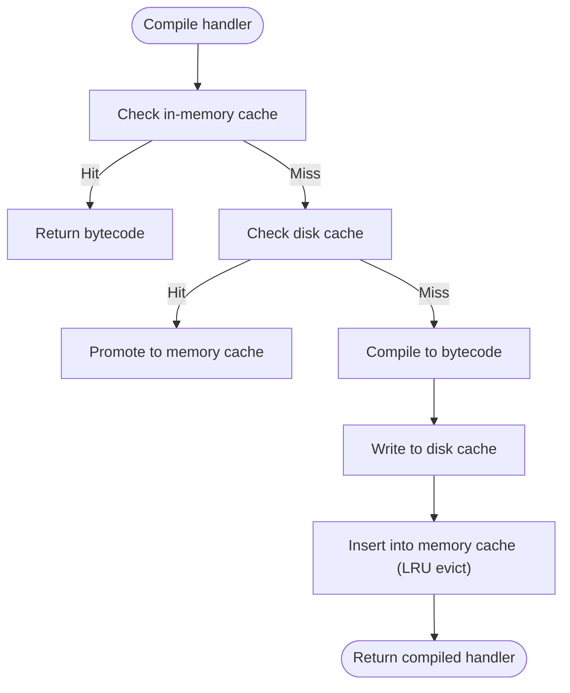
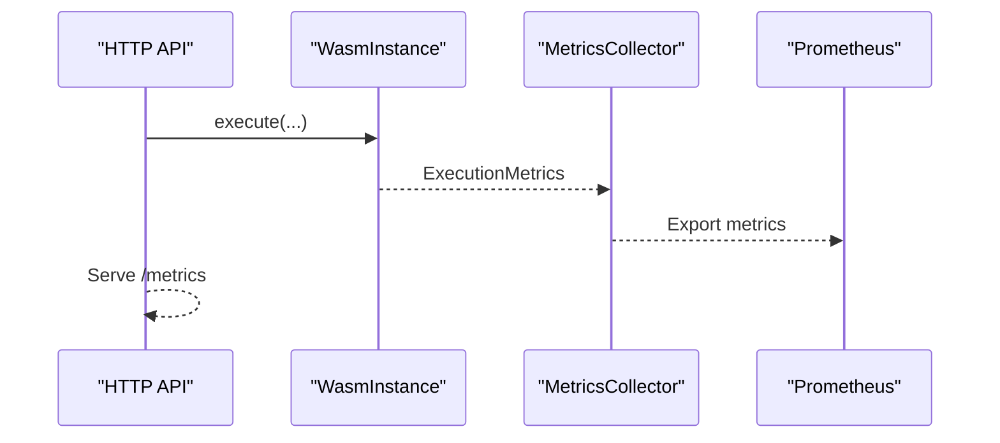
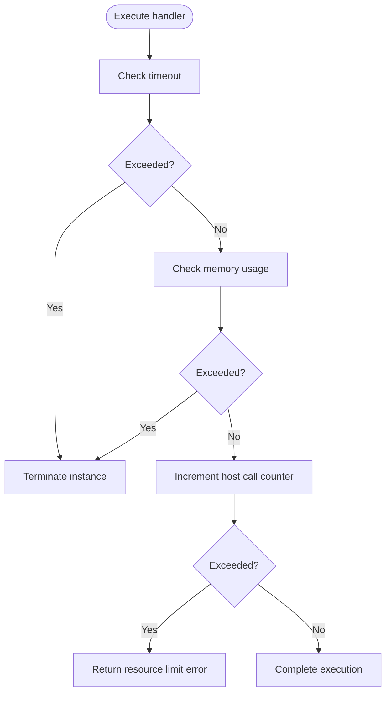
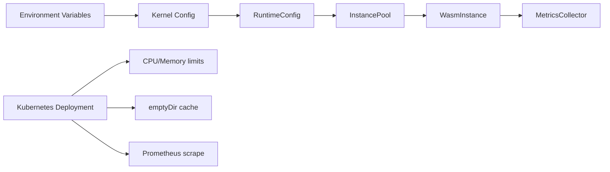

# Resource Management

<cite>
**Referenced Files in This Document**
- [deployment.yaml](file://runtime/k8s/deployment.yaml)
- [config.rs](file://runtime/nexus-wasm-bridge/src/config.rs)
- [pool.rs](file://runtime/nexus-wasm-bridge/src/engine/pool.rs)
- [instance.rs](file://runtime/nexus-wasm-bridge/src/engine/instance.rs)
- [compiler.rs](file://runtime/nexus-wasm-bridge/src/engine/compiler.rs)
- [metrics.rs](file://runtime/nexus-wasm-bridge/src/metrics.rs)
- [context.rs](file://runtime/nexus-wasm-bridge/src/context.rs)
- [config.ts](file://runtime/workspace-kernel/src/config.ts)
- [README.md](file://runtime/README.md)
- [02_runtime_spec.md](file://docs/02_runtime_spec.md)
</cite>

## Table of Contents
1. [Introduction](#introduction)
2. [Project Structure](#project-structure)
3. [Core Components](#core-components)
4. [Architecture Overview](#architecture-overview)
5. [Detailed Component Analysis](#detailed-component-analysis)
6. [Dependency Analysis](#dependency-analysis)
7. [Performance Considerations](#performance-considerations)
8. [Troubleshooting Guide](#troubleshooting-guide)
9. [Conclusion](#conclusion)
10. [Appendices](#appendices)

## Introduction
This document describes the Nexus resource management architecture for WASM-based execution environments. It covers memory allocation strategies for WASM instances, per-instance and container-level limits, CPU resource allocation and throttling via Kubernetes, instance pooling for performance, cache management using emptyDir volumes with memory medium, and monitoring/metrics collection via Prometheus. It also provides tuning guidelines based on workload characteristics.

## Project Structure
The runtime is split into:
- A Rust-based WASM bridge that manages instance lifecycle, compilation, and metrics.
- A Node.js workspace kernel that exposes HTTP/WebSocket APIs and integrates with the bridge.

Kubernetes manifests define container resource requests/limits, probes, and a PodDisruptionBudget. The bridge’s configuration and metrics are exposed to Prometheus.

**Diagram sources**
- [deployment.yaml](file://runtime/k8s/deployment.yaml#L1-L135)

**Section sources**
- [deployment.yaml](file://runtime/k8s/deployment.yaml#L1-L135)
- [README.md](file://runtime/README.md#L1-L120)

## Core Components
- RuntimeConfig: Defines per-instance limits (memory, stack), concurrency limits (max_instances), and cache settings.
- ResourceLimits: Enforces per-execution constraints (timeout, memory, host calls, state mutations, events).
- InstancePool: Manages a bounded pool of reusable WASM instances with concurrency control and memory accounting.
- WasmInstance: Tracks state, memory usage, and execution lifecycle; supports suspend/resume.
- HandlerCompiler: Compiles and caches handler bytecode with LRU eviction and disk cache.
- MetricsCollector: Aggregates execution metrics and exports Prometheus-formatted metrics.
- Kubernetes Deployment: Sets container resource requests/limits, probes, and emptyDir cache volume.

**Section sources**
- [config.rs](file://runtime/nexus-wasm-bridge/src/config.rs#L33-L169)
- [config.rs](file://runtime/nexus-wasm-bridge/src/config.rs#L171-L211)
- [pool.rs](file://runtime/nexus-wasm-bridge/src/engine/pool.rs#L50-L116)
- [instance.rs](file://runtime/nexus-wasm-bridge/src/engine/instance.rs#L18-L116)
- [compiler.rs](file://runtime/nexus-wasm-bridge/src/engine/compiler.rs#L117-L166)
- [metrics.rs](file://runtime/nexus-wasm-bridge/src/metrics.rs#L12-L122)
- [deployment.yaml](file://runtime/k8s/deployment.yaml#L88-L135)

## Architecture Overview
The runtime enforces resource limits at multiple layers:
- Per-instance limits via RuntimeConfig and ResourceLimits.
- Container-level CPU/memory via Kubernetes Deployment resources.
- Instance pooling to reduce overhead and improve throughput.
- Compilation caching to reduce cold-start latency.
- Metrics exported for Prometheus scraping.

**Diagram sources**
- [config.rs](file://runtime/nexus-wasm-bridge/src/config.rs#L33-L169)
- [config.rs](file://runtime/nexus-wasm-bridge/src/config.rs#L171-L211)
- [pool.rs](file://runtime/nexus-wasm-bridge/src/engine/pool.rs#L75-L116)
- [instance.rs](file://runtime/nexus-wasm-bridge/src/engine/instance.rs#L118-L211)
- [compiler.rs](file://runtime/nexus-wasm-bridge/src/engine/compiler.rs#L138-L214)
- [metrics.rs](file://runtime/nexus-wasm-bridge/src/metrics.rs#L137-L211)
- [deployment.yaml](file://runtime/k8s/deployment.yaml#L88-L135)

## Detailed Component Analysis

### Memory Allocation Strategy for WASM Instances
- Per-instance memory limit: Controlled by RuntimeConfig.memory_limit_bytes and ResourceLimits.memory_limit_bytes. Defaults are defined and validated.
- Stack size limit: Controlled by RuntimeConfig.stack_size_bytes and ResourceLimits.stack_size_bytes.
- Instance memory accounting: WasmInstance tracks memory_used and memory_peak; InstancePool aggregates total_memory across active instances.
- Container memory constraint: Kubernetes Deployment sets memory requests and limits; emptyDir cache volume uses Memory medium with sizeLimit.

**Diagram sources**
- [config.rs](file://runtime/nexus-wasm-bridge/src/config.rs#L33-L169)
- [config.rs](file://runtime/nexus-wasm-bridge/src/config.rs#L171-L211)
- [instance.rs](file://runtime/nexus-wasm-bridge/src/engine/instance.rs#L77-L116)
- [pool.rs](file://runtime/nexus-wasm-bridge/src/engine/pool.rs#L158-L183)

**Section sources**
- [config.rs](file://runtime/nexus-wasm-bridge/src/config.rs#L33-L169)
- [config.rs](file://runtime/nexus-wasm-bridge/src/config.rs#L171-L211)
- [instance.rs](file://runtime/nexus-wasm-bridge/src/engine/instance.rs#L77-L116)
- [pool.rs](file://runtime/nexus-wasm-bridge/src/engine/pool.rs#L158-L183)
- [deployment.yaml](file://runtime/k8s/deployment.yaml#L97-L104)
- [deployment.yaml](file://runtime/k8s/deployment.yaml#L130-L134)

### CPU Resource Allocation and Throttling
- CPU requests/limits are defined in the Kubernetes Deployment. These constrain container CPU allocation and act as implicit throttling when limits are exceeded.
- HorizontalPodAutoscaler scales pods based on CPU and memory utilization targets, indirectly controlling concurrency and preventing overload.

**Diagram sources**
- [deployment.yaml](file://runtime/k8s/deployment.yaml#L97-L104)
- [deployment.yaml](file://runtime/k8s/deployment.yaml#L208-L233)
- [pool.rs](file://runtime/nexus-wasm-bridge/src/engine/pool.rs#L118-L171)

**Section sources**
- [deployment.yaml](file://runtime/k8s/deployment.yaml#L97-L104)
- [deployment.yaml](file://runtime/k8s/deployment.yaml#L208-L233)

### Instance Pooling System
- Pool bounds concurrency via a semaphore sized to max_instances.
- Pre-warms pool with min_instances to reduce cold starts.
- Tracks active_count, available_count, suspended_count, and total_memory.
- Supports suspend/resume by moving instances to/from suspended map keyed by suspension_id.
- Shutdown closes the semaphore and terminates all instances.

**Diagram sources**
- [pool.rs](file://runtime/nexus-wasm-bridge/src/engine/pool.rs#L70-L217)
- [instance.rs](file://runtime/nexus-wasm-bridge/src/engine/instance.rs#L118-L211)

**Section sources**
- [pool.rs](file://runtime/nexus-wasm-bridge/src/engine/pool.rs#L75-L116)
- [pool.rs](file://runtime/nexus-wasm-bridge/src/engine/pool.rs#L118-L171)
- [pool.rs](file://runtime/nexus-wasm-bridge/src/engine/pool.rs#L173-L217)
- [pool.rs](file://runtime/nexus-wasm-bridge/src/engine/pool.rs#L219-L259)
- [pool.rs](file://runtime/nexus-wasm-bridge/src/engine/pool.rs#L260-L286)
- [instance.rs](file://runtime/nexus-wasm-bridge/src/engine/instance.rs#L118-L211)

### Cache Management Using emptyDir with Memory Medium
- The Deployment mounts an emptyDir volume with medium=Memory and sizeLimit=128Mi to /tmp/nexus-cache.
- The HandlerCompiler writes compiled bytecode to disk cache under the configured cache_dir, enabling disk-backed cache hits.
- Memory cache is maintained in-process with LRU eviction based on max_cache_size_bytes.

**Diagram sources**
- [deployment.yaml](file://runtime/k8s/deployment.yaml#L120-L134)
- [compiler.rs](file://runtime/nexus-wasm-bridge/src/engine/compiler.rs#L138-L214)
- [compiler.rs](file://runtime/nexus-wasm-bridge/src/engine/compiler.rs#L254-L296)

**Section sources**
- [deployment.yaml](file://runtime/k8s/deployment.yaml#L120-L134)
- [compiler.rs](file://runtime/nexus-wasm-bridge/src/engine/compiler.rs#L138-L214)
- [compiler.rs](file://runtime/nexus-wasm-bridge/src/engine/compiler.rs#L254-L296)

### Monitoring and Metrics Collection
- MetricsCollector aggregates execution counts, durations, cache hit rates, peak memory, host calls, and error counts.
- Exports Prometheus-formatted metrics including handler executions, execution time, cache hit rate, peak memory, host calls, and error totals.
- The Deployment enables Prometheus scraping via annotations and exposes a /metrics endpoint.

**Diagram sources**
- [metrics.rs](file://runtime/nexus-wasm-bridge/src/metrics.rs#L137-L211)
- [metrics.rs](file://runtime/nexus-wasm-bridge/src/metrics.rs#L284-L339)
- [deployment.yaml](file://runtime/k8s/deployment.yaml#L57-L60)

**Section sources**
- [metrics.rs](file://runtime/nexus-wasm-bridge/src/metrics.rs#L12-L122)
- [metrics.rs](file://runtime/nexus-wasm-bridge/src/metrics.rs#L137-L211)
- [metrics.rs](file://runtime/nexus-wasm-bridge/src/metrics.rs#L284-L339)
- [deployment.yaml](file://runtime/k8s/deployment.yaml#L57-L60)

### Resource Limits Enforcement (Timeout, Memory, Host Calls)
- Timeout enforcement: The runtime specification outlines applying timeouts around instance execution and terminating instances upon timeout.
- Memory limit enforcement: The runtime specification shows configuring maximum memory pages during VM creation.
- Host call limit enforcement: The runtime specification demonstrates checking host call counts per invocation and returning resource-limit errors when exceeded.

**Diagram sources**
- [02_runtime_spec.md](file://docs/02_runtime_spec.md#L961-L1093)

**Section sources**
- [02_runtime_spec.md](file://docs/02_runtime_spec.md#L961-L1093)

## Dependency Analysis
- Kernel configuration sources environment variables and merges with defaults; these values feed RuntimeConfig and ResourceLimits.
- Kubernetes Deployment controls container-level CPU/memory and provides cache volume and metrics scraping.
- Bridge components depend on configuration and export metrics consumed by Prometheus.

**Diagram sources**
- [config.ts](file://runtime/workspace-kernel/src/config.ts#L76-L123)
- [config.rs](file://runtime/nexus-wasm-bridge/src/config.rs#L33-L169)
- [pool.rs](file://runtime/nexus-wasm-bridge/src/engine/pool.rs#L75-L116)
- [metrics.rs](file://runtime/nexus-wasm-bridge/src/metrics.rs#L284-L339)
- [deployment.yaml](file://runtime/k8s/deployment.yaml#L88-L135)

**Section sources**
- [config.ts](file://runtime/workspace-kernel/src/config.ts#L76-L123)
- [config.rs](file://runtime/nexus-wasm-bridge/src/config.rs#L33-L169)
- [deployment.yaml](file://runtime/k8s/deployment.yaml#L88-L135)

## Performance Considerations
- Instance pooling reduces cold-start latency and improves throughput by reusing initialized instances.
- Compilation caching minimizes repeated compilation costs; tune max_cache_size_bytes and ensure disk cache availability.
- Pre-warming min_instances helps stabilize startup latency under load.
- Use HPA with CPU and memory targets to scale pods horizontally; ensure max_instances aligns with desired concurrency per pod.
- Prefer memory medium emptyDir for cache to reduce disk I/O overhead; monitor sizeLimit to prevent pressure.

[No sources needed since this section provides general guidance]

## Troubleshooting Guide
- High memory usage: Verify per-instance memory_limit_bytes and ResourceLimits.memory_limit_bytes; confirm WasmInstance memory_used and InstancePool total_memory.
- Timeouts: Confirm timeout_ms and ensure handlers respect host-call and mutation/event limits to avoid premature termination.
- Cache misses: Increase max_cache_size_bytes and ensure cache_dir is writable; verify disk cache presence.
- Sudden spikes: Check HPA scaling behavior and adjust min/max replicas; review InstancePool active_count and available_count.

**Section sources**
- [config.rs](file://runtime/nexus-wasm-bridge/src/config.rs#L171-L211)
- [instance.rs](file://runtime/nexus-wasm-bridge/src/engine/instance.rs#L77-L116)
- [pool.rs](file://runtime/nexus-wasm-bridge/src/engine/pool.rs#L235-L259)
- [compiler.rs](file://runtime/nexus-wasm-bridge/src/engine/compiler.rs#L138-L214)
- [deployment.yaml](file://runtime/k8s/deployment.yaml#L208-L233)

## Conclusion
Nexus employs layered resource management: per-instance limits enforced by the bridge, container-level CPU/memory constraints via Kubernetes, instance pooling for performance, compilation caching for reduced latency, and comprehensive metrics for observability. Proper tuning of max_instances, memory limits, cache sizes, and HPA targets ensures predictable performance and efficient resource utilization.

[No sources needed since this section summarizes without analyzing specific files]

## Appendices

### Tuning Guidelines by Workload Characteristics
- CPU-bound handlers:
  - Increase CPU requests/limits in Deployment.
  - Scale replicas via HPA; ensure max_instances matches desired concurrency per pod.
- Memory-heavy handlers:
  - Raise memory_limit_bytes and ResourceLimits.memory_limit_bytes.
  - Monitor InstancePool total_memory and adjust max_instances accordingly.
- Latency-sensitive:
  - Enable min_instances pre-warming.
  - Increase cache_dir disk cache and max_cache_size_bytes.
  - Use memory medium emptyDir for cache.
- Throughput-heavy:
  - Increase max_instances to utilize available CPU.
  - Tune HPA targets to scale pods based on CPU utilization.

**Section sources**
- [config.rs](file://runtime/nexus-wasm-bridge/src/config.rs#L33-L169)
- [config.rs](file://runtime/nexus-wasm-bridge/src/config.rs#L171-L211)
- [pool.rs](file://runtime/nexus-wasm-bridge/src/engine/pool.rs#L75-L116)
- [compiler.rs](file://runtime/nexus-wasm-bridge/src/engine/compiler.rs#L138-L214)
- [deployment.yaml](file://runtime/k8s/deployment.yaml#L97-L104)
- [deployment.yaml](file://runtime/k8s/deployment.yaml#L208-L233)