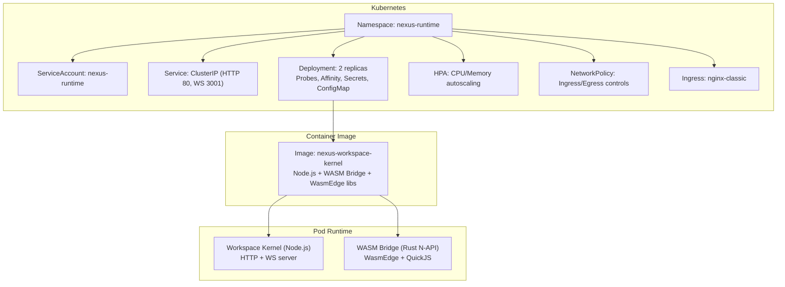
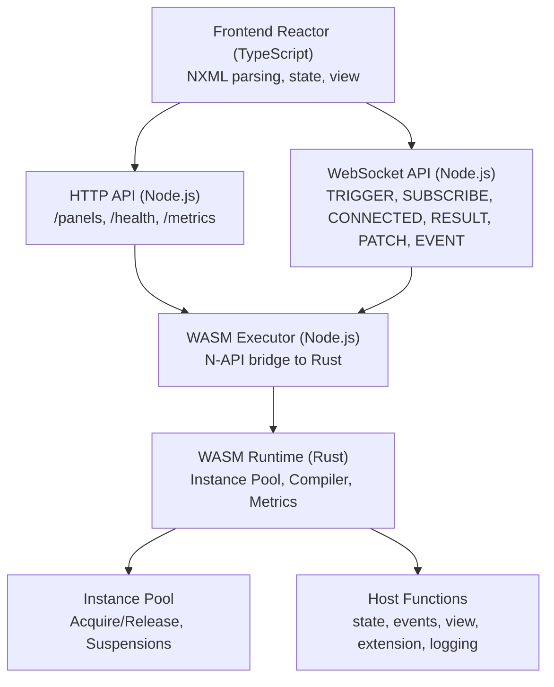
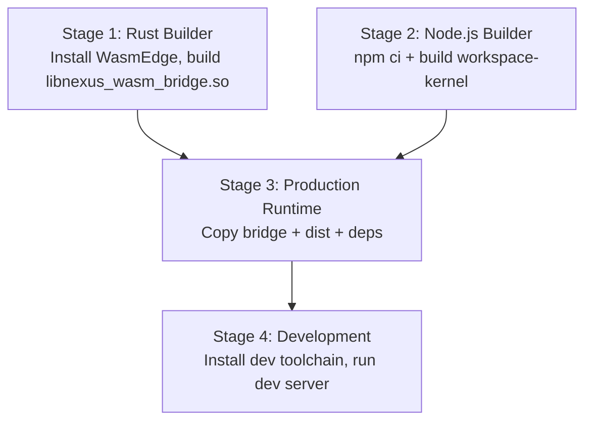
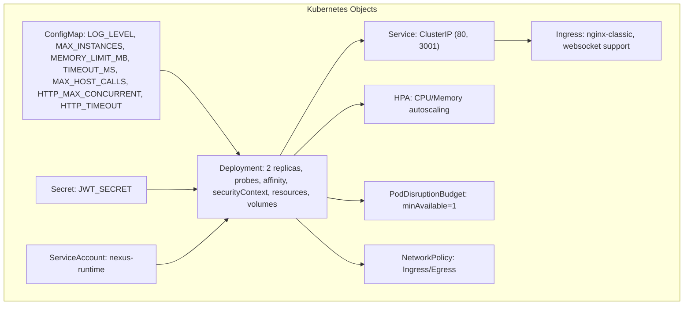
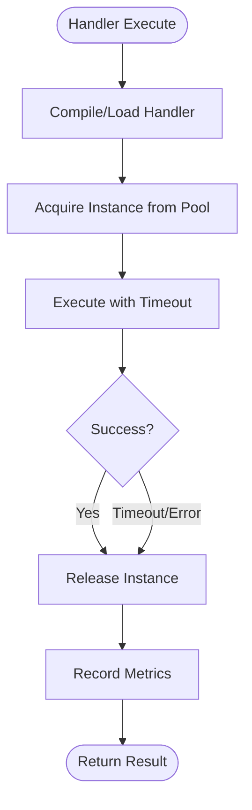
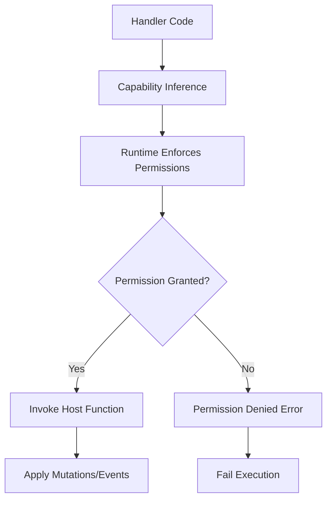
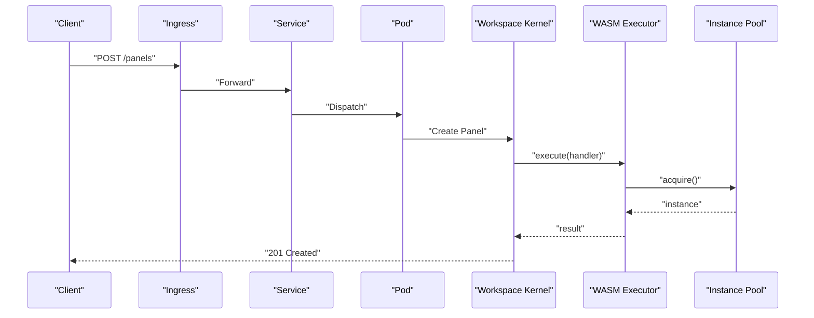
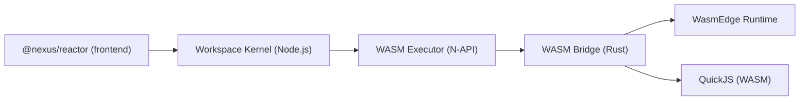

# Runtime Architecture

<cite>
**Referenced Files in This Document**
- [deployment.yaml](file://runtime/k8s/deployment.yaml)
- [Dockerfile](file://runtime/images/Dockerfile)
- [runtime README](file://runtime/README.md)
- [workspace-kernel index.ts](file://runtime/workspace-kernel/src/index.ts)
- [workspace-kernel config.ts](file://runtime/workspace-kernel/src/config.ts)
- [workspace-kernel executor.ts](file://runtime/workspace-kernel/src/executor.ts)
- [workspace-kernel server.ts](file://runtime/workspace-kernel/src/server.ts)
- [workspace-kernel types.ts](file://runtime/workspace-kernel/src/types.ts)
- [nexus-wasm-bridge lib.rs](file://runtime/nexus-wasm-bridge/src/lib.rs)
- [nexus-wasm-bridge engine/mod.rs](file://runtime/nexus-wasm-bridge/src/engine/mod.rs)
- [nexus-wasm-bridge engine/pool.rs](file://runtime/nexus-wasm-bridge/src/engine/pool.rs)
- [nexus-wasm-bridge capability.rs](file://runtime/nexus-wasm-bridge/src/capability.rs)
- [nexus-wasm-bridge host_functions/state.rs](file://runtime/nexus-wasm-bridge/src/host_functions/state.rs)
- [nexus-reactor index.ts](file://packages/nexus-reactor/src/index.ts)
</cite>

## Table of Contents
1. [Introduction](#introduction)
2. [Project Structure](#project-structure)
3. [Core Components](#core-components)
4. [Architecture Overview](#architecture-overview)
5. [Detailed Component Analysis](#detailed-component-analysis)
6. [Dependency Analysis](#dependency-analysis)
7. [Performance Considerations](#performance-considerations)
8. [Troubleshooting Guide](#troubleshooting-guide)
9. [Conclusion](#conclusion)
10. [Appendices](#appendices)

## Introduction
This document describes the Nexus runtime environment architecture, focusing on containerization with Docker, orchestration with Kubernetes, resource management for WASM instances and handler execution, security model (network isolation, capability-based access control, sandboxing), scaling strategies for multiple panel instances and high-concurrency client connections, and production infrastructure and disaster recovery considerations. It also presents topology diagrams showing the relationship between the frontend Reactor, Workspace Kernel, and WASM Bridge components.

## Project Structure
The runtime is composed of:
- A Node.js Workspace Kernel that serves HTTP and WebSocket APIs, manages panels, and coordinates execution with the WASM bridge.
- A Rust-based WASM Bridge that provides secure, isolated execution of JavaScript handlers via WasmEdge and QuickJS, with capability-based security and instance pooling.
- A multi-stage Dockerfile that builds the Node.js application and the native Rust WASM bridge, and a Kubernetes deployment manifest that defines pods, services, ingress, autoscaling, and network policies.

**Diagram sources**
- [deployment.yaml](file://runtime/k8s/deployment.yaml#L1-L299)
- [Dockerfile](file://runtime/images/Dockerfile#L1-L152)

**Section sources**
- [runtime README](file://runtime/README.md#L1-L210)
- [deployment.yaml](file://runtime/k8s/deployment.yaml#L1-L299)
- [Dockerfile](file://runtime/images/Dockerfile#L1-L152)

## Core Components
- Workspace Kernel (Node.js): Initializes configuration, subsystems, and starts HTTP/WS servers. It integrates with the WASM executor and panel manager, and exposes REST and WebSocket endpoints for panel lifecycle and handler execution.
- WASM Bridge (Rust): Provides a N-API interface to Node.js, manages instance pools, compiles and executes handlers, enforces capabilities, and collects metrics.
- Reactor (TypeScript/Node.js): Parses NXML, manages state and view rendering, and coordinates with the Workspace Kernel via the WASM Bridge.

Key responsibilities:
- HTTP API: panel creation/listing, state retrieval, health/metrics.
- WebSocket API: TRIGGER/SUBSCRIBE/PING, streaming state patches and events.
- Handler execution: compile/run/resume with timeouts and resource limits.
- Capability enforcement: strict host function access control.

**Section sources**
- [workspace-kernel index.ts](file://runtime/workspace-kernel/src/index.ts#L1-L149)
- [workspace-kernel server.ts](file://runtime/workspace-kernel/src/server.ts#L1-L703)
- [workspace-kernel executor.ts](file://runtime/workspace-kernel/src/executor.ts#L1-L541)
- [nexus-wasm-bridge lib.rs](file://runtime/nexus-wasm-bridge/src/lib.rs#L1-L71)
- [nexus-reactor index.ts](file://packages/nexus-reactor/src/index.ts#L1-L190)

## Architecture Overview
The runtime architecture separates concerns across layers:
- Frontend Reactor parses NXML and renders views.
- Workspace Kernel exposes HTTP/WS APIs and orchestrates panel lifecycle and handler execution.
- WASM Bridge provides sandboxed execution with capability-based access control and instance pooling.

**Diagram sources**
- [runtime README](file://runtime/README.md#L1-L210)
- [workspace-kernel server.ts](file://runtime/workspace-kernel/src/server.ts#L1-L703)
- [workspace-kernel executor.ts](file://runtime/workspace-kernel/src/executor.ts#L1-L541)
- [nexus-wasm-bridge engine/mod.rs](file://runtime/nexus-wasm-bridge/src/engine/mod.rs#L1-L244)
- [nexus-wasm-bridge engine/pool.rs](file://runtime/nexus-wasm-bridge/src/engine/pool.rs#L1-L395)
- [nexus-wasm-bridge host_functions/state.rs](file://runtime/nexus-wasm-bridge/src/host_functions/state.rs#L1-L238)

## Detailed Component Analysis

### Containerization Strategy (Docker)
- Multi-stage build:
  - Rust stage installs WasmEdge and builds the native WASM bridge shared library.
  - Node.js stage builds the workspace-kernel application.
  - Production stage copies artifacts, installs WasmEdge runtime libraries, sets non-root user, exposes ports, and defines health checks.
  - Development stage enables local iteration with Rust and Node.js toolchains.
- Image packaging:
  - Copies the compiled Rust bridge, Node.js dist, and runtime dependencies.
  - Sets environment variables for ports, logging, and cache directory.
  - Runs as non-root user with hardened container security context.

**Diagram sources**
- [Dockerfile](file://runtime/images/Dockerfile#L1-L152)

**Section sources**
- [Dockerfile](file://runtime/images/Dockerfile#L1-L152)

### Orchestration via Kubernetes
- Namespace and labels for app identification.
- ConfigMap and Secret for configuration and JWT secret.
- Deployment:
  - Two replicas with anti-affinity across nodes.
  - Probes for readiness/liveness.
  - SecurityContext: non-root user/group, fsGroup, read-only root filesystem, dropped capabilities.
  - Resources: CPU/memory requests/limits.
  - VolumeMount for cache in-memory tmpfs.
- Service: ClusterIP exposing HTTP and WebSocket ports.
- Ingress: nginx ingress class with websocket support and long read/send timeouts.
- HPA: autoscaling based on CPU and memory utilization.
- PodDisruptionBudget: minimum available pods.
- NetworkPolicy: restricts ingress to ingress-nginx and monitoring namespaces, allows DNS, and allows external HTTP/HTTPS to non-private ranges.

**Diagram sources**
- [deployment.yaml](file://runtime/k8s/deployment.yaml#L1-L299)

**Section sources**
- [deployment.yaml](file://runtime/k8s/deployment.yaml#L1-L299)

### Resource Management Model
- WASM instance management:
  - Instance pool with configurable max/min instances, memory limits, and host call limits.
  - Pre-warming of minimum instances to reduce cold-start latency.
  - Acquire/release semantics with semaphore-based concurrency control.
  - Suspended instances tracked by suspension ID for resumption.
- Handler execution:
  - Execution timeout enforced via tokio timeout.
  - Metrics collection for execution time, memory usage, host calls, and cache hits.
  - Optional pre-compilation and bytecode caching for performance.
- Node.js runtime:
  - CPU/memory requests/limits configured in Deployment.
  - In-memory cache volume for temporary storage.
  - HTTP and WebSocket concurrency limits via configuration.

**Diagram sources**
- [nexus-wasm-bridge engine/mod.rs](file://runtime/nexus-wasm-bridge/src/engine/mod.rs#L1-L244)
- [nexus-wasm-bridge engine/pool.rs](file://runtime/nexus-wasm-bridge/src/engine/pool.rs#L1-L395)
- [workspace-kernel executor.ts](file://runtime/workspace-kernel/src/executor.ts#L1-L541)

**Section sources**
- [workspace-kernel config.ts](file://runtime/workspace-kernel/src/config.ts#L1-L233)
- [nexus-wasm-bridge engine/mod.rs](file://runtime/nexus-wasm-bridge/src/engine/mod.rs#L1-L244)
- [nexus-wasm-bridge engine/pool.rs](file://runtime/nexus-wasm-bridge/src/engine/pool.rs#L1-L395)
- [workspace-kernel executor.ts](file://runtime/workspace-kernel/src/executor.ts#L1-L541)

### Security Model
- Network isolation:
  - NetworkPolicy restricts inbound traffic to ingress-nginx and monitoring namespaces and outbound to DNS and external HTTP/HTTPS.
- Capability-based access control:
  - Handlers must declare required capabilities; runtime enforces permissions on host function calls (state read/write, events emit, view updates, extension access).
  - Capability tokens support wildcard scopes and precise scoping.
- Sandboxing:
  - True WASM isolation with per-instance execution and strict capability checks.
  - Host functions gate all external access; handlers cannot access arbitrary globals or APIs without explicit capability grants.

**Diagram sources**
- [nexus-wasm-bridge capability.rs](file://runtime/nexus-wasm-bridge/src/capability.rs#L1-L384)
- [nexus-wasm-bridge host_functions/state.rs](file://runtime/nexus-wasm-bridge/src/host_functions/state.rs#L1-L238)
- [deployment.yaml](file://runtime/k8s/deployment.yaml#L247-L299)

**Section sources**
- [nexus-wasm-bridge capability.rs](file://runtime/nexus-wasm-bridge/src/capability.rs#L1-L384)
- [nexus-wasm-bridge host_functions/state.rs](file://runtime/nexus-wasm-bridge/src/host_functions/state.rs#L1-L238)
- [deployment.yaml](file://runtime/k8s/deployment.yaml#L247-L299)

### Scaling Considerations
- Horizontal scaling:
  - Kubernetes HPA scales based on CPU and memory utilization with min/max replicas.
  - Pod anti-affinity ensures spread across nodes.
- Concurrency:
  - HTTP_MAX_CONCURRENT and HTTP_TIMEOUT control extension HTTP concurrency and timeouts.
  - MAX_HOST_CALLS limits host function calls per execution to prevent abuse.
  - MAX_INSTANCES and MIN_INSTANCES tune WASM instance pool sizing.
- Client connections:
  - WebSocket connections are supported per panel; ensure adequate CPU and memory limits to handle high concurrency.
  - Use Ingress with appropriate timeouts for long-running connections.

**Diagram sources**
- [deployment.yaml](file://runtime/k8s/deployment.yaml#L1-L299)
- [workspace-kernel server.ts](file://runtime/workspace-kernel/src/server.ts#L1-L703)
- [workspace-kernel executor.ts](file://runtime/workspace-kernel/src/executor.ts#L1-L541)
- [nexus-wasm-bridge engine/pool.rs](file://runtime/nexus-wasm-bridge/src/engine/pool.rs#L1-L395)

**Section sources**
- [deployment.yaml](file://runtime/k8s/deployment.yaml#L208-L233)
- [workspace-kernel config.ts](file://runtime/workspace-kernel/src/config.ts#L1-L233)

### Infrastructure Requirements and Disaster Recovery
- Infrastructure:
  - Kubernetes cluster with ingress controller (nginx) and persistent storage for logs/metrics if needed.
  - Monitoring stack scraping Prometheus metrics endpoint.
  - Secrets management for JWT secret.
- Disaster recovery:
  - PodDisruptionBudget ensures minimum availability during maintenance.
  - Anti-affinity spreads pods across nodes.
  - Rolling updates with probes ensure zero-downtime deployments.

**Section sources**
- [deployment.yaml](file://runtime/k8s/deployment.yaml#L234-L246)
- [deployment.yaml](file://runtime/k8s/deployment.yaml#L134-L146)

## Dependency Analysis
The Workspace Kernel depends on the WASM Bridge via N-API. The WASM Bridge depends on the WasmEdge runtime and QuickJS. The Reactor provides NXML definitions consumed by the Workspace Kernel.

**Diagram sources**
- [nexus-reactor index.ts](file://packages/nexus-reactor/src/index.ts#L1-L190)
- [workspace-kernel index.ts](file://runtime/workspace-kernel/src/index.ts#L1-L149)
- [workspace-kernel executor.ts](file://runtime/workspace-kernel/src/executor.ts#L1-L541)
- [nexus-wasm-bridge lib.rs](file://runtime/nexus-wasm-bridge/src/lib.rs#L1-L71)

**Section sources**
- [nexus-reactor index.ts](file://packages/nexus-reactor/src/index.ts#L1-L190)
- [workspace-kernel index.ts](file://runtime/workspace-kernel/src/index.ts#L1-L149)
- [workspace-kernel executor.ts](file://runtime/workspace-kernel/src/executor.ts#L1-L541)
- [nexus-wasm-bridge lib.rs](file://runtime/nexus-wasm-bridge/src/lib.rs#L1-L71)

## Performance Considerations
- Instance pooling reduces cold-start overhead; configure MIN_INSTANCES to balance startup latency vs. resource usage.
- Pre-compilation and bytecode caching improve repeated handler performance.
- Limit host calls and enforce timeouts to prevent runaway handlers.
- Use HPA to scale based on observed load; monitor Prometheus metrics for tail-latency and saturation.

[No sources needed since this section provides general guidance]

## Troubleshooting Guide
Common areas to inspect:
- Health endpoint for runtime status and panel counts.
- Metrics endpoint for execution statistics and cache hit rates.
- Logs for permission denials, timeouts, and capability mismatches.
- WebSocket connectivity and authentication tokens.
- Kubernetes events and pod restarts.

Operational checks:
- Verify JWT secret is set and valid when auth is enabled.
- Confirm Ingress timeouts accommodate long-running WebSocket sessions.
- Review NetworkPolicy to ensure DNS and external HTTP/HTTPS are permitted.

**Section sources**
- [workspace-kernel server.ts](file://runtime/workspace-kernel/src/server.ts#L478-L508)
- [deployment.yaml](file://runtime/k8s/deployment.yaml#L177-L206)
- [deployment.yaml](file://runtime/k8s/deployment.yaml#L247-L299)

## Conclusion
The Nexus runtime combines a Node.js Workspace Kernel with a Rust WASM Bridge to deliver secure, scalable, and responsive panel execution. Docker and Kubernetes provide robust containerization and orchestration, while capability-based security and instance pooling ensure isolation and performance. With autoscaling, network policies, and monitoring, the system is production-ready for multiple panel instances and high-concurrency client connections.

[No sources needed since this section summarizes without analyzing specific files]

## Appendices

### API Surface (HTTP and WebSocket)
- HTTP endpoints:
  - POST /panels: create a panel
  - GET /panels: list panels
  - GET /panels/{id}: get panel info
  - GET /panels/{id}/state: get panel state
  - DELETE /panels/{id}: destroy a panel
  - GET /health: health status
  - GET /metrics: Prometheus metrics
- WebSocket endpoints:
  - Connect to ws://{host}:3001/panels/{panelId}/ws
  - Client messages: TRIGGER, SUBSCRIBE, UNSUBSCRIBE, PING
  - Server messages: CONNECTED, RESULT, PATCH, EVENT, PROGRESS, ERROR, PONG

**Section sources**
- [runtime README](file://runtime/README.md#L115-L142)
- [workspace-kernel server.ts](file://runtime/workspace-kernel/src/server.ts#L130-L201)
- [workspace-kernel server.ts](file://runtime/workspace-kernel/src/server.ts#L250-L477)

### Configuration Reference
- Environment variables:
  - HTTP_PORT, WS_PORT, HOST, AUTH_ENABLED, JWT_SECRET, CACHE_DIR
  - LOG_LEVEL, MAX_INSTANCES, MIN_INSTANCES, MEMORY_LIMIT_MB, TIMEOUT_MS, MAX_HOST_CALLS
  - HTTP_MAX_CONCURRENT, HTTP_TIMEOUT
- Defaults and validations are defined in configuration loaders.

**Section sources**
- [workspace-kernel config.ts](file://runtime/workspace-kernel/src/config.ts#L1-L233)
- [deployment.yaml](file://runtime/k8s/deployment.yaml#L11-L26)