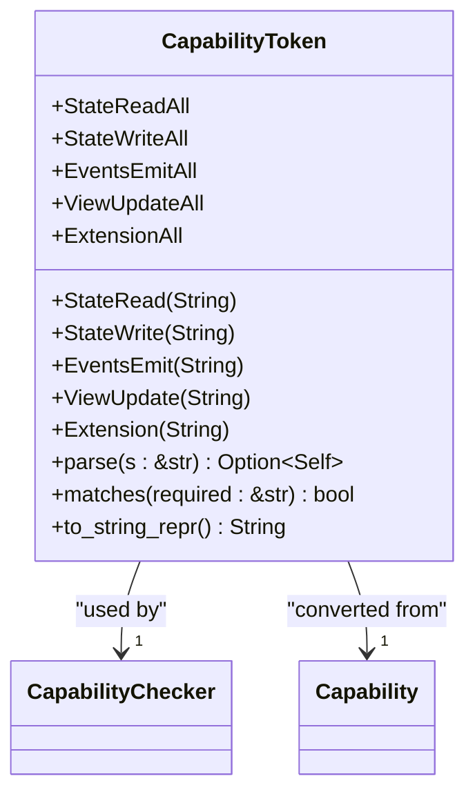
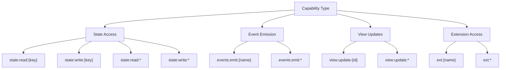
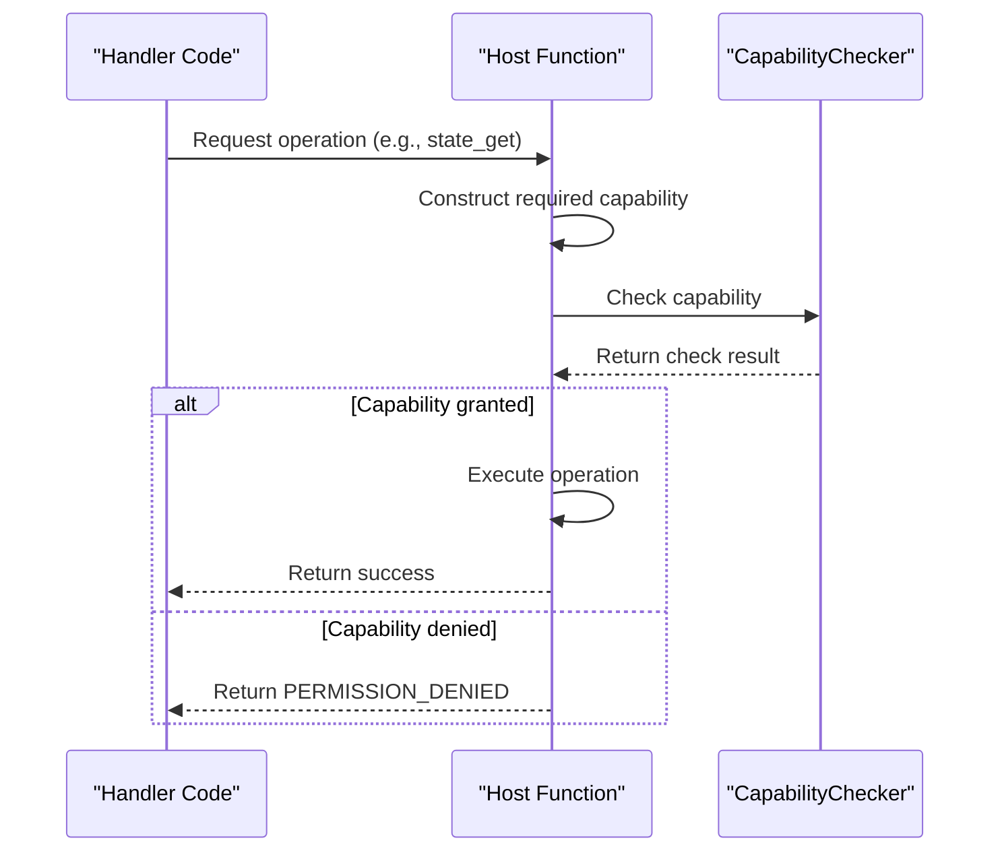
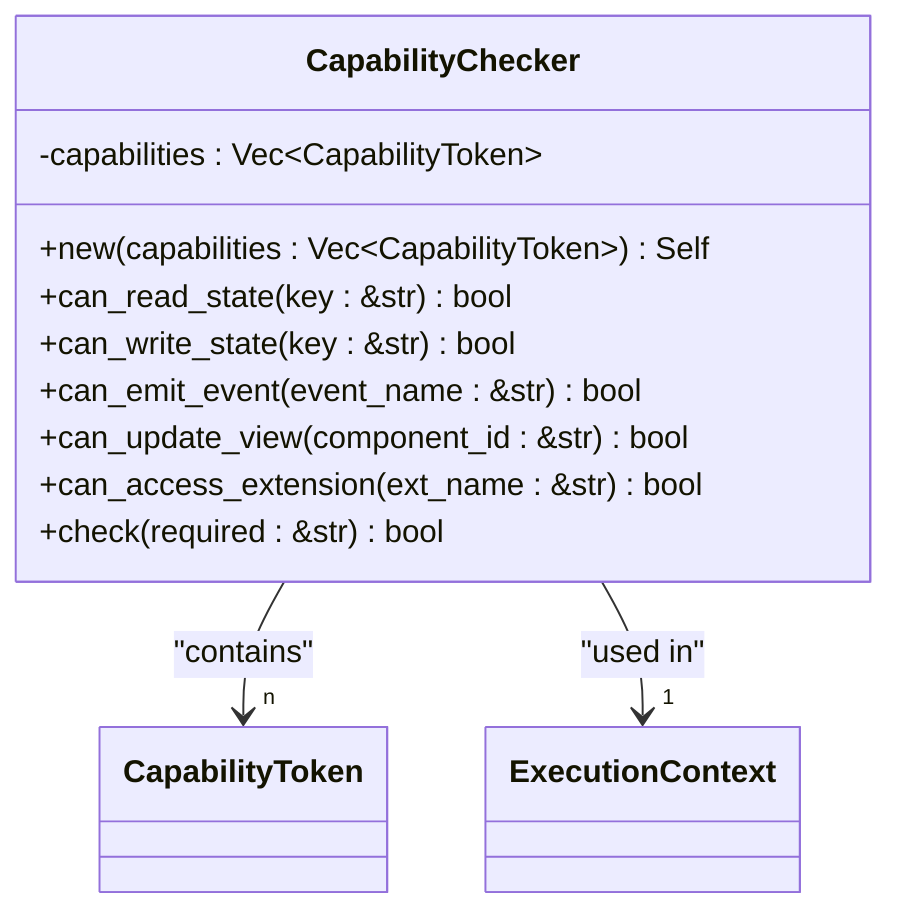
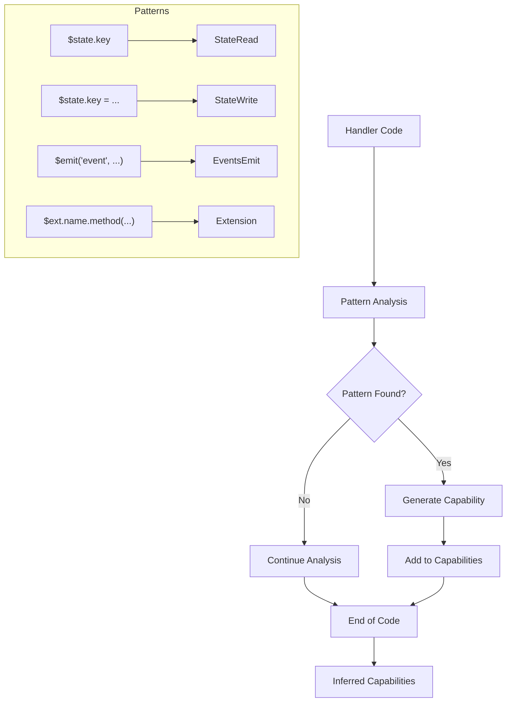
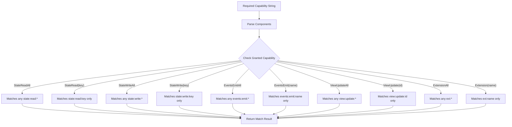
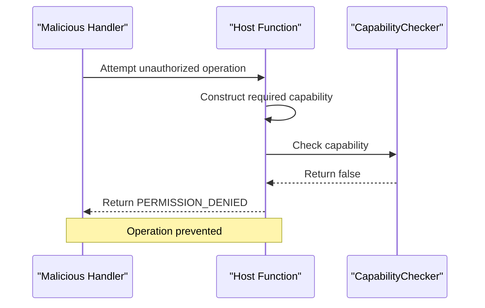

# Capability-Based Access Control

<cite>
**Referenced Files in This Document**   
- [capability.rs](file://runtime/nexus-wasm-bridge/src/capability.rs)
- [state.rs](file://runtime/nexus-wasm-bridge/src/host_functions/state.rs)
- [events.rs](file://runtime/nexus-wasm-bridge/src/host_functions/events.rs)
- [view.rs](file://runtime/nexus-wasm-bridge/src/host_functions/view.rs)
- [extension.rs](file://runtime/nexus-wasm-bridge/src/host_functions/extension.rs)
- [context.rs](file://runtime/nexus-wasm-bridge/src/context.rs)
- [02_runtime_spec.md](file://docs/02_runtime_spec.md)
- [01_reactor_spec.md](file://docs/01_reactor_spec.md)
</cite>

## Table of Contents
1. [Introduction](#introduction)
2. [CapabilityToken Enum Design](#capabilitytoken-enum-design)
3. [Capability Types and Scope Patterns](#capability-types-and-scope-patterns)
4. [Capability Enforcement Mechanism](#capability-enforcement-mechanism)
5. [CapabilityChecker Implementation](#capabilitychecker-implementation)
6. [Static Capability Inference](#static-capability-inference)
7. [NXML Declaration Syntax](#nxml-declaration-syntax)
8. [Capability Matching Algorithm](#capability-matching-algorithm)
9. [Security Model and Unauthorized Operation Prevention](#security-model-and-unauthorized-operation-prevention)
10. [Conclusion](#conclusion)

## Introduction

The Nexus capability-based access control system implements a fine-grained security model that governs access to state, events, view updates, and extensions. This system ensures that handlers can only perform operations for which they have explicitly declared capabilities in the NXML configuration. The runtime enforces these capabilities at every host function call, preventing unauthorized access and maintaining system integrity. The design centers around the `CapabilityToken` enum, which defines the permission model, and the `CapabilityChecker` struct, which performs real-time validation during execution.

**Section sources**
- [capability.rs](file://runtime/nexus-wasm-bridge/src/capability.rs#L1-L383)

## CapabilityToken Enum Design

The `CapabilityToken` enum is the core data structure that defines the fine-grained permissions within the Nexus system. It represents five distinct capability types, each with specific scope patterns and wildcard support. The enum is designed to be both human-readable and machine-parsable, with a string representation format that follows a consistent pattern: `{domain}:{operation}:{scope}`.

The enum variants include:
- `StateRead(String)` and `StateReadAll`: For reading specific state keys or all state
- `StateWrite(String)` and `StateWriteAll`: For writing specific state keys or all state
- `EventsEmit(String)` and `EventsEmitAll`: For emitting specific events or all events
- `ViewUpdate(String)` and `ViewUpdateAll`: For updating specific components or all components
- `Extension(String)` and `ExtensionAll`: For accessing specific extensions or all extensions

The `CapabilityToken` implements `From<String>` and `Into<String>` traits, enabling seamless conversion between string representations and enum instances. This design allows capabilities to be easily serialized, transmitted, and stored while maintaining type safety within the runtime.



**Diagram sources**
- [capability.rs](file://runtime/nexus-wasm-bridge/src/capability.rs#L12-L33)

**Section sources**
- [capability.rs](file://runtime/nexus-wasm-bridge/src/capability.rs#L9-L118)

## Capability Types and Scope Patterns

The Nexus system defines five capability types that govern access to different system resources. Each capability type follows a specific scope pattern that determines the granularity of access.

### State Access Capabilities
State access capabilities control read and write operations on the reactive state system. They follow the pattern `state:{operation}:{key}` where:
- `state:read:{key}` grants read access to a specific state key
- `state:write:{key}` grants write access to a specific state key
- `state:read:*` grants read access to all state keys
- `state:write:*` grants write access to all state keys

### Event Emission Capabilities
Event emission capabilities control the ability to emit events to the host system. They follow the pattern `events:emit:{name}` where:
- `events:emit:{name}` grants permission to emit a specific event
- `events:emit:*` grants permission to emit any event

### View Update Capabilities
View update capabilities control imperative UI manipulations. They follow the pattern `view:update:{id}` where:
- `view:update:{id}` grants permission to update a specific component
- `view:update:*` grants permission to update any component

### Extension Access Capabilities
Extension access capabilities control access to external services and APIs. They follow the pattern `ext:{name}` where:
- `ext:{name}` grants access to a specific extension
- `ext:*` grants access to all extensions

The scope patterns support both specific targeting and wildcard access, allowing for flexible security policies that balance security with usability.



**Diagram sources**
- [capability.rs](file://runtime/nexus-wasm-bridge/src/capability.rs#L13-L32)

**Section sources**
- [capability.rs](file://runtime/nexus-wasm-bridge/src/capability.rs#L13-L32)

## Capability Enforcement Mechanism

The capability enforcement mechanism is implemented at the host function level, where every operation that requires permission checks the caller's capabilities before execution. This enforcement happens in real-time during handler execution, ensuring that unauthorized operations are prevented immediately.

When a handler attempts to perform an operation, the corresponding host function first constructs the required capability string and then checks if the handler's granted capabilities match this requirement. For example, when reading a state value, the `state_get` function constructs the capability string `state:read:{key}` and verifies that the handler has either this specific capability or the wildcard `state:read:*` capability.

The enforcement mechanism is implemented consistently across all host functions, including state access, event emission, view updates, and extension calls. Each host function performs capability checks before executing the requested operation, returning a `PERMISSION_DENIED` error if the required capability is not present.



**Diagram sources**
- [state.rs](file://runtime/nexus-wasm-bridge/src/host_functions/state.rs#L22-L26)
- [events.rs](file://runtime/nexus-wasm-bridge/src/host_functions/events.rs#L22-L26)
- [view.rs](file://runtime/nexus-wasm-bridge/src/host_functions/view.rs#L22-L30)
- [extension.rs](file://runtime/nexus-wasm-bridge/src/host_functions/extension.rs#L43-L47)

**Section sources**
- [state.rs](file://runtime/nexus-wasm-bridge/src/host_functions/state.rs#L19-L30)
- [events.rs](file://runtime/nexus-wasm-bridge/src/host_functions/events.rs#L19-L27)
- [view.rs](file://runtime/nexus-wasm-bridge/src/host_functions/view.rs#L19-L34)
- [extension.rs](file://runtime/nexus-wasm-bridge/src/host_functions/extension.rs#L42-L48)

## CapabilityChecker Implementation

The `CapabilityChecker` struct is responsible for performing real-time permission validation during host function calls. It maintains a collection of `CapabilityToken` instances that represent the capabilities granted to a handler and provides methods to check various types of operations.

The implementation follows a simple but effective design pattern. The checker stores the granted capabilities in a vector and provides specialized methods for common operations such as reading state, writing state, emitting events, updating views, and accessing extensions. Each method constructs the required capability string and checks if any of the granted capabilities match this requirement using the `matches` method of `CapabilityToken`.

The `CapabilityChecker` is initialized with a vector of `CapabilityToken` instances, typically derived from the NXML configuration. It provides both specific checking methods (e.g., `can_read_state`, `can_write_state`) and a generic `check` method that accepts any capability string. This design allows for efficient permission checks while maintaining a clean API.

The checker's implementation is optimized for performance, using early termination in the `any` method call that iterates through the capabilities. This ensures that the check stops as soon as a matching capability is found, minimizing unnecessary comparisons.



**Diagram sources**
- [capability.rs](file://runtime/nexus-wasm-bridge/src/capability.rs#L179-L224)

**Section sources**
- [capability.rs](file://runtime/nexus-wasm-bridge/src/capability.rs#L179-L224)

## Static Capability Inference

The Nexus system includes a static analysis function `infer_capabilities` that automatically detects required capabilities from handler code by analyzing specific patterns. This feature allows the system to infer capabilities when they are not explicitly declared in the NXML configuration, providing a convenient way to ensure proper security without manual capability specification.

The inference algorithm uses pattern matching to detect operations that require specific capabilities:
- `$state.key` or `$state['key']` patterns indicate state read operations
- `$state.key = ...` or `$state['key'] = ...` patterns indicate state write operations
- `$emit('event', ...)` patterns indicate event emission
- `$ext.name.method(...)` patterns indicate extension access

The implementation uses regular expressions to find these patterns in the handler code and generates the corresponding `CapabilityToken` instances. For example, when the pattern `$state.count = 42` is detected, the system infers a `StateWrite("count")` capability. Similarly, when `$emit('toast', 'Hello')` is found, it infers an `EventsEmit("toast")` capability.

This static analysis is performed during the parsing phase, allowing the system to automatically grant necessary capabilities even when they are not explicitly declared. The inferred capabilities are then validated against the security policy, ensuring that the handler has appropriate permissions for all operations it attempts to perform.



**Diagram sources**
- [capability.rs](file://runtime/nexus-wasm-bridge/src/capability.rs#L227-L327)
- [02_runtime_spec.md](file://docs/02_runtime_spec.md#L908-L957)

**Section sources**
- [capability.rs](file://runtime/nexus-wasm-bridge/src/capability.rs#L226-L327)

## NXML Declaration Syntax

Capabilities are declared in the NXML configuration using the `<Capabilities>` element within the `<Logic>` section. This declaration is mandatory and must explicitly list all capabilities required by the handlers in the panel.

The NXML syntax for capability declarations follows a structured format:

```xml
<Logic>
  <Capabilities>
    <Capability type="state:read" scope="count" />
    <Capability type="state:write" scope="count" />
    <Capability type="events:emit" scope="toast" />
    <Capability type="view:update" scope="logs" />
    <Capability type="ext" scope="http" />
  </Capabilities>
  <!-- Tools and handlers -->
</Logic>
```

Each `<Capability>` element has two attributes:
- `type`: Specifies the capability type (e.g., "state:read", "events:emit")
- `scope`: Specifies the scope of the capability (e.g., state key, event name, component ID, extension name)

The `scope` attribute can contain a wildcard `*` to grant broad permissions. For example, `scope="*"` with `type="state:read"` grants read access to all state keys.

The NXML parser validates these declarations during the parsing phase, ensuring that all capability types are valid and that the structure is correct. The declared capabilities are then converted to `CapabilityToken` instances and associated with the corresponding handlers for runtime enforcement.

**Section sources**
- [02_runtime_spec.md](file://docs/02_runtime_spec.md#L835-L839)

## Capability Matching Algorithm

The capability matching algorithm is implemented in the `matches` method of the `CapabilityToken` enum. This algorithm determines whether a granted capability satisfies a required capability string, enabling flexible permission checks with support for wildcard patterns.

The matching logic follows these rules:
- A `StateReadAll` capability matches any `state:read:{key}` requirement
- A `StateRead(key)` capability matches only the specific `state:read:{key}` requirement
- A `StateWriteAll` capability matches any `state:write:{key}` requirement
- A `StateWrite(key)` capability matches only the specific `state:write:{key}` requirement
- An `EventsEmitAll` capability matches any `events:emit:{name}` requirement
- An `EventsEmit(name)` capability matches only the specific `events:emit:{name}` requirement
- A `ViewUpdateAll` capability matches any `view:update:{id}` requirement
- A `ViewUpdate(id)` capability matches only the specific `view:update:{id}` requirement
- An `ExtensionAll` capability matches any `ext:{name}` requirement
- An `Extension(name)` capability matches only the specific `ext:{name}` requirement

The algorithm parses the required capability string into components and performs pattern matching based on the granted capability type. This approach allows for efficient and accurate permission checks while supporting the wildcard functionality that enables broad access patterns.

The matching algorithm is designed to be both secure and flexible, ensuring that capabilities are not over-privileged while still allowing for practical use cases where broad permissions are necessary.



**Diagram sources**
- [capability.rs](file://runtime/nexus-wasm-bridge/src/capability.rs#L56-L82)

**Section sources**
- [capability.rs](file://runtime/nexus-wasm-bridge/src/capability.rs#L56-L82)

## Security Model and Unauthorized Operation Prevention

The Nexus capability-based security model prevents unauthorized operations through strict runtime enforcement and comprehensive validation. When a handler attempts to perform an operation without the required capability, the system immediately rejects the request and returns a `PERMISSION_DENIED` error.

This prevention mechanism is implemented consistently across all host functions. For example, in the `state_get` function, if the handler does not have the required `state:read:{key}` capability or the wildcard `state:read:*` capability, the function returns an error without accessing the state. Similarly, the `emit_event` function checks for the appropriate `events:emit` capability before recording the event.

The system's security model follows the principle of least privilege, where handlers are granted only the minimum capabilities necessary to perform their functions. This approach minimizes the potential impact of compromised handlers and prevents privilege escalation attacks.

The combination of explicit capability declarations in NXML, static capability inference, and runtime enforcement creates a robust security framework that protects the system from unauthorized access while maintaining flexibility for legitimate operations.



**Section sources**
- [state.rs](file://runtime/nexus-wasm-bridge/src/host_functions/state.rs#L24-L26)
- [events.rs](file://runtime/nexus-wasm-bridge/src/host_functions/events.rs#L24-L26)
- [view.rs](file://runtime/nexus-wasm-bridge/src/host_functions/view.rs#L28-L30)
- [extension.rs](file://runtime/nexus-wasm-bridge/src/host_functions/extension.rs#L46-L47)

## Conclusion

The Nexus capability-based access control system provides a comprehensive security framework for governing access to state, events, view updates, and extensions. The system's design centers around the `CapabilityToken` enum, which defines fine-grained permissions with support for specific targeting and wildcard patterns. The `CapabilityChecker` struct performs real-time validation during host function calls, ensuring that handlers can only perform operations for which they have explicitly declared capabilities.

The system combines explicit capability declarations in NXML with static capability inference to ensure proper security configuration. The capability matching algorithm supports flexible permission checks while maintaining security, and the enforcement mechanism prevents unauthorized operations through consistent runtime validation.

This capability-based approach provides a robust security model that follows the principle of least privilege, protecting the system from unauthorized access and privilege escalation attacks while maintaining the flexibility needed for legitimate operations.