# Container Security

<cite>
**Referenced Files in This Document**
- [Dockerfile](file://runtime/images/Dockerfile)
- [deployment.yaml](file://runtime/k8s/deployment.yaml)
- [Cargo.toml](file://runtime/nexus-wasm-bridge/Cargo.toml)
- [package.json](file://runtime/workspace-kernel/package.json)
- [server.ts](file://runtime/workspace-kernel/src/server.ts)
- [config.ts](file://runtime/workspace-kernel/src/config.ts)
- [context.rs](file://runtime/nexus-wasm-bridge/src/context.rs)
- [capability.rs](file://runtime/nexus-wasm-bridge/src/capability.rs)
- [engine/mod.rs](file://runtime/nexus-wasm-bridge/src/engine/mod.rs)
- [compiler.rs](file://runtime/nexus-wasm-bridge/src/engine/compiler.rs)
- [state.rs](file://runtime/nexus-wasm-bridge/src/host_functions/state.rs)
- [events.rs](file://runtime/nexus-wasm-bridge/src/host_functions/events.rs)
- [02_runtime_spec.md](file://docs/02_runtime_spec.md)
</cite>

## Table of Contents
1. [Introduction](#introduction)
2. [Project Structure](#project-structure)
3. [Core Components](#core-components)
4. [Architecture Overview](#architecture-overview)
5. [Detailed Component Analysis](#detailed-component-analysis)
6. [Dependency Analysis](#dependency-analysis)
7. [Performance Considerations](#performance-considerations)
8. [Troubleshooting Guide](#troubleshooting-guide)
9. [Conclusion](#conclusion)

## Introduction
This document describes the container security model for the Nexus runtime, focusing on:
- A Docker multi-stage build that separates build-time and runtime environments to minimize attack surface
- Non-root user execution with dedicated nexus user and group, and filesystem ownership configuration
- Read-only root filesystem enforcement and its implications for runtime immutability
- Kubernetes security context settings including dropped capabilities and prevention of privilege escalation
- Minimal runtime dependencies installation and cleanup of package lists
- Cache volume implementation using a memory-backed emptyDir with size limits

## Project Structure
The security-relevant parts of the repository are organized around:
- Container build: runtime/images/Dockerfile
- Kubernetes deployment: runtime/k8s/deployment.yaml
- Runtime kernel (Node.js): runtime/workspace-kernel
- WASM bridge (Rust): runtime/nexus-wasm-bridge

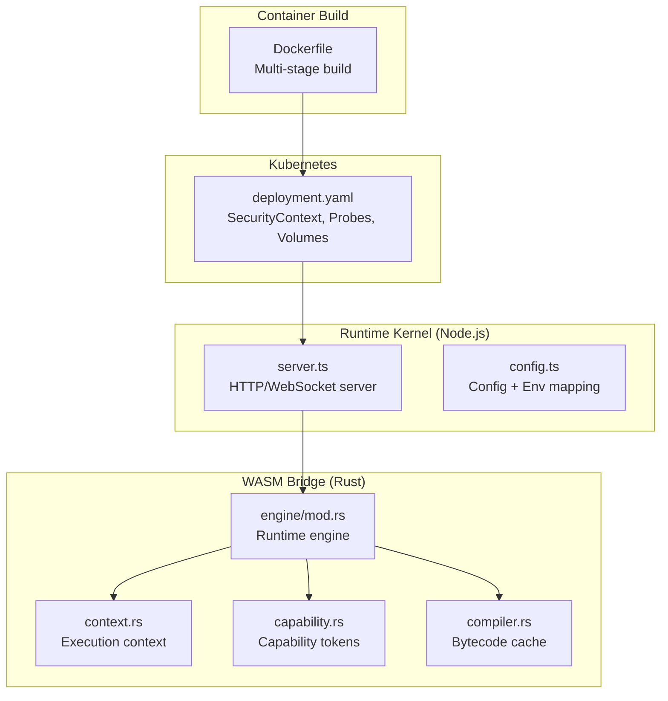

**Diagram sources**
- [Dockerfile](file://runtime/images/Dockerfile#L1-L152)
- [deployment.yaml](file://runtime/k8s/deployment.yaml#L1-L299)
- [server.ts](file://runtime/workspace-kernel/src/server.ts#L1-L703)
- [config.ts](file://runtime/workspace-kernel/src/config.ts#L1-L233)
- [context.rs](file://runtime/nexus-wasm-bridge/src/context.rs#L1-L695)
- [capability.rs](file://runtime/nexus-wasm-bridge/src/capability.rs#L1-L224)
- [engine/mod.rs](file://runtime/nexus-wasm-bridge/src/engine/mod.rs#L1-L244)
- [compiler.rs](file://runtime/nexus-wasm-bridge/src/engine/compiler.rs#L254-L296)

**Section sources**
- [Dockerfile](file://runtime/images/Dockerfile#L1-L152)
- [deployment.yaml](file://runtime/k8s/deployment.yaml#L1-L299)

## Core Components
- Docker multi-stage build:
  - Stage 1 builds the native WASM bridge module with Rust toolchain and WasmEdge libraries
  - Stage 2 builds the Node.js workspace kernel with production dependencies
  - Stage 3 produces the minimal runtime image with runtime-only dependencies and WasmEdge libraries
  - Stage 4 is a development image with build tools and Rust installed
- Non-root user and filesystem ownership:
  - Creates a dedicated nexus user and group, sets ownership of application directories, and switches to the non-root user
- Read-only root filesystem:
  - Enforced via Kubernetes securityContext for the container
- Kubernetes security context:
  - runAsNonRoot, runAsUser, runAsGroup, fsGroup configured
  - allowPrivilegeEscalation disabled
  - capabilities dropped ALL
- Runtime dependencies and cleanup:
  - Installs minimal runtime dependencies in the production stage and cleans package lists
- Cache volume:
  - Uses an emptyDir with Memory medium and a size limit mounted at the cache directory

**Section sources**
- [Dockerfile](file://runtime/images/Dockerfile#L54-L103)
- [deployment.yaml](file://runtime/k8s/deployment.yaml#L61-L129)
- [deployment.yaml](file://runtime/k8s/deployment.yaml#L120-L134)

## Architecture Overview
The runtime architecture enforces security at multiple layers:
- Container build isolates build-time toolchains from the runtime image
- Kubernetes enforces non-root execution and capability drops
- Node.js runtime enforces authentication and validates requests
- WASM bridge enforces capability-based access control and resource limits

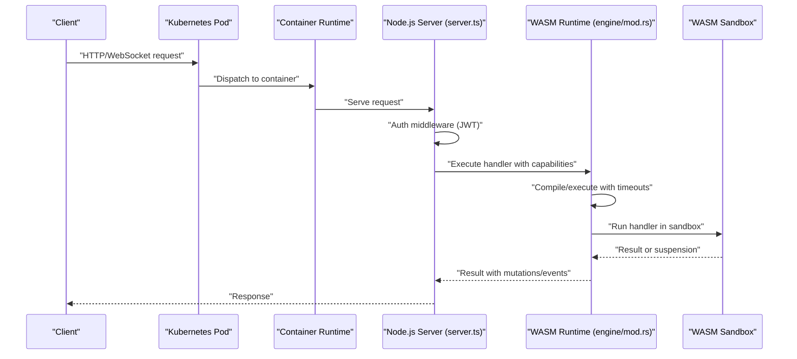

**Diagram sources**
- [deployment.yaml](file://runtime/k8s/deployment.yaml#L61-L129)
- [server.ts](file://runtime/workspace-kernel/src/server.ts#L1-L703)
- [engine/mod.rs](file://runtime/nexus-wasm-bridge/src/engine/mod.rs#L55-L120)

## Detailed Component Analysis

### Docker Multi-Stage Build and Attack Surface Reduction
- Build stage (Rust):
  - Installs WasmEdge runtime dependencies and WasmEdge itself
  - Builds the native module with cargo
- Node.js build stage:
  - Copies package manifests and installs production dependencies
  - Compiles TypeScript sources
- Production runtime stage:
  - Installs minimal runtime dependencies (e.g., C++ runtime and certificates)
  - Installs WasmEdge libraries only
  - Copies built artifacts from earlier stages
  - Creates a non-root user and sets ownership
  - Creates a cache directory owned by the non-root user
  - Switches to the non-root user
  - Sets environment variables and exposes ports
  - Adds a health check
- Development stage:
  - Installs build essentials, Rust, and WasmEdge for local development

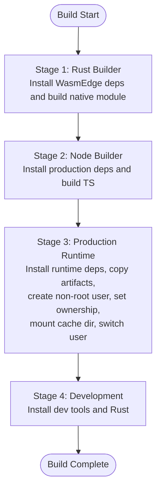

**Diagram sources**
- [Dockerfile](file://runtime/images/Dockerfile#L1-L152)

**Section sources**
- [Dockerfile](file://runtime/images/Dockerfile#L1-L152)

### Non-Root User Execution and Filesystem Ownership
- Creates a dedicated nexus user and group
- Ensures ownership of application directories and cache directory
- Switches to the non-root user for the runtime container

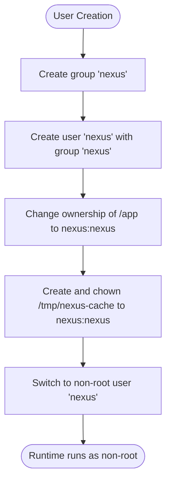

**Diagram sources**
- [Dockerfile](file://runtime/images/Dockerfile#L76-L83)

**Section sources**
- [Dockerfile](file://runtime/images/Dockerfile#L76-L83)

### Read-Only Root Filesystem Enforcement
- Kubernetes securityContext sets:
  - readOnlyRootFilesystem: true
  - allowPrivilegeEscalation: false
  - capabilities.drop: ALL

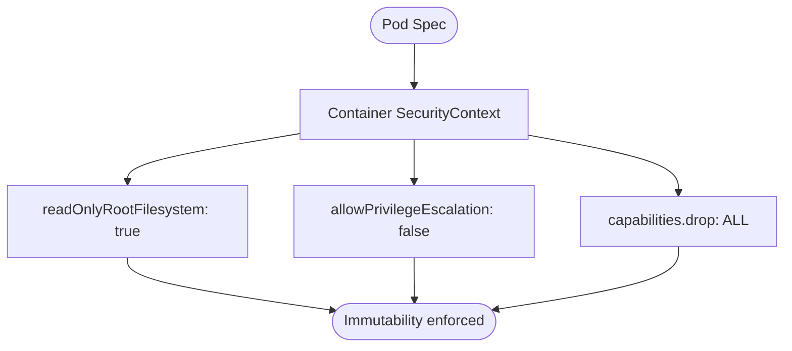

**Diagram sources**
- [deployment.yaml](file://runtime/k8s/deployment.yaml#L120-L129)

**Section sources**
- [deployment.yaml](file://runtime/k8s/deployment.yaml#L120-L129)

### Kubernetes Security Context Settings
- Pod-level securityContext:
  - runAsNonRoot: true
  - runAsUser/runAsGroup/fsGroup: configured numeric IDs
- Container-level securityContext:
  - readOnlyRootFilesystem: true
  - allowPrivilegeEscalation: false
  - capabilities.drop: ALL

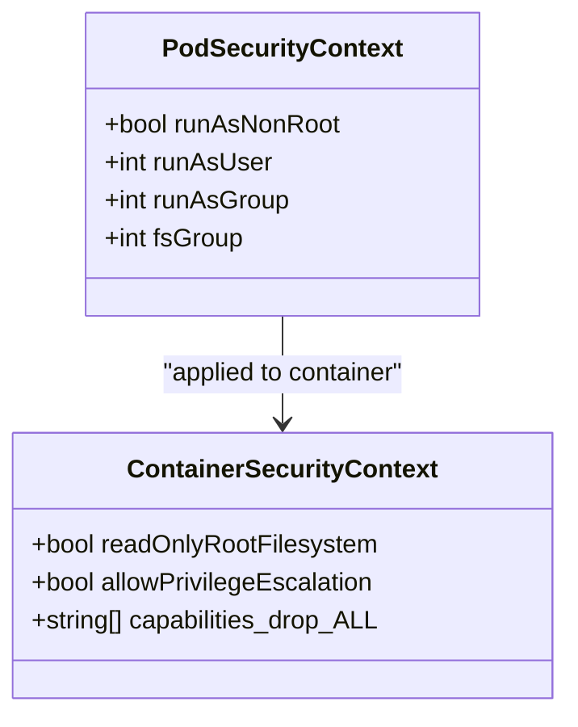

**Diagram sources**
- [deployment.yaml](file://runtime/k8s/deployment.yaml#L61-L129)

**Section sources**
- [deployment.yaml](file://runtime/k8s/deployment.yaml#L61-L129)

### Runtime Dependencies Installation and Cleanup
- Production stage installs minimal runtime dependencies and removes package lists to reduce image size and potential exposure
- Development stage installs additional build tools and Rust for local development

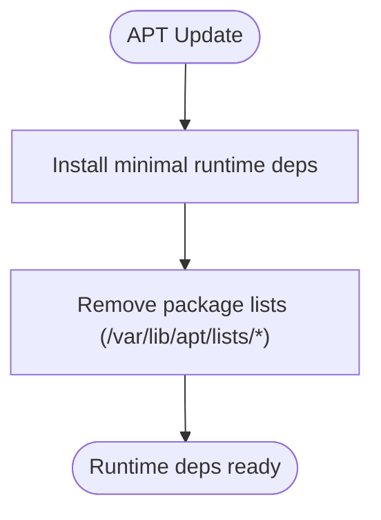

**Diagram sources**
- [Dockerfile](file://runtime/images/Dockerfile#L58-L63)

**Section sources**
- [Dockerfile](file://runtime/images/Dockerfile#L58-L63)

### Cache Volume Implementation (Memory-backed emptyDir)
- Mounts a cache directory at /tmp/nexus-cache
- Uses an emptyDir with Memory medium and a size limit
- Node.js runtime reads and writes cache via environment variable

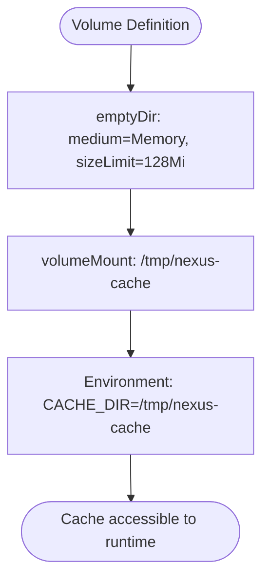

**Diagram sources**
- [deployment.yaml](file://runtime/k8s/deployment.yaml#L120-L134)
- [config.ts](file://runtime/workspace-kernel/src/config.ts#L19-L25)

**Section sources**
- [deployment.yaml](file://runtime/k8s/deployment.yaml#L120-L134)
- [config.ts](file://runtime/workspace-kernel/src/config.ts#L19-L25)

### Capability-Based Access Control and Secure Defaults
- Capability tokens define precise permissions for state, events, view updates, and extensions
- Host functions enforce capability checks before performing operations
- Runtime configuration enforces timeouts, memory limits, and host call counts
- Secure defaults:
  - No capabilities by default
  - Explicit capability declaration required
  - Principle of least privilege
  - Immutable context in WASM (mutations collected and applied in JS)
  - No dynamic code generation

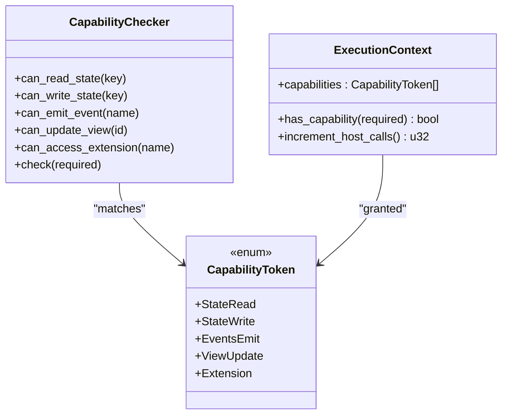

**Diagram sources**
- [capability.rs](file://runtime/nexus-wasm-bridge/src/capability.rs#L1-L224)
- [context.rs](file://runtime/nexus-wasm-bridge/src/context.rs#L496-L588)
- [state.rs](file://runtime/nexus-wasm-bridge/src/host_functions/state.rs#L45-L87)
- [events.rs](file://runtime/nexus-wasm-bridge/src/host_functions/events.rs#L78-L123)
- [02_runtime_spec.md](file://docs/02_runtime_spec.md#L868-L906)

**Section sources**
- [capability.rs](file://runtime/nexus-wasm-bridge/src/capability.rs#L1-L224)
- [context.rs](file://runtime/nexus-wasm-bridge/src/context.rs#L496-L588)
- [state.rs](file://runtime/nexus-wasm-bridge/src/host_functions/state.rs#L45-L87)
- [events.rs](file://runtime/nexus-wasm-bridge/src/host_functions/events.rs#L78-L123)
- [02_runtime_spec.md](file://docs/02_runtime_spec.md#L868-L906)
- [02_runtime_spec.md](file://docs/02_runtime_spec.md#L2014-L2027)

### Runtime Engine and Bytecode Cache
- WasmRuntime manages instance pooling, compilation caching, and handler execution with timeouts
- Compiler maintains an in-memory cache and disk cache eviction policy
- Execution metrics and statistics are tracked

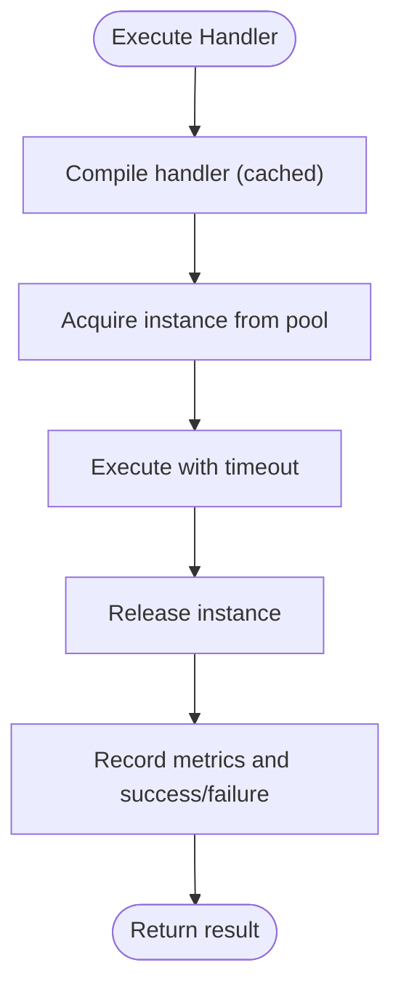

**Diagram sources**
- [engine/mod.rs](file://runtime/nexus-wasm-bridge/src/engine/mod.rs#L55-L120)
- [compiler.rs](file://runtime/nexus-wasm-bridge/src/engine/compiler.rs#L254-L296)

**Section sources**
- [engine/mod.rs](file://runtime/nexus-wasm-bridge/src/engine/mod.rs#L55-L120)
- [compiler.rs](file://runtime/nexus-wasm-bridge/src/engine/compiler.rs#L254-L296)

### Node.js Server Security Controls
- Authentication middleware verifies JWT tokens for protected endpoints
- CORS configuration controlled by environment variables
- Request logging and structured error handling
- WebSocket upgrade path validates panel existence and optional JWT token

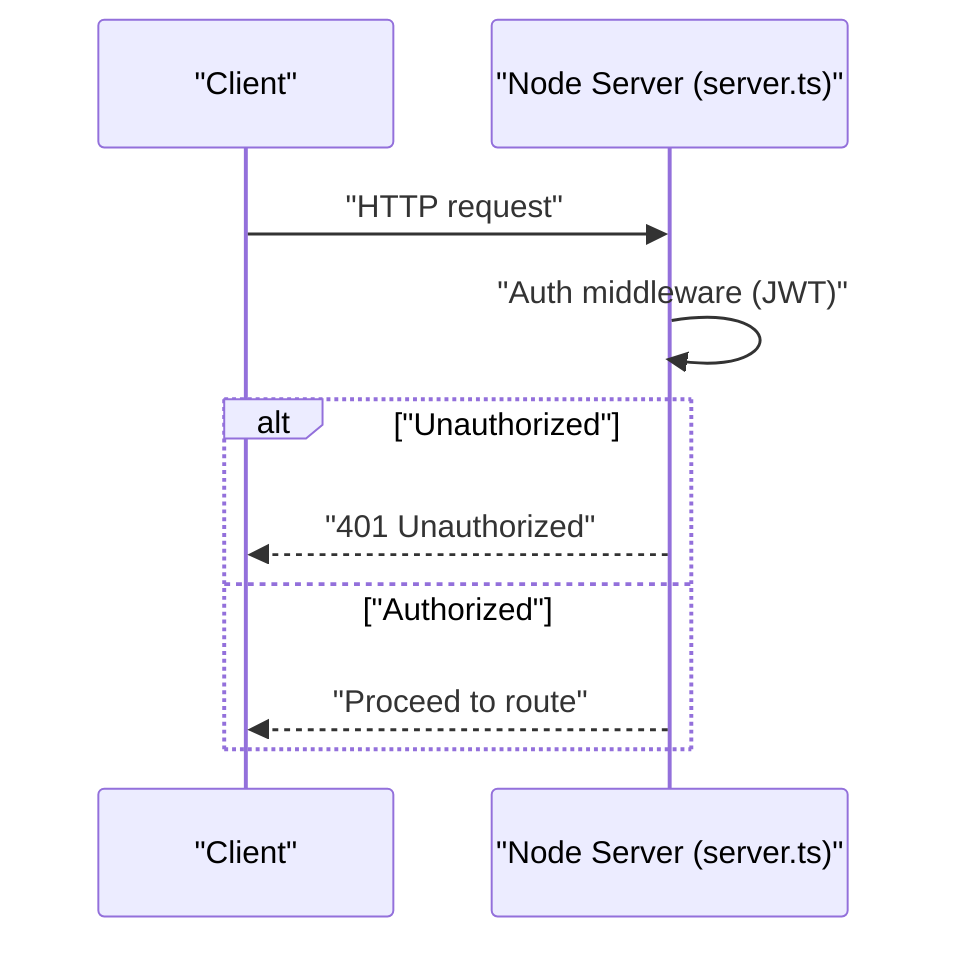

**Diagram sources**
- [server.ts](file://runtime/workspace-kernel/src/server.ts#L99-L129)

**Section sources**
- [server.ts](file://runtime/workspace-kernel/src/server.ts#L99-L129)

## Dependency Analysis
- Container build dependencies:
  - Rust builder depends on WasmEdge toolchain and LLVM/Clang
  - Node builder depends on Node.js and npm
  - Production runtime depends on minimal system libraries and WasmEdge libraries
- Kubernetes dependencies:
  - Deployment references ConfigMap and Secret for configuration and secrets
  - SecurityContext applies to the container
  - Volume mounts cache directory

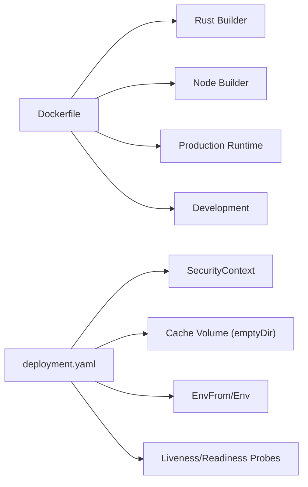

**Diagram sources**
- [Dockerfile](file://runtime/images/Dockerfile#L1-L152)
- [deployment.yaml](file://runtime/k8s/deployment.yaml#L1-L299)

**Section sources**
- [Dockerfile](file://runtime/images/Dockerfile#L1-L152)
- [deployment.yaml](file://runtime/k8s/deployment.yaml#L1-L299)

## Performance Considerations
- Multi-stage build reduces final image size and attack surface
- Read-only root filesystem prevents accidental writes and improves immutability
- Memory-backed cache volume reduces disk I/O overhead for cache operations
- Instance pooling and bytecode caching in the WASM runtime improve throughput and latency
- Resource limits (CPU/memory) and timeouts prevent resource exhaustion

[No sources needed since this section provides general guidance]

## Troubleshooting Guide
- Health checks:
  - The container exposes a health endpoint checked by Kubernetes probes
- Authentication failures:
  - Verify JWT secret is set and tokens are valid
- Cache issues:
  - Confirm cache volume is mounted and writable under the non-root user
- Capability denials:
  - Ensure handlers declare required capabilities in NXML; verify capability enforcement logic

**Section sources**
- [Dockerfile](file://runtime/images/Dockerfile#L98-L100)
- [deployment.yaml](file://runtime/k8s/deployment.yaml#L104-L119)
- [server.ts](file://runtime/workspace-kernel/src/server.ts#L99-L129)
- [capability.rs](file://runtime/nexus-wasm-bridge/src/capability.rs#L1-L224)

## Conclusion
The Nexus runtime employs layered security:
- A multi-stage Docker build minimizes the runtime image’s attack surface
- Non-root execution and filesystem ownership ensure least privilege
- Kubernetes securityContext enforces capability drops and prevents privilege escalation
- Minimal runtime dependencies and cleanup reduce risk
- A memory-backed cache volume with size limits supports performance and isolation
- Capability-based access control and secure defaults protect against unauthorized operations
- Node.js server and WASM runtime enforce authentication, timeouts, and resource limits