# Network Security

<cite>
**Referenced Files in This Document**
- [deployment.yaml](file://runtime/k8s/deployment.yaml)
- [server.ts](file://runtime/workspace-kernel/src/server.ts)
- [config.ts](file://runtime/workspace-kernel/src/config.ts)
- [types.ts](file://runtime/workspace-kernel/src/types.ts)
- [capability.rs](file://runtime/nexus-wasm-bridge/src/capability.rs)
- [metrics.rs](file://runtime/nexus-wasm-bridge/src/metrics.rs)
- [Dockerfile](file://runtime/images/Dockerfile)
</cite>

## Table of Contents
1. [Introduction](#introduction)
2. [Project Structure](#project-structure)
3. [Core Components](#core-components)
4. [Architecture Overview](#architecture-overview)
5. [Detailed Component Analysis](#detailed-component-analysis)
6. [Dependency Analysis](#dependency-analysis)
7. [Performance Considerations](#performance-considerations)
8. [Troubleshooting Guide](#troubleshooting-guide)
9. [Conclusion](#conclusion)

## Introduction
This document describes the Nexus network security model and Kubernetes networking implementation. It explains how ingress and egress traffic are restricted to authorized sources, how HTTP and WebSocket traffic are configured, how timeouts are enforced, how Prometheus metrics are exposed, and how the nexus-runtime namespace isolates runtime traffic from the rest of the cluster. It also details the ingress-nginx integration and service exposure patterns.

## Project Structure
The network security model is primarily defined in the Kubernetes manifests and runtime server configuration:
- Kubernetes manifests define namespaces, services, ingress, autoscaling, PodDisruptionBudget, and NetworkPolicy.
- The runtime server exposes HTTP and WebSocket endpoints and integrates with ingress-nginx.
- Configuration controls timeouts, authentication, and extension behavior.
- Security enforcement occurs at the capability boundary in the WASM bridge.

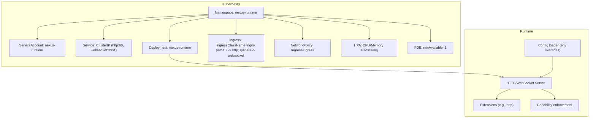

**Diagram sources**
- [deployment.yaml](file://runtime/k8s/deployment.yaml#L1-L298)
- [server.ts](file://runtime/workspace-kernel/src/server.ts#L46-L103)
- [config.ts](file://runtime/workspace-kernel/src/config.ts#L1-L123)

**Section sources**
- [deployment.yaml](file://runtime/k8s/deployment.yaml#L1-L298)

## Core Components
- Kubernetes Namespace: isolates runtime resources.
- Service: exposes HTTP and WebSocket ports internally.
- Ingress: routes external traffic to the service, enabling WebSocket upgrades and long-running timeouts.
- NetworkPolicy: restricts inbound traffic to ingress-nginx and monitoring namespaces and outbound traffic to DNS and public HTTP/HTTPS.
- Prometheus annotations: enable scraping of runtime metrics.
- Runtime Server: provides HTTP and WebSocket endpoints, authentication, and metrics.

**Section sources**
- [deployment.yaml](file://runtime/k8s/deployment.yaml#L1-L298)
- [server.ts](file://runtime/workspace-kernel/src/server.ts#L130-L152)
- [config.ts](file://runtime/workspace-kernel/src/config.ts#L1-L123)

## Architecture Overview
The runtime is deployed in the nexus-runtime namespace. Inbound traffic is strictly limited to ingress-nginx and monitoring namespaces. Outbound traffic is limited to DNS and public HTTP/HTTPS. Prometheus scrapes metrics from the runtime’s HTTP port. The ingress controller terminates TLS and forwards requests to the service, with special handling for WebSocket upgrades and long-lived connections.

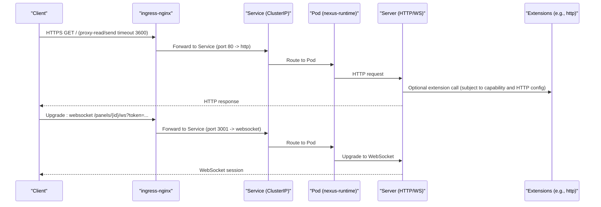

**Diagram sources**
- [deployment.yaml](file://runtime/k8s/deployment.yaml#L177-L206)
- [server.ts](file://runtime/workspace-kernel/src/server.ts#L130-L201)
- [config.ts](file://runtime/workspace-kernel/src/config.ts#L26-L37)

## Detailed Component Analysis

### Kubernetes NetworkPolicy
The NetworkPolicy enforces strict ingress and egress boundaries:
- Ingress:
  - Allows HTTP and WebSocket traffic from the ingress-nginx namespace to ports 3000 and 3001.
  - Allows Prometheus scraping from the monitoring namespace to port 3000.
- Egress:
  - Allows DNS queries to kube-dns pods.
  - Allows HTTP/HTTPS to public internet, excluding private IP ranges.

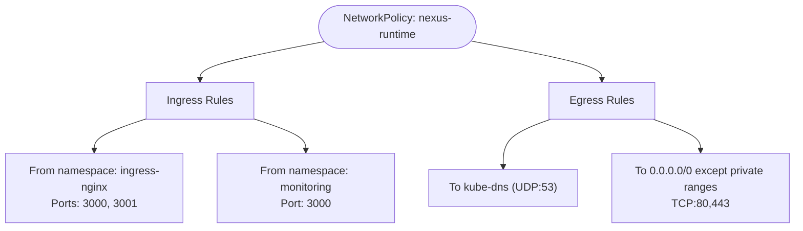

**Diagram sources**
- [deployment.yaml](file://runtime/k8s/deployment.yaml#L247-L298)

**Section sources**
- [deployment.yaml](file://runtime/k8s/deployment.yaml#L247-L298)

### Ingress Configuration (HTTP and WebSocket)
- Ingress class: nginx.
- Paths:
  - / -> HTTP service (port 80 targets container http).
  - /panels -> WebSocket service (port 3001 targets container websocket).
- Annotations:
  - proxy-read-timeout and proxy-send-timeout set to 3600 seconds to support long-running WebSocket sessions.
  - websocket-services annotation enables WebSocket upgrades for the named service.

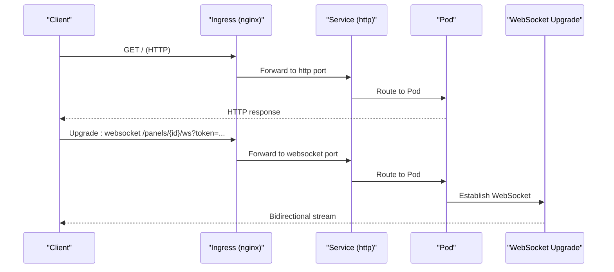

**Diagram sources**
- [deployment.yaml](file://runtime/k8s/deployment.yaml#L177-L206)
- [server.ts](file://runtime/workspace-kernel/src/server.ts#L155-L201)

**Section sources**
- [deployment.yaml](file://runtime/k8s/deployment.yaml#L177-L206)
- [server.ts](file://runtime/workspace-kernel/src/server.ts#L155-L201)

### Timeout Settings
- Ingress timeouts:
  - proxy-read-timeout: 3600 seconds.
  - proxy-send-timeout: 3600 seconds.
- Server-side:
  - HTTP server listens on configured ports.
  - Extensions HTTP default timeout is configurable via environment variables.
  - Runtime configuration includes a handler timeout and memory limits.

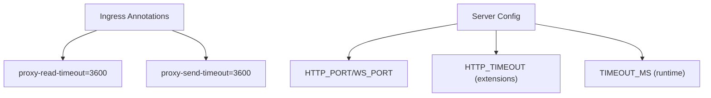

**Diagram sources**
- [deployment.yaml](file://runtime/k8s/deployment.yaml#L182-L186)
- [config.ts](file://runtime/workspace-kernel/src/config.ts#L80-L123)
- [Dockerfile](file://runtime/images/Dockerfile#L86-L95)

**Section sources**
- [deployment.yaml](file://runtime/k8s/deployment.yaml#L182-L186)
- [config.ts](file://runtime/workspace-kernel/src/config.ts#L80-L123)
- [Dockerfile](file://runtime/images/Dockerfile#L86-L95)

### Isolation of the nexus-runtime Namespace
- Dedicated namespace: nexus-runtime.
- ServiceAccount: nexus-runtime.
- Service: ClusterIP exposing http and websocket ports.
- Deployment: runs the runtime container with non-root security context and read-only root filesystem.
- Pod anti-affinity: distributes pods across nodes.
- Monitoring: Prometheus annotations on the pod template enable scraping of /metrics.

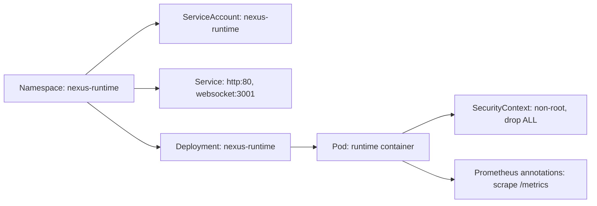

**Diagram sources**
- [deployment.yaml](file://runtime/k8s/deployment.yaml#L1-L175)
- [Dockerfile](file://runtime/images/Dockerfile#L76-L103)

**Section sources**
- [deployment.yaml](file://runtime/k8s/deployment.yaml#L1-L175)
- [Dockerfile](file://runtime/images/Dockerfile#L76-L103)

### Allowed Egress Traffic and Private IP Blocking
- Egress DNS: permitted to kube-dns pods (UDP:53).
- Egress HTTP/HTTPS: permitted to public internet with exceptions for private IP ranges:
  - 10.0.0.0/8
  - 172.16.0.0/12
  - 192.168.0.0/16

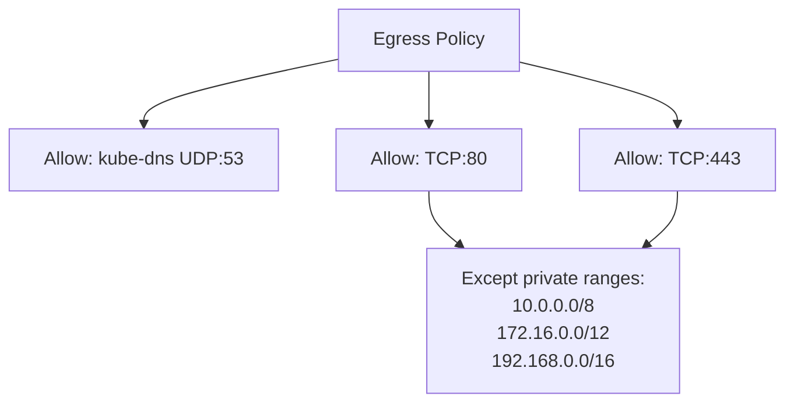

**Diagram sources**
- [deployment.yaml](file://runtime/k8s/deployment.yaml#L276-L298)

**Section sources**
- [deployment.yaml](file://runtime/k8s/deployment.yaml#L276-L298)

### Monitoring and Prometheus Scraping
- Prometheus annotations on the pod template:
  - prometheus.io/scrape: true
  - prometheus.io/port: 3000
  - prometheus.io/path: /metrics
- Metrics endpoint:
  - HTTP GET /metrics returns plain text Prometheus metrics.
  - Metrics are produced by the runtime and exported in Prometheus format.

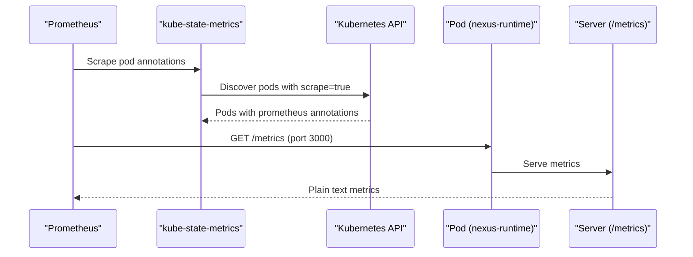

**Diagram sources**
- [deployment.yaml](file://runtime/k8s/deployment.yaml#L56-L60)
- [server.ts](file://runtime/workspace-kernel/src/server.ts#L504-L508)
- [metrics.rs](file://runtime/nexus-wasm-bridge/src/metrics.rs#L284-L339)

**Section sources**
- [deployment.yaml](file://runtime/k8s/deployment.yaml#L56-L60)
- [server.ts](file://runtime/workspace-kernel/src/server.ts#L504-L508)
- [metrics.rs](file://runtime/nexus-wasm-bridge/src/metrics.rs#L284-L339)

### Ingress-Nginx Integration and Service Exposure Patterns
- IngressClassName: nginx.
- Service exposure:
  - HTTP: Service port 80 targets containerPort http.
  - WebSocket: Service port 3001 targets containerPort websocket.
- WebSocket routing:
  - Path /panels routes to the websocket service.
  - Annotation nginx.ingress.kubernetes.io/websocket-services enables upgrade handling.

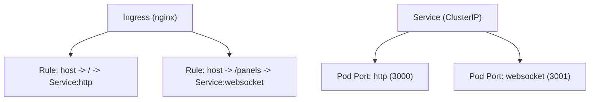

**Diagram sources**
- [deployment.yaml](file://runtime/k8s/deployment.yaml#L177-L206)

**Section sources**
- [deployment.yaml](file://runtime/k8s/deployment.yaml#L177-L206)

### Security Boundaries and Capability Enforcement
- Capability-based enforcement:
  - Handlers declare required capabilities; the runtime enforces them at host function calls.
  - Tokens include state reads/writes, event emissions, view updates, and extension access.
- JWT authentication:
  - HTTP requests can be protected by JWT verification.
  - WebSocket upgrades require a token query parameter when authentication is enabled.

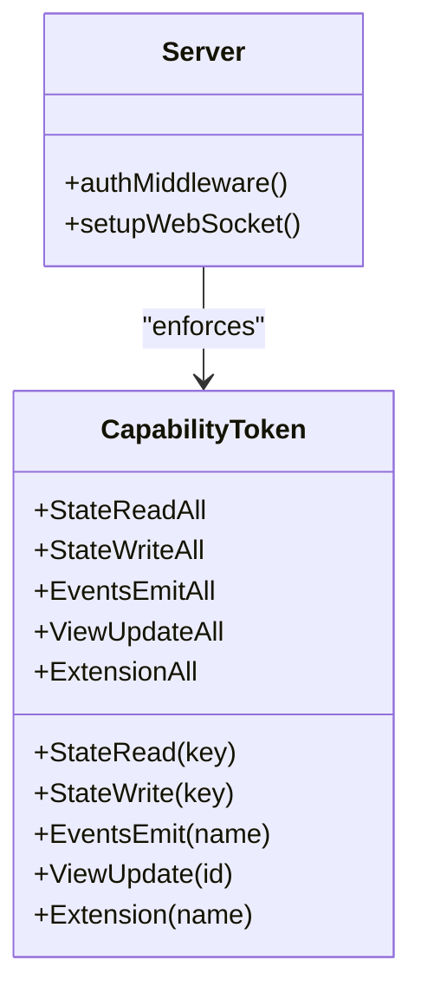

**Diagram sources**
- [capability.rs](file://runtime/nexus-wasm-bridge/src/capability.rs#L1-L33)
- [server.ts](file://runtime/workspace-kernel/src/server.ts#L99-L128)

**Section sources**
- [capability.rs](file://runtime/nexus-wasm-bridge/src/capability.rs#L1-L33)
- [server.ts](file://runtime/workspace-kernel/src/server.ts#L99-L128)

## Dependency Analysis
- Ingress depends on Service selectors and ports.
- Service depends on Deployment labels and container ports.
- NetworkPolicy depends on namespace labels and pod selectors.
- Prometheus scraping depends on pod annotations and the metrics endpoint.
- Runtime server depends on configuration loaded from environment variables.

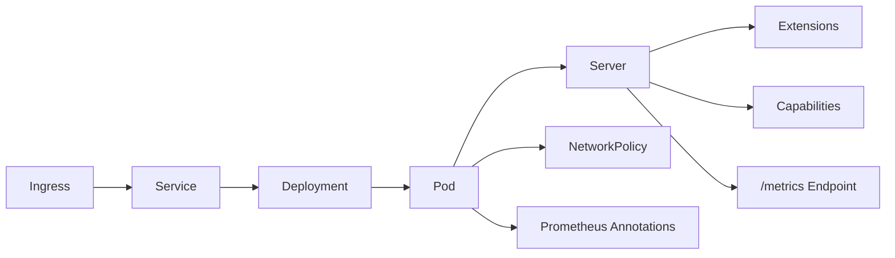

**Diagram sources**
- [deployment.yaml](file://runtime/k8s/deployment.yaml#L1-L298)
- [server.ts](file://runtime/workspace-kernel/src/server.ts#L130-L152)
- [config.ts](file://runtime/workspace-kernel/src/config.ts#L1-L123)

**Section sources**
- [deployment.yaml](file://runtime/k8s/deployment.yaml#L1-L298)
- [server.ts](file://runtime/workspace-kernel/src/server.ts#L130-L152)
- [config.ts](file://runtime/workspace-kernel/src/config.ts#L1-L123)

## Performance Considerations
- HorizontalPodAutoscaler scales based on CPU and memory utilization.
- PodDisruptionBudget ensures availability during maintenance.
- Runtime configuration includes limits for instances, memory, and timeouts to prevent resource exhaustion.
- Ingress timeouts are set high to support long-running WebSocket sessions.

**Section sources**
- [deployment.yaml](file://runtime/k8s/deployment.yaml#L208-L245)
- [config.ts](file://runtime/workspace-kernel/src/config.ts#L1-L123)

## Troubleshooting Guide
- Ingress not receiving WebSocket upgrades:
  - Verify ingressClassName is nginx and websocket-services annotation is set.
  - Confirm Service ports match container ports and Ingress paths route to the websocket service.
- Prometheus scraping fails:
  - Ensure prometheus.io/scrape=true, prometheus.io/port=3000, and prometheus.io/path=/metrics are present on the pod.
  - Confirm the metrics endpoint responds with plain text.
- Private IP egress blocked unexpectedly:
  - Review NetworkPolicy egress rules and private IP exceptions.
- Authentication failures:
  - For HTTP, ensure Authorization header is present and valid when auth is enabled.
  - For WebSocket, ensure token query parameter is provided and valid.

**Section sources**
- [deployment.yaml](file://runtime/k8s/deployment.yaml#L177-L206)
- [deployment.yaml](file://runtime/k8s/deployment.yaml#L56-L60)
- [deployment.yaml](file://runtime/k8s/deployment.yaml#L247-L298)
- [server.ts](file://runtime/workspace-kernel/src/server.ts#L99-L128)
- [server.ts](file://runtime/workspace-kernel/src/server.ts#L155-L201)

## Conclusion
The Nexus network security model confines inbound traffic to trusted namespaces and outbound traffic to essential services. Ingress-nginx terminates TLS and forwards both HTTP and WebSocket traffic to the runtime service. Prometheus scraping is enabled for observability. The runtime enforces capability-based security and supports JWT authentication. Together, these controls provide a secure, observable, and isolated runtime environment.