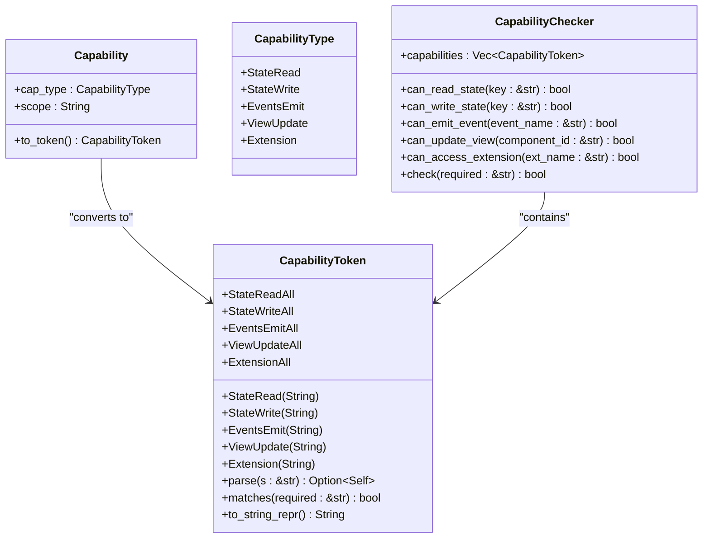
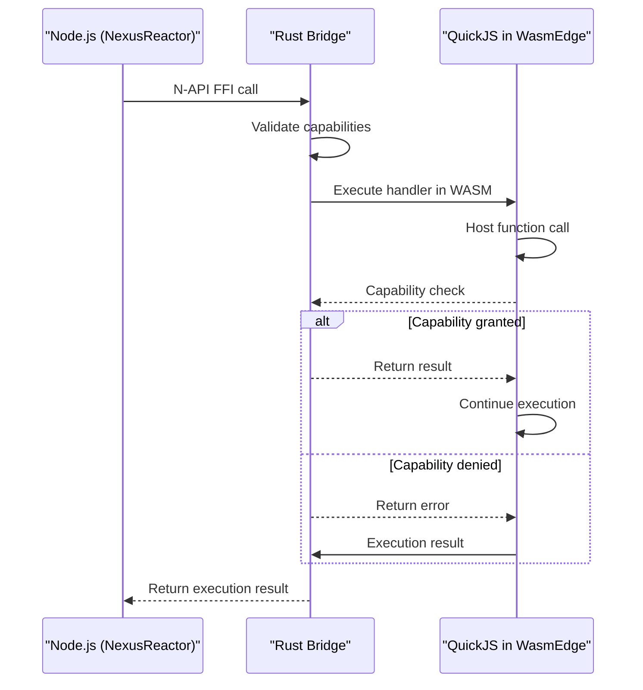
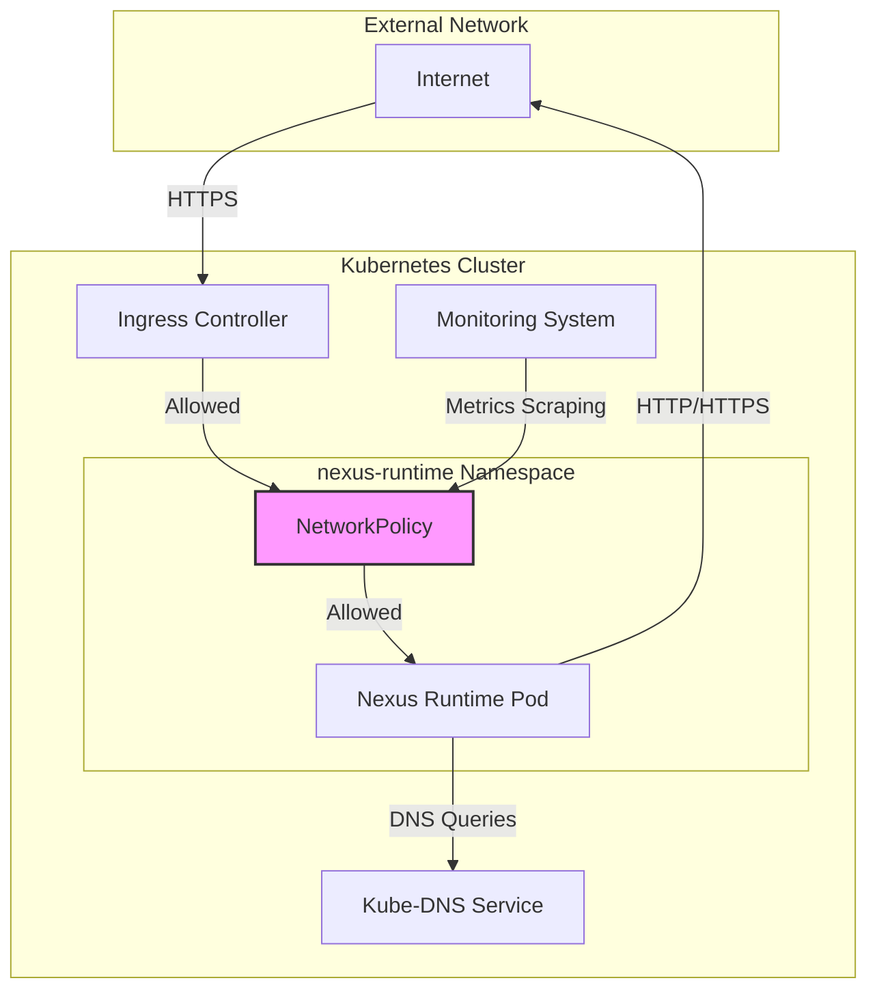
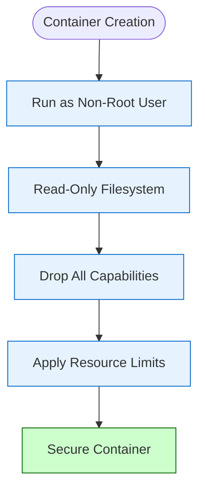
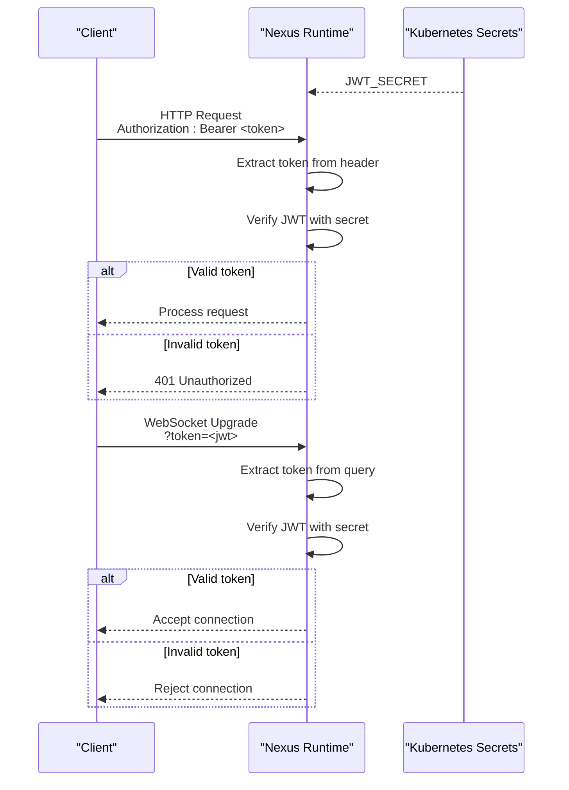
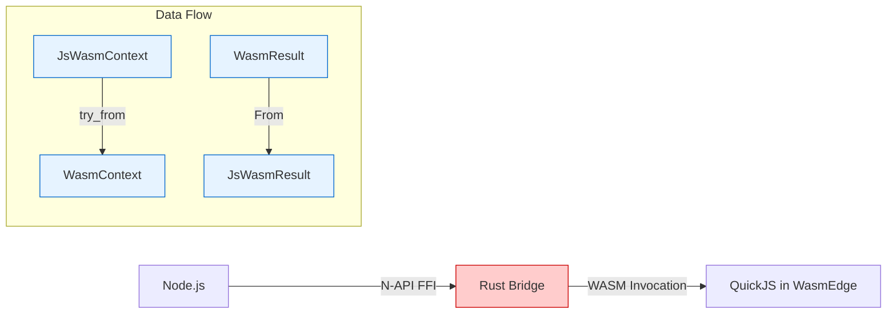

# Security Model

<cite>
**Referenced Files in This Document**   
- [capability.rs](file://runtime/nexus-wasm-bridge/src/capability.rs)
- [lib.rs](file://runtime/nexus-wasm-bridge/src/lib.rs)
- [napi.rs](file://runtime/nexus-wasm-bridge/src/napi.rs)
- [deployment.yaml](file://runtime/k8s/deployment.yaml)
- [Dockerfile](file://runtime/images/Dockerfile)
- [config.ts](file://runtime/workspace-kernel/src/config.ts)
- [server.ts](file://runtime/workspace-kernel/src/server.ts)
- [context.rs](file://runtime/nexus-wasm-bridge/src/context.rs)
- [state.rs](file://runtime/nexus-wasm-bridge/src/host_functions/state.rs)
- [events.rs](file://runtime/nexus-wasm-bridge/src/host_functions/events.rs)
- [extension.rs](file://runtime/nexus-wasm-bridge/src/host_functions/extension.rs)
</cite>

## Table of Contents
1. [Introduction](#introduction)
2. [Capability-Based Access Control](#capability-based-access-control)
3. [WASM Sandboxing Implementation](#wasm-sandboxing-implementation)
4. [Network Isolation Strategy](#network-isolation-strategy)
5. [Container Security Hardening](#container-security-hardening)
6. [Authentication and Secret Management](#authentication-and-secret-management)
7. [N-API Bridge Security](#n-api-bridge-security)
8. [Security Considerations](#security-considerations)

## Introduction
The Nexus security model implements a multi-layered approach to ensure secure execution of JavaScript handlers within a distributed system. The architecture combines Kubernetes network policies, container security contexts, and WASM sandboxing to create isolated execution environments. At the core of this model is a capability-based access control system that enforces least-privilege principles for all operations. Handlers must declare required capabilities in their configuration, which are then enforced at runtime through the WASM bridge. The system also implements network isolation through Kubernetes NetworkPolicy resources, restricting ingress and egress traffic to authorized endpoints only. Container security is hardened through non-root user execution, read-only filesystems, and dropped capabilities. Authentication is handled through JWT tokens with environment-based secret management, ensuring secure access to the system.

## Capability-Based Access Control
The capability-based access control system is implemented in the capability.rs module and integrated throughout the handler execution process. Handlers must declare required capabilities in their NXML configuration, which are then enforced at every host function call by the runtime. The system uses a fine-grained capability token model that supports both specific and wildcard permissions for different resource types.

The CapabilityToken enum defines the available capability types, including state read/write operations, event emission, view updates, and extension access. Each capability can be scoped to specific resources (e.g., "state:read:count") or use wildcards for broader access (e.g., "state:read:*"). The CapabilityChecker struct validates that handlers have the required capabilities before allowing operations, with methods like can_read_state, can_write_state, can_emit_event, and can_access_extension that check against the handler's granted capabilities.

Capabilities are enforced at the host function level, where each host function checks for the required capability before proceeding. For example, the state_get function verifies that the handler has either the specific state:read:{key} capability or the wildcard state:read:* capability before allowing access to state values. Similarly, the emit_event function requires the appropriate events:emit:{name} or events:emit:* capability. The extension access system requires the ext:{name} or ext:* capability before allowing calls to extension methods.

The system also supports capability inference from handler code through static analysis. The infer_capabilities function uses pattern matching to detect state access patterns, $emit calls, and extension access in the handler code, allowing the system to automatically determine required capabilities when they are not explicitly declared.

**Diagram sources**
- [capability.rs](file://runtime/nexus-wasm-bridge/src/capability.rs#L6-L384)

**Section sources**
- [capability.rs](file://runtime/nexus-wasm-bridge/src/capability.rs#L6-L384)
- [context.rs](file://runtime/nexus-wasm-bridge/src/context.rs#L7-L695)
- [state.rs](file://runtime/nexus-wasm-bridge/src/host_functions/state.rs#L1-L238)
- [events.rs](file://runtime/nexus-wasm-bridge/src/host_functions/events.rs#L1-L155)
- [extension.rs](file://runtime/nexus-wasm-bridge/src/host_functions/extension.rs#L1-L233)

## WASM Sandboxing Implementation
The WASM sandboxing implementation provides true isolation for JavaScript handler execution through the WasmEdge runtime. Each handler runs in a separate WASM instance, ensuring complete isolation between executions. The architecture follows a layered approach with Node.js communicating with the Rust bridge via N-API, which in turn invokes handlers in the QuickJS environment running within WasmEdge.

The WasmRuntime struct manages a pool of WASM instances for efficient resource utilization, with instance pooling and compilation caching to minimize startup overhead. The execute_handler method compiles handler code (with caching) and executes it within a timeout-bound context, ensuring that no single handler can monopolize resources. The system uses Asyncify for suspend/resume operations, allowing handlers to perform asynchronous operations through extensions while maintaining isolation.

Host functions are exposed to the WASM environment through a carefully controlled interface that enforces capability checks on every call. The HostFunctions registry manages access to state, events, view manipulation, and extensions, with each host function validating capabilities before execution. The ExecutionContext maintains state mutations, events, and view commands collected during execution, which are returned to the host system upon completion.

The system implements resource limits including maximum host calls per execution, memory limits per instance, and execution timeouts. These limits prevent denial-of-service attacks and ensure fair resource allocation across handlers. The metrics system tracks execution time, memory usage, and host call counts, providing visibility into resource consumption.

**Diagram sources**
- [lib.rs](file://runtime/nexus-wasm-bridge/src/lib.rs#L1-L71)
- [napi.rs](file://runtime/nexus-wasm-bridge/src/napi.rs#L1-L491)
- [engine/mod.rs](file://runtime/nexus-wasm-bridge/src/engine/mod.rs#L1-L244)

**Section sources**
- [lib.rs](file://runtime/nexus-wasm-bridge/src/lib.rs#L1-L71)
- [napi.rs](file://runtime/nexus-wasm-bridge/src/napi.rs#L1-L491)
- [engine/mod.rs](file://runtime/nexus-wasm-bridge/src/engine/mod.rs#L1-L244)
- [context.rs](file://runtime/nexus-wasm-bridge/src/context.rs#L1-L695)

## Network Isolation Strategy
The network isolation strategy is implemented through Kubernetes NetworkPolicy resources that strictly control ingress and egress traffic to the Nexus runtime pods. The NetworkPolicy resource defines precise rules for allowed connections, ensuring that only authorized traffic can reach the runtime components.

Ingress traffic is restricted to specific sources, allowing connections only from the ingress-nginx namespace on ports 3000 (HTTP) and 3001 (WebSocket). This ensures that external access to the runtime is mediated through the ingress controller, which can apply additional security policies. Monitoring traffic is also permitted from the monitoring namespace to allow Prometheus scraping of metrics on port 3000.

Egress traffic is tightly controlled to prevent unauthorized outbound connections. The policy allows DNS queries to the kube-dns service on UDP port 53, enabling name resolution. External HTTP/HTTPS traffic is permitted to the public internet (0.0.0.0/0) but excludes private IP ranges (10.0.0.0/8, 172.16.0.0/12, 192.168.0.0/16), preventing connections to internal networks. This allows extensions to access external APIs while protecting internal infrastructure.

The deployment configuration complements the network policy by exposing only the necessary ports (3000 for HTTP and 3001 for WebSocket) and using a ClusterIP service to limit external exposure. The Ingress resource further restricts access by defining specific host-based rules and path-based routing, ensuring that only requests to the configured host (nexus-runtime.example.com) are accepted.

**Diagram sources**
- [deployment.yaml](file://runtime/k8s/deployment.yaml#L247-L299)

**Section sources**
- [deployment.yaml](file://runtime/k8s/deployment.yaml#L247-L299)

## Container Security Hardening
Container security hardening is implemented through multiple layers of protection in the Dockerfile and Kubernetes deployment configuration. The container runs as a non-root user with UID 1000, eliminating the risks associated with root privileges. This is configured in both the Dockerfile with the USER nexus directive and in the Kubernetes deployment with runAsNonRoot, runAsUser, runAsGroup, and fsGroup settings.

The container filesystem is configured as read-only to prevent malicious modifications or persistence of changes. This is enforced through the readOnlyRootFilesystem: true setting in the container's securityContext, which prevents any writes to the container's filesystem except for explicitly defined volume mounts. The cache directory is mounted as an emptyDir volume with a size limit of 128Mi, providing a controlled location for temporary data.

All Linux capabilities are dropped from the container using the capabilities.drop: ["ALL"] configuration, removing potentially dangerous operations like raw socket access, system time modification, and privilege escalation. This follows the principle of least privilege, ensuring that the container has only the minimal permissions necessary to function.

Resource limits are applied to prevent denial-of-service attacks and ensure fair resource allocation. The container has CPU and memory limits set to 1000m and 1Gi respectively, with requests of 100m and 256Mi. These limits prevent any single container from consuming excessive resources and affecting other workloads on the node.

**Diagram sources**
- [Dockerfile](file://runtime/images/Dockerfile#L1-L152)
- [deployment.yaml](file://runtime/k8s/deployment.yaml#L61-L133)

**Section sources**
- [Dockerfile](file://runtime/images/Dockerfile#L1-L152)
- [deployment.yaml](file://runtime/k8s/deployment.yaml#L61-L133)

## Authentication and Secret Management
Authentication is implemented using JWT tokens with environment-based secret management. The system validates JWT tokens on all incoming requests except for health checks, ensuring that only authorized clients can access the API. The authentication middleware in the server.ts file intercepts requests and validates the JWT token using the configured secret.

The JWT secret is managed through Kubernetes secrets, which are mounted into the container as environment variables. In the deployment.yaml file, the JWT_SECRET is defined in the nexus-runtime-secrets Secret resource and referenced in the container's environment configuration using secretKeyRef. This ensures that the secret is not exposed in the configuration files and is securely managed by Kubernetes.

The authentication middleware extracts the JWT token from the Authorization header (expected in Bearer token format) and validates it using the jwt.verify function with the configured secret. If the token is missing, malformed, or invalid, the request is rejected with a 401 Unauthorized response. WebSocket connections also require authentication, with the token passed as a query parameter and validated during the connection upgrade process.

Environment variables are used to configure authentication settings, including enabling/disabling authentication (AUTH_ENABLED) and specifying the JWT secret (JWT_SECRET). These values are loaded from the ConfigMap and Secret resources in Kubernetes, allowing for secure configuration management without hardcoding values in the application.

**Diagram sources**
- [config.ts](file://runtime/workspace-kernel/src/config.ts#L79-L232)
- [server.ts](file://runtime/workspace-kernel/src/server.ts#L108-L127)
- [deployment.yaml](file://runtime/k8s/deployment.yaml#L29-L37)

**Section sources**
- [config.ts](file://runtime/workspace-kernel/src/config.ts#L79-L232)
- [server.ts](file://runtime/workspace-kernel/src/server.ts#L108-L127)
- [deployment.yaml](file://runtime/k8s/deployment.yaml#L29-L37)

## N-API Bridge Security
The N-API bridge security focuses on the secure integration between Node.js and Rust components, ensuring safe data exchange and proper error handling. The bridge uses N-API (Node-API) for stable ABI compatibility across Node.js versions, with the nexus_wasm_bridge crate exposing a safe interface to JavaScript.

The JsWasmContext structure defines the JavaScript-friendly execution context that is converted to the internal WasmContext type, with proper validation and error handling during the conversion process. MessagePack is used for efficient serialization of complex data types like state, arguments, and scope, with proper error handling for deserialization failures.

The bridge implements strict type checking and validation for all inputs, converting JavaScript types to their Rust equivalents with appropriate error handling. The try_from implementations for JsWasmContext and JsAsyncResult include comprehensive error handling for serialization/deserialization failures, ensuring that malformed data does not compromise the system.

Memory safety is maintained through proper ownership and borrowing patterns in Rust, with Arc<RwLock<T>> used for shared state between asynchronous operations. The bridge also implements proper shutdown procedures to clean up resources and prevent use-after-free conditions.

**Diagram sources**
- [napi.rs](file://runtime/nexus-wasm-bridge/src/napi.rs#L1-L491)
- [lib.rs](file://runtime/nexus-wasm-bridge/src/lib.rs#L1-L71)

**Section sources**
- [napi.rs](file://runtime/nexus-wasm-bridge/src/napi.rs#L1-L491)
- [lib.rs](file://runtime/nexus-wasm-bridge/src/lib.rs#L1-L71)

## Security Considerations
The Nexus security model addresses several critical security considerations through its multi-layered approach. The capability-based access control system enforces the principle of least privilege, ensuring that handlers can only access resources they are explicitly authorized to use. This prevents privilege escalation and limits the impact of compromised handlers.

The WASM sandboxing provides strong isolation between handler executions, preventing one handler from affecting others or accessing unauthorized resources. The combination of instance pooling and resource limits prevents denial-of-service attacks by limiting the resources any single handler can consume.

Network policies ensure that the runtime is only accessible through authorized channels, with ingress restricted to the ingress controller and egress limited to necessary external services. This reduces the attack surface and prevents lateral movement within the cluster.

Container security hardening through non-root execution, read-only filesystems, and dropped capabilities minimizes the risks associated with container escapes or privilege escalation. Even if an attacker gains code execution within the container, the limited privileges and restricted filesystem prevent persistence or system-level compromise.

The JWT-based authentication system with Kubernetes-managed secrets ensures secure access control while protecting sensitive credentials. The separation of authentication for HTTP and WebSocket connections ensures consistent security across all entry points.

Potential security improvements could include implementing more granular capability inference, adding support for capability revocation, enhancing the network policy with egress filtering based on domain names, and implementing additional container security features like seccomp profiles or AppArmor policies.

**Section sources**
- [capability.rs](file://runtime/nexus-wasm-bridge/src/capability.rs#L6-L384)
- [lib.rs](file://runtime/nexus-wasm-bridge/src/lib.rs#L1-L71)
- [napi.rs](file://runtime/nexus-wasm-bridge/src/napi.rs#L1-L491)
- [deployment.yaml](file://runtime/k8s/deployment.yaml#L1-L299)
- [Dockerfile](file://runtime/images/Dockerfile#L1-L152)
- [config.ts](file://runtime/workspace-kernel/src/config.ts#L79-L232)
- [server.ts](file://runtime/workspace-kernel/src/server.ts#L108-L127)