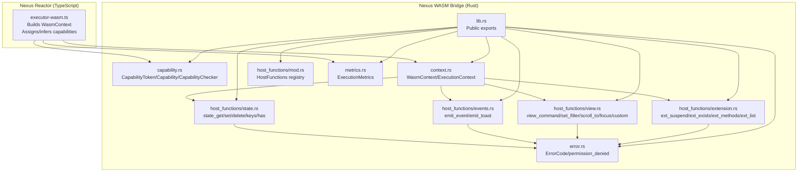
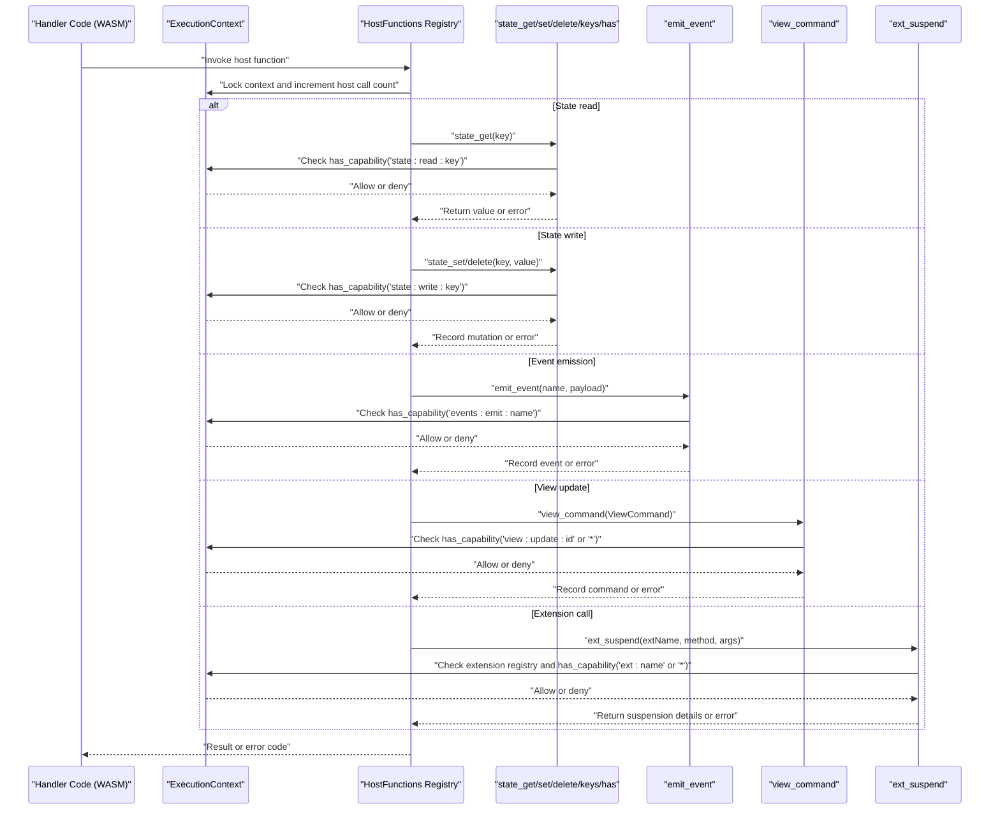
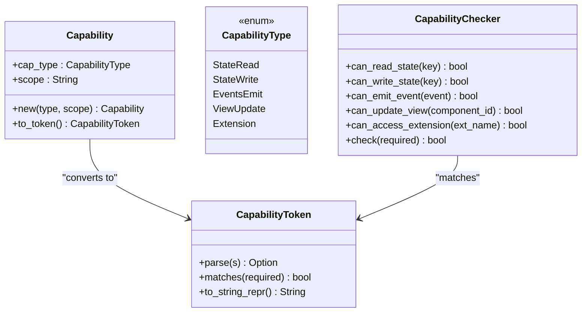
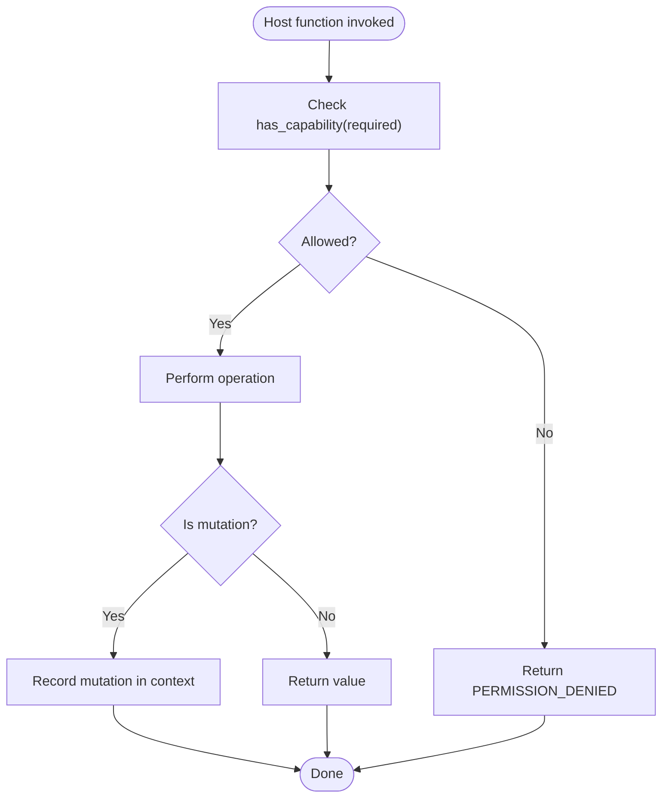
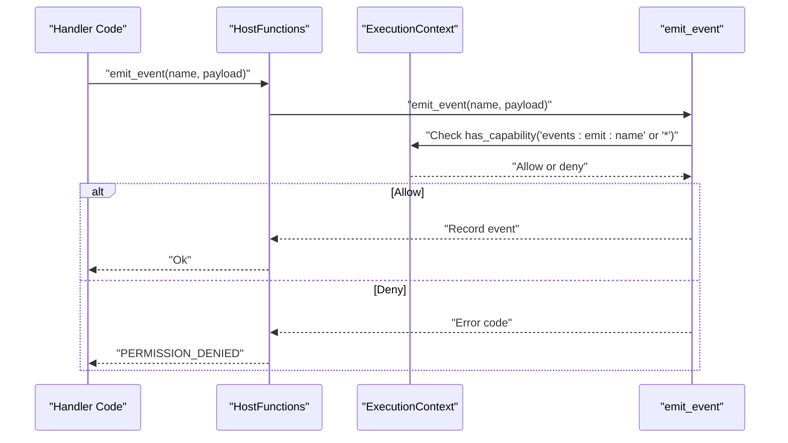
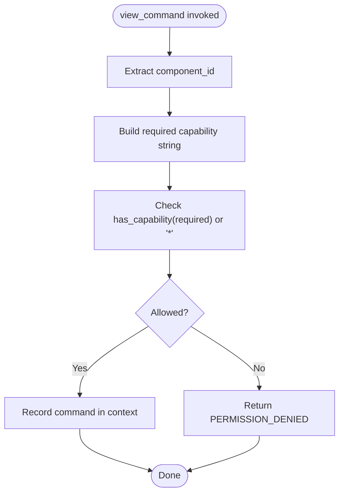
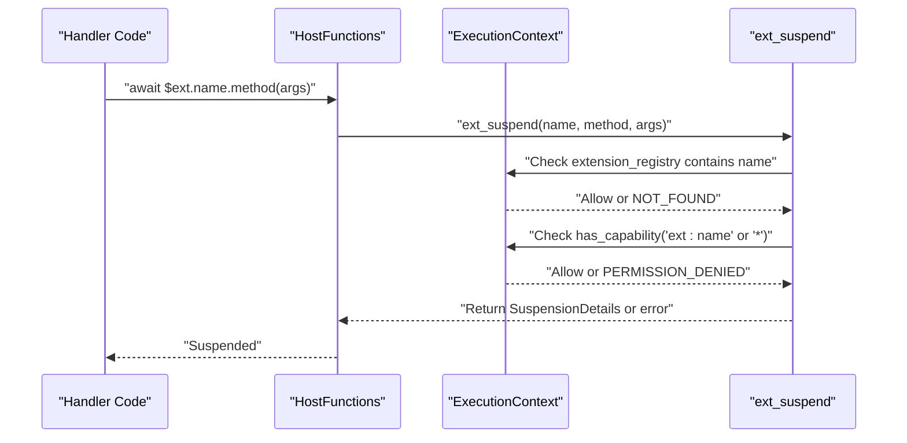
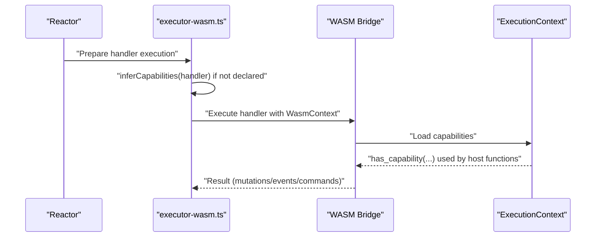
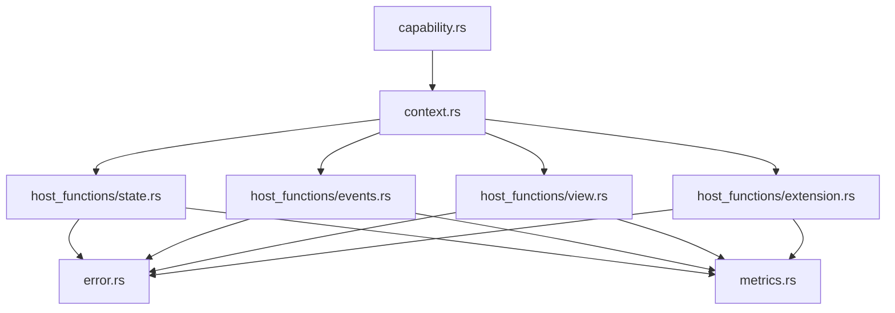

# Capability-Based Security

<cite>
**Referenced Files in This Document**
- [capability.rs](file://runtime/nexus-wasm-bridge/src/capability.rs)
- [context.rs](file://runtime/nexus-wasm-bridge/src/context.rs)
- [host_functions/mod.rs](file://runtime/nexus-wasm-bridge/src/host_functions/mod.rs)
- [host_functions/state.rs](file://runtime/nexus-wasm-bridge/src/host_functions/state.rs)
- [host_functions/events.rs](file://runtime/nexus-wasm-bridge/src/host_functions/events.rs)
- [host_functions/view.rs](file://runtime/nexus-wasm-bridge/src/host_functions/view.rs)
- [host_functions/extension.rs](file://runtime/nexus-wasm-bridge/src/host_functions/extension.rs)
- [error.rs](file://runtime/nexus-wasm-bridge/src/error.rs)
- [metrics.rs](file://runtime/nexus-wasm-bridge/src/metrics.rs)
- [lib.rs](file://runtime/nexus-wasm-bridge/src/lib.rs)
- [executor-wasm.ts](file://packages/nexus-reactor/src/sandbox/executor-wasm.ts)
</cite>

## Table of Contents
1. [Introduction](#introduction)
2. [Project Structure](#project-structure)
3. [Core Components](#core-components)
4. [Architecture Overview](#architecture-overview)
5. [Detailed Component Analysis](#detailed-component-analysis)
6. [Dependency Analysis](#dependency-analysis)
7. [Performance Considerations](#performance-considerations)
8. [Troubleshooting Guide](#troubleshooting-guide)
9. [Conclusion](#conclusion)
10. [Appendices](#appendices)

## Introduction
This document explains the capability-based security model in Nexus. It focuses on how capabilities are defined and enforced at the WASM bridge layer to restrict access to sensitive host functions such as state mutation, event emission, and view updates. It details the implementation in capability.rs, including capability enumeration, permission masking, and runtime checks during host function invocation. It also describes how capabilities are assigned to logic handlers based on NXML declarations and validated during panel instantiation, and provides examples of capability-safe and capability-violating code patterns. Finally, it documents integration with the host_functions module and how granular access control prevents privilege escalation, along with performance implications and strategies for minimizing overhead in high-frequency operations.

## Project Structure
The capability system spans two primary areas:
- WASM bridge runtime (Rust): Defines capability tokens, capability types, capability checking, and enforcement in host functions.
- Reactor sandbox (TypeScript): Builds the execution context for handlers, including capability assignment and fallback inference.

**Diagram sources**
- [executor-wasm.ts](file://packages/nexus-reactor/src/sandbox/executor-wasm.ts#L93-L120)
- [capability.rs](file://runtime/nexus-wasm-bridge/src/capability.rs#L1-L120)
- [context.rs](file://runtime/nexus-wasm-bridge/src/context.rs#L120-L190)
- [host_functions/mod.rs](file://runtime/nexus-wasm-bridge/src/host_functions/mod.rs#L1-L93)
- [host_functions/state.rs](file://runtime/nexus-wasm-bridge/src/host_functions/state.rs#L1-L128)
- [host_functions/events.rs](file://runtime/nexus-wasm-bridge/src/host_functions/events.rs#L1-L64)
- [host_functions/view.rs](file://runtime/nexus-wasm-bridge/src/host_functions/view.rs#L1-L64)
- [host_functions/extension.rs](file://runtime/nexus-wasm-bridge/src/host_functions/extension.rs#L1-L67)
- [error.rs](file://runtime/nexus-wasm-bridge/src/error.rs#L1-L60)
- [metrics.rs](file://runtime/nexus-wasm-bridge/src/metrics.rs#L1-L40)
- [lib.rs](file://runtime/nexus-wasm-bridge/src/lib.rs#L32-L51)

**Section sources**
- [lib.rs](file://runtime/nexus-wasm-bridge/src/lib.rs#L32-L51)
- [executor-wasm.ts](file://packages/nexus-reactor/src/sandbox/executor-wasm.ts#L93-L120)

## Core Components
- CapabilityToken: Enumerates capability tokens for state read/write, event emission, view updates, and extension access. Supports parsing from strings and matching against required capability strings.
- Capability: Represents a capability as defined in NXML, with a type and scope, and converts to a token.
- CapabilityChecker: Provides convenience methods to check whether a capability is granted for state read/write, event emission, view update, and extension access.
- ExecutionContext/WasmContext: Holds the handler’s granted capabilities and is used by host functions to enforce permissions.
- Host functions: Enforce capability checks before performing state mutations, event emissions, view updates, and extension calls.

Key implementation references:
- CapabilityToken and Capability: [capability.rs](file://runtime/nexus-wasm-bridge/src/capability.rs#L1-L120)
- CapabilityChecker: [capability.rs](file://runtime/nexus-wasm-bridge/src/capability.rs#L180-L224)
- ExecutionContext.has_capability: [context.rs](file://runtime/nexus-wasm-bridge/src/context.rs#L558-L561)
- Host functions state_get/state_set/state_delete/state_keys/state_has: [host_functions/state.rs](file://runtime/nexus-wasm-bridge/src/host_functions/state.rs#L1-L128)
- Host functions emit_event/emit_toast: [host_functions/events.rs](file://runtime/nexus-wasm-bridge/src/host_functions/events.rs#L1-L64)
- Host functions view_command/set_filter/scroll_to/focus/custom: [host_functions/view.rs](file://runtime/nexus-wasm-bridge/src/host_functions/view.rs#L1-L136)
- Host functions ext_suspend/ext_exists/ext_methods/ext_list: [host_functions/extension.rs](file://runtime/nexus-wasm-bridge/src/host_functions/extension.rs#L1-L112)

**Section sources**
- [capability.rs](file://runtime/nexus-wasm-bridge/src/capability.rs#L1-L224)
- [context.rs](file://runtime/nexus-wasm-bridge/src/context.rs#L558-L561)
- [host_functions/state.rs](file://runtime/nexus-wasm-bridge/src/host_functions/state.rs#L1-L128)
- [host_functions/events.rs](file://runtime/nexus-wasm-bridge/src/host_functions/events.rs#L1-L64)
- [host_functions/view.rs](file://runtime/nexus-wasm-bridge/src/host_functions/view.rs#L1-L136)
- [host_functions/extension.rs](file://runtime/nexus-wasm-bridge/src/host_functions/extension.rs#L1-L112)

## Architecture Overview
The capability enforcement architecture ensures that every host function call is validated against the handler’s granted capabilities before execution proceeds.

**Diagram sources**
- [host_functions/mod.rs](file://runtime/nexus-wasm-bridge/src/host_functions/mod.rs#L1-L93)
- [host_functions/state.rs](file://runtime/nexus-wasm-bridge/src/host_functions/state.rs#L1-L128)
- [host_functions/events.rs](file://runtime/nexus-wasm-bridge/src/host_functions/events.rs#L1-L64)
- [host_functions/view.rs](file://runtime/nexus-wasm-bridge/src/host_functions/view.rs#L1-L64)
- [host_functions/extension.rs](file://runtime/nexus-wasm-bridge/src/host_functions/extension.rs#L1-L67)
- [context.rs](file://runtime/nexus-wasm-bridge/src/context.rs#L558-L561)
- [error.rs](file://runtime/nexus-wasm-bridge/src/error.rs#L1-L60)

## Detailed Component Analysis

### Capability Model and Enforcement
- CapabilityToken: Defines tokens for state read/write, event emission, view updates, and extension access. It supports parsing from strings and matching against required capability strings. This enables flexible scoping, including wildcard grants.
- Capability: Converts NXML-defined capability types and scopes into tokens.
- CapabilityChecker: Provides helper methods to check whether a capability is granted for specific operations, delegating to the underlying token matching.

**Diagram sources**
- [capability.rs](file://runtime/nexus-wasm-bridge/src/capability.rs#L1-L224)

**Section sources**
- [capability.rs](file://runtime/nexus-wasm-bridge/src/capability.rs#L1-L224)

### State Access Enforcement
State host functions enforce capability checks before allowing reads or writes:
- state_get: Checks either a specific read capability for the key or a wildcard read-all capability.
- state_set/state_delete: Checks either a specific write capability for the key or a wildcard write-all capability.
- state_has: Requires read capability for the key.
- state_keys: Requires wildcard read-all capability.

**Diagram sources**
- [host_functions/state.rs](file://runtime/nexus-wasm-bridge/src/host_functions/state.rs#L1-L128)
- [context.rs](file://runtime/nexus-wasm-bridge/src/context.rs#L558-L561)
- [error.rs](file://runtime/nexus-wasm-bridge/src/error.rs#L1-L60)

**Section sources**
- [host_functions/state.rs](file://runtime/nexus-wasm-bridge/src/host_functions/state.rs#L1-L128)
- [context.rs](file://runtime/nexus-wasm-bridge/src/context.rs#L558-L561)
- [error.rs](file://runtime/nexus-wasm-bridge/src/error.rs#L1-L60)

### Event Emission Enforcement
Event emission enforces capability checks:
- emit_event: Checks either a specific event emission capability for the event name or a wildcard emit-all capability.
- emit_toast: Convenience wrapper that emits a toast event with a structured payload.

**Diagram sources**
- [host_functions/events.rs](file://runtime/nexus-wasm-bridge/src/host_functions/events.rs#L1-L64)
- [context.rs](file://runtime/nexus-wasm-bridge/src/context.rs#L558-L561)
- [error.rs](file://runtime/nexus-wasm-bridge/src/error.rs#L1-L60)

**Section sources**
- [host_functions/events.rs](file://runtime/nexus-wasm-bridge/src/host_functions/events.rs#L1-L64)
- [context.rs](file://runtime/nexus-wasm-bridge/src/context.rs#L558-L561)
- [error.rs](file://runtime/nexus-wasm-bridge/src/error.rs#L1-L60)

### View Update Enforcement
View commands enforce capability checks:
- view_command: Checks either a specific view update capability for the component ID or a wildcard update-all capability.
- Convenience functions: set_filter, scroll_to, focus, custom.

**Diagram sources**
- [host_functions/view.rs](file://runtime/nexus-wasm-bridge/src/host_functions/view.rs#L1-L64)
- [context.rs](file://runtime/nexus-wasm-bridge/src/context.rs#L558-L561)
- [error.rs](file://runtime/nexus-wasm-bridge/src/error.rs#L1-L60)

**Section sources**
- [host_functions/view.rs](file://runtime/nexus-wasm-bridge/src/host_functions/view.rs#L1-L136)
- [context.rs](file://runtime/nexus-wasm-bridge/src/context.rs#L558-L561)
- [error.rs](file://runtime/nexus-wasm-bridge/src/error.rs#L1-L60)

### Extension Call Enforcement
Extension calls enforce capability checks and registration:
- ext_suspend: Validates extension/method existence, checks capability for the extension, and records suspension state.
- ext_exists/ext_methods/ext_list: Utility functions to introspect extensions.

**Diagram sources**
- [host_functions/extension.rs](file://runtime/nexus-wasm-bridge/src/host_functions/extension.rs#L1-L112)
- [context.rs](file://runtime/nexus-wasm-bridge/src/context.rs#L558-L561)
- [error.rs](file://runtime/nexus-wasm-bridge/src/error.rs#L1-L60)

**Section sources**
- [host_functions/extension.rs](file://runtime/nexus-wasm-bridge/src/host_functions/extension.rs#L1-L112)
- [context.rs](file://runtime/nexus-wasm-bridge/src/context.rs#L558-L561)
- [error.rs](file://runtime/nexus-wasm-bridge/src/error.rs#L1-L60)

### Capability Assignment and Validation During Panel Instantiation
- Reactor sandbox builds the WasmContext for each handler, including capabilities. If capabilities are not explicitly declared, the executor infers them from handler code. This is a placeholder implementation that currently grants broad capabilities when none are declared.
- The bridge’s ExecutionContext holds the granted capabilities and exposes has_capability for runtime checks.

**Diagram sources**
- [executor-wasm.ts](file://packages/nexus-reactor/src/sandbox/executor-wasm.ts#L93-L120)
- [executor-wasm.ts](file://packages/nexus-reactor/src/sandbox/executor-wasm.ts#L318-L326)
- [context.rs](file://runtime/nexus-wasm-bridge/src/context.rs#L538-L561)

**Section sources**
- [executor-wasm.ts](file://packages/nexus-reactor/src/sandbox/executor-wasm.ts#L93-L120)
- [executor-wasm.ts](file://packages/nexus-reactor/src/sandbox/executor-wasm.ts#L318-L326)
- [context.rs](file://runtime/nexus-wasm-bridge/src/context.rs#L538-L561)

### Examples of Capability-Safe and Capability-Violating Patterns
- Capability-safe patterns:
  - Read a specific state key only if granted state:read:<key>.
  - Write a specific state key only if granted state:write:<key>.
  - Emit a specific event only if granted events:emit:<name>.
  - Update a specific component only if granted view:update:<id>.
  - Call a specific extension only if granted ext:<name>.

- Capability-violating patterns:
  - Attempting to read/write a state key without the corresponding capability.
  - Emitting an event without the corresponding capability.
  - Updating a component without the corresponding capability.
  - Calling an extension without the corresponding capability or without the extension being registered.

These violations result in PERMISSION_DENIED errors from host functions.

**Section sources**
- [host_functions/state.rs](file://runtime/nexus-wasm-bridge/src/host_functions/state.rs#L1-L128)
- [host_functions/events.rs](file://runtime/nexus-wasm-bridge/src/host_functions/events.rs#L1-L64)
- [host_functions/view.rs](file://runtime/nexus-wasm-bridge/src/host_functions/view.rs#L1-L136)
- [host_functions/extension.rs](file://runtime/nexus-wasm-bridge/src/host_functions/extension.rs#L1-L112)
- [error.rs](file://runtime/nexus-wasm-bridge/src/error.rs#L1-L60)

## Dependency Analysis
The capability enforcement depends on:
- CapabilityToken and Capability for capability modeling and matching.
- ExecutionContext for storing and checking granted capabilities.
- Host functions for enforcing checks and recording side effects.
- Error codes for consistent error signaling.
- Metrics for tracking host function calls and performance.

**Diagram sources**
- [capability.rs](file://runtime/nexus-wasm-bridge/src/capability.rs#L1-L224)
- [context.rs](file://runtime/nexus-wasm-bridge/src/context.rs#L538-L561)
- [host_functions/state.rs](file://runtime/nexus-wasm-bridge/src/host_functions/state.rs#L1-L128)
- [host_functions/events.rs](file://runtime/nexus-wasm-bridge/src/host_functions/events.rs#L1-L64)
- [host_functions/view.rs](file://runtime/nexus-wasm-bridge/src/host_functions/view.rs#L1-L136)
- [host_functions/extension.rs](file://runtime/nexus-wasm-bridge/src/host_functions/extension.rs#L1-L112)
- [error.rs](file://runtime/nexus-wasm-bridge/src/error.rs#L1-L60)
- [metrics.rs](file://runtime/nexus-wasm-bridge/src/metrics.rs#L1-L40)

**Section sources**
- [capability.rs](file://runtime/nexus-wasm-bridge/src/capability.rs#L1-L224)
- [context.rs](file://runtime/nexus-wasm-bridge/src/context.rs#L538-L561)
- [host_functions/state.rs](file://runtime/nexus-wasm-bridge/src/host_functions/state.rs#L1-L128)
- [host_functions/events.rs](file://runtime/nexus-wasm-bridge/src/host_functions/events.rs#L1-L64)
- [host_functions/view.rs](file://runtime/nexus-wasm-bridge/src/host_functions/view.rs#L1-L136)
- [host_functions/extension.rs](file://runtime/nexus-wasm-bridge/src/host_functions/extension.rs#L1-L112)
- [error.rs](file://runtime/nexus-wasm-bridge/src/error.rs#L1-L60)
- [metrics.rs](file://runtime/nexus-wasm-bridge/src/metrics.rs#L1-L40)

## Performance Considerations
- Capability checks are O(n) over the number of granted tokens for each host call, where n is the number of tokens granted to the handler. This is efficient for typical small sets of tokens.
- Host function call limits and metrics collection add minimal overhead and help detect excessive usage.
- Static analysis for capability inference is currently basic and may be improved to reduce unnecessary broad grants.

Optimization strategies:
- Prefer specific capabilities over wildcard grants to minimize matching overhead.
- Batch operations (e.g., multiple view commands) can be grouped to reduce host call counts.
- Use precompiled bytecode to reduce compilation overhead and improve overall throughput.

**Section sources**
- [metrics.rs](file://runtime/nexus-wasm-bridge/src/metrics.rs#L1-L40)
- [host_functions/mod.rs](file://runtime/nexus-wasm-bridge/src/host_functions/mod.rs#L37-L66)
- [executor-wasm.ts](file://packages/nexus-reactor/src/sandbox/executor-wasm.ts#L243-L255)

## Troubleshooting Guide
Common issues and resolutions:
- PERMISSION_DENIED errors indicate missing capability for the operation. Review the handler’s declared or inferred capabilities and adjust accordingly.
- NOT_FOUND errors for extension calls indicate either an unregistered extension or an incorrect method name. Verify the extension registry and method availability.
- Excessive host calls or resource limits can trigger resource limit errors. Tune handler logic and consider batching operations.

Diagnostic tips:
- Inspect ExecutionMetrics to understand host call counts and durations.
- Use error codes and messages to pinpoint the failing operation and required capability.

**Section sources**
- [error.rs](file://runtime/nexus-wasm-bridge/src/error.rs#L1-L60)
- [error.rs](file://runtime/nexus-wasm-bridge/src/error.rs#L146-L154)
- [metrics.rs](file://runtime/nexus-wasm-bridge/src/metrics.rs#L1-L40)

## Conclusion
Nexus employs a robust capability-based security model at the WASM bridge layer. CapabilityToken and Capability define precise permissions, while ExecutionContext and CapabilityChecker enforce them during host function invocations. Host functions validate access for state, events, view updates, and extension calls, returning standardized errors when violations occur. The Reactor sandbox assigns or infers capabilities for handlers, and the bridge’s metrics and error systems provide observability. By using specific capabilities and optimizing host call patterns, applications can achieve strong isolation and predictable performance.

## Appendices
- Public exports and module boundaries are defined in lib.rs, exposing capability types and runtime primitives for integration.

**Section sources**
- [lib.rs](file://runtime/nexus-wasm-bridge/src/lib.rs#L32-L51)