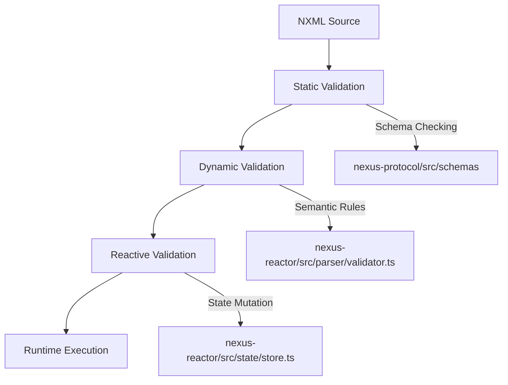
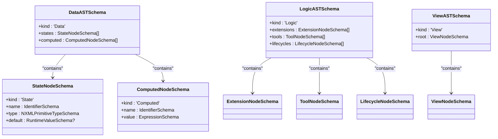
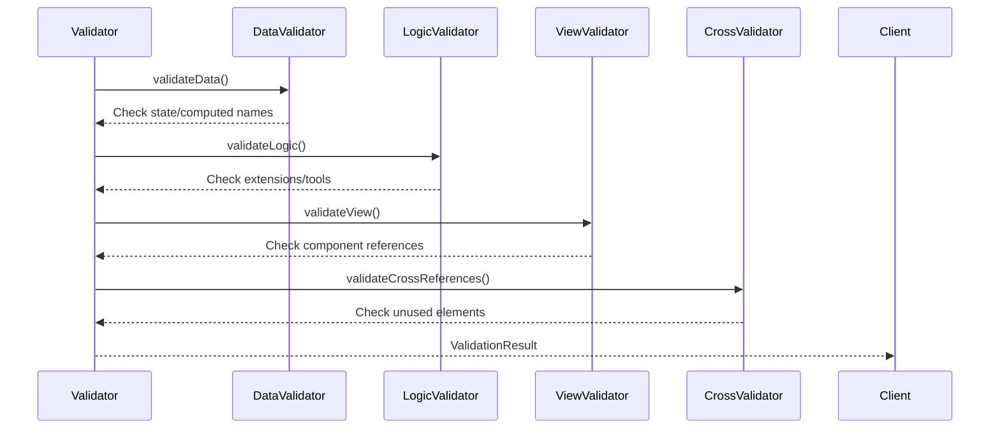
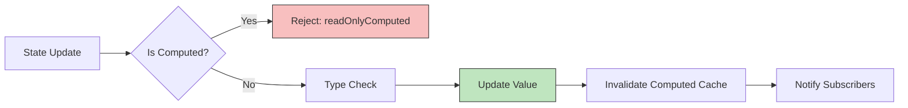
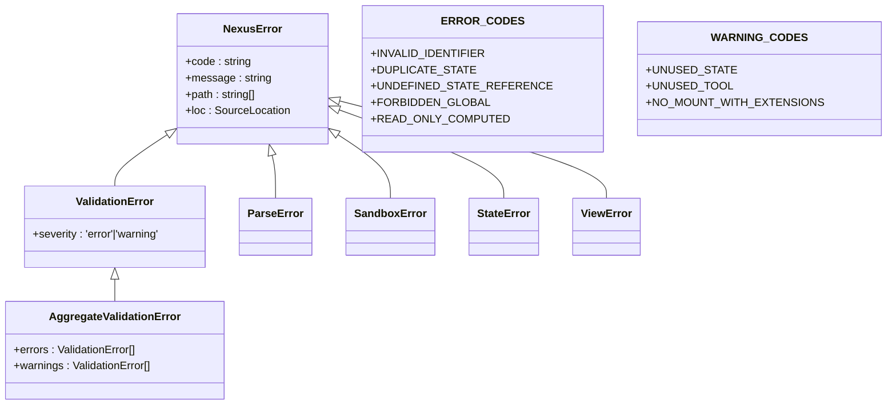

# Input Validation and Sanitization

<cite>
**Referenced Files in This Document**   
- [data.ts](file://packages/nexus-protocol/src/schemas/data.ts)
- [logic.ts](file://packages/nexus-protocol/src/schemas/logic.ts)
- [view.ts](file://packages/nexus-protocol/src/schemas/view.ts)
- [panel.ts](file://packages/nexus-protocol/src/schemas/panel.ts)
- [validator.ts](file://packages/nexus-reactor/src/parser/validator.ts)
- [store.ts](file://packages/nexus-reactor/src/state/store.ts)
- [expression.ts](file://packages/nexus-reactor/src/utils/expression.ts)
- [constants.ts](file://packages/nexus-reactor/src/core/constants.ts)
- [errors.ts](file://packages/nexus-reactor/src/core/errors.ts)
</cite>

## Table of Contents
1. [Introduction](#introduction)
2. [Layered Validation Strategy](#layered-validation-strategy)
3. [Static Validation: Schema Enforcement](#static-validation-schema-enforcement)
4. [Dynamic Validation: Semantic Rule Checking](#dynamic-validation-semantic-rule-checking)
5. [Reactive Validation: Runtime State Mutation](#reactive-validation-runtime-state-mutation)
6. [Error Handling and Reporting](#error-handling-and-reporting)
7. [Extending Validation Rules](#extending-validation-rules)
8. [Integration with External Tools](#integration-with-external-tools)
9. [Conclusion](#conclusion)

## Introduction
Nexus implements a comprehensive, multi-layered validation system to ensure the integrity and security of NXML documents and runtime state mutations. This document details the three-tiered validation strategy: static (parse-time), dynamic (execution-time), and reactive (mutation-time) validation. The system leverages Zod schemas for structural validation, custom validators for semantic rules, and runtime proxies for state sanitization. This approach prevents injection attacks, ensures type consistency, and maintains namespace validity throughout the application lifecycle.

## Layered Validation Strategy
Nexus employs a three-tiered validation architecture that operates at different stages of the NXML processing pipeline:

**Diagram sources**
- [panel.ts](file://packages/nexus-protocol/src/schemas/panel.ts)
- [validator.ts](file://packages/nexus-reactor/src/parser/validator.ts)
- [store.ts](file://packages/nexus-reactor/src/state/store.ts)

**Section sources**
- [panel.ts](file://packages/nexus-protocol/src/schemas/panel.ts)
- [validator.ts](file://packages/nexus-reactor/src/parser/validator.ts)
- [store.ts](file://packages/nexus-reactor/src/state/store.ts)

The validation pipeline begins with static schema enforcement during parsing, proceeds to dynamic semantic validation of the AST, and concludes with reactive validation during state mutations. Each layer builds upon the previous one, creating a robust defense against invalid or malicious input.

## Static Validation: Schema Enforcement
The static validation layer uses Zod schemas defined in `nexus-protocol/src/schemas` to enforce structural correctness of NXML documents during parsing. These schemas validate the syntax and basic structure of each namespace (Data, Logic, View) according to the NXML specification.

**Diagram sources**
- [data.ts](file://packages/nexus-protocol/src/schemas/data.ts)
- [logic.ts](file://packages/nexus-protocol/src/schemas/logic.ts)
- [view.ts](file://packages/nexus-protocol/src/schemas/view.ts)

**Section sources**
- [data.ts](file://packages/nexus-protocol/src/schemas/data.ts)
- [logic.ts](file://packages/nexus-protocol/src/schemas/logic.ts)
- [view.ts](file://packages/nexus-protocol/src/schemas/view.ts)

The schema validation ensures that:
- All identifiers follow JavaScript naming conventions via `IdentifierSchema`
- State and computed values have valid types through `NXMLPrimitiveTypeSchema`
- Expression syntax is balanced and valid using `ExpressionSchema`
- Component props adhere to type-specific requirements via dedicated schemas (e.g., `ButtonPropsSchema`, `InputPropsSchema`)
- Cross-namespace references are syntactically correct

This layer operates at parse-time, rejecting malformed NXML before any semantic analysis occurs.

## Dynamic Validation: Semantic Rule Checking
The dynamic validation layer, implemented in `nexus-reactor/src/parser/validator.ts`, performs semantic analysis on the parsed AST to enforce business rules and cross-namespace consistency. This validation occurs after parsing but before execution.

**Diagram sources**
- [validator.ts](file://packages/nexus-reactor/src/parser/validator.ts)

**Section sources**
- [validator.ts](file://packages/nexus-reactor/src/parser/validator.ts)

The validator enforces several critical rules:
- **Uniqueness constraints**: Prevents duplicate state, computed, tool, and extension names
- **Namespace validity**: Ensures extension aliases follow proper naming conventions
- **Lifecycle constraints**: Limits mount/unmount lifecycles to one each
- **Security rules**: Prohibits forbidden globals (window, document, eval) in handler code
- **Reference integrity**: Validates that all state and tool references exist
- **Scope context**: Prevents $scope references outside Iterate components

The validation process is comprehensive, checking data, logic, and view sections independently before performing cross-references validation to ensure all references are valid.

## Reactive Validation: Runtime State Mutation
The reactive validation layer, implemented in `nexus-reactor/src/state/store.ts`, sanitizes state updates and prevents injection attacks during runtime. This layer uses a Proxy-based reactive system to intercept and validate all state mutations.

**Diagram sources**
- [store.ts](file://packages/nexus-reactor/src/state/store.ts)

**Section sources**
- [store.ts](file://packages/nexus-reactor/src/state/store.ts)

Key aspects of reactive validation include:
- **Computed protection**: Prevents direct writes to computed values via `set` trap
- **Type checking**: Validates value types against declared state types
- **Computed caching**: Maintains a cache of computed values that invalidates on dependency changes
- **Dependency tracking**: Uses `trackAccess` to monitor which state values are accessed during computed evaluation
- **Update depth limiting**: Prevents infinite loops by limiting recursive updates to 50 levels

The store also handles expression evaluation in computed values through `evaluateExpression`, which safely executes binding expressions in a restricted context.

## Error Handling and Reporting
Nexus provides detailed error reporting through a comprehensive error hierarchy defined in `nexus-reactor/src/core/errors.ts`. The system categorizes validation failures into distinct error types with specific codes and contextual information.

**Diagram sources**
- [errors.ts](file://packages/nexus-reactor/src/core/errors.ts)
- [constants.ts](file://packages/nexus-reactor/src/core/constants.ts)

**Section sources**
- [errors.ts](file://packages/nexus-reactor/src/core/errors.ts)
- [constants.ts](file://packages/nexus-reactor/src/core/constants.ts)

The error system provides:
- **Precise error codes**: Each validation failure has a specific code (e.g., `INVALID_IDENTIFIER`, `UNDEFINED_STATE_REFERENCE`)
- **Location information**: Source location data for precise error positioning
- **Path context**: Hierarchical path to the invalid element
- **Severity levels**: Differentiation between errors and warnings
- **Aggregation**: Collection of multiple validation issues in a single report

Common validation failures include:
- Invalid identifiers containing special characters
- Duplicate state or tool names
- References to undefined states or tools
- Usage of forbidden globals in handler code
- $scope references outside Iterate components
- Writing to computed values

## Extending Validation Rules
Custom components can extend the validation system by implementing additional rules and integrating with the existing validation pipeline. The system is designed to be extensible while maintaining security and consistency.

To extend validation rules:
1. Define custom Zod schemas for new component types in the protocol package
2. Implement type-specific validation logic in the validator
3. Register component props validators in the view schema
4. Add new error codes to the constants file
5. Update documentation and IDE tooling configurations

The validation system supports custom components through the extensible schema architecture and component registry pattern. New components can define their own validation rules while inheriting core validation behaviors.

## Integration with External Tools
The validation system integrates with external linters and IDE tooling through standardized error reporting and schema definitions. The Zod schemas can be consumed by TypeScript-based tools, and the error format is compatible with standard diagnostic protocols.

Integration points include:
- **IDE extensions**: Language servers can use the schema definitions for real-time validation
- **CLI tools**: Command-line validators can leverage the same validation logic
- **Build systems**: Pre-commit hooks and CI/CD pipelines can enforce validation rules
- **Editor integrations**: Syntax highlighting and autocomplete based on schema definitions

The consistent error format and comprehensive schema definitions enable seamless integration with various development tools, providing a unified validation experience across different environments.

## Conclusion
Nexus's multi-layered validation system provides comprehensive protection for NXML documents and runtime state mutations. By combining static schema enforcement, dynamic semantic validation, and reactive state sanitization, the system ensures structural correctness, semantic integrity, and runtime security. The detailed error reporting and extensible architecture make it possible to maintain high validation standards while supporting custom components and external tool integration. This layered approach effectively prevents injection attacks, enforces type consistency, and maintains namespace validity throughout the application lifecycle.