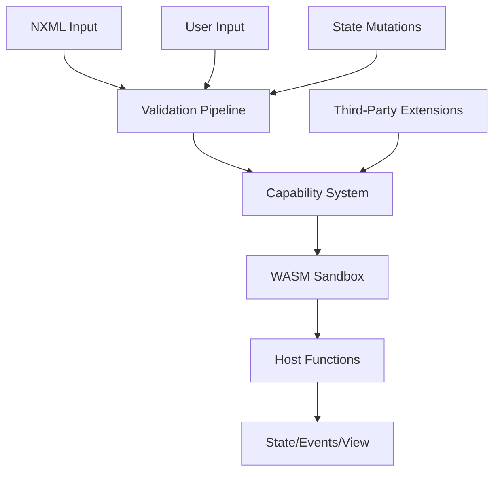
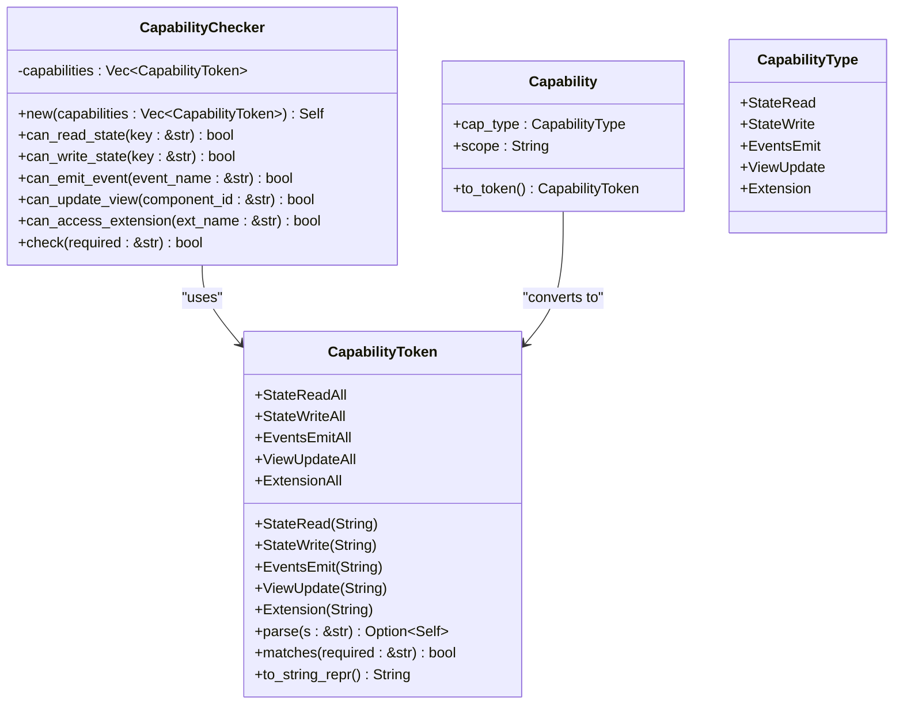
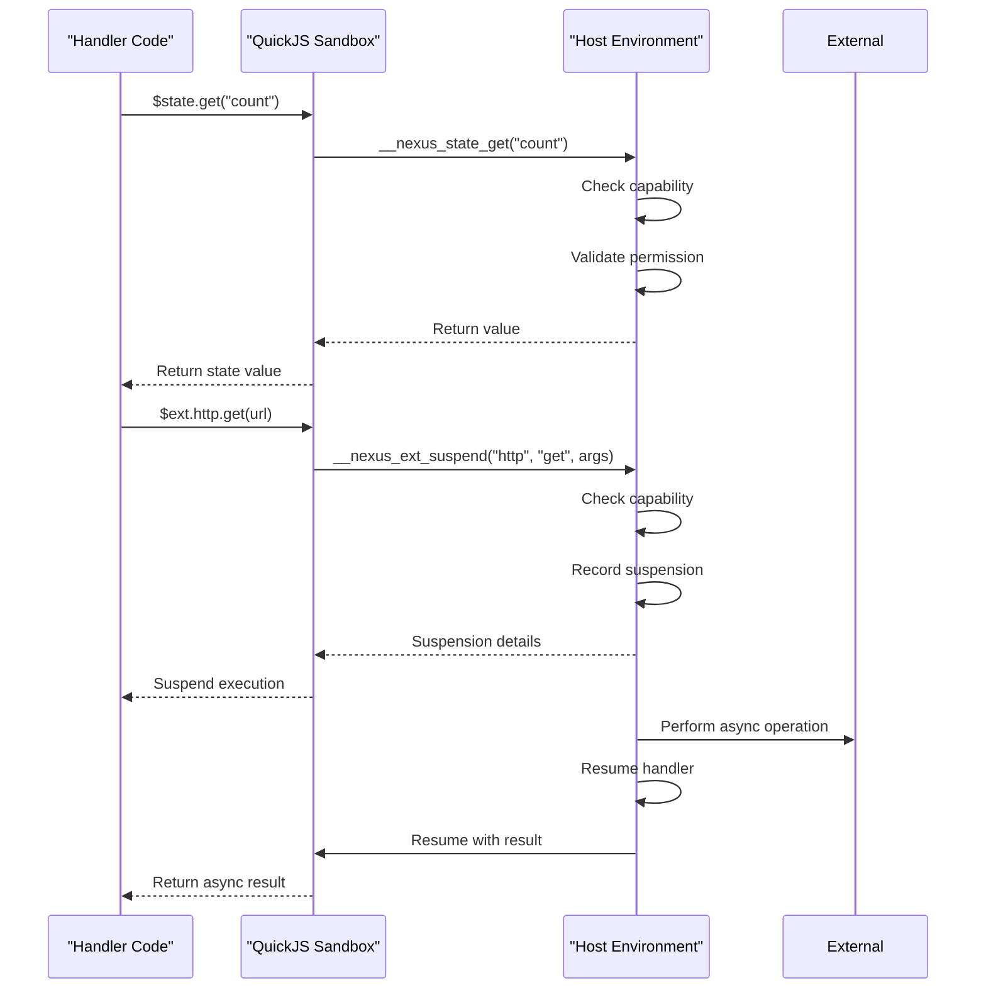
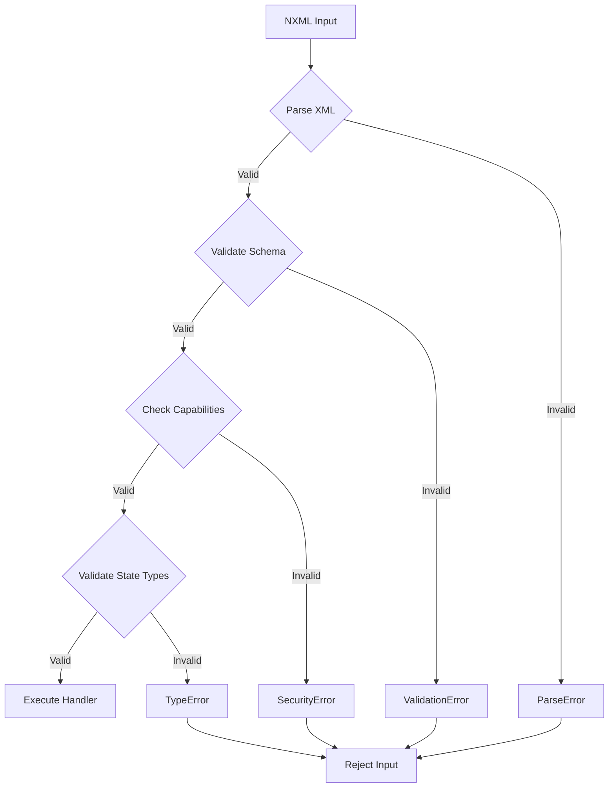
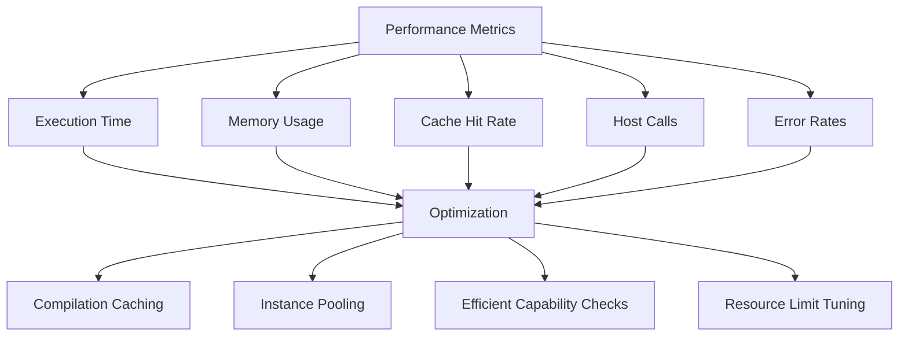

# Security Model

<cite>
**Referenced Files in This Document**   
- [capability.rs](file://runtime/nexus-wasm-bridge/src/capability.rs)
- [quickjs_wrapper.js](file://runtime/nexus-wasm-bridge/src/quickjs_wrapper.js)
- [host_functions/state.rs](file://runtime/nexus-wasm-bridge/src/host_functions/state.rs)
- [host_functions/events.rs](file://runtime/nexus-wasm-bridge/src/host_functions/events.rs)
- [host_functions/extension.rs](file://runtime/nexus-wasm-bridge/src/host_functions/extension.rs)
- [host_functions/view.rs](file://runtime/nexus-wasm-bridge/src/host_functions/view.rs)
- [context.rs](file://runtime/nexus-wasm-bridge/src/context.rs)
- [error.rs](file://runtime/nexus-wasm-bridge/src/error.rs)
- [config.rs](file://runtime/nexus-wasm-bridge/src/config.rs)
- [metrics.rs](file://runtime/nexus-wasm-bridge/src/metrics.rs)
- [executor-wasm.ts](file://packages/nexus-reactor/src/sandbox/executor-wasm.ts)
- [globals.ts](file://packages/nexus-reactor/src/sandbox/globals.ts)
- [errors.ts](file://packages/nexus-reactor/src/core/errors.ts)
- [constants.ts](file://packages/nexus-reactor/src/core/constants.ts)
</cite>

## Table of Contents
1. [Introduction](#introduction)
2. [Multi-Layered Security Architecture](#multi-layered-security-architecture)
3. [Capability-Based Access Control](#capability-based-access-control)
4. [WASM Sandboxing and Execution Model](#wasm-sandboxing-and-execution-model)
5. [Input Validation Pipeline](#input-validation-pipeline)
6. [Threat Models and Mitigation Strategies](#threat-models-and-mitigation-strategies)
7. [Secure Extension Development Guidelines](#secure-extension-development-guidelines)
8. [Performance Overhead and Optimization](#performance-overhead-and-optimization)
9. [Conclusion](#conclusion)

## Introduction
The Nexus security architecture implements a comprehensive, multi-layered approach to ensure the safe execution of user-defined handlers within a reactive UI framework. This document details the security model that combines capability-based access control, WASM sandboxing, and rigorous input validation to protect against various threats including code injection, privilege escalation, and denial of service attacks. The system is designed to provide strong isolation while enabling secure third-party integrations and extensions.

**Section sources**
- [capability.rs](file://runtime/nexus-wasm-bridge/src/capability.rs#L1-L384)
- [quickjs_wrapper.js](file://runtime/nexus-wasm-bridge/src/quickjs_wrapper.js#L1-L411)

## Multi-Layered Security Architecture
The Nexus security model employs three primary layers of defense: capability-based access control, WASM sandboxing, and input validation. These layers work in concert to create a secure execution environment for handler code. The capability system restricts access to host functions based on declared permissions in NXML, the WASM sandbox isolates execution using QuickJS with forbidden globals lists, and the validation pipeline ensures both NXML input and state mutations conform to expected schemas. This defense-in-depth approach ensures that even if one layer is compromised, others provide additional protection.

**Diagram sources**
- [capability.rs](file://runtime/nexus-wasm-bridge/src/capability.rs#L1-L384)
- [quickjs_wrapper.js](file://runtime/nexus-wasm-bridge/src/quickjs_wrapper.js#L1-L411)
- [context.rs](file://runtime/nexus-wasm-bridge/src/context.rs#L1-L695)

## Capability-Based Access Control
The capability system in Nexus implements a fine-grained permission model where handlers must declare required capabilities in NXML before accessing host functions. Capabilities are represented as tokens in the format `domain:action:scope` and include state access (`state:read:*`, `state:write:count`), event emission (`events:emit:toast`), view manipulation (`view:update:logs`), and extension access (`ext:http`). The `CapabilityToken` enum defines these permissions, and the `CapabilityChecker` enforces them at runtime by validating each host function call against the handler's granted capabilities. This prevents privilege escalation by ensuring handlers can only perform actions they are explicitly authorized to do.

**Diagram sources**
- [capability.rs](file://runtime/nexus-wasm-bridge/src/capability.rs#L1-L384)

**Section sources**
- [capability.rs](file://runtime/nexus-wasm-bridge/src/capability.rs#L1-L384)
- [host_functions/state.rs](file://runtime/nexus-wasm-bridge/src/host_functions/state.rs#L1-L238)
- [host_functions/events.rs](file://runtime/nexus-wasm-bridge/src/host_functions/events.rs#L1-L155)
- [host_functions/extension.rs](file://runtime/nexus-wasm-bridge/src/host_functions/extension.rs#L1-L233)
- [host_functions/view.rs](file://runtime/nexus-wasm-bridge/src/host_functions/view.rs#L1-L251)

## WASM Sandboxing and Execution Model
Nexus employs a robust sandboxing model using WasmEdge and QuickJS to isolate handler execution. The `quickjs_wrapper.js` script runs within the WASM environment and provides controlled access to host functions through global APIs like `$state`, `$emit`, `$view`, and `$ext`. The sandbox execution model enforces a forbidden globals list, preventing access to dangerous JavaScript built-ins. Each handler runs in a separate WASM instance from a pooled runtime, ensuring true isolation. The `WasmRuntime` manages instance pooling, compilation caching, and execution with configurable timeouts and memory limits, while the `HostFunctions` registry controls access to sensitive operations.

**Diagram sources**
- [quickjs_wrapper.js](file://runtime/nexus-wasm-bridge/src/quickjs_wrapper.js#L1-L411)
- [engine/mod.rs](file://runtime/nexus-wasm-bridge/src/engine/mod.rs#L1-L244)
- [host_functions/mod.rs](file://runtime/nexus-wasm-bridge/src/host_functions/mod.rs#L1-L93)

**Section sources**
- [quickjs_wrapper.js](file://runtime/nexus-wasm-bridge/src/quickjs_wrapper.js#L1-L411)
- [engine/mod.rs](file://runtime/nexus-wasm-bridge/src/engine/mod.rs#L1-L244)
- [host_functions/mod.rs](file://runtime/nexus-wasm-bridge/src/host_functions/mod.rs#L1-L93)
- [executor-wasm.ts](file://packages/nexus-reactor/src/sandbox/executor-wasm.ts)
- [globals.ts](file://packages/nexus-reactor/src/sandbox/globals.ts)

## Input Validation Pipeline
The Nexus security architecture includes a comprehensive validation pipeline for both NXML input and state mutations. The system validates NXML structure during parsing, ensuring all elements conform to the expected schema and that capabilities are properly declared. State mutations are validated against type constraints and schema requirements before being applied. The validation process checks for proper data types, required fields, and valid identifiers, rejecting any input that doesn't meet security requirements. Error handling is robust, with detailed error codes and messages that help developers identify and fix security issues without exposing sensitive system information.

**Diagram sources**
- [parser/validator.ts](file://packages/nexus-reactor/src/parser/validator.ts)
- [errors.ts](file://packages/nexus-reactor/src/core/errors.ts)
- [constants.ts](file://packages/nexus-reactor/src/core/constants.ts)

**Section sources**
- [errors.ts](file://packages/nexus-reactor/src/core/errors.ts#L69-L120)
- [constants.ts](file://packages/nexus-reactor/src/core/constants.ts#L216-L283)
- [coercion.ts](file://packages/nexus-reactor/src/utils/coercion.ts#L170-L218)

## Threat Models and Mitigation Strategies
The Nexus security architecture addresses several key threat models through targeted mitigation strategies. For code injection attacks, the WASM sandbox prevents execution of arbitrary code by restricting access to forbidden globals and using capability-based access control. Privilege escalation is mitigated by the fine-grained capability system that enforces least privilege principles. Denial of service attacks are prevented through resource limits on execution time, memory usage, and host function calls. The system also protects against data exfiltration by restricting state access to explicitly declared capabilities and validating all input against strict schemas.

| Threat Model | Mitigation Strategy | Implementation |
|--------------|-------------------|----------------|
| Code Injection | WASM Sandboxing | QuickJS in WasmEdge with forbidden globals list |
| Privilege Escalation | Capability-Based Access Control | Fine-grained permissions for state, events, view, and extensions |
| Denial of Service | Resource Limiting | Execution timeouts, memory limits, host call limits |
| Data Exfiltration | Capability Scoping | Specific state key access rather than wildcard permissions |
| Invalid Input | Validation Pipeline | NXML schema validation and state mutation type checking |
| Async Operation Abuse | Suspension Control | Limited suspension IDs and capability checks for extensions |

**Section sources**
- [capability.rs](file://runtime/nexus-wasm-bridge/src/capability.rs#L1-L384)
- [config.rs](file://runtime/nexus-wasm-bridge/src/config.rs#L1-L320)
- [error.rs](file://runtime/nexus-wasm-bridge/src/error.rs#L1-L395)
- [metrics.rs](file://runtime/nexus-wasm-bridge/src/metrics.rs#L1-L474)

## Secure Extension Development Guidelines
Developers creating extensions for Nexus must follow strict security guidelines to maintain the integrity of the system. Extensions should declare minimal required capabilities, using specific scopes rather than wildcards when possible. All input should be validated against schemas, and error handling should avoid exposing sensitive information. Extensions must respect execution timeouts and memory limits, and should implement proper rate limiting for external API calls. Third-party integrations should use capability tokens to restrict access and should never expose privileged operations without proper capability checks. The `$ext` API provides a secure interface for async operations using the suspend/resume mechanism.

**Section sources**
- [quickjs_wrapper.js](file://runtime/nexus-wasm-bridge/src/quickjs_wrapper.js#L1-L411)
- [host_functions/extension.rs](file://runtime/nexus-wasm-bridge/src/host_functions/extension.rs#L1-L233)
- [context.rs](file://runtime/nexus-wasm-bridge/src/context.rs#L1-L695)

## Performance Overhead and Optimization
The Nexus security architecture includes performance monitoring and optimization techniques to minimize overhead. The `MetricsCollector` tracks execution time, memory usage, cache hit rates, and host function calls, providing insights into performance characteristics. Optimization techniques include compilation caching, instance pooling, and efficient capability checking. The system allows configuration of resource limits through `RuntimeConfig`, enabling administrators to balance security and performance. Performance overhead is typically minimal for normal operations, with most security checks adding only microseconds to execution time, while the benefits of enhanced security far outweigh the small performance cost.

**Diagram sources**
- [metrics.rs](file://runtime/nexus-wasm-bridge/src/metrics.rs#L1-L474)
- [config.rs](file://runtime/nexus-wasm-bridge/src/config.rs#L1-L320)
- [engine/mod.rs](file://runtime/nexus-wasm-bridge/src/engine/mod.rs#L1-L244)

**Section sources**
- [metrics.rs](file://runtime/nexus-wasm-bridge/src/metrics.rs#L1-L474)
- [config.rs](file://runtime/nexus-wasm-bridge/src/config.rs#L1-L320)

## Conclusion
The Nexus security architecture provides a comprehensive, multi-layered defense system that effectively protects against a wide range of threats while enabling flexible and powerful reactive UI development. By combining capability-based access control, WASM sandboxing, and rigorous input validation, the system ensures that handlers execute in a secure, isolated environment with minimal risk of privilege escalation or resource abuse. The architecture balances security with performance through optimization techniques like compilation caching and instance pooling, making it suitable for production environments. Developers can confidently create extensions and integrations following the established security guidelines, knowing that the system enforces least privilege principles and protects against common attack vectors.