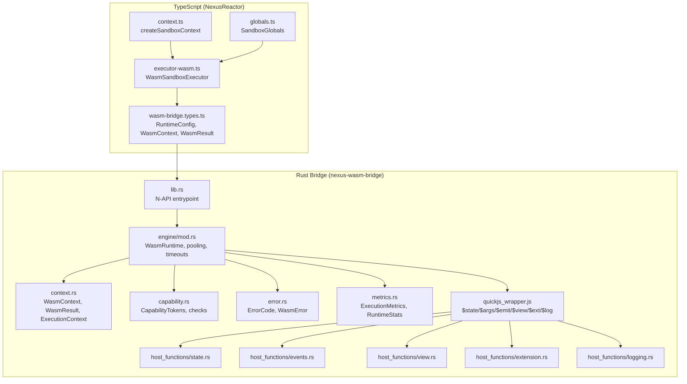
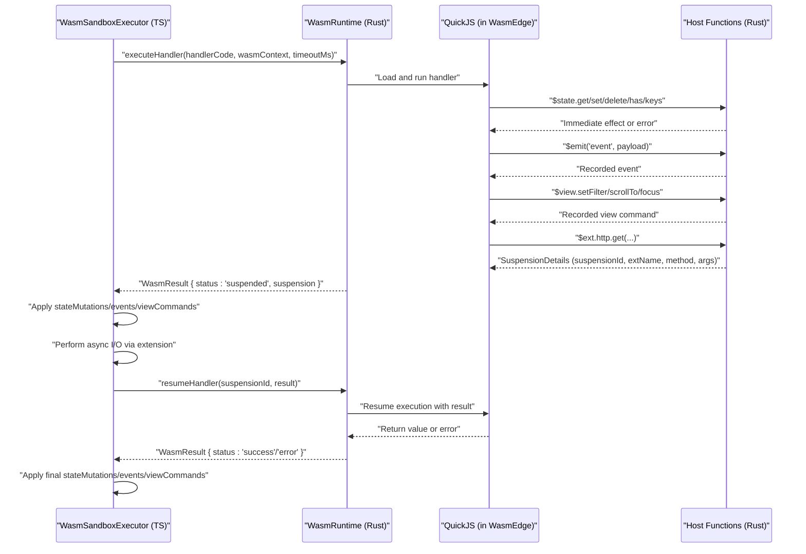
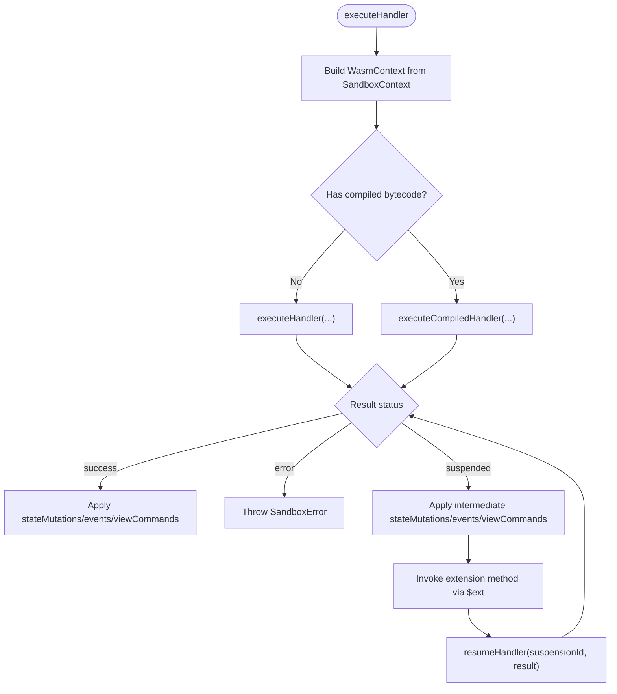
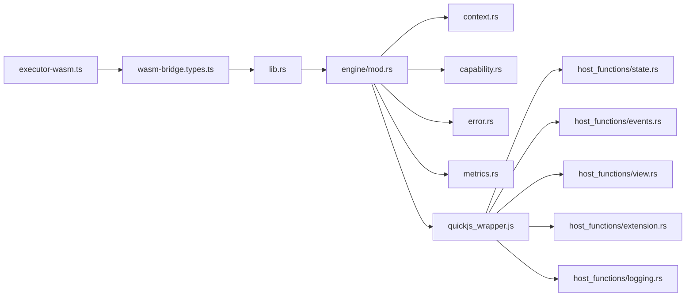

# WASM Sandbox Execution

<cite>
**Referenced Files in This Document**
- [executor-wasm.ts](file://packages/nexus-reactor/src/sandbox/executor-wasm.ts)
- [context.ts](file://packages/nexus-reactor/src/sandbox/context.ts)
- [globals.ts](file://packages/nexus-reactor/src/sandbox/globals.ts)
- [wasm-bridge.types.ts](file://packages/nexus-reactor/src/sandbox/wasm-bridge.types.ts)
- [lib.rs](file://runtime/nexus-wasm-bridge/src/lib.rs)
- [engine/mod.rs](file://runtime/nexus-wasm-bridge/src/engine/mod.rs)
- [context.rs](file://runtime/nexus-wasm-bridge/src/context.rs)
- [quickjs_wrapper.js](file://runtime/nexus-wasm-bridge/src/quickjs_wrapper.js)
- [host_functions/state.rs](file://runtime/nexus-wasm-bridge/src/host_functions/state.rs)
- [host_functions/events.rs](file://runtime/nexus-wasm-bridge/src/host_functions/events.rs)
- [host_functions/view.rs](file://runtime/nexus-wasm-bridge/src/host_functions/view.rs)
- [host_functions/extension.rs](file://runtime/nexus-wasm-bridge/src/host_functions/extension.rs)
- [host_functions/logging.rs](file://runtime/nexus-wasm-bridge/src/host_functions/logging.rs)
- [capability.rs](file://runtime/nexus-wasm-bridge/src/capability.rs)
- [error.rs](file://runtime/nexus-wasm-bridge/src/error.rs)
- [metrics.rs](file://runtime/nexus-wasm-bridge/src/metrics.rs)
</cite>

## Table of Contents
1. [Introduction](#introduction)
2. [Project Structure](#project-structure)
3. [Core Components](#core-components)
4. [Architecture Overview](#architecture-overview)
5. [Detailed Component Analysis](#detailed-component-analysis)
6. [Dependency Analysis](#dependency-analysis)
7. [Performance Considerations](#performance-considerations)
8. [Troubleshooting Guide](#troubleshooting-guide)
9. [Conclusion](#conclusion)
10. [Appendices](#appendices)

## Introduction
This document explains the WASM sandbox execution environment powering the Nexus Reactor. It focuses on how the TypeScript executor orchestrates secure handler execution using the WasmEdge runtime and the QuickJS JavaScript engine, how isolated execution contexts are initialized, how forbidden globals are managed, and how dangerous operations are intercepted. It also details the two-layer sandbox model: a TypeScript-level sandbox (NexusReactor) and a native Rust/WASM bridge that enforces system-level restrictions. Finally, it covers context isolation between panels, memory limits, timeout enforcement, secure handler patterns, containment of malicious code attempts, and debugging/logging across the JS-Rust boundary.

## Project Structure
The WASM sandbox spans both the Reactor (TypeScript) and the bridge (Rust) layers:
- Reactor layer (TypeScript):
  - Sandbox executor and context utilities
  - Type-safe bridge definitions for the native runtime
- Bridge layer (Rust):
  - WasmEdge + QuickJS runtime orchestration
  - Host function implementations for state, events, view, extensions, and logging
  - Capability-based security enforcement
  - Metrics and error reporting

**Diagram sources**
- [executor-wasm.ts](file://packages/nexus-reactor/src/sandbox/executor-wasm.ts#L1-L397)
- [context.ts](file://packages/nexus-reactor/src/sandbox/context.ts#L1-L113)
- [wasm-bridge.types.ts](file://packages/nexus-reactor/src/sandbox/wasm-bridge.types.ts#L1-L332)
- [globals.ts](file://packages/nexus-reactor/src/sandbox/globals.ts#L1-L149)
- [lib.rs](file://runtime/nexus-wasm-bridge/src/lib.rs#L1-L71)
- [engine/mod.rs](file://runtime/nexus-wasm-bridge/src/engine/mod.rs#L1-L244)
- [context.rs](file://runtime/nexus-wasm-bridge/src/context.rs#L1-L695)
- [capability.rs](file://runtime/nexus-wasm-bridge/src/capability.rs#L1-L384)
- [error.rs](file://runtime/nexus-wasm-bridge/src/error.rs#L1-L395)
- [metrics.rs](file://runtime/nexus-wasm-bridge/src/metrics.rs#L1-L474)
- [quickjs_wrapper.js](file://runtime/nexus-wasm-bridge/src/quickjs_wrapper.js#L1-L411)
- [host_functions/state.rs](file://runtime/nexus-wasm-bridge/src/host_functions/state.rs#L1-L238)
- [host_functions/events.rs](file://runtime/nexus-wasm-bridge/src/host_functions/events.rs#L1-L155)
- [host_functions/view.rs](file://runtime/nexus-wasm-bridge/src/host_functions/view.rs#L1-L251)
- [host_functions/extension.rs](file://runtime/nexus-wasm-bridge/src/host_functions/extension.rs#L1-L233)
- [host_functions/logging.rs](file://runtime/nexus-wasm-bridge/src/host_functions/logging.rs#L1-L170)

**Section sources**
- [executor-wasm.ts](file://packages/nexus-reactor/src/sandbox/executor-wasm.ts#L1-L397)
- [wasm-bridge.types.ts](file://packages/nexus-reactor/src/sandbox/wasm-bridge.types.ts#L1-L332)
- [lib.rs](file://runtime/nexus-wasm-bridge/src/lib.rs#L1-L71)

## Core Components
- WasmSandboxExecutor (TypeScript): Orchestrates runtime initialization, handler execution, suspension/resume loops, and result application. It builds the execution context, infers capabilities, and applies state mutations, events, and view commands immediately upon suspension.
- WasmRuntime (Rust): Manages instance pooling, compilation caching, timeouts, and execution lifecycle. It returns results with immediate effects and suspension details.
- QuickJS wrapper (Rust): Injects $state, $args, $emit, $view, $ext, $log, and $time into the QuickJS environment and handles async suspension/resume.
- Host functions (Rust): Implement state read/write, event emission, view commands, extension calls, and logging with capability checks and resource limits.
- Capability system (Rust): Token-based permissions enforced at every host function call.
- Error and metrics systems (Rust): Structured error codes and rich execution metrics.

**Section sources**
- [executor-wasm.ts](file://packages/nexus-reactor/src/sandbox/executor-wasm.ts#L48-L201)
- [engine/mod.rs](file://runtime/nexus-wasm-bridge/src/engine/mod.rs#L55-L195)
- [quickjs_wrapper.js](file://runtime/nexus-wasm-bridge/src/quickjs_wrapper.js#L1-L411)
- [host_functions/state.rs](file://runtime/nexus-wasm-bridge/src/host_functions/state.rs#L1-L238)
- [host_functions/events.rs](file://runtime/nexus-wasm-bridge/src/host_functions/events.rs#L1-L155)
- [host_functions/view.rs](file://runtime/nexus-wasm-bridge/src/host_functions/view.rs#L1-L251)
- [host_functions/extension.rs](file://runtime/nexus-wasm-bridge/src/host_functions/extension.rs#L1-L233)
- [host_functions/logging.rs](file://runtime/nexus-wasm-bridge/src/host_functions/logging.rs#L1-L170)
- [capability.rs](file://runtime/nexus-wasm-bridge/src/capability.rs#L1-L384)
- [error.rs](file://runtime/nexus-wasm-bridge/src/error.rs#L1-L395)
- [metrics.rs](file://runtime/nexus-wasm-bridge/src/metrics.rs#L1-L474)

## Architecture Overview
The system uses a two-layer sandbox:
- TypeScript-level sandbox (NexusReactor):
  - Provides a typed interface to the native runtime.
  - Initializes and manages execution contexts, enforces capability inference, and applies immediate effects.
- Native Rust/WASM bridge (WasmEdge + QuickJS):
  - Enforces system-level restrictions, memory/timeouts, and capability checks.
  - Implements host functions that translate JS calls into controlled operations.

**Diagram sources**
- [executor-wasm.ts](file://packages/nexus-reactor/src/sandbox/executor-wasm.ts#L88-L199)
- [engine/mod.rs](file://runtime/nexus-wasm-bridge/src/engine/mod.rs#L55-L195)
- [quickjs_wrapper.js](file://runtime/nexus-wasm-bridge/src/quickjs_wrapper.js#L209-L256)
- [host_functions/extension.rs](file://runtime/nexus-wasm-bridge/src/host_functions/extension.rs#L24-L67)
- [host_functions/state.rs](file://runtime/nexus-wasm-bridge/src/host_functions/state.rs#L10-L128)
- [host_functions/events.rs](file://runtime/nexus-wasm-bridge/src/host_functions/events.rs#L9-L35)
- [host_functions/view.rs](file://runtime/nexus-wasm-bridge/src/host_functions/view.rs#L10-L36)

## Detailed Component Analysis

### TypeScript Executor: WasmSandboxExecutor
Responsibilities:
- Lazy initialization of the native runtime via N-API.
- Building the WasmContext from a SandboxContext.
- Executing handlers with optional precompilation and caching.
- Managing the suspension/resume loop for async extensions.
- Applying state mutations, emitting events, and executing view commands immediately upon suspension.
- Inferring capabilities when not explicitly declared.
- Recording execution metrics and exposing runtime statistics.

Key behaviors:
- Timeout enforcement is delegated to the Rust runtime; the executor surfaces errors and metrics.
- Immediate effect application prevents “blind intervals” during async operations.
- Capability inference currently grants broad access when unspecified; this is noted as unsafe and should be replaced with static analysis.

**Diagram sources**
- [executor-wasm.ts](file://packages/nexus-reactor/src/sandbox/executor-wasm.ts#L88-L199)

**Section sources**
- [executor-wasm.ts](file://packages/nexus-reactor/src/sandbox/executor-wasm.ts#L48-L201)
- [executor-wasm.ts](file://packages/nexus-reactor/src/sandbox/executor-wasm.ts#L240-L397)

### Native Runtime: WasmRuntime (Rust)
Responsibilities:
- Instance pooling to reuse WASM instances efficiently.
- Compilation caching to speed up repeated handler execution.
- Timeout enforcement using tokio::time::timeout.
- Suspension/resume orchestration for async extension calls.
- Metrics collection and runtime statistics export.

Highlights:
- Uses a shared ExecutionContext to collect state mutations, events, view commands, logs, and host call counts.
- Enforces capability checks and resource limits at every host function call.
- Emits structured error codes and metrics for diagnostics.

**Section sources**
- [engine/mod.rs](file://runtime/nexus-wasm-bridge/src/engine/mod.rs#L55-L195)
- [context.rs](file://runtime/nexus-wasm-bridge/src/context.rs#L495-L640)
- [metrics.rs](file://runtime/nexus-wasm-bridge/src/metrics.rs#L1-L200)

### QuickJS Wrapper: Global APIs and Async Suspension
Responsibilities:
- Injects $state, $args, $emit, $view, $ext, $log, and $time into the QuickJS environment.
- Encodes/decodes values using a lightweight serialization scheme.
- Implements async suspension via $ext calls and resumption via the host.
- Provides convenience methods for logging and toast notifications.

Security and interception:
- $ext is proxied to only expose registered extensions and methods.
- $state, $emit, $view, and $log are bound to host functions with capability checks.

**Section sources**
- [quickjs_wrapper.js](file://runtime/nexus-wasm-bridge/src/quickjs_wrapper.js#L1-L411)
- [host_functions/state.rs](file://runtime/nexus-wasm-bridge/src/host_functions/state.rs#L1-L128)
- [host_functions/events.rs](file://runtime/nexus-wasm-bridge/src/host_functions/events.rs#L1-L90)
- [host_functions/view.rs](file://runtime/nexus-wasm-bridge/src/host_functions/view.rs#L1-L112)
- [host_functions/extension.rs](file://runtime/nexus-wasm-bridge/src/host_functions/extension.rs#L1-L112)
- [host_functions/logging.rs](file://runtime/nexus-wasm-bridge/src/host_functions/logging.rs#L1-L80)

### Host Functions: State, Events, View, Extensions, Logging
- State:
  - Read/write/delete with granular key-level permissions.
  - Records mutations for immediate application by the executor.
- Events:
  - Emits events with capability checks; includes convenience toast emission.
- View:
  - Supports imperative commands (setFilter, scrollTo, focus) with component-scoped permissions.
- Extensions:
  - Async suspension with unique suspension IDs; validates extension/method existence and capability.
- Logging:
  - Always allowed; records messages and logs to tracing for debugging.

**Section sources**
- [host_functions/state.rs](file://runtime/nexus-wasm-bridge/src/host_functions/state.rs#L1-L238)
- [host_functions/events.rs](file://runtime/nexus-wasm-bridge/src/host_functions/events.rs#L1-L155)
- [host_functions/view.rs](file://runtime/nexus-wasm-bridge/src/host_functions/view.rs#L1-L251)
- [host_functions/extension.rs](file://runtime/nexus-wasm-bridge/src/host_functions/extension.rs#L1-L233)
- [host_functions/logging.rs](file://runtime/nexus-wasm-bridge/src/host_functions/logging.rs#L1-L170)

### Capability-Based Security
- Tokens represent scoped permissions (e.g., state:read:*, state:write:count, events:emit:toast, view:update:*, ext:http).
- CapabilityChecker evaluates whether a required capability string matches granted tokens.
- Static analysis can infer capabilities from handler code; fallback grants broad access.

**Section sources**
- [capability.rs](file://runtime/nexus-wasm-bridge/src/capability.rs#L1-L224)
- [capability.rs](file://runtime/nexus-wasm-bridge/src/capability.rs#L226-L384)
- [executor-wasm.ts](file://packages/nexus-reactor/src/sandbox/executor-wasm.ts#L317-L325)

### Error Handling and Metrics
- Error codes enumerate categories such as TIMEOUT, MEMORY_LIMIT, PERMISSION_DENIED, EXECUTION_ERROR, COMPILATION_ERROR, INVALID_HANDLER, INTERNAL_ERROR, RESOURCE_LIMIT, EXTENSION_NOT_FOUND, METHOD_NOT_FOUND.
- WasmError carries code, message, optional stack, location, snippet, and context for debugging.
- ExecutionMetrics capture duration, memory usage, host calls, instruction count, compilation time, and cache hit.
- RuntimeStats summarize totals, active/available instances, cache hit rate, average execution time, and total memory.

**Section sources**
- [error.rs](file://runtime/nexus-wasm-bridge/src/error.rs#L1-L236)
- [error.rs](file://runtime/nexus-wasm-bridge/src/error.rs#L237-L395)
- [metrics.rs](file://runtime/nexus-wasm-bridge/src/metrics.rs#L1-L123)
- [metrics.rs](file://runtime/nexus-wasm-bridge/src/metrics.rs#L124-L200)

### Context Isolation and Panels
- Each handler execution is associated with a panelId and handlerName for logging and metrics.
- ExecutionContext holds a state snapshot, args, scope, capabilities, extension registry, and collects mutations, events, view commands, and logs.
- Panels are isolated by distinct state snapshots and capability sets.

**Section sources**
- [context.rs](file://runtime/nexus-wasm-bridge/src/context.rs#L120-L189)
- [context.rs](file://runtime/nexus-wasm-bridge/src/context.rs#L495-L556)

### Memory Limits and Timeouts
- Memory limits and stack sizes are configured in RuntimeConfig and enforced by the runtime.
- Timeouts are enforced via tokio::time::timeout; exceeding the limit yields a TIMEOUT error and metrics.

**Section sources**
- [wasm-bridge.types.ts](file://packages/nexus-reactor/src/sandbox/wasm-bridge.types.ts#L14-L41)
- [engine/mod.rs](file://runtime/nexus-wasm-bridge/src/engine/mod.rs#L76-L102)

### Secure Handler Patterns and Containment
Secure patterns:
- Explicitly declare capabilities in NXML to minimize exposure.
- Use $state.read/write with specific keys rather than wildcard scopes.
- Emit events only with explicit event permissions.
- Limit view updates to specific components.
- Use $ext only for registered extensions and methods.

Containment mechanisms:
- Capability checks on every host function call.
- Extension existence and method verification before suspension.
- Immediate application of state mutations and events to reduce blind intervals.
- Strict error codes and structured traces for malicious or invalid operations.

**Section sources**
- [capability.rs](file://runtime/nexus-wasm-bridge/src/capability.rs#L180-L224)
- [host_functions/extension.rs](file://runtime/nexus-wasm-bridge/src/host_functions/extension.rs#L24-L67)
- [executor-wasm.ts](file://packages/nexus-reactor/src/sandbox/executor-wasm.ts#L132-L171)

### Debugging and Logging Across JS-Rust Boundary
- $log API captures messages with levels and forwards them to tracing for visibility.
- ExecutionContext accumulates log messages for reporting.
- WasmError supports stack traces, source locations, and snippets to aid debugging.
- Metrics include host call counts and cache hit rates for performance insights.

**Section sources**
- [quickjs_wrapper.js](file://runtime/nexus-wasm-bridge/src/quickjs_wrapper.js#L279-L344)
- [host_functions/logging.rs](file://runtime/nexus-wasm-bridge/src/host_functions/logging.rs#L1-L80)
- [context.rs](file://runtime/nexus-wasm-bridge/src/context.rs#L569-L640)
- [error.rs](file://runtime/nexus-wasm-bridge/src/error.rs#L87-L112)
- [metrics.rs](file://runtime/nexus-wasm-bridge/src/metrics.rs#L1-L99)

## Dependency Analysis
The TypeScript executor depends on the native runtime’s N-API interface, while the Rust runtime depends on host functions, capability enforcement, and error/metrics subsystems. The QuickJS wrapper bridges JS APIs to host functions.

**Diagram sources**
- [executor-wasm.ts](file://packages/nexus-reactor/src/sandbox/executor-wasm.ts#L1-L397)
- [wasm-bridge.types.ts](file://packages/nexus-reactor/src/sandbox/wasm-bridge.types.ts#L1-L332)
- [lib.rs](file://runtime/nexus-wasm-bridge/src/lib.rs#L1-L71)
- [engine/mod.rs](file://runtime/nexus-wasm-bridge/src/engine/mod.rs#L1-L244)
- [context.rs](file://runtime/nexus-wasm-bridge/src/context.rs#L1-L695)
- [capability.rs](file://runtime/nexus-wasm-bridge/src/capability.rs#L1-L384)
- [error.rs](file://runtime/nexus-wasm-bridge/src/error.rs#L1-L395)
- [metrics.rs](file://runtime/nexus-wasm-bridge/src/metrics.rs#L1-L474)
- [quickjs_wrapper.js](file://runtime/nexus-wasm-bridge/src/quickjs_wrapper.js#L1-L411)
- [host_functions/state.rs](file://runtime/nexus-wasm-bridge/src/host_functions/state.rs#L1-L238)
- [host_functions/events.rs](file://runtime/nexus-wasm-bridge/src/host_functions/events.rs#L1-L155)
- [host_functions/view.rs](file://runtime/nexus-wasm-bridge/src/host_functions/view.rs#L1-L251)
- [host_functions/extension.rs](file://runtime/nexus-wasm-bridge/src/host_functions/extension.rs#L1-L233)
- [host_functions/logging.rs](file://runtime/nexus-wasm-bridge/src/host_functions/logging.rs#L1-L170)

**Section sources**
- [lib.rs](file://runtime/nexus-wasm-bridge/src/lib.rs#L1-L71)
- [engine/mod.rs](file://runtime/nexus-wasm-bridge/src/engine/mod.rs#L1-L244)

## Performance Considerations
- Instance pooling reduces overhead by reusing WASM instances.
- Compilation caching improves cold-start latency for frequently used handlers.
- Metrics include instruction counts and host call distributions to identify hotspots.
- Memory and stack limits protect against runaway handlers.

[No sources needed since this section provides general guidance]

## Troubleshooting Guide
Common issues and resolutions:
- Permission denied errors:
  - Ensure the handler declares required capabilities (state read/write, events emit, view update, ext access).
  - Verify the extension name and method exist in the extension registry.
- Timeout errors:
  - Increase handler timeoutMs or optimize handler logic.
  - Check host call limits and reduce excessive I/O.
- Memory limit errors:
  - Reduce memory-intensive operations or increase memoryLimitBytes.
- Extension not found or method not found:
  - Confirm extension registration and method availability.
- Debugging tips:
  - Use $log to emit structured messages.
  - Inspect WasmError for stack, location, and snippet.
  - Review metrics for host call counts and cache hit rates.

**Section sources**
- [error.rs](file://runtime/nexus-wasm-bridge/src/error.rs#L1-L236)
- [metrics.rs](file://runtime/nexus-wasm-bridge/src/metrics.rs#L1-L123)
- [host_functions/extension.rs](file://runtime/nexus-wasm-bridge/src/host_functions/extension.rs#L1-L112)
- [capability.rs](file://runtime/nexus-wasm-bridge/src/capability.rs#L180-L224)

## Conclusion
The WASM sandbox combines a TypeScript executor with a native Rust/WASM bridge to deliver secure, isolated handler execution. The two-layer model ensures both logical sandboxing (TypeScript) and system-level isolation (Rust/WASM). Strict capability checks, async suspension/resume, immediate effect application, and comprehensive metrics and error reporting provide strong containment and observability. Adopting explicit capability declarations and following secure handler patterns further hardens the environment against malicious or unintended behavior.

[No sources needed since this section summarizes without analyzing specific files]

## Appendices

### Appendix A: Initialization and Context Creation
- Create a SandboxContext with $state, $args, $view, $emit, $ext, and $log.
- Build WasmContext for the runtime with panelId, handlerName, stateSnapshot, args, capabilities, scope, and extension registry.

**Section sources**
- [context.ts](file://packages/nexus-reactor/src/sandbox/context.ts#L12-L80)
- [wasm-bridge.types.ts](file://packages/nexus-reactor/src/sandbox/wasm-bridge.types.ts#L50-L71)
- [context.rs](file://runtime/nexus-wasm-bridge/src/context.rs#L120-L189)

### Appendix B: Two-Layer Sandbox Model
- TypeScript-level sandbox:
  - Capability inference, context building, suspension/resume loop, immediate effect application.
- Native Rust/WASM bridge:
  - Instance pooling, compilation caching, timeouts, capability enforcement, host functions, logging, metrics.

**Section sources**
- [executor-wasm.ts](file://packages/nexus-reactor/src/sandbox/executor-wasm.ts#L48-L201)
- [engine/mod.rs](file://runtime/nexus-wasm-bridge/src/engine/mod.rs#L55-L195)