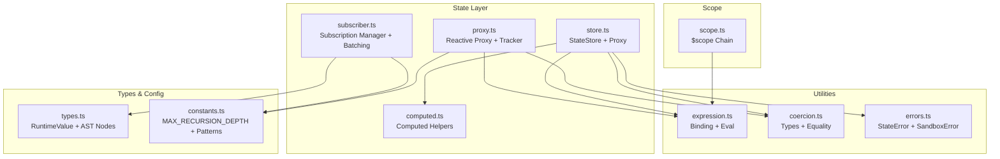
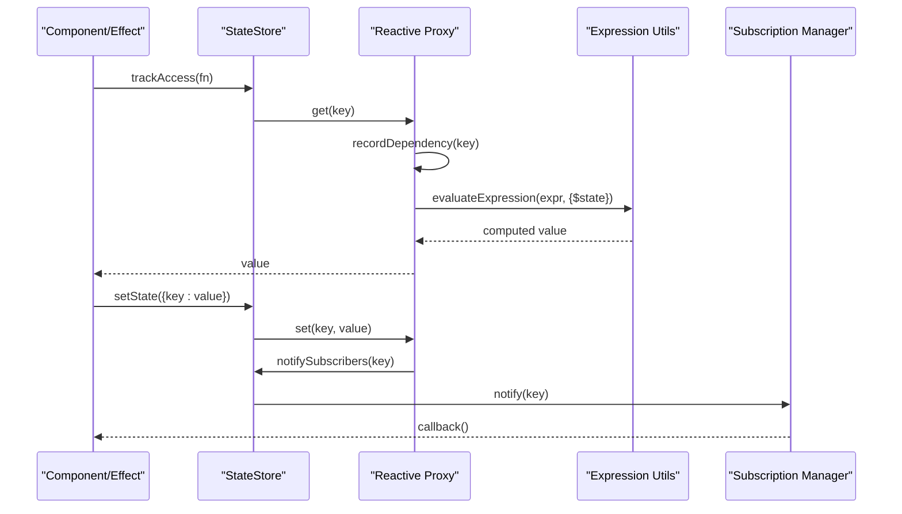
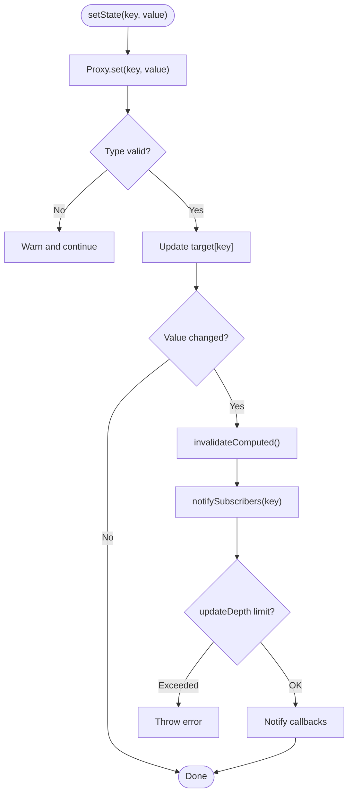
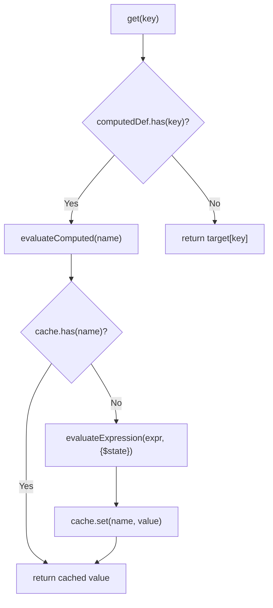
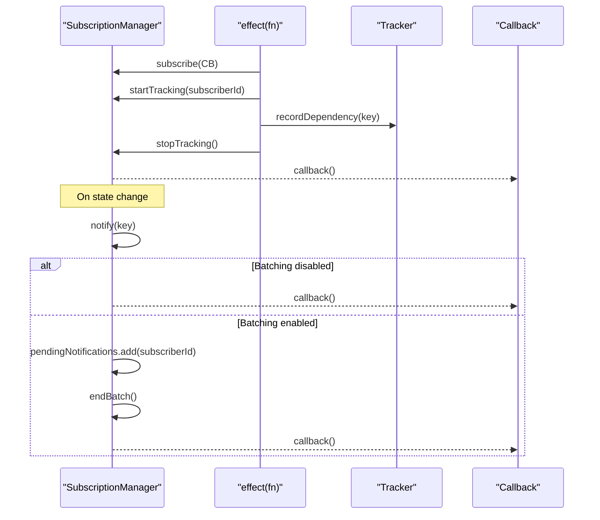
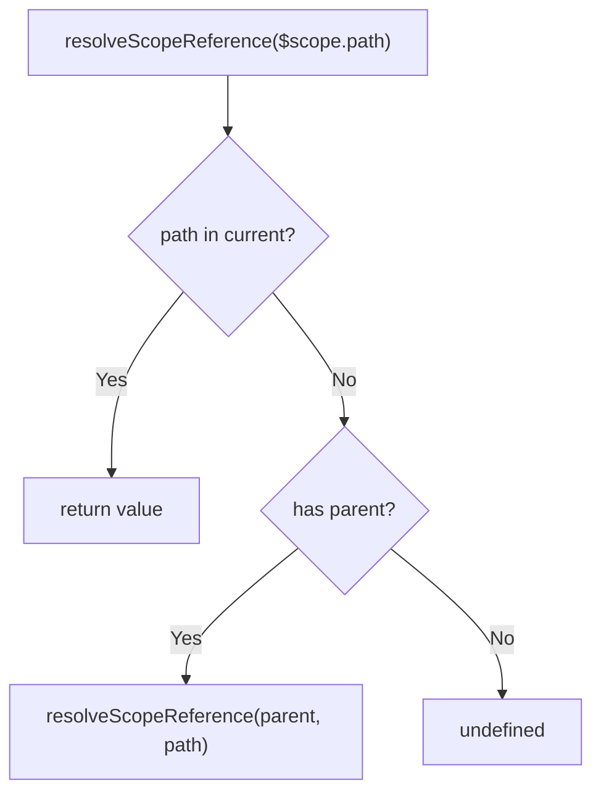
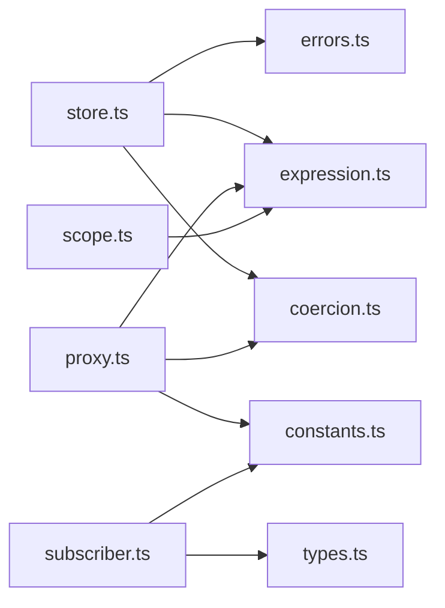

# State Management

<cite>
**Referenced Files in This Document**
- [store.ts](file://packages/nexus-reactor/src/state/store.ts)
- [proxy.ts](file://packages/nexus-reactor/src/state/proxy.ts)
- [computed.ts](file://packages/nexus-reactor/src/state/computed.ts)
- [subscriber.ts](file://packages/nexus-reactor/src/state/subscriber.ts)
- [scope.ts](file://packages/nexus-reactor/src/view/scope.ts)
- [types.ts](file://packages/nexus-reactor/src/core/types.ts)
- [constants.ts](file://packages/nexus-reactor/src/core/constants.ts)
- [expression.ts](file://packages/nexus-reactor/src/utils/expression.ts)
- [coercion.ts](file://packages/nexus-reactor/src/utils/coercion.ts)
- [errors.ts](file://packages/nexus-reactor/src/core/errors.ts)
- [index.ts](file://packages/nexus-reactor/src/state/index.ts)
- [App.tsx](file://packages/nexus-reactor/test/App.tsx)
</cite>

## Table of Contents
1. [Introduction](#introduction)
2. [Project Structure](#project-structure)
3. [Core Components](#core-components)
4. [Architecture Overview](#architecture-overview)
5. [Detailed Component Analysis](#detailed-component-analysis)
6. [Dependency Analysis](#dependency-analysis)
7. [Performance Considerations](#performance-considerations)
8. [Troubleshooting Guide](#troubleshooting-guide)
9. [Conclusion](#conclusion)
10. [Appendices](#appendices)

## Introduction
This document explains the Nexus state management system, focusing on the reactive programming model built on JavaScript Proxies, the StateStore architecture, computed value evaluation, subscriber notification patterns, and the scope context system for isolated state within panels. It also covers performance characteristics, batching optimizations, and practical usage patterns for declaring state, computed properties, and effects. Finally, it addresses common issues such as memory leaks in subscriptions and solutions using the subscriber management module.

## Project Structure
The state management lives primarily under the state module with supporting utilities and types:
- StateStore and proxy-based reactivity live in store.ts and proxy.ts
- Computed value helpers live in computed.ts
- Subscription and batching utilities live in subscriber.ts
- Scope context for Iterate and $scope variables lives in view/scope.ts
- Shared types, constants, expression utilities, coercion utilities, and errors are in core/, utils/, and state/ directories



**Diagram sources**
- [store.ts](file://packages/nexus-reactor/src/state/store.ts#L1-L255)
- [proxy.ts](file://packages/nexus-reactor/src/state/proxy.ts#L1-L393)
- [computed.ts](file://packages/nexus-reactor/src/state/computed.ts#L1-L96)
- [subscriber.ts](file://packages/nexus-reactor/src/state/subscriber.ts#L1-L351)
- [expression.ts](file://packages/nexus-reactor/src/utils/expression.ts#L1-L255)
- [coercion.ts](file://packages/nexus-reactor/src/utils/coercion.ts#L1-L284)
- [errors.ts](file://packages/nexus-reactor/src/core/errors.ts#L1-L367)
- [types.ts](file://packages/nexus-reactor/src/core/types.ts#L1-L446)
- [constants.ts](file://packages/nexus-reactor/src/core/constants.ts#L1-L283)
- [scope.ts](file://packages/nexus-reactor/src/view/scope.ts#L1-L120)

**Section sources**
- [store.ts](file://packages/nexus-reactor/src/state/store.ts#L1-L255)
- [proxy.ts](file://packages/nexus-reactor/src/state/proxy.ts#L1-L393)
- [computed.ts](file://packages/nexus-reactor/src/state/computed.ts#L1-L96)
- [subscriber.ts](file://packages/nexus-reactor/src/state/subscriber.ts#L1-L351)
- [scope.ts](file://packages/nexus-reactor/src/view/scope.ts#L1-L120)
- [types.ts](file://packages/nexus-reactor/src/core/types.ts#L1-L446)
- [constants.ts](file://packages/nexus-reactor/src/core/constants.ts#L1-L283)
- [expression.ts](file://packages/nexus-reactor/src/utils/expression.ts#L1-L255)
- [coercion.ts](file://packages/nexus-reactor/src/utils/coercion.ts#L1-L284)
- [errors.ts](file://packages/nexus-reactor/src/core/errors.ts#L1-L367)

## Core Components
- StateStore: central reactive store with target, proxy, type map, computed definitions/cache, subscribers, and update depth. Provides creation, mutation, computed evaluation, dependency tracking, and notification.
- Reactive Proxy: a Proxy-based system that wraps state and nested objects, tracks property access, validates types, and notifies subscribers.
- Computed Helpers: evaluate cached computed values, invalidate caches, and introspect computed metadata.
- Subscription Manager: manages subscribers, dependency mapping, batching, and safe notification execution.
- Scope Context: resolves $scope variables across nested Iterate contexts.

**Section sources**
- [store.ts](file://packages/nexus-reactor/src/state/store.ts#L1-L255)
- [proxy.ts](file://packages/nexus-reactor/src/state/proxy.ts#L1-L393)
- [computed.ts](file://packages/nexus-reactor/src/state/computed.ts#L1-L96)
- [subscriber.ts](file://packages/nexus-reactor/src/state/subscriber.ts#L1-L351)
- [scope.ts](file://packages/nexus-reactor/src/view/scope.ts#L1-L120)

## Architecture Overview
The system composes a reactive proxy around state and nested objects. Property access during tracked computations records dependencies. Mutations invalidate computed caches and notify subscribers. Computed values are evaluated lazily and cached until invalidation. Subscriptions can be batched to reduce redundant renders.



**Diagram sources**
- [store.ts](file://packages/nexus-reactor/src/state/store.ts#L180-L202)
- [proxy.ts](file://packages/nexus-reactor/src/state/proxy.ts#L112-L144)
- [expression.ts](file://packages/nexus-reactor/src/utils/expression.ts#L76-L100)
- [subscriber.ts](file://packages/nexus-reactor/src/state/subscriber.ts#L146-L183)

## Detailed Component Analysis

### StateStore: Reactive Store and Proxy
- Initialization: constructs target state from DataAST, registers computed definitions, creates a reactive proxy, and sets up caches and subscriber maps.
- Proxy behavior:
  - get: tracks dependency when a subscriber is active, checks computed values, wraps nested objects/arrays in proxies, returns values.
  - set: prevents writes to computed keys, validates types, updates target, invalidates computed cache, and notifies subscribers if value changed.
  - has/ownKeys: ensures computed keys appear as present and enumerable.
- Computed evaluation: cached evaluation keyed by computed name; invalidation clears cache.
- Dependency tracking: records subscriber-to-key mappings; notifies subscribers with depth protection against infinite loops.
- Utilities: subscribe/unsubscribe, setState, getSnapshot, trackAccess.



**Diagram sources**
- [store.ts](file://packages/nexus-reactor/src/state/store.ts#L84-L109)
- [store.ts](file://packages/nexus-reactor/src/state/store.ts#L168-L170)
- [store.ts](file://packages/nexus-reactor/src/state/store.ts#L179-L202)

**Section sources**
- [store.ts](file://packages/nexus-reactor/src/state/store.ts#L1-L255)

### Reactive Proxy (Advanced)
- Tracks dependencies via a dependency tracker with active subscriber, reverse maps, and callbacks.
- Provides onGet/onSet hooks to integrate with higher-level stores.
- Wraps nested objects/arrays recursively, ensuring deep reactivity.
- Validates types and throws typed errors for computed writes.
- Notifies subscribers safely with recursion depth protection.

```mermaid
classDiagram
class DependencyTracker {
+activeSubscriber : SubscriberId?
+dependencies : Map<StateKey, Set<SubscriberId>>
+subscriberDeps : Map<SubscriberId, Set<StateKey>>
+callbacks : Map<SubscriberId, () => void>
+updateDepth : number
}
class ProxyOptions {
+onGet(key)
+onSet(key, value, oldValue)
+types
+readOnly
}
DependencyTracker <.. ProxyOptions : "used by"
```

**Diagram sources**
- [proxy.ts](file://packages/nexus-reactor/src/state/proxy.ts#L18-L41)
- [proxy.ts](file://packages/nexus-reactor/src/state/proxy.ts#L167-L254)

**Section sources**
- [proxy.ts](file://packages/nexus-reactor/src/state/proxy.ts#L1-L393)
- [constants.ts](file://packages/nexus-reactor/src/core/constants.ts#L120-L129)
- [errors.ts](file://packages/nexus-reactor/src/core/errors.ts#L246-L283)

### Computed Values
- evaluateComputed: retrieves expression from store, evaluates with $state context, caches result, returns value.
- invalidateComputedCache: clears cache to force recomputation.
- Helpers: isComputed, getComputedNames, getComputedExpression, getAllComputed, forceRecompute, getComputedValues.



**Diagram sources**
- [store.ts](file://packages/nexus-reactor/src/state/store.ts#L152-L166)
- [computed.ts](file://packages/nexus-reactor/src/state/computed.ts#L15-L38)
- [expression.ts](file://packages/nexus-reactor/src/utils/expression.ts#L76-L100)

**Section sources**
- [computed.ts](file://packages/nexus-reactor/src/state/computed.ts#L1-L96)
- [store.ts](file://packages/nexus-reactor/src/state/store.ts#L152-L166)

### Subscription Manager and Batching
- subscribe/unsubscribe: manage subscriber lifecycle and dependency maps.
- startTracking/stopTracking: collect dependencies for a subscriber.
- recordAccess: register key-to-subscriber and subscriber-to-key mappings.
- notify: immediate or batched notification; batching queues subscribers and flushes in a single tick.
- effect: creates a subscriber that runs immediately and re-runs on dependency changes; returns an unsubscribe function.
- watch: registers a subscriber for specific keys (manual dependency registration).



**Diagram sources**
- [subscriber.ts](file://packages/nexus-reactor/src/state/subscriber.ts#L51-L91)
- [subscriber.ts](file://packages/nexus-reactor/src/state/subscriber.ts#L93-L145)
- [subscriber.ts](file://packages/nexus-reactor/src/state/subscriber.ts#L146-L207)
- [subscriber.ts](file://packages/nexus-reactor/src/state/subscriber.ts#L282-L322)

**Section sources**
- [subscriber.ts](file://packages/nexus-reactor/src/state/subscriber.ts#L1-L351)

### Scope Context System
- ScopeContext holds parent link and variables map.
- createRootScope/createChildScope/createIterateScope build nested scopes.
- resolveScopeReference traverses up the chain to resolve $scope paths.
- setScopeValue and hasScopeVariable provide mutation and existence checks.
- getFlattenedScope merges parent variables into a flat object for evaluation.



**Diagram sources**
- [scope.ts](file://packages/nexus-reactor/src/view/scope.ts#L52-L72)

**Section sources**
- [scope.ts](file://packages/nexus-reactor/src/view/scope.ts#L1-L120)

## Dependency Analysis
- Coupling:
  - StateStore depends on expression evaluation and coercion utilities for computed and type validation.
  - Proxy utilities depend on constants for recursion limits and patterns.
  - Subscription Manager depends on types for SubscriberId and StateKey.
- Cohesion:
  - Each module encapsulates a single concern: store, proxy, computed, subscription, scope.
- External dependencies:
  - No external runtime dependencies; relies on built-in Proxy and Function constructor for evaluation.



**Diagram sources**
- [store.ts](file://packages/nexus-reactor/src/state/store.ts#L1-L255)
- [proxy.ts](file://packages/nexus-reactor/src/state/proxy.ts#L1-L393)
- [subscriber.ts](file://packages/nexus-reactor/src/state/subscriber.ts#L1-L351)
- [scope.ts](file://packages/nexus-reactor/src/view/scope.ts#L1-L120)
- [expression.ts](file://packages/nexus-reactor/src/utils/expression.ts#L1-L255)
- [coercion.ts](file://packages/nexus-reactor/src/utils/coercion.ts#L1-L284)
- [errors.ts](file://packages/nexus-reactor/src/core/errors.ts#L1-L367)
- [types.ts](file://packages/nexus-reactor/src/core/types.ts#L1-L446)
- [constants.ts](file://packages/nexus-reactor/src/core/constants.ts#L1-L283)

**Section sources**
- [store.ts](file://packages/nexus-reactor/src/state/store.ts#L1-L255)
- [proxy.ts](file://packages/nexus-reactor/src/state/proxy.ts#L1-L393)
- [subscriber.ts](file://packages/nexus-reactor/src/state/subscriber.ts#L1-L351)
- [scope.ts](file://packages/nexus-reactor/src/view/scope.ts#L1-L120)
- [expression.ts](file://packages/nexus-reactor/src/utils/expression.ts#L1-L255)
- [coercion.ts](file://packages/nexus-reactor/src/utils/coercion.ts#L1-L284)
- [errors.ts](file://packages/nexus-reactor/src/core/errors.ts#L1-L367)
- [types.ts](file://packages/nexus-reactor/src/core/types.ts#L1-L446)
- [constants.ts](file://packages/nexus-reactor/src/core/constants.ts#L1-L283)

## Performance Considerations
- Recursion depth protection: both store and proxy systems guard against infinite loops with a maximum update depth.
- Computed caching: computed values are cached per key; invalidated on state changes to avoid repeated evaluations.
- Nested proxy wrapping: nested objects/arrays are proxied on demand to minimize overhead.
- Equality checks: shallow comparison for arrays and objects; deep cloning for snapshots to prevent accidental mutations.
- Batching: subscription manager batches notifications to reduce redundant re-renders and stabilize updates.

Practical tips:
- Prefer batching updates when performing multiple state changes in sequence.
- Keep computed expressions pure and minimal; avoid heavy computation inside expressions.
- Use nested proxies judiciously; deeply nested structures can increase traversal cost.

**Section sources**
- [constants.ts](file://packages/nexus-reactor/src/core/constants.ts#L120-L129)
- [store.ts](file://packages/nexus-reactor/src/state/store.ts#L168-L170)
- [proxy.ts](file://packages/nexus-reactor/src/state/proxy.ts#L112-L144)
- [subscriber.ts](file://packages/nexus-reactor/src/state/subscriber.ts#L189-L226)
- [coercion.ts](file://packages/nexus-reactor/src/utils/coercion.ts#L233-L284)

## Troubleshooting Guide
Common issues and resolutions:
- Infinite loops: The system detects excessive updates and throws an error. Review computed dependencies and avoid mutating the same key in a tight cycle.
- Memory leaks in subscriptions: Ensure to call unsubscribe when components unmount or when no longer needed. The subscription manager removes subscriber entries and cleans pending notifications.
- Type mismatches: State setters validate types; incorrect assignments will warn or throw. Normalize inputs using coercion utilities before setting.
- Computed writes: Attempting to set a computed key throws an error. Computed values are read-only; update underlying state instead.
- Scope resolution: $scope references outside Iterate contexts resolve to undefined. Ensure Iterate wrappers are in place when using $scope.

**Section sources**
- [store.ts](file://packages/nexus-reactor/src/state/store.ts#L84-L109)
- [proxy.ts](file://packages/nexus-reactor/src/state/proxy.ts#L195-L219)
- [subscriber.ts](file://packages/nexus-reactor/src/state/subscriber.ts#L73-L91)
- [errors.ts](file://packages/nexus-reactor/src/core/errors.ts#L246-L283)
- [scope.ts](file://packages/nexus-reactor/src/view/scope.ts#L52-L72)

## Conclusion
Nexus state management combines Proxy-based reactivity with explicit dependency tracking, computed caching, and robust subscription management. The system offers strong guarantees against infinite loops, supports batching for performance, and provides a clear mental model for state, computed values, and effects. Proper use of subscription lifecycle and batching helps avoid memory leaks and improves responsiveness.

## Appendices

### Usage Examples (paths only)
- Declaring state and computed values in NXML and mounting a panel:
  - [App.tsx](file://packages/nexus-reactor/test/App.tsx#L11-L87)
  - [App.tsx](file://packages/nexus-reactor/test/App.tsx#L89-L162)
- Using Iterate with $scope and dynamic args:
  - [App.tsx](file://packages/nexus-reactor/test/App.tsx#L140-L158)
- Effects and watchers via subscription manager:
  - [subscriber.ts](file://packages/nexus-reactor/src/state/subscriber.ts#L282-L322)
  - [subscriber.ts](file://packages/nexus-reactor/src/state/subscriber.ts#L324-L351)
- Snapshot and state mutation:
  - [store.ts](file://packages/nexus-reactor/src/state/store.ts#L237-L246)
  - [index.ts](file://packages/nexus-reactor/src/state/index.ts#L1-L13)

### API Surface (selected)
- StateStore
  - [createStateStore](file://packages/nexus-reactor/src/state/store.ts#L25-L57)
  - [trackAccess](file://packages/nexus-reactor/src/state/store.ts#L247-L255)
  - [setState](file://packages/nexus-reactor/src/state/store.ts#L241-L246)
  - [getSnapshot](file://packages/nexus-reactor/src/state/store.ts#L237-L240)
  - [subscribe/unsubscribe](file://packages/nexus-reactor/src/state/store.ts#L224-L236)
- Subscription Manager
  - [createSubscriptionManager](file://packages/nexus-reactor/src/state/subscriber.ts#L33-L45)
  - [subscribe/unsubscribe](file://packages/nexus-reactor/src/state/subscriber.ts#L51-L91)
  - [startTracking/stopTracking](file://packages/nexus-reactor/src/state/subscriber.ts#L93-L119)
  - [recordAccess](file://packages/nexus-reactor/src/state/subscriber.ts#L120-L145)
  - [notify/startBatch/endBatch/batch](file://packages/nexus-reactor/src/state/subscriber.ts#L146-L207)
  - [effect/watch](file://packages/nexus-reactor/src/state/subscriber.ts#L282-L351)
- Computed Helpers
  - [evaluateComputed/invalidateComputedCache](file://packages/nexus-reactor/src/state/computed.ts#L15-L47)
  - [forceRecompute/getComputedValues](file://packages/nexus-reactor/src/state/computed.ts#L76-L96)
- Scope Context
  - [createRootScope/createChildScope/createIterateScope](file://packages/nexus-reactor/src/view/scope.ts#L18-L51)
  - [resolveScopeReference/setScopeValue/hasScopeVariable](file://packages/nexus-reactor/src/view/scope.ts#L52-L95)
  - [getFlattenedScope/mergeScopeForEvaluation](file://packages/nexus-reactor/src/view/scope.ts#L97-L120)